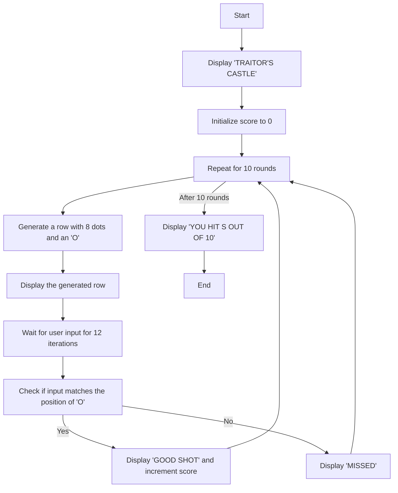
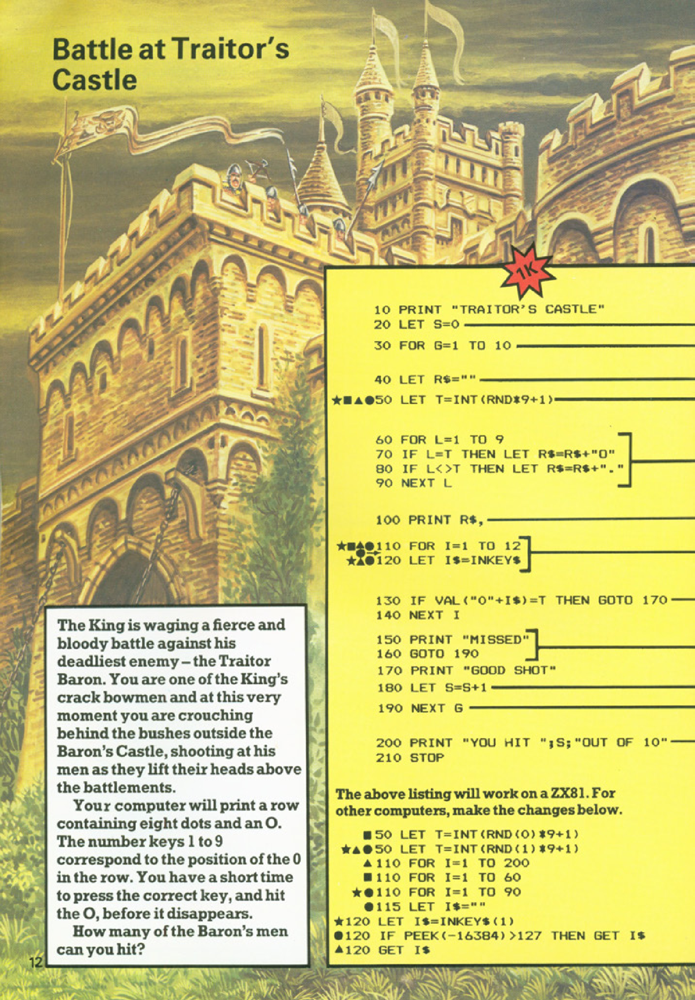
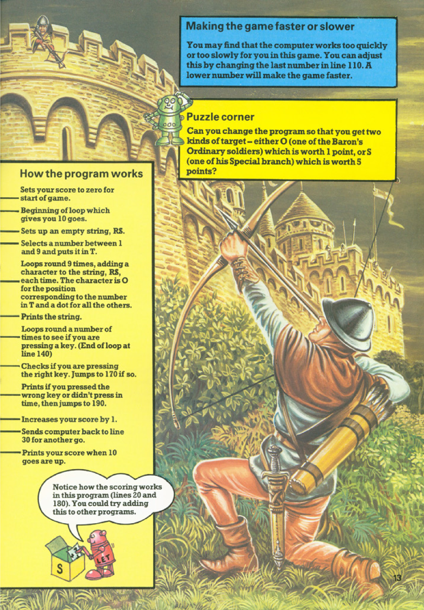

# Battle at Traitor's Castle

**Book**: _Computer Battlegames_  
**Author**: Usborne Publishing

## Story

The King is waging a fierce and bloody battle against his deadliest enemy – the Traitor Baron. You are one of the King's crack bowmen, crouched behind the bushes outside the Baron’s Castle. Your mission is to shoot at the Baron’s men as they lift their heads above the battlements. The computer will display a row with eight dots and an "O" representing a target. You must quickly press the correct number (1 to 9) corresponding to the position of "O" before it disappears. How many of the Baron’s men can you hit?

## Pseudocode

```plaintext
START
PRINT "TRAITOR'S CASTLE"
SET score (S) to 0
FOR 10 rounds:
    SET an empty string (R$)
    GENERATE a random number (T) between 1 and 9
    FOR each position (L) from 1 to 9:
        IF position matches T:
            ADD "0" to R$
        ELSE:
            ADD "." to R$
    PRINT the row R$

    WAIT for user input (I$) for 12 iterations:
        IF user input matches T:
            PRINT "GOOD SHOT"
            INCREMENT score (S) by 1
            BREAK loop
        ELSE:
            PRINT "MISSED"
    END WAIT

PRINT "YOU HIT", S, "OUT OF 10"
END
```

## Flowchart



## Code

<details>
<summary>Pages</summary>

  


</details>

<details>
<summary>ZX-81</summary>

```basic
10 PRINT "TRAITOR'S CASTLE"
20 LET S=0
30 FOR G=1 TO 10
40 LET R$=""
50 LET T=INT(RND*9)+1
60 FOR L=1 TO 9
70 IF L=T THEN LET R$=R$+"0"
80 IF L<>T THEN LET R$=R$+"."
90 NEXT L
100 PRINT R$
110 FOR I=1 TO 12
120 LET I$=INKEY$
130 IF VAL(I$) = T THEN GOTO 170
140 PRINT "MISSED"
150 GOTO 190
160 PRINT "GOOD SHOT"
170 LET S=S+1
180 NEXT I
190 PRINT "YOU HIT ";S;" OUT OF 10"
210 STOP
```

</details>

<details>
<summary>C#</summary>

```csharp
using System;

class TraitorsCastle
{
    static void Main()
    {
        Console.WriteLine("TRAITOR'S CASTLE");
        int score = 0;

        Random random = new Random();

        for (int round = 1; round <= 10; round++)
        {
            string row = "";
            int targetPosition = random.Next(1, 10);

            for (int position = 1; position <= 9; position++)
            {
                if (position == targetPosition)
                {
                    row += "0";
                }
                else
                {
                    row += ".";
                }
            }

            Console.WriteLine(row);

            bool hit = false;
            for (int i = 0; i < 12; i++)
            {
                string input = Console.ReadLine();

                if (int.TryParse(input, out int userGuess) && userGuess == targetPosition)
                {
                    Console.WriteLine("GOOD SHOT");
                    score++;
                    hit = true;
                    break;
                }
            }

            if (!hit)
            {
                Console.WriteLine("MISSED");
            }
        }

        Console.WriteLine($"YOU HIT {score} OUT OF 10");
    }
}
```

</details>

<details>
<summary>Python</summary>

```python
import random

print("TRAITOR'S CASTLE")
score = 0

for _ in range(10):
    row = ""
    target_position = random.randint(1, 9)

    for position in range(1, 10):
        if position == target_position:
            row += "0"
        else:
            row += "."

    print(row)

    hit = False
    for _ in range(12):
        try:
            user_guess = int(input("Your guess: "))
            if user_guess == target_position:
                print("GOOD SHOT")
                score += 1
                hit = True
                break
        except ValueError:
            pass

    if not hit:
        print("MISSED")

print(f"YOU HIT {score} OUT OF 10")
```

</details>

<details>
<summary>Java</summary>

```java
import java.util.Scanner;
import java.util.Random;

public class TraitorsCastle {
    public static void main(String[] args) {
        System.out.println("TRAITOR'S CASTLE");
        Scanner scanner = new Scanner(System.in);
        Random random = new Random();
        int score = 0;

        for (int round = 0; round < 10; round++) {
            StringBuilder row = new StringBuilder();
            int targetPosition = random.nextInt(9) + 1;

            for (int position = 1; position <= 9; position++) {
                if (position == targetPosition) {
                    row.append("0");
                } else {
                    row.append(".");
                }
            }

            System.out.println(row);

            boolean hit = false;
            for (int i = 0; i < 12; i++) {
                String input = scanner.nextLine();
                try {
                    int userGuess = Integer.parseInt(input);
                    if (userGuess == targetPosition) {
                        System.out.println("GOOD SHOT");
                        score++;
                        hit = true;
                        break;
                    }
                } catch (NumberFormatException e) {
                    // Ignore invalid input
                }
            }

            if (!hit) {
                System.out.println("MISSED");
            }
        }

        System.out.printf("YOU HIT %d OUT OF 10\n", score);
    }
}
```

</details>

<details>
<summary>Go</summary>

```go
package main

import (
	"fmt"
	"math/rand"
	"time"
)

func main() {
	fmt.Println("TRAITOR'S CASTLE")
	rand.Seed(time.Now().UnixNano())
	var score int

	for round := 0; round < 10; round++ {
		row := ""
		targetPosition := rand.Intn(9) + 1

		for position := 1; position <= 9; position++ {
			if position == targetPosition {
				row += "0"
			} else {
				row += "."
			}
		}

		fmt.Println(row)

		hit := false
		for i := 0; i < 12; i++ {
			var userGuess int
			fmt.Scan(&userGuess)
			if userGuess == targetPosition {
				fmt.Println("GOOD SHOT")
				score++
				hit = true
				break
			}
		}

		if !hit {
			fmt.Println("MISSED")
		}
	}

	fmt.Printf("YOU HIT %d OUT OF 10\n", score)
}
```

</details>

<details>
<summary>C++</summary>

```cpp
#include <iostream>
#include <string>
#include <cstdlib>
#include <ctime>

using namespace std;

int main() {
    cout << "TRAITOR'S CASTLE" << endl;
    srand(time(0));
    int score = 0;

    for (int round = 0; round < 10; round++) {
        string row = "";
        int targetPosition = rand() % 9 + 1;

        for (int position = 1; position <= 9; position++) {
            if (position == targetPosition) {
                row += "0";
            } else {
                row += ".";
            }
        }

        cout << row << endl;

        bool hit = false;
        for (int i = 0; i < 12; i++) {
            int userGuess;
            cin >> userGuess;
            if (userGuess == targetPosition) {
                cout << "GOOD SHOT" << endl;
                score++;
                hit = true;
                break;
            }
        }

        if (!hit) {
            cout << "MISSED" << endl;
        }
    }

    cout << "YOU HIT " << score << " OUT OF 10" << endl;
    return 0;
}
```

</details>

<details>
<summary>Rust</summary>

```rust
use rand::Rng;
use std::io;

fn main() {
    println!("TRAITOR'S CASTLE");
    let mut score = 0;

    for _ in 0..10 {
        let mut row = String::new();
        let target_position = rand::thread_rng().gen_range(1..=9);

        for position in 1..=9 {
            if position == target_position {
                row.push('0');
            } else {
                row.push('.');
            }
        }

        println!("{}", row);

        let mut hit = false;
        for _ in 0..12 {
            let mut input = String::new();
            io::stdin().read_line(&mut input).unwrap();

            if let Ok(user_guess) = input.trim().parse::<u32>() {
                if user_guess == target_position {
                    println!("GOOD SHOT");
                    score += 1;
                    hit = true;
                    break;
                }
            }
        }

        if !hit {
            println!("MISSED");
        }
    }

    println!("YOU HIT {} OUT OF 10", score);
}
```

</details>

## Explanation

This game simulates an archer defending a castle. The program generates a random position for a target in a row of dots. The player has to guess the position of the target before it disappears. The game counts and displays the total number of hits after 10 rounds.

## Challenges

1. **Increase Difficulty**: Reduce the time available to input the guess.
2. **Add Features**: Introduce different types of targets with varying points.
3. **Customize**: Allow the player to adjust the number of rounds or the speed of the game.

## Copyright

These programs are adaptations of the original Usborne Computer Guides published in the 1980s. The books are free to download for personal or educational use from [Usborne's Computer and Coding Books](https://usborne.com/row/books/computer-and-coding-books). Programs and adaptations may not be used for commercial purposes.

Return to [Computer Battlegames](./readme.md).
