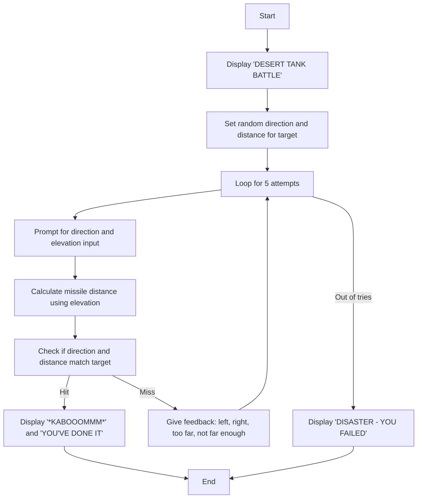
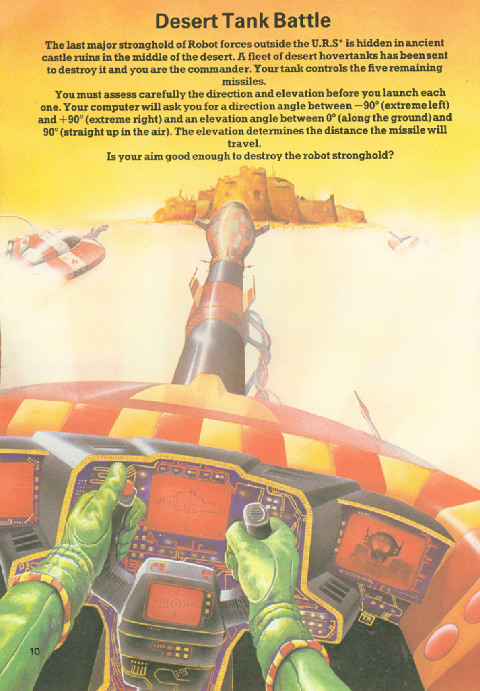
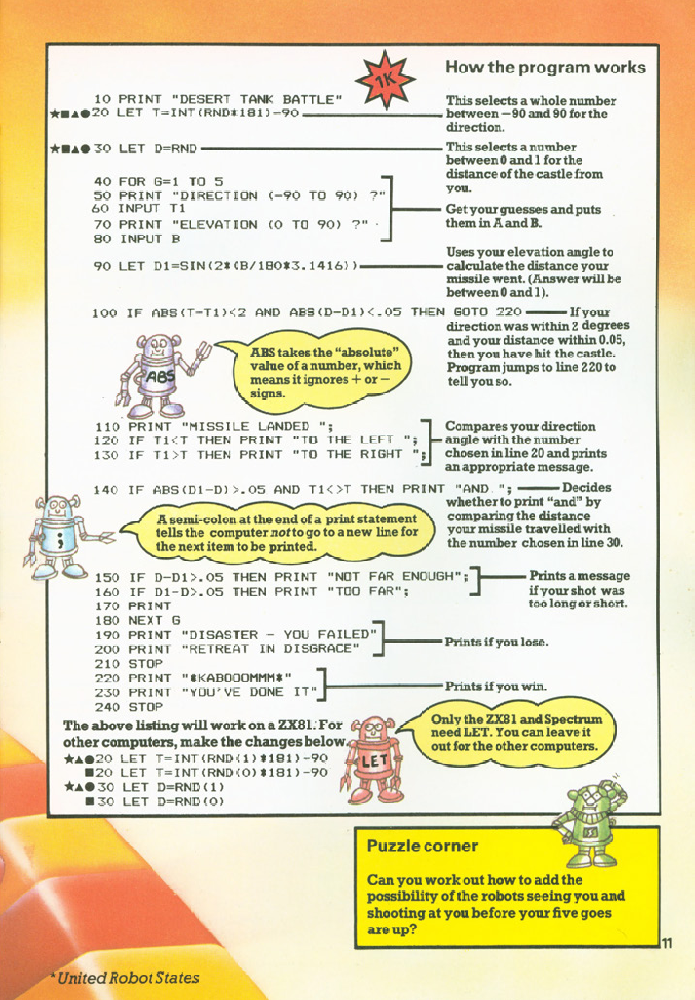

# Desert Tank Battle

**Book**: _[Computer Battlegames](https://drive.google.com/file/d/0Bxv0SsvibDMTVUExUjFhTURCSU0/view?usp=sharing&resourcekey=0-v2liG0G60g8b7DXjJtDBXg)_  
**Author**:  [Usborne Publishing](https://usborne.com/)    
**Translator**: [Marcus Medina](https://github.com/marcusjobb/UsborneBooks)

## Story

The last major stronghold of Robot forces outside the U.R.S. (United Robot States) is hidden in ancient castle ruins in the middle of the desert. A fleet of desert hovertanks has been sent to destroy it, and you are the commander. Your tank controls the five remaining missiles.

You must carefully assess the direction and elevation before launching each missile. The computer will ask for a direction angle between -90° (extreme left) and +90° (extreme right) and an elevation angle between 0° (along the ground) and 90° (straight up). The elevation determines the distance the missile will travel. Your mission is to destroy the robot stronghold in five attempts.

## Pseudocode

```plaintext
START
PRINT "DESERT TANK BATTLE"
SET target direction (T) to a random value between -90 and +90
SET target distance (D) to a random value between 0 and 1
FOR 5 attempts:
    PROMPT "DIRECTION (-90 TO 90) ?"
    INPUT direction (A)
    PROMPT "ELEVATION (0 TO 90) ?"
    INPUT elevation (B)

    CALCULATE missile distance (D1) as SIN(2 * B / 180 * PI)

    IF absolute difference between A and T < 2 AND
       absolute difference between D1 and D < 0.05 THEN
        PRINT "*KABOOOMMM*"
        PRINT "YOU'VE DONE IT"
        END GAME
    ELSE
        PRINT "MISSILE LANDED"
        IF T > A THEN PRINT "TO THE LEFT"
        IF T < A THEN PRINT "TO THE RIGHT"
        IF D1 > D THEN PRINT "NOT FAR ENOUGH"
        IF D1 < D THEN PRINT "TOO FAR"
    END IF

PRINT "DISASTER - YOU FAILED"
PRINT "RETREAT IN DISGRACE"
END
```

## Flowchart



## Code

<details>
<summary>Pages</summary>

  


</details>

<details>
<summary>ZX-81</summary>

```basic
10 PRINT "DESERT TANK BATTLE"
20 LET T=INT(RND*181)-90
30 LET D=RND
40 FOR G=1 TO 5
50 PRINT "DIRECTION (-90 TO 90) ?"
60 INPUT A
70 PRINT "ELEVATION (0 TO 90) ?"
80 INPUT B
90 LET D1=SIN(2*B/180*3.1416)
100 IF ABS(T-A)<2 AND ABS(D-D1)<.05 THEN GOTO 220
110 PRINT "MISSILE LANDED ";
120 IF T>A THEN PRINT "TO THE LEFT"
130 IF T<A THEN PRINT "TO THE RIGHT"
140 IF ABS(D1-D)>.05 AND T<D THEN PRINT "AND TOO FAR"
150 IF D1<D THEN PRINT "NOT FAR ENOUGH"
160 IF D1>D THEN PRINT "TOO FAR"
170 PRINT
180 NEXT G
190 PRINT "DISASTER - YOU FAILED"
200 PRINT "RETREAT IN DISGRACE"
210 STOP
220 PRINT "*KABOOOMMM*"
230 PRINT "YOU'VE DONE IT"
240 STOP
```

</details>

<details>
<summary>C#</summary>

```csharp
using System;

class DesertTankBattle
{
    static void Main()
    {
        Console.WriteLine("DESERT TANK BATTLE");
        Random random = new Random();
        int targetDirection = random.Next(-90, 91);
        double targetDistance = random.NextDouble();

        for (int attempt = 1; attempt <= 5; attempt++)
        {
            Console.Write("DIRECTION (-90 TO 90) ? ");
            int playerDirection = int.Parse(Console.ReadLine());

            Console.Write("ELEVATION (0 TO 90) ? ");
            int playerElevation = int.Parse(Console.ReadLine());

            double missileDistance = Math.Sin(2 * playerElevation * Math.PI / 180);

            if (Math.Abs(targetDirection - playerDirection) < 2 &&
                Math.Abs(targetDistance - missileDistance) < 0.05)
            {
                Console.WriteLine("*KABOOOMMM*");
                Console.WriteLine("YOU'VE DONE IT");
                return;
            }

            Console.Write("MISSILE LANDED ");
            if (targetDirection > playerDirection) Console.Write("TO THE LEFT ");
            if (targetDirection < playerDirection) Console.Write("TO THE RIGHT ");
            if (missileDistance > targetDistance) Console.WriteLine("NOT FAR ENOUGH");
            if (missileDistance < targetDistance) Console.WriteLine("TOO FAR");
        }

        Console.WriteLine("DISASTER - YOU FAILED");
        Console.WriteLine("RETREAT IN DISGRACE");
    }
}
```

</details>

<details>
<summary>Python</summary>

```python
import math
import random

print("DESERT TANK BATTLE")

target_direction = random.randint(-90, 90)
target_distance = random.random()

for attempt in range(5):
    direction = int(input("DIRECTION (-90 TO 90) ? "))
    elevation = int(input("ELEVATION (0 TO 90) ? "))

    missile_distance = math.sin(2 * elevation * math.pi / 180)

    if abs(target_direction - direction) < 2 and abs(target_distance - missile_distance) < 0.05:
        print("*KABOOOMMM*")
        print("YOU'VE DONE IT")
        break

    print("MISSILE LANDED", end=" ")
    if target_direction > direction:
        print("TO THE LEFT", end=" ")
    if target_direction < direction:
        print("TO THE RIGHT", end=" ")
    if missile_distance > target_distance:
        print("NOT FAR ENOUGH")
    if missile_distance < target_distance:
        print("TOO FAR")
else:
    print("DISASTER - YOU FAILED")
    print("RETREAT IN DISGRACE")
```

</details>

<details>
<summary>Java</summary>

```java
import java.util.Scanner;
import java.util.Random;

public class DesertTankBattle {
    public static void main(String[] args) {
        System.out.println("DESERT TANK BATTLE");

        Random random = new Random();
        Scanner scanner = new Scanner(System.in);

        int targetDirection = random.nextInt(181) - 90;
        double targetDistance = random.nextDouble();

        for (int attempt = 0; attempt < 5; attempt++) {
            System.out.print("DIRECTION (-90 TO 90) ? ");
            int playerDirection = scanner.nextInt();

            System.out.print("ELEVATION (0 TO 90) ? ");
            int playerElevation = scanner.nextInt();

            double missileDistance = Math.sin(2 * playerElevation * Math.PI / 180);

            if (Math.abs(targetDirection - playerDirection) < 2 &&
                Math.abs(targetDistance - missileDistance) < 0.05) {
                System.out.println("*KABOOOMMM*");
                System.out.println("YOU'VE DONE IT");
                return;
            }

            System.out.print("MISSILE LANDED ");
            if (targetDirection > playerDirection) System.out.print("TO THE LEFT ");
            if (targetDirection < playerDirection) System.out.print("TO THE RIGHT ");
            if (missileDistance > targetDistance) System.out.println("NOT FAR ENOUGH");
            if (missileDistance < targetDistance) System.out.println("TOO FAR");
        }

        System.out.println("DISASTER - YOU FAILED");
        System.out.println("RETREAT IN DISGRACE");
    }
}
```

</details>

<details>
<summary>Go</summary>

```go
package main

import (
	"fmt"
	"math"
	"math/rand"
	"time"
)

func main() {
	fmt.Println("DESERT TANK BATTLE")
	rand.Seed(time.Now().UnixNano())
	targetDirection := rand.Intn(181) - 90
	targetDistance := rand.Float64()

	for attempt := 0; attempt < 5; attempt++ {
		var playerDirection int
		var playerElevation int
		fmt.Print("DIRECTION (-90 TO 90) ? ")
		fmt.Scan(&playerDirection)

		fmt.Print("ELEVATION (0 TO 90) ? ")
		fmt.Scan(&playerElevation)

		missileDistance := math.Sin(2 * float64(playerElevation) * math.Pi / 180)

		if math.Abs(float64(targetDirection-playerDirection)) < 2 &&
			math.Abs(targetDistance-missileDistance) < 0.05 {
			fmt.Println("*KABOOOMMM*")
			fmt.Println("YOU'VE DONE IT")
			return
		}

		fmt.Print("MISSILE LANDED ")
		if targetDirection > playerDirection {
			fmt.Print("TO THE LEFT ")
		}
		if targetDirection < playerDirection {
			fmt.Print("TO THE RIGHT ")
		}
		if missileDistance > targetDistance {
			fmt.Println("NOT FAR ENOUGH")
		}
		if missileDistance < targetDistance {
			fmt.Println("TOO FAR")
		}
	}

	fmt.Println("DISASTER - YOU FAILED")
	fmt.Println("RETREAT IN DISGRACE")
}
```

</details>

<details>
<summary>C++</summary>

```cpp
#include <iostream>
#include <cmath>
#include <cstdlib>
#include <ctime>

using namespace std;

int main() {
    cout << "DESERT TANK BATTLE" << endl;
    srand(time(0));

    int targetDirection = rand() % 181 - 90;
    double targetDistance = (double)rand() / RAND_MAX;

    for (int attempt = 0; attempt < 5; attempt++) {
        int playerDirection, playerElevation;
        cout << "DIRECTION (-90 TO 90) ? ";
        cin >> playerDirection;

        cout << "ELEVATION (0 TO 90) ? ";
        cin >> playerElevation;

        double missileDistance = sin(2 * playerElevation * M_PI / 180);

        if (abs(targetDirection - playerDirection) < 2 &&
            abs(targetDistance - missileDistance) < 0.05) {
            cout << "*KABOOOMMM*" << endl;
            cout << "YOU'VE DONE IT" << endl;
            return 0;
        }

        cout << "MISSILE LANDED ";
        if (targetDirection > playerDirection) cout << "TO THE LEFT ";
        if (targetDirection < playerDirection) cout << "TO THE RIGHT ";
        if (missileDistance > targetDistance) cout << "NOT FAR ENOUGH" << endl;
        if (missileDistance < targetDistance) cout << "TOO FAR" << endl;
    }

    cout << "DISASTER - YOU FAILED" << endl;
    cout << "RETREAT IN DISGRACE" << endl;
    return 0;
}
```

</details>

<details>
<summary>Rust</summary>

```rust
use rand::Rng;
use std::io;

fn main() {
    println!("DESERT TANK BATTLE");

    let mut rng = rand::thread_rng();
    let target_direction: i32 = rng.gen_range(-90..=90);
    let target_distance: f64 = rng.gen_range(0.0..1.0);

    for _ in 0..5 {
        println!("DIRECTION (-90 TO 90) ?");
        let mut direction_input = String::new();
        io::stdin().read_line(&mut direction_input).unwrap();
        let player_direction: i32 = direction_input.trim().parse().unwrap();

        println!("ELEVATION (0 TO 90) ?");
        let mut elevation_input = String::new();
        io::stdin().read_line(&mut elevation_input).unwrap();
        let player_elevation: f64 = elevation_input.trim().parse().unwrap();

        let missile_distance = (2.0 * player_elevation * std::f64::consts::PI / 180.0).sin();

        if (target_direction - player_direction).abs() < 2 &&
           (target_distance - missile_distance).abs() < 0.05 {
            println!("*KABOOOMMM*");
            println!("YOU'VE DONE IT");
            return;
        }

        print!("MISSILE LANDED ");
        if target_direction > player_direction {
            print!("TO THE LEFT ");
        }
        if target_direction < player_direction {
            print!("TO THE RIGHT ");
        }
        if missile_distance > target_distance {
            println!("NOT FAR ENOUGH");
        }
        if missile_distance < target_distance {
            println!("TOO FAR");
        }
    }

    println!("DISASTER - YOU FAILED");
    println!("RETREAT IN DISGRACE");
}
```

</details>

## Explanation

In "Desert Tank Battle," the player commands a tank with five missiles to destroy a robot fortress. The player must input the direction (-90 to 90) and elevation (0 to 90) for each missile. The game uses trigonometry to calculate the missile's distance and checks if it matches the target within a small margin of error. Success or failure is displayed after each attempt, and the game ends with either victory or defeat.

## Challenges

1. **Increase Difficulty**: Reduce the allowed margin of error for direction and distance.
2. **Add Features**: Introduce wind effects or obstacles that alter the missile's trajectory.
3. **Customize**: Allow the player to choose the number of attempts.

## Copyright

These programs are adaptations of the original Usborne Computer Guides published in the 1980s. The books are free to download for personal or educational use from [Usborne's Computer and Coding Books](https://usborne.com/row/books/computer-and-coding-books). Programs and adaptations may not be used for commercial purposes.

Return to [Computer Battlegames](./readme.md).
