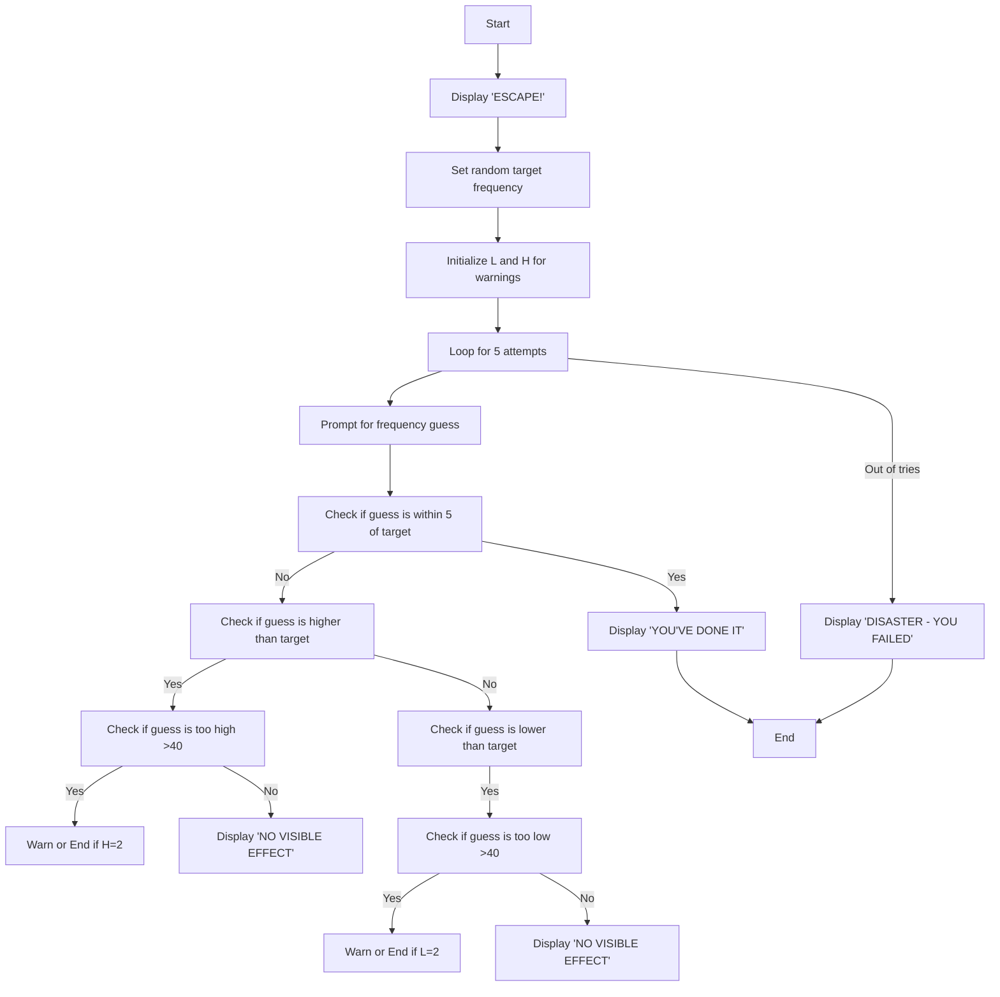
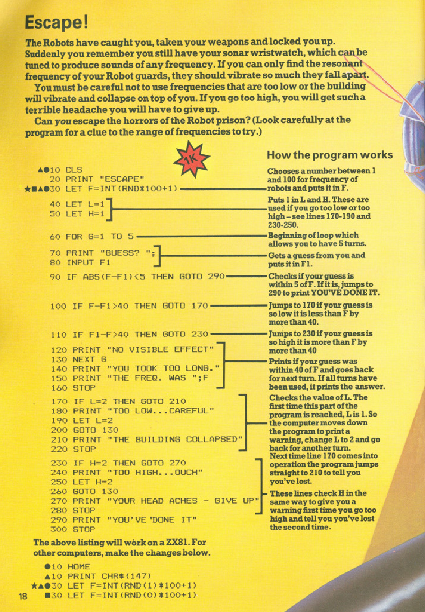
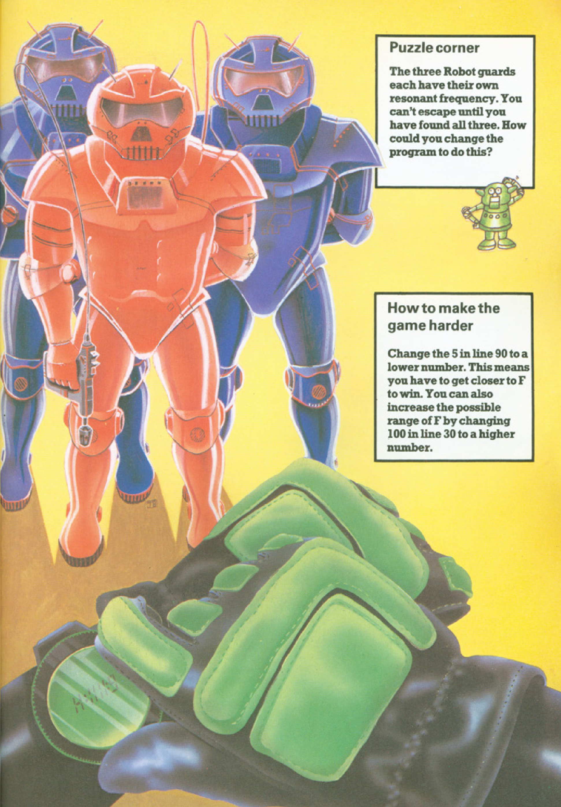

# Escape!

**Book**: _[Computer Battlegames](https://drive.google.com/file/d/0Bxv0SsvibDMTVUExUjFhTURCSU0/view?usp=sharing&resourcekey=0-v2liG0G60g8b7DXjJtDBXg)_  
**Author**:  [Usborne Publishing](https://usborne.com/)    
**Translator**: [Marcus Medina](https://github.com/marcusjobb/UsborneBooks)

## Story

The Robots have captured you, taken your weapons, and locked you up. Suddenly, you remember that you still have your sonar wristwatch, which can produce sounds of any frequency. By discovering the resonant frequency of the Robot guards, you can cause them to vibrate and collapse.

However, you must avoid frequencies that are too low or too high, as they can collapse the building or give you a terrible headache. You only have five chances to guess the correct frequency and escape the horrors of the Robot prison.

## Pseudocode

```plaintext
START
PRINT "ESCAPE!"
SET target frequency (F) to a random value between 1 and 100
INITIALIZE variables L=1 and H=1 for warnings
FOR 5 attempts:
    PROMPT "GUESS?"
    INPUT frequency guess (F1)

    IF absolute difference between F1 and F < 5 THEN
        PRINT "YOU'VE DONE IT"
        END GAME

    IF F1 > F THEN
        IF F1 - F > 40 THEN
            PRINT "TOO HIGH...OUCH"
            IF H == 2 THEN
                PRINT "YOUR HEAD ACHES - GIVE UP"
                END GAME
            END IF
            SET H = 2
        ELSE
            PRINT "NO VISIBLE EFFECT"
    END IF

    IF F1 < F THEN
        IF F - F1 > 40 THEN
            PRINT "TOO LOW...CAREFUL"
            IF L == 2 THEN
                PRINT "THE BUILDING COLLAPSED"
                END GAME
            END IF
            SET L = 2
        ELSE
            PRINT "NO VISIBLE EFFECT"
    END IF

PRINT "DISASTER - YOU FAILED"
END
```

## Flowchart



## Code

<details>
<summary>Pages</summary>

  


</details>

<details>
<summary>ZX-81</summary>

```basic
10 CLS
20 PRINT "ESCAPE"
30 LET F=INT(RND*100+1)
40 LET L=1
50 LET H=1
60 FOR G=1 TO 5
70 PRINT "GUESS? ";
80 INPUT F1
90 IF ABS(F-F1)<5 THEN GOTO 290
100 IF F-F1>40 THEN GOTO 170
110 IF F1-F>40 THEN GOTO 230
120 PRINT "NO VISIBLE EFFECT"
130 NEXT G
140 PRINT "YOU TOOK TOO LONG"
150 PRINT "THE FREQ. WAS ";F
160 STOP
170 IF L=2 THEN GOTO 210
180 PRINT "TOO LOW...CAREFUL"
190 LET L=2
200 GOTO 130
210 PRINT "THE BUILDING COLLAPSED"
220 STOP
230 IF H=2 THEN GOTO 270
240 PRINT "TOO HIGH...OUCH"
250 LET H=2
260 GOTO 130
270 PRINT "YOUR HEAD ACHES - GIVE UP"
280 STOP
290 PRINT "YOU'VE DONE IT"
300 STOP
```

</details>

<details>
<summary>C#</summary>

```csharp
using System;

class Escape
{
    static void Main()
    {
        Console.WriteLine("ESCAPE!");
        Random random = new Random();
        int targetFrequency = random.Next(1, 101);
        int lowWarning = 1, highWarning = 1;

        for (int attempts = 1; attempts <= 5; attempts++)
        {
            int playerGuess;
            do
            {
                Console.Write("GUESS? ");
            } while (!int.TryParse(Console.ReadLine(), out playerGuess));

            if (Math.Abs(targetFrequency - playerGuess) < 5)
            {
                Console.WriteLine("YOU'VE DONE IT");
                return;
            }

            if (playerGuess < targetFrequency)
            {
                if (targetFrequency - playerGuess > 40)
                {
                    if (lowWarning == 2)
                    {
                        Console.WriteLine("THE BUILDING COLLAPSED");
                        return;
                    }
                    Console.WriteLine("TOO LOW...CAREFUL");
                    lowWarning = 2;
                }
                else
                {
                    Console.WriteLine("NO VISIBLE EFFECT");
                }
            }
            else
            {
                if (playerGuess - targetFrequency > 40)
                {
                    if (highWarning == 2)
                    {
                        Console.WriteLine("YOUR HEAD ACHES - GIVE UP");
                        return;
                    }
                    Console.WriteLine("TOO HIGH...OUCH");
                    highWarning = 2;
                }
                else
                {
                    Console.WriteLine("NO VISIBLE EFFECT");
                }
            }
        }

        Console.WriteLine("DISASTER - YOU FAILED");
        Console.WriteLine("THE FREQ. WAS {0}", targetFrequency);
    }
}
```

</details>

<details>
<summary>Python</summary>

```python
import random

print("ESCAPE!")

frequency = random.randint(1, 100)
low_warning = 1
high_warning = 1

for attempt in range(5):
    guess = int(input("GUESS? "))

    if abs(frequency - guess) < 5:
        print("YOU'VE DONE IT")
        break

    if guess < frequency:
        if frequency - guess > 40:
            if low_warning == 2:
                print("THE BUILDING COLLAPSED")
                break
            print("TOO LOW...CAREFUL")
            low_warning = 2
        else:
            print("NO VISIBLE EFFECT")
    else:
        if guess - frequency > 40:
            if high_warning == 2:
                print("YOUR HEAD ACHES - GIVE UP")
                break
            print("TOO HIGH...OUCH")
            high_warning = 2
        else:
            print("NO VISIBLE EFFECT")
else:
    print("DISASTER - YOU FAILED")
    print(f"THE FREQ. WAS {frequency}")
```

</details>

<details>
<summary>Java</summary>

```java
import java.util.Scanner;
import java.util.Random;

public class Escape {
    public static void main(String[] args) {
        System.out.println("ESCAPE!");

        Random random = new Random();
        Scanner scanner = new Scanner(System.in);

        int frequency = random.nextInt(100) + 1;
        int lowWarning = 1, highWarning = 1;

        for (int attempt = 1; attempt <= 5; attempt++) {
            System.out.print("GUESS? ");
            int guess = scanner.nextInt();

            if (Math.abs(frequency - guess) < 5) {
                System.out.println("YOU'VE DONE IT");
                return;
            }

            if (guess < frequency) {
                if (frequency - guess > 40) {
                    if (lowWarning == 2) {
                        System.out.println("THE BUILDING COLLAPSED");
                        return;
                    }
                    System.out.println("TOO LOW...CAREFUL");
                    lowWarning = 2;
                } else {
                    System.out.println("NO VISIBLE EFFECT");
                }
            } else {
                if (guess - frequency > 40) {
                    if (highWarning == 2) {
                        System.out.println("YOUR HEAD ACHES - GIVE UP");
                        return;
                    }
                    System.out.println("TOO HIGH...OUCH");
                    highWarning = 2;
                } else {
                    System.out.println("NO VISIBLE EFFECT");
                }
            }
        }

        System.out.println("DISASTER - YOU FAILED");
        System.out.printf("THE FREQ. WAS %d\n", frequency);
    }
}
```

</details>

<details>
<summary>Go</summary>

```go
package main

import (
	"fmt"
	"math"
	"math/rand"
	"time"
)

func main() {
	fmt.Println("ESCAPE!")
	rand.Seed(time.Now().UnixNano())
	frequency := rand.Intn(100) + 1
	lowWarning := 1
	highWarning := 1

	for attempt := 0; attempt < 5; attempt++ {
		var guess int
		fmt.Print("GUESS? ")
		fmt.Scan(&guess)

		if math.Abs(float64(frequency-guess)) < 5 {
			fmt.Println("YOU'VE DONE IT")
			return
		}

		if guess < frequency {
			if frequency-guess > 40 {
				if lowWarning == 2 {
					fmt.Println("THE BUILDING COLLAPSED")
					return
				}
				fmt.Println("TOO LOW...CAREFUL")
				lowWarning = 2
			} else {
				fmt.Println("NO VISIBLE EFFECT")
			}
		} else {
			if guess-frequency > 40 {
				if highWarning == 2 {
					fmt.Println("YOUR HEAD ACHES - GIVE UP")
					return
				}
				fmt.Println("TOO HIGH...OUCH")
				highWarning = 2
			} else {
				fmt.Println("NO VISIBLE EFFECT")
			}
		}
	}

	fmt.Println("DISASTER - YOU FAILED")
	fmt.Printf("THE FREQ. WAS %d\n", frequency)
}
```

</details>

<details>
<summary>C++</summary>

```cpp
#include <iostream>
#include <cmath>
#include <cstdlib>
#include <ctime>

using namespace std;

int main() {
    cout << "ESCAPE!" << endl;
    srand(time(0));

    int frequency = rand() % 100 + 1;
    int lowWarning = 1, highWarning = 1;

    for (int attempt = 0; attempt < 5; attempt++) {
        int guess;
        cout << "GUESS? ";
        cin >> guess;

        if (abs(frequency - guess) < 5) {
            cout << "YOU'VE DONE IT" << endl;
            return 0;
        }

        if (guess < frequency) {
            if (frequency - guess > 40) {
                if (lowWarning == 2) {
                    cout << "THE BUILDING COLLAPSED" << endl;
                    return 0;
                }
                cout << "TOO LOW...CAREFUL" << endl;
                lowWarning = 2;
            } else {
                cout << "NO VISIBLE EFFECT" << endl;
            }
        } else {
            if (guess - frequency > 40) {
                if (highWarning == 2) {
                    cout << "YOUR HEAD ACHES - GIVE UP" << endl;
                    return 0;
                }
                cout << "TOO HIGH...OUCH" << endl;
                highWarning = 2;
            } else {
                cout << "NO VISIBLE EFFECT" << endl;
            }
        }
    }

    cout << "DISASTER - YOU FAILED" << endl;
    cout << "THE FREQ. WAS " << frequency << endl;
    return 0;
}
```

</details>

<details>
<summary>Rust</summary>

```rust
use rand::Rng;
use std::io;

fn main() {
    println!("ESCAPE!");

    let mut rng = rand::thread_rng();
    let frequency = rng.gen_range(1..=100);
    let mut low_warning = 1;
    let mut high_warning = 1;

    for _ in 0..5 {
        println!("GUESS?");
        let mut guess = String::new();
        io::stdin().read_line(&mut guess).unwrap();
        let guess: i32 = guess.trim().parse().unwrap();

        if (frequency - guess).abs() < 5 {
            println!("YOU'VE DONE IT");
            return;
        }

        if guess < frequency {
            if frequency - guess > 40 {
                if low_warning == 2 {
                    println!("THE BUILDING COLLAPSED");
                    return;
                }
                println!("TOO LOW...CAREFUL");
                low_warning = 2;
            } else {
                println!("NO VISIBLE EFFECT");
            }
        } else {
            if guess - frequency > 40 {
                if high_warning == 2 {
                    println!("YOUR HEAD ACHES - GIVE UP");
                    return;
                }
                println!("TOO HIGH...OUCH");
                high_warning = 2;
            } else {
                println!("NO VISIBLE EFFECT");
            }
        }
    }

    println!("DISASTER - YOU FAILED");
    println!("THE FREQ. WAS {}", frequency);
}
```

</details>

## Explanation

In "Escape!" the player must guess the resonant frequency of the Robot guards to escape. The game gives feedback based on the player's guess, warning them if the guess is too low or too high and within dangerous thresholds. The player has five attempts to guess the correct frequency.

## Challenges

1. **Increase Difficulty**: Reduce the number of attempts to three or lower.
2. **Add Features**: Introduce multiple robots with different frequencies to guess.
3. **Customize**: Allow players to adjust the frequency range or number of attempts.

## Copyright

These programs are adaptations of the original Usborne Computer Guides published in the 1980s. The books are free to download for personal or educational use from [Usborne's Computer and Coding Books](https://usborne.com/row/books/computer-and-coding-books). Programs and adaptations may not be used for commercial purposes.

Return to [Computer Battlegames](./readme.md).
