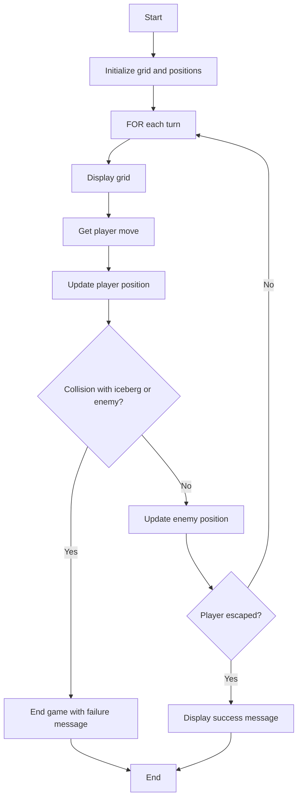
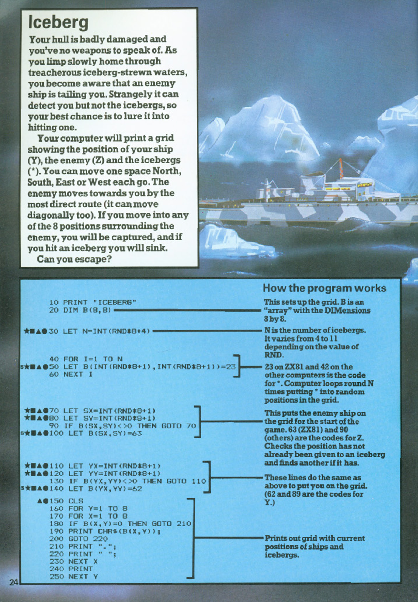
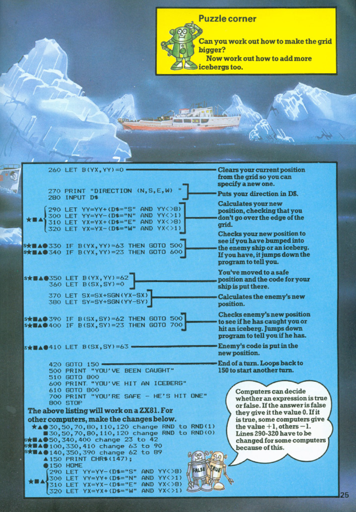

# Iceberg

**Book**: _[Computer Battlegames](https://drive.google.com/file/d/0Bxv0SsvibDMTVUExUjFhTURCSU0/view?usp=sharing&resourcekey=0-v2liG0G60g8b7DXjJtDBXg)_  
**Author**:  [Usborne Publishing](https://usborne.com/)    
**Translator**: [Marcus Medina](https://github.com/marcusjobb/UsborneBooks)

## Story

Your hull is badly damaged and you have no time to speak of. As you limp slowly home through treacherous frozen waters, you become aware that an enemy ship is after you. Strangely, it can only detect you if you stop moving. Your best chance is to lure it into an iceberg and escape. Can you escape?

## Pseudocode

```plaintext
start
initialize grid and set positions for ship, enemy, and icebergs
for each turn:
    display grid
    get player move (north, south, east, west)
    update ship position
    check for collisions with icebergs or the enemy
    if collision:
        end game with failure message
    update enemy position
    if player escapes:
        display success message and end game
end
```

## Flowchart



## Code

<details>
<summary>Pages</summary>

  


</details>

<details>
<summary>ZX-81</summary>

```basic
10 PRINT "ICEBERG"
20 DIM B(8,8)
30 LET N=INT(RND*4)+4
40 FOR I=1 TO N
50 LET B(INT(RND*8)+1, INT(RND*8)+1)=23
60 NEXT I
70 LET SX=INT(RND*8)+1
80 LET SY=INT(RND*8)+1
90 IF B(SX,SY)<>0 THEN GOTO 70
100 LET B(SX,SY)=63
110 LET YX=INT(RND*8)+1
120 LET YY=INT(RND*8)+1
130 IF B(YX,YY)<>0 THEN GOTO 110
140 LET B(YX,YY)=62
150 CLS
160 FOR Y=1 TO 8
170 FOR X=1 TO 8
180 IF B(X,Y)>0 THEN GOTO 210
190 PRINT CHR$(B(X,Y));
200 GOTO 220
210 PRINT " ";
220 NEXT X
230 PRINT
240 NEXT Y
250 INPUT D$
260 LET B(YX,YY)=0
270 PRINT "DIRECTION (N,S,E,W) "
280 INPUT D$
290 LET YY=YY+(D$="S" AND YY<8)
300 LET YY=YY-(D$="N" AND YY>1)
310 LET YX=YX+(D$="E" AND YX<8)
320 LET YX=YX-(D$="W" AND YX>1)
330 IF B(YX,YY)=63 THEN GOTO 500
340 IF B(YX,YY)=23 THEN GOTO 600
350 LET B(SX,SY)=42
360 LET B(SX,SY)=0
370 LET SX=SX+SGN(YX-SX)
380 LET SY=SY+SGN(YY-SY)
390 IF B(SX,SY)=42 THEN GOTO 500
400 IF B(SX,SY)=23 THEN GOTO 700
410 LET B(SX,SY)=63
420 GOTO 150
500 PRINT "YOU'VE BEEN CAUGHT"
510 GOTO 800
600 PRINT "YOU'VE HIT AN ICEBERG"
610 GOTO 800
700 PRINT "YOU'RE SAFE - HE'S HIT ONE"
800 STOP
```

</details>

<details>
<summary>C#</summary>

```csharp
using System;

class Iceberg
{
    static void Main()
    {
        Console.WriteLine("Iceberg");

        char[,] grid = new char[8, 8];
        Random random = new Random();

        int playerX = random.Next(0, 8);
        int playerY = random.Next(0, 8);
        int enemyX = random.Next(0, 8);
        int enemyY = random.Next(0, 8);

        // Add icebergs
        int[,] icebergs = new int[8, 8];
        for (int i = 0; i < 4; i++)
        {
            int x, y;
            do
            {
                x = random.Next(0, 8);
                y = random.Next(0, 8);
            } while (icebergs[x, y] == 1 || (x == playerX && y == playerY) || (x == enemyX && y == enemyY));
            icebergs[x, y] = 1;
        }

        for (int i = 0; i < 10; i++)
        {
            Console.Clear();
            DisplayGrid(grid, playerX, playerY, enemyX, enemyY, icebergs);

            Console.Write("Move (N/S/E/W): ");
            char move = char.ToUpper(Console.ReadKey().KeyChar);

            switch (move)
            {
                case 'N': playerX = Math.Max(0, playerX - 1); break;
                case 'S': playerX = Math.Min(7, playerX + 1); break;
                case 'E': playerY = Math.Min(7, playerY + 1); break;
                case 'W': playerY = Math.Max(0, playerY - 1); break;
            }

            if (icebergs[playerX, playerY] == 1)
            {
                Console.WriteLine("You hit an iceberg!");
                return;
            }

            if (playerX == enemyX && playerY == enemyY)
            {
                Console.WriteLine("You've been caught!");
                return;
            }

            enemyX = Math.Max(0, Math.Min(7, enemyX + random.Next(-1, 2)));
            enemyY = Math.Max(0, Math.Min(7, enemyY + random.Next(-1, 2)));

            if (icebergs[enemyX, enemyY] == 1)
            {
                Console.WriteLine("Enemy hit an iceberg! You're safe!");
                return;
            }
        }

        Console.WriteLine("You escaped!");
    }

    static void DisplayGrid(char[,] grid, int playerX, int playerY, int enemyX, int enemyY, int[,] icebergs)
    {
        for (int x = 0; x < 8; x++)
        {
            for (int y = 0; y < 8; y++)
            {
                if (x == playerX && y == playerY) Console.Write("P ");
                else if (x == enemyX && y == enemyY) Console.Write("E ");
                else if (icebergs[x, y] == 1) Console.Write("I ");
                else Console.Write(". ");
            }
            Console.WriteLine();
        }
    }
}
```

</details>

<details>
<summary>Python</summary>

```python
import random

print("Iceberg")
grid_size = 8
player = [random.randint(0, grid_size - 1), random.randint(0, grid_size - 1)]
enemy = [random.randint(0, grid_size - 1), random.randint(0, grid_size - 1)]
icebergs = set()

# Place icebergs
for _ in range(4):
    while True:
        iceberg = (random.randint(0, grid_size - 1), random.randint(0, grid_size - 1))
        if iceberg not in icebergs and iceberg != tuple(player) and iceberg != tuple(enemy):
            icebergs.add(iceberg)
            break

for turn in range(10):
    for x in range(grid_size):
        for y in range(grid_size):
            if [x, y] == player:
                print("P", end=" ")
            elif [x, y] == enemy:
                print("E", end=" ")
            elif (x, y) in icebergs:
                print("I", end=" ")
            else:
                print(".", end=" ")
        print()

    move = input("Move (N/S/E/W): ").upper()
    if move == 'N': player[0] = max(0, player[0] - 1)
    elif move == 'S': player[0] = min(grid_size - 1, player[0] + 1)
    elif move == 'E': player[1] = min(grid_size - 1, player[1] + 1)
    elif move == 'W': player[1] = max(0, player[1] - 1)

    if tuple(player) in icebergs:
        print("You hit an iceberg!")
        break

    if player == enemy:
        print("You've been caught!")
        break

    enemy = [max(0, min(grid_size - 1, enemy[0] + random.randint(-1, 1))), max(0, min(grid_size - 1, enemy[1] + random.randint(-1, 1)))]

    if tuple(enemy) in icebergs:
        print("Enemy hit an iceberg! You're safe!")
        break

else:
    print("You escaped!")
```

</details>

<details>
<summary>Java</summary>

```java
import java.util.Random;
import java.util.Scanner;
import java.util.HashSet;

public class Iceberg {
    public static void main(String[] args) {
        Scanner scanner = new Scanner(System.in);
        Random random = new Random();

        int gridSize = 8;
        int playerX = random.nextInt(gridSize);
        int playerY = random.nextInt(gridSize);
        int enemyX = random.nextInt(gridSize);
        int enemyY = random.nextInt(gridSize);

        HashSet<String> icebergs = new HashSet<>();
        for (int i = 0; i < 4; i++) {
            int x, y;
            do {
                x = random.nextInt(gridSize);
                y = random.nextInt(gridSize);
            } while (icebergs.contains(x + "," + y) || (x == playerX && y == playerY) || (x == enemyX && y == enemyY));
            icebergs.add(x + "," + y);
        }

        for (int turn = 0; turn < 10; turn++) {
            for (int x = 0; x < gridSize; x++) {
                for (int y = 0; y < gridSize; y++) {
                    if (x == playerX && y == playerY) {
                        System.out.print("P ");
                    } else if (x == enemyX && y == enemyY) {
                        System.out.print("E ");
                    } else if (icebergs.contains(x + "," + y)) {
                        System.out.print("I ");
                    } else {
                        System.out.print(". ");
                    }
                }
                System.out.println();
            }

            System.out.print("Move (N/S/E/W): ");
            char move = scanner.next().toUpperCase().charAt(0);

            switch (move) {
                case 'N': playerX = Math.max(0, playerX - 1); break;
                case 'S': playerX = Math.min(gridSize - 1, playerX + 1); break;
                case 'E': playerY = Math.min(gridSize - 1, playerY + 1); break;
                case 'W': playerY = Math.max(0, playerY - 1); break;
            }

            if (icebergs.contains(playerX + "," + playerY)) {
                System.out.println("You hit an iceberg!");
                break;
            }

            if (playerX == enemyX && playerY == enemyY) {
                System.out.println("You've been caught!");
                break;
            }

            enemyX = Math.max(0, Math.min(gridSize - 1, enemyX + random.nextInt(3) - 1));
            enemyY = Math.max(0, Math.min(gridSize - 1, enemyY + random.nextInt(3) - 1));

            if (icebergs.contains(enemyX + "," + enemyY)) {
                System.out.println("Enemy hit an iceberg! You're safe!");
                break;
            }
        }

        scanner.close();
    }
}
```

</details>

<details>
<summary>Go</summary>

```go
package main

import (
	"fmt"
	"math/rand"
	"time"
)

func main() {
	rand.Seed(time.Now().UnixNano())
	gridSize := 8
	playerX, playerY := rand.Intn(gridSize), rand.Intn(gridSize)
	enemyX, enemyY := rand.Intn(gridSize), rand.Intn(gridSize)
	icebergs := make(map[[2]int]bool)

	// Place icebergs
	for i := 0; i < 4; i++ {
		for {
			x, y := rand.Intn(gridSize), rand.Intn(gridSize)
			if !icebergs[[2]int{x, y}] && (x != playerX || y != playerY) && (x != enemyX || y != enemyY) {
				icebergs[[2]int{x, y}] = true
				break
			}
		}
	}

	for turn := 0; turn < 10; turn++ {
		for x := 0; x < gridSize; x++ {
			for y := 0; y < gridSize; y++ {
				switch {
				case x == playerX && y == playerY:
					fmt.Print("P ")
				case x == enemyX && y == enemyY:
					fmt.Print("E ")
				case icebergs[[2]int{x, y}]:
					fmt.Print("I ")
				default:
					fmt.Print(". ")
				}
			}
			fmt.Println()
		}

		var move string
		fmt.Print("Move (N/S/E/W): ")
		fmt.Scan(&move)

		switch move {
		case "N":
			if playerX > 0 {
				playerX--
			}
		case "S":
			if playerX < gridSize-1 {
				playerX++
			}
		case "E":
			if playerY < gridSize-1 {
				playerY++
			}
		case "W":
			if playerY > 0 {
				playerY--
			}
		}

		if icebergs[[2]int{playerX, playerY}] {
			fmt.Println("You hit an iceberg!")
			return
		}

		if playerX == enemyX && playerY == enemyY {
			fmt.Println("You've been caught!")
			return
		}

		enemyX += rand.Intn(3) - 1
		enemyY += rand.Intn(3) - 1

		if icebergs[[2]int{enemyX, enemyY}] {
			fmt.Println("Enemy hit an iceberg! You're safe!")
			return
		}
	}

	fmt.Println("You escaped!")
}
```

</details>

<details>
<summary>C++</summary>

```cpp
#include <iostream>
#include <set>
#include <utility>
#include <cstdlib>
#include <ctime>
using namespace std;

int main() {
    srand(static_cast<unsigned>(time(0)));

    const int gridSize = 8;
    int playerX = rand() % gridSize;
    int playerY = rand() % gridSize;
    int enemyX = rand() % gridSize;
    int enemyY = rand() % gridSize;

    set<pair<int, int>> icebergs;
    for (int i = 0; i < 4; i++) {
        int x, y;
        do {
            x = rand() % gridSize;
            y = rand() % gridSize;
        } while (icebergs.count({x, y}) || (x == playerX && y == playerY) || (x == enemyX && y == enemyY));
        icebergs.insert({x, y});
    }

    for (int turn = 0; turn < 10; turn++) {
        for (int x = 0; x < gridSize; x++) {
            for (int y = 0; y < gridSize; y++) {
                if (x == playerX && y == playerY)
                    cout << "P ";
                else if (x == enemyX && y == enemyY)
                    cout << "E ";
                else if (icebergs.count({x, y}))
                    cout << "I ";
                else
                    cout << ". ";
            }
            cout << endl;
        }

        char move;
        cout << "Move (N/S/E/W): ";
        cin >> move;

        switch (toupper(move)) {
            case 'N': if (playerX > 0) playerX--; break;
            case 'S': if (playerX < gridSize - 1) playerX++; break;
            case 'E': if (playerY < gridSize - 1) playerY++; break;
            case 'W': if (playerY > 0) playerY--; break;
        }

        if (icebergs.count({playerX, playerY})) {
            cout << "You hit an iceberg!" << endl;
            return 0;
        }

        if (playerX == enemyX && playerY == enemyY) {
            cout << "You've been caught!" << endl;
            return 0;
        }

        enemyX = max(0, min(gridSize - 1, enemyX + (rand() % 3 - 1)));
        enemyY = max(0, min(gridSize - 1, enemyY + (rand() % 3 - 1)));

        if (icebergs.count({enemyX, enemyY})) {
            cout << "Enemy hit an iceberg! You're safe!" << endl;
            return 0;
        }
    }

    cout << "You escaped!" << endl;
    return 0;
}
```

</details>

## Explanation

- **Objective**: Escape the grid without colliding with icebergs or the enemy ship.
- **Gameplay**: Players move on the grid using cardinal directions while the enemy ship attempts to follow.
- **Win Condition**: Successfully avoid obstacles and the enemy for 10 turns.

## Challenges

1. **Increase Difficulty**:

   - Add more icebergs to the grid.
   - Reduce the number of safe turns required for escape.

2. **Add Features**:

   - Introduce power-ups or safe zones.
   - Add multiple enemy ships with varied movement patterns.

3. **Customize**:
   - Change the grid size for more strategic gameplay.
   - Introduce a dynamic grid where obstacles appear or move each turn.

## Book Information

- **Title**: _Computer Battlegames_
- **Publisher**: Usborne Publishing

## Copyright

These programs are adaptations of the original Usborne Computer Guides published in the 1980s. The books are free to download for personal or educational use from [Usborne's Computer and Coding Books](https://usborne.com/row/books/computer-and-coding-books). Programs and adaptations may not be used for commercial purposes.

Return to [Computer Battlegames](./readme.md).
