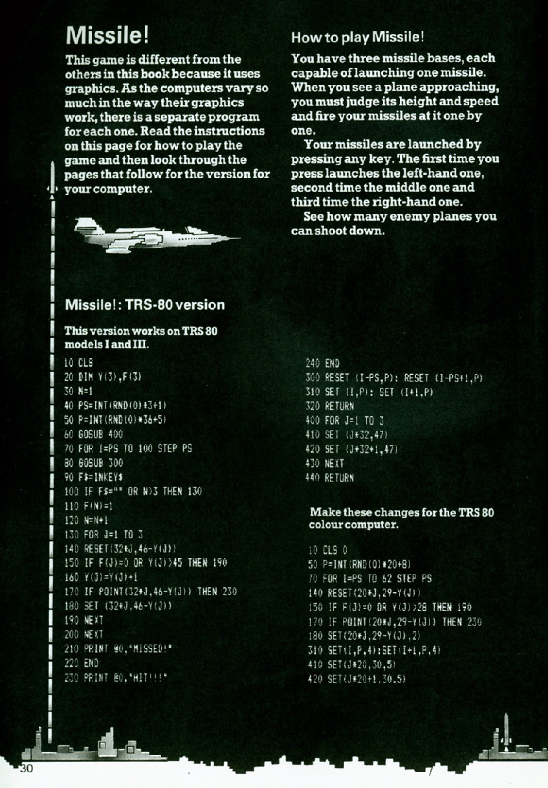
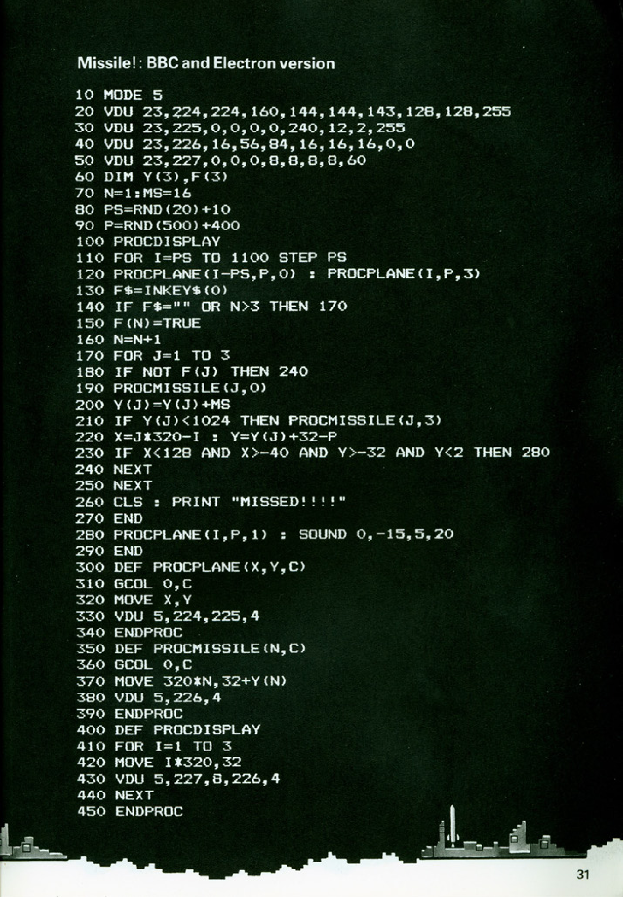
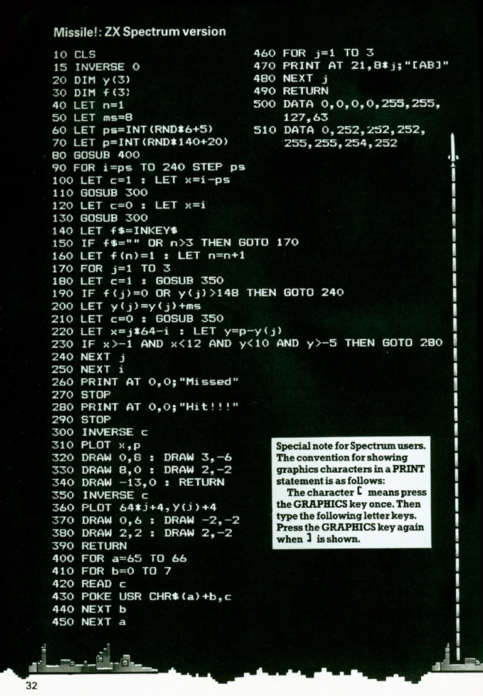
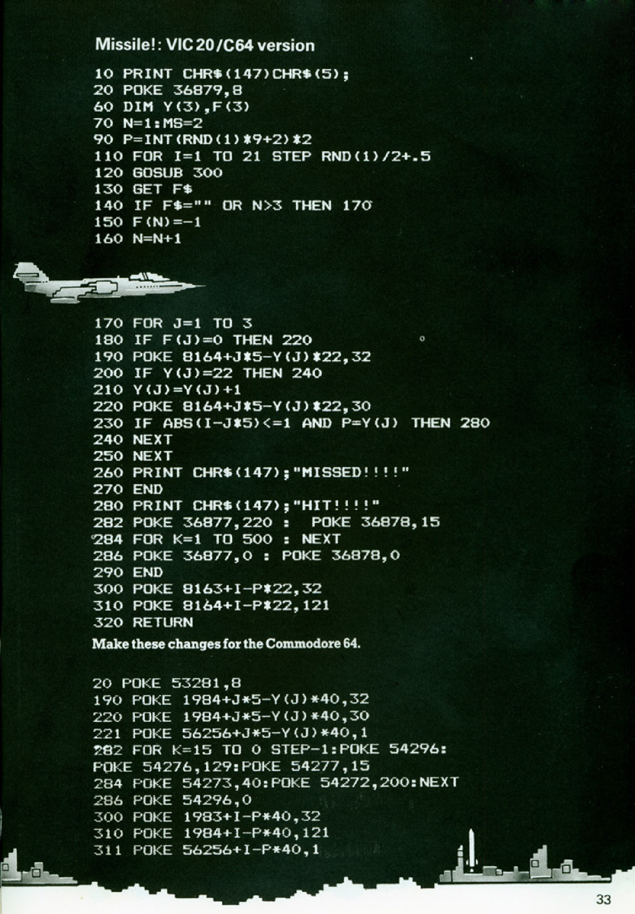
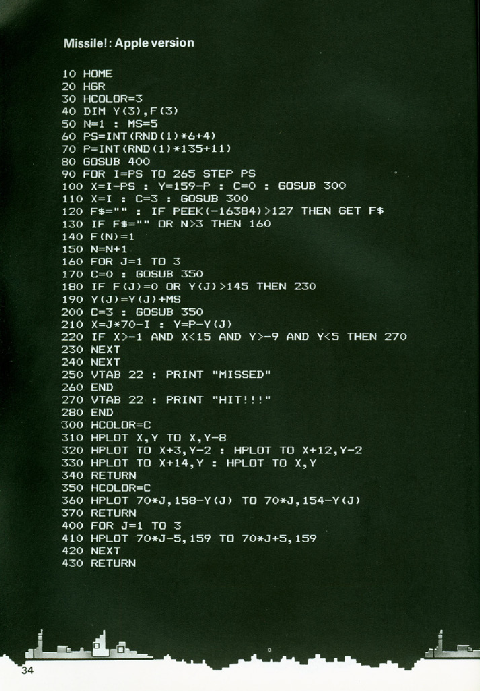
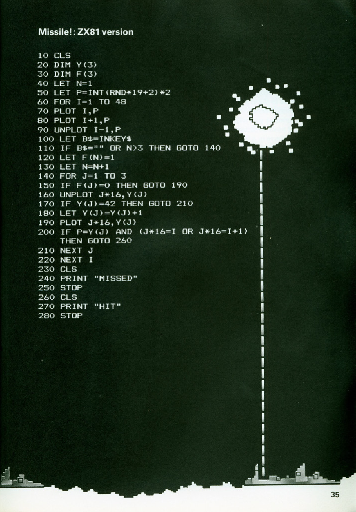

# Missile!

**Book**: _[Computer Battlegames](https://drive.google.com/file/d/0Bxv0SsvibDMTVUExUjFhTURCSU0/view?usp=sharing&resourcekey=0-v2liG0G60g8b7DXjJtDBXg)_  
**Author**:  [Usborne Publishing](https://usborne.com/)    
**Translator**: [Marcus Medina](https://github.com/marcusjobb/UsborneBooks)

## Story

In "Missile!", you control three missile bases and must shoot down enemy planes using your missiles. The game stands out by utilizing graphics instead of text, providing an engaging visual experience. Success depends on your ability to judge the height, speed, and trajectory of enemy planes, and timing your missiles effectively.

## Pseudocode

```plaintext
START
INITIALIZE missile bases and positions
INITIALIZE variables for plane trajectory and speed
DISPLAY missile bases on screen
REPEAT
    CHECK for user input to fire missile
    IF missile is fired THEN
        LAUNCH missile from the selected base
    ENDIF
    MOVE enemy planes across the screen
    CHECK for collisions between missiles and planes
    IF a collision occurs THEN
        DESTROY plane
        UPDATE score
    ENDIF
UNTIL player runs out of bases or decides to quit
END
```

## Flowchart

<div class="mermaid">
flowchart TD
    Start[Start]
    Init[Initialize missile bases and variables]
    Display[Display missile bases on screen]
    Repeat[Repeat until game ends]
    Input[Check for user input to fire missile]
    Launch[Launch missile from selected base]
    MovePlanes[Move enemy planes across screen]
    Collision[Check for collisions between missiles and planes]
    Destroy[Destroy plane and update score]
    GameOver[Game Over]

    Start --> Init --> Display --> Repeat
    Repeat --> Input -->|If missile fired| Launch --> Collision
    Collision -->|If collision| Destroy --> Repeat
    Collision -->|If no collision| Repeat
    Repeat -->|If out of bases or quit| GameOver

</div>

## Code

<details>
<summary>Pages</summary>

  

  
  
  


</details>

<details>
<summary>ZX-81</summary>

```plaintext
10 CLS
20 DIM Y(3)
30 DIM F(3)
40 LET N=1
50 LET P=INT(RND*19+2)*2
60 FOR I=1 TO 48
70 PLOT I,P
80 PLOT I+1,P
90 UNPLOT I-1,P
100 LET B$=INKEY$
110 IF B$="" OR N>3 THEN GOTO 140
120 LET F(N)=1
130 LET N=N+1
140 FOR J=1 TO 3
150 IF F(J)=0 THEN GOTO 190
160 UNPLOT J*16,Y(J)
170 LET Y(J)=Y(J)+2
180 UNPLOT J*16,Y(J)+1
190 PLOT J*16,Y(J)
200 IF P=Y(J) AND (J*16=I OR J*16=I+1) THEN GOTO 270
210 NEXT J
220 NEXT I
230 CLS
240 PRINT "MISSED"
250 STOP
260 CLS
270 PRINT "HIT"
280 STOP
```

</details>

<details>
<summary>C#</summary>

```csharp
using System;

class MissileGame
{
    static void Main()
    {
        int[] missileBases = { 0, 0, 0 }; // Positions of missile bases
        int score = 0; // Player's score
        bool gameRunning = true;

        Console.WriteLine("Welcome to Missile! Use keys to launch missiles and shoot enemy planes.");

        Random random = new Random();
        while (gameRunning)
        {
            Console.WriteLine("Press 1, 2, or 3 to fire a missile from the corresponding base.");
            ConsoleKeyInfo keyInfo = Console.ReadKey(true);

            if (keyInfo.Key == ConsoleKey.D1 || keyInfo.Key == ConsoleKey.D2 || keyInfo.Key == ConsoleKey.D3)
            {
                int baseIndex = keyInfo.Key - ConsoleKey.D1;
                Console.WriteLine($"Missile launched from base {baseIndex + 1}!");

                int planePosition = random.Next(1, 4);
                Console.WriteLine($"Enemy plane approaching base {planePosition}!");

                if (planePosition == baseIndex + 1)
                {
                    score++;
                    Console.WriteLine("Direct hit! Plane destroyed.");
                }
                else
                {
                    Console.WriteLine("Missed!");
                }
            }

            Console.WriteLine("Continue? (Y/N)");
            if (Console.ReadKey(true).Key == ConsoleKey.N)
            {
                gameRunning = false;
            }
        }

        Console.WriteLine($"Game Over. Final score: {score}");
    }
}
```

</details>

<details>
<summary>Python</summary>

```python
import random

print("Welcome to Missile! Use keys to launch missiles and shoot enemy planes.")
missile_bases = [0, 0, 0]  # Positions of missile bases
score = 0  # Player's score
game_running = True

while game_running:
    print("Press 1, 2, or 3 to fire a missile from the corresponding base.")
    user_input = input("Enter your choice (1-3) or Q to quit: ")

    if user_input in ['1', '2', '3']:
        base_index = int(user_input) - 1
        print(f"Missile launched from base {base_index + 1}!")

        plane_position = random.randint(1, 3)
        print(f"Enemy plane approaching base {plane_position}!")

        if plane_position == base_index + 1:
            score += 1
            print("Direct hit! Plane destroyed.")
        else:
            print("Missed!")

    elif user_input.lower() == 'q':
        game_running = False

print(f"Game Over. Final score: {score}")
```

</details>

<details>
<summary>Java</summary>

```java
import java.util.Random;
import java.util.Scanner;

public class MissileGame {
    public static void main(String[] args) {
        int[] missileBases = {0, 0, 0};
        int score = 0;
        boolean gameRunning = true;

        Scanner scanner = new Scanner(System.in);
        Random random = new Random();

        System.out.println("Welcome to Missile! Use keys to launch missiles and shoot enemy planes.");

        while (gameRunning) {
            System.out.println("Press 1, 2, or 3 to fire a missile from the corresponding base.");
            String input = scanner.nextLine();

            if (input.equals("1") || input.equals("2") || input.equals("3")) {
                int baseIndex = Integer.parseInt(input) - 1;
                System.out.println("Missile launched from base " + (baseIndex + 1) + "!");

                int planePosition = random.nextInt(3) + 1;
                System.out.println("Enemy plane approaching base " + planePosition + "!");

                if (planePosition == baseIndex + 1) {
                    score++;
                    System.out.println("Direct hit! Plane destroyed.");
                } else {
                    System.out.println("Missed!");
                }
            } else if (input.equalsIgnoreCase("q")) {
                gameRunning = false;
            }
        }

        System.out.println("Game Over. Final score: " + score);
        scanner.close();
    }
}
```

</details>

<details>
<summary>Go</summary>

```go
package main

import (
	"fmt"
	"math/rand"
	"time"
)

func main() {
	missileBases := [3]int{0, 0, 0}
	score := 0
	gameRunning := true

	rand.Seed(time.Now().UnixNano())
	fmt.Println("Welcome to Missile! Use keys to launch missiles and shoot enemy planes.")

	for gameRunning {
		fmt.Println("Press 1, 2, or 3 to fire a missile from the corresponding base.")
		var input string
		fmt.Scanln(&input)

		if input == "1" || input == "2" || input == "3" {
			baseIndex := int(input[0] - '1')
			fmt.Printf("Missile launched from base %d!\n", baseIndex+1)

			planePosition := rand.Intn(3) + 1
			fmt.Printf("Enemy plane approaching base %d!\n", planePosition)

			if planePosition == baseIndex+1 {
				score++
				fmt.Println("Direct hit! Plane destroyed.")
			} else {
				fmt.Println("Missed!")
			}
		} else if input == "q" {
			gameRunning = false
		}
	}

	fmt.Printf("Game Over. Final score: %d\n", score)
}
```

</details>

<details>
<summary>C++</summary>

```cpp
#include <iostream>
#include <cstdlib>
#include <ctime>
using namespace std;

int main() {
    int missileBases[3] = {0, 0, 0};
    int score = 0;
    bool gameRunning = true;

    srand(time(0));
    cout << "Welcome to Missile! Use keys to launch missiles and shoot enemy planes." << endl;

    while (gameRunning) {
        cout << "Press 1, 2, or 3 to fire a missile from the corresponding base." << endl;
        char input;
        cin >> input;

        if (input == '1' || input == '2' || input == '3') {
            int baseIndex = input - '1';
            cout << "Missile launched from base " << (baseIndex + 1) << "!" << endl;

            int planePosition = rand() % 3 + 1;
            cout << "Enemy plane approaching base " << planePosition << "!" << endl;

            if (planePosition == baseIndex + 1) {
                score++;
                cout << "Direct hit! Plane destroyed." << endl;
            } else {
                cout << "Missed!" << endl;
            }
        } else if (input == 'q') {
            gameRunning = false;
        }
    }

    cout << "Game Over. Final score: " << score << endl;
    return 0;
}
```

</details>

<details>
<summary>Rust</summary>

```rust
use rand::Rng;
use std::io;

fn main() {
    let mut missile_bases = [0; 3];
    let mut score = 0;
    let mut game_running = true;

    println!("Welcome to Missile! Use keys to launch missiles and shoot enemy planes.");

    while game_running {
        println!("Press 1, 2, or 3 to fire a missile from the corresponding base.");

        let mut input = String::new();
        io::stdin().read_line(&mut input).expect("Failed to read input");
        let input = input.trim();

        if let Ok(base_index) = input.parse::<usize>() {
            if base_index >= 1 && base_index <= 3 {
                println!("Missile launched from base {}!", base_index);

                let plane_position = rand::thread_rng().gen_range(1..=3);
                println!("Enemy plane approaching base {}!", plane_position);

                if plane_position == base_index {
                    score += 1;
                    println!("Direct hit! Plane destroyed.");
                } else {
                    println!("Missed!");
                }
            }
        } else if input.eq_ignore_ascii_case("q") {
            game_running = false;
        }
    }

    println!("Game Over. Final score: {}", score);
}
```

</details>

## Explanation

The objective of "Missile!" is to use your missile bases to intercept enemy planes before they cross the screen. Players must time their missile launches accurately, accounting for the trajectory and speed of the planes. The game ends when all bases are destroyed or the player decides to quit.

## Challenges

1. **Increase Difficulty**:

   - Add more planes with varying speeds and heights.
   - Reduce the number of missile bases available to the player.

2. **Add Features**:

   - Include bonus planes that give extra points.
   - Add obstacles that missiles must avoid.

3. **Customize**:
   - Allow players to upgrade missile bases for faster reloads or higher accuracy.
   - Include a multiplayer mode.

## Copyright

These programs are adaptations of the original Usborne Computer Guides published in the 1980s. The books are free to download for personal or educational use from [Usborne's Computer and Coding Books](https://usborne.com/row/books/computer-and-coding-books). Programs and adaptations may not be used for commercial purposes.

Return to [Computer Battlegames](./readme.md).
