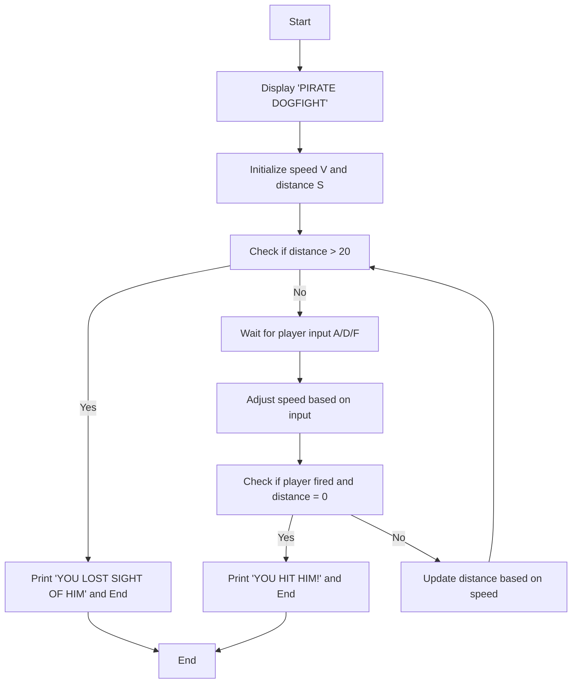

# Pirate Dogfight

**Book**: _Computer Battlegames_  
**Author**: Usborne Publishing

## Story

You are piloting a fighter jet against the infamous Sky Pirate. The pirate moves ahead, you accelerate, he slows down, and you decelerate. Your mission is to level your position with the pirate and shoot him down before he shoots you. Use the letter keys **A** to accelerate, **D** to decelerate, and **F** to fire. Pay attention to your speed and position to time your shots carefully!

## Pseudocode

```plaintext
START
PRINT "PIRATE DOGFIGHT"
SET speed (V) randomly between -5 and 5
SET distance (S) randomly between -2 and 1
LOOP UNTIL distance > 20:
    DISPLAY "YOU ARE" POSITION RELATIVE TO PIRATE
    DISPLAY "YOU ARE GOING" SPEED RELATIVE TO PIRATE
    WAIT FOR PLAYER INPUT (A/D/F)

    IF A THEN INCREASE SPEED
    IF D THEN DECREASE SPEED
    IF F AND distance = 0 THEN
        PRINT "YOU HIT HIM!"
        END GAME
    END IF

    UPDATE distance

    IF distance > 20 THEN
        PRINT "YOU LOST SIGHT OF HIM"
        END GAME
    END IF

PRINT "YOU HIT HIM!"
END
```

## Flowchart



## Code

<details>
<summary>Pages</summary>

  


</details>

<details>
<summary>ZX-81</summary>

```basic
10 CLS
20 PRINT "PIRATE DOGFIGHT"
30 LET V=INT(RND*11)-5
40 LET S=-INT(RND*3)+1
50 IF ABS(S)>20 THEN GOTO 230
60 CLS
70 PRINT "YOU ARE ";
80 IF S<0 THEN PRINT "BEHIND"
90 IF S>0 THEN PRINT "AHEAD"
100 IF S=0 THEN PRINT "LEVEL"
110 PRINT "YOU ARE GOING ";
120 IF V>0 THEN PRINT "FASTER"
130 IF V<0 THEN PRINT "SLOWER"
140 IF V=0 THEN PRINT "SAME"
150 LET I$=INKEY$
160 IF I$="A" THEN LET V=V+1
170 IF I$="D" THEN LET V=V-1
180 IF I$="F" AND S=0 THEN GOTO 250
190 IF I$="" THEN GOTO 150
200 LET S=S-V
210 GOTO 50
230 PRINT "YOU LOST SIGHT OF HIM"
240 STOP
250 PRINT "YOU HIT HIM!"
260 STOP
```

</details>

<details>
<summary>C#</summary>

```csharp
using System;

class PirateDogfight
{
    static void Main()
    {
        Console.WriteLine("PIRATE DOGFIGHT");
        Random random = new Random();
        int speed = random.Next(-5, 6);
        int distance = random.Next(-2, 2);

        while (Math.Abs(distance) <= 20)
        {
            Console.Clear();
            Console.Write("YOU ARE ");
            if (distance < 0) Console.WriteLine("BEHIND");
            else if (distance > 0) Console.WriteLine("AHEAD");
            else Console.WriteLine("LEVEL");

            Console.Write("YOU ARE GOING ");
            if (speed > 0) Console.WriteLine("FASTER");
            else if (speed < 0) Console.WriteLine("SLOWER");
            else Console.WriteLine("SAME");

            Console.WriteLine("Press A to accelerate, D to decelerate, F to fire.");
            string input = Console.ReadLine().ToUpper();

            if (input == "A") speed++;
            else if (input == "D") speed--;
            else if (input == "F" && distance == 0)
            {
                Console.WriteLine("YOU HIT HIM!");
                return;
            }

            distance -= speed;
        }

        Console.WriteLine("YOU LOST SIGHT OF HIM");
    }
}
```

</details>

<details>
<summary>Python</summary>

```python
import random

print("PIRATE DOGFIGHT")

speed = random.randint(-5, 5)
distance = random.randint(-2, 1)

while abs(distance) <= 20:
    print("YOU ARE", end=" ")
    if distance < 0:
        print("BEHIND")
    elif distance > 0:
        print("AHEAD")
    else:
        print("LEVEL")

    print("YOU ARE GOING", end=" ")
    if speed > 0:
        print("FASTER")
    elif speed < 0:
        print("SLOWER")
    else:
        print("SAME")

    command = input("Press A to accelerate, D to decelerate, F to fire: ").upper()

    if command == "A":
        speed += 1
    elif command == "D":
        speed -= 1
    elif command == "F" and distance == 0:
        print("YOU HIT HIM!")
        break

    distance -= speed
else:
    print("YOU LOST SIGHT OF HIM")
```

</details>

<details>
<summary>Java</summary>

```java
import java.util.Scanner;
import java.util.Random;

public class PirateDogfight {
    public static void main(String[] args) {
        Scanner scanner = new Scanner(System.in);
        Random random = new Random();

        System.out.println("PIRATE DOGFIGHT");
        int speed = random.nextInt(11) - 5;
        int distance = random.nextInt(4) - 2;

        while (Math.abs(distance) <= 20) {
            System.out.print("YOU ARE ");
            if (distance < 0) System.out.println("BEHIND");
            else if (distance > 0) System.out.println("AHEAD");
            else System.out.println("LEVEL");

            System.out.print("YOU ARE GOING ");
            if (speed > 0) System.out.println("FASTER");
            else if (speed < 0) System.out.println("SLOWER");
            else System.out.println("SAME");

            System.out.print("Press A to accelerate, D to decelerate, F to fire: ");
            String input = scanner.next().toUpperCase();

            if (input.equals("A")) speed++;
            else if (input.equals("D")) speed--;
            else if (input.equals("F") && distance == 0) {
                System.out.println("YOU HIT HIM!");
                break;
            }

            distance -= speed;
        }

        if (Math.abs(distance) > 20) {
            System.out.println("YOU LOST SIGHT OF HIM");
        }
    }
}
```

</details>

<details>
<summary>Go</summary>

```go
package main

import (
	"fmt"
	"math/rand"
	"time"
)

func main() {
	fmt.Println("PIRATE DOGFIGHT")

	rand.Seed(time.Now().UnixNano())
	speed := rand.Intn(11) - 5
	distance := rand.Intn(4) - 2

	for abs(distance) <= 20 {
		fmt.Print("YOU ARE ")
		if distance < 0 {
			fmt.Println("BEHIND")
		} else if distance > 0 {
			fmt.Println("AHEAD")
		} else {
			fmt.Println("LEVEL")
		}

		fmt.Print("YOU ARE GOING ")
		if speed > 0 {
			fmt.Println("FASTER")
		} else if speed < 0 {
			fmt.Println("SLOWER")
		} else {
			fmt.Println("SAME")
		}

		var input string
		fmt.Print("Press A to accelerate, D to decelerate, F to fire: ")
		fmt.Scan(&input)

		if input == "A" {
			speed++
		} else if input == "D" {
			speed--
		} else if input == "F" && distance == 0 {
			fmt.Println("YOU HIT HIM!")
			return
		}

		distance -= speed
	}

	fmt.Println("YOU LOST SIGHT OF HIM")
}

func abs(x int) int {
	if x < 0 {
		return -x
	}
	return x
}
```

</details>

<details>
<summary>C++</summary>

```cpp
#include <iostream>
#include <cstdlib>
#include <ctime>
#include <cmath>

using namespace std;

int main() {
    srand(time(0));

    int speed = rand() % 11 - 5;
    int distance = rand() % 4 - 2;

    cout << "PIRATE DOGFIGHT" << endl;

    while (abs(distance) <= 20) {
        cout << "YOU ARE ";
        if (distance < 0) cout << "BEHIND" << endl;
        else if (distance > 0) cout << "AHEAD" << endl;
        else cout << "LEVEL" << endl;

        cout << "YOU ARE GOING ";
        if (speed > 0) cout << "FASTER" << endl;
        else if (speed < 0) cout << "SLOWER" << endl;
        else cout << "SAME" << endl;

        cout << "Press A to accelerate, D to decelerate, F to fire: ";
        char input;
        cin >> input;

        if (input == 'A' || input == 'a') {
            speed++;
        } else if (input == 'D' || input == 'd') {
            speed--;
        } else if ((input == 'F' || input == 'f') && distance == 0) {
            cout << "YOU HIT HIM!" << endl;
            return 0;
        }

        distance -= speed;
    }

    cout << "YOU LOST SIGHT OF HIM" << endl;
    return 0;
}
```

</details>

<details>
<summary>Rust</summary>

```rust
use rand::Rng;
use std::io;

fn main() {
    println!("PIRATE DOGFIGHT");

    let mut rng = rand::thread_rng();
    let mut speed = rng.gen_range(-5..=5);
    let mut distance = rng.gen_range(-2..=1);

    while distance.abs() <= 20 {
        println!("YOU ARE {}", if distance < 0 {
            "BEHIND"
        } else if distance > 0 {
            "AHEAD"
        } else {
            "LEVEL"
        });

        println!("YOU ARE GOING {}", if speed > 0 {
            "FASTER"
        } else if speed < 0 {
            "SLOWER"
        } else {
            "SAME"
        });

        println!("Press A to accelerate, D to decelerate, F to fire: ");

        let mut input = String::new();
        io::stdin().read_line(&mut input).unwrap();
        let input = input.trim().to_uppercase();

        if input == "A" {
            speed += 1;
        } else if input == "D" {
            speed -= 1;
        } else if input == "F" && distance == 0 {
            println!("YOU HIT HIM!");
            return;
        }

        distance -= speed;
    }

    println!("YOU LOST SIGHT OF HIM");
}
```

</details>

## Explanation

In "Pirate Dogfight," you need to manage your speed and distance relative to the Sky Pirate to line up your shot. If you are "level" with the pirate and fire, you win. If the distance grows too large, you lose.

## Challenges

1. **Increase Difficulty**: Limit the number of commands allowed.
2. **Add Features**: Introduce random movements for the pirate.
3. **Enhance Gameplay**: Add fuel or ammo limits.

## Copyright

These programs are adaptations of the original Usborne Computer Guides published in the 1980s. The books are free to download for personal or educational use from [Usborne's Computer and Coding Books](https://usborne.com/row/books/computer-and-coding-books). Programs and adaptations may not be used for commercial purposes.

Return to [Computer Battlegames](./readme.md).
