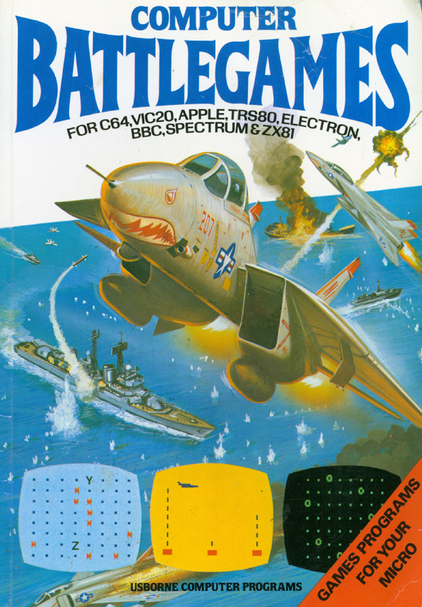

# Computer Battlegames

## About the Book

_Computer Battlegames_ is one of the classic Usborne computer books from the 1980s, featuring a collection of exciting, action-packed games that introduced kids and adults alike to the world of programming. Originally written for early home computers like the ZX-81 and Commodore 64, the book made programming approachable and fun through engaging stories and challenges.

## Games Included

The book contains the following games:

1. [**Robot Missile**](./robot_missile.md) - Save Earth Command by defusing a missile using the correct code.
2. [**The Vital Message**](./the_vital_message.md) - Relay a critical message to HQ by memorizing and retyping it.
3. [**Shootout**](./shootout.md) - Face off in a high-stakes cowboy duel.
4. [**Desert Tank Battle**](./desert_tank_battle.md) - Destroy enemy strongholds with precision targeting.
5. [**Battle at Traitor's Castle**](./battle_at_traitors_castle.md) - Take down hidden targets in a castle siege.
6. [**Robot Invaders**](./robot_invaders.md) - Defend your base from invading robots.
7. [**Secret Weapon**](./secret_weapon.md) - Uncover the hidden weapon and stop the enemy.
8. [**Escape!**](./escape.md) - Navigate through a dangerous labyrinth to freedom.
9. [**Pirate Dogfight**](./pirate_dogfight.md) - Engage in thrilling aerial combat with pirate planes.
10. [**Supersonic Bomber**](./supersonic_bomber.md) - Bomb enemy installations with speed and accuracy.
11. [**Iceberg**](./iceberg.md) - Steer your ship through icy waters, avoiding dangers.
12. [**The Wall**](./the_wall.md) - Break through the enemy’s defenses to win.
13. [**Missile!**](./missile.md) - Destroy moving targets with precision.

## Why Adapt This Book?

The games in _Computer Battlegames_ are timeless examples of how coding can be fun, educational, and creative. By adapting these games into modern programming languages, we:

- Keep the magic of the original book alive for new generations.
- Provide a hands-on way to learn coding concepts.
- Honor the creativity and innovation of 1980s computing.

## Organization

Each game from the book is presented in its own Markdown file. These files include:

- **The story** behind the game.
- **Code translations** in modern languages, starting with C#.
- **Beginner-friendly comments** to help new coders understand key concepts.
- **Challenges** to make the games harder or expand their functionality.

You can explore each game by navigating through the files in this folder.

## Copyright Notice

These programs are adaptations of the original Usborne Computer Guides published in the 1980s. The books are free to download for personal or educational use from [Usborne's Computer and Coding Books](https://usborne.com/row/books/computer-and-coding-books). Programs and adaptations may not be used for commercial purposes.
