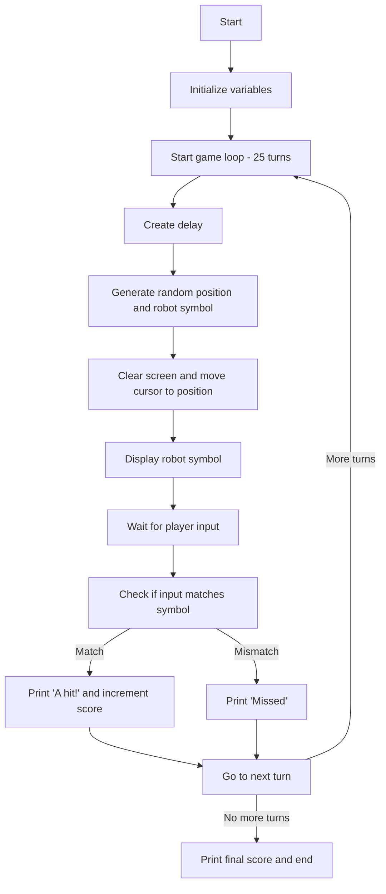
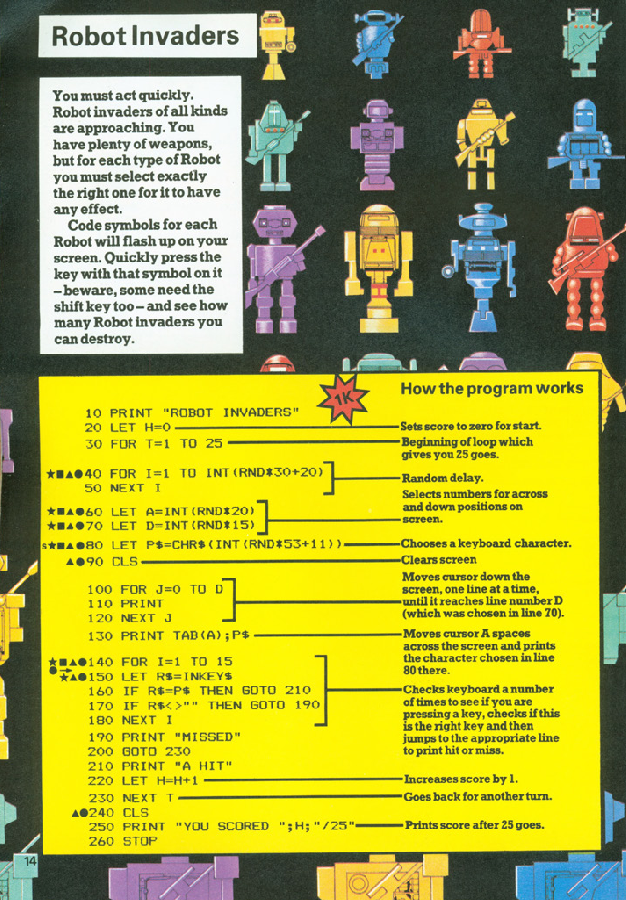
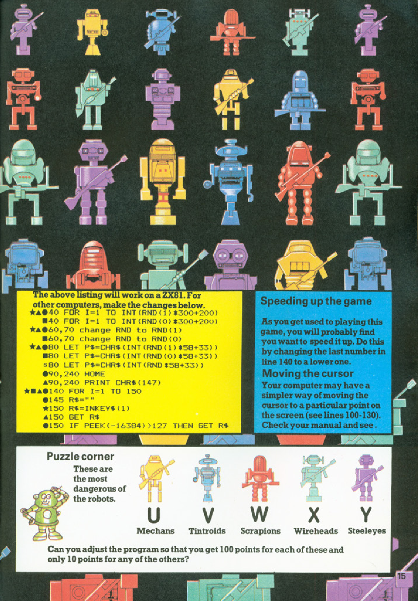

# Robot Invaders

**Book**: _[Computer Battlegames](https://drive.google.com/file/d/0Bxv0SsvibDMTVUExUjFhTURCSU0/view?usp=sharing&resourcekey=0-v2liG0G60g8b7DXjJtDBXg)_  
**Author**:  [Usborne Publishing](https://usborne.com/)    
**Translator**: [Marcus Medina](https://github.com/marcusjobb/UsborneBooks)

## Story

Robot invaders of all kinds are approaching! Your task is to identify and destroy them by pressing the correct key matching their unique symbol. Beware, some require the shift key as well. See how many robots you can destroy before the game ends.

## Pseudocode

```plaintext
START
PRINT "Robot Invaders"
SET score to 0
FOR 25 TURNS:
    CREATE delay
    CHOOSE random horizontal and vertical positions
    CHOOSE random character for robot
    CLEAR screen
    MOVE cursor to robot's position
    DISPLAY robot's symbol
    WAIT for player input

    IF input matches robot's symbol THEN
        INCREMENT score
        PRINT "A hit!"
    ELSE IF wrong input THEN
        PRINT "Missed"

PRINT final score
END
```

## Flowchart



## Code

<details>
<summary>Pages</summary>




</details>

<details>
<summary>ZX-81</summary>

```basic
10 PRINT "ROBOT INVADERS"
20 LET H=0
30 FOR T=1 TO 25
40 FOR I=1 TO INT(RND*30+20)
50 NEXT I
60 LET A=INT(RND*20)
70 LET D=INT(RND*15)
80 LET P$=CHR$(INT(RND*53+11))
90 CLS
100 FOR J=0 TO D
110 PRINT
120 NEXT J
130 PRINT TAB(A);P$
140 FOR I=1 TO 15
150 LET R$=INKEY$
160 IF R$=P$ THEN GOTO 210
170 IF R$<>"" THEN GOTO 190
180 NEXT I
190 PRINT "MISSED"
200 GOTO 230
210 PRINT "A HIT"
220 LET H=H+1
230 NEXT T
240 CLS
250 PRINT "YOU SCORED ";H;" /25"
260 STOP
```

</details>

<details>
<summary>C#</summary>

```csharp
using System;

class RobotInvaders
{
    static void Main()
    {
        Console.WriteLine("Robot Invaders");
        Random random = new Random();
        int score = 0;

        for (int turn = 0; turn < 25; turn++)
        {
            System.Threading.Thread.Sleep(random.Next(200, 500));
            int x = random.Next(0, 20);
            int y = random.Next(0, 15);
            char robotSymbol = (char)(random.Next(33, 87));

            Console.Clear();
            for (int i = 0; i < y; i++)
            {
                Console.WriteLine();
            }
            Console.SetCursorPosition(x, y);
            Console.Write(robotSymbol);

            Console.SetCursorPosition(0, 20);
            Console.Write("Type the character: ");
            string input = Console.ReadLine();

            if (!string.IsNullOrEmpty(input) && input[0] == robotSymbol)
            {
                Console.WriteLine("A hit!");
                score++;
            }
            else
            {
                Console.WriteLine("Missed");
            }
        }

        Console.Clear();
        Console.WriteLine($"You scored {score} / 25");
    }
}
```

</details>

<details>
<summary>Python</summary>

```python
import random
import time

print("Robot Invaders")
score = 0

for turn in range(25):
    time.sleep(random.uniform(0.2, 0.5))
    x = random.randint(0, 20)
    y = random.randint(0, 15)
    robot_symbol = chr(random.randint(33, 87))

    print("\033[H\033[J", end="")  # Clear screen
    print("\n" * y + " " * x + robot_symbol)

    player_input = input("Type the character: ").strip()

    if player_input == robot_symbol:
        print("A hit!")
        score += 1
    else:
        print("Missed")

print(f"You scored {score} / 25")
```

</details>

<details>
<summary>Java</summary>

```java
import java.util.Scanner;
import java.util.Random;

public class RobotInvaders {
    public static void main(String[] args) {
        Scanner scanner = new Scanner(System.in);
        Random random = new Random();

        System.out.println("Robot Invaders");
        int score = 0;

        for (int turn = 0; turn < 25; turn++) {
            try {
                Thread.sleep(random.nextInt(300) + 200);
            } catch (InterruptedException e) {
                e.printStackTrace();
            }

            int x = random.nextInt(20);
            int y = random.nextInt(15);
            char robotSymbol = (char)(random.nextInt(53) + 33);

            for (int i = 0; i < y; i++) {
                System.out.println();
            }
            System.out.println(" ".repeat(x) + robotSymbol);

            System.out.print("Type the character: ");
            String input = scanner.nextLine();

            if (!input.isEmpty() && input.charAt(0) == robotSymbol) {
                System.out.println("A hit!");
                score++;
            } else {
                System.out.println("Missed");
            }
        }

        System.out.println("You scored " + score + " / 25");
    }
}
```

</details>

<details>
<summary>Go</summary>

```go
package main

import (
	"fmt"
	"math/rand"
	"time"
)

func main() {
	fmt.Println("Robot Invaders")

	rand.Seed(time.Now().UnixNano())
	score := 0

	for turn := 0; turn < 25; turn++ {
		time.Sleep(time.Duration(rand.Intn(300)+200) * time.Millisecond)
		x := rand.Intn(20)
		y := rand.Intn(15)
		robotSymbol := string(rune(rand.Intn(53) + 33))

		fmt.Print("\033[H\033[J") // Clear screen
		for i := 0; i < y; i++ {
			fmt.Println()
		}
		fmt.Printf("%*s\n", x+1, robotSymbol)

		var input string
		fmt.Print("Type the character: ")
		fmt.Scanln(&input)

		if input == robotSymbol {
			fmt.Println("A hit!")
			score++
		} else {
			fmt.Println("Missed")
		}
	}

	fmt.Printf("You scored %d / 25\n", score)
}
```

</details>

<details>
<summary>C++</summary>

```cpp
#include <iostream>
#include <cstdlib>
#include <ctime>
#include <unistd.h>

using namespace std;

int main() {
    srand(time(0));

    cout << "Robot Invaders" << endl;
    int score = 0;

    for (int turn = 0; turn < 25; turn++) {
        usleep((rand() % 300 + 200) * 1000);
        int x = rand() % 20;
        int y = rand() % 15;
        char robotSymbol = static_cast<char>(rand() % 53 + 33);

        cout << "\033[H\033[J"; // Clear screen
        for (int i = 0; i < y; i++) {
            cout << endl;
        }
        cout << string(x, ' ') << robotSymbol << endl;

        string input;
        cout << "Type the character: ";
        cin >> input;

        if (!input.empty() && input[0] == robotSymbol) {
            cout << "A hit!" << endl;
            score++;
        } else {
            cout << "Missed" << endl;
        }
    }

    cout << "You scored " << score << " / 25" << endl;
    return 0;
}
```

</details>

<details>
<summary>Rust</summary>

```rust
use rand::Rng;
use std::{thread, time, io};

fn main() {
    println!("Robot Invaders");
    let mut score = 0;
    let mut rng = rand::thread_rng();

    for _ in 0..25 {
        let delay = rng.gen_range(200..500);
        thread::sleep(time::Duration::from_millis(delay));

        let x = rng.gen_range(0..20);
        let y = rng.gen_range(0..15);
        let robot_symbol = (rng.gen_range(33..87) as u8) as char;

        print!("\x1B[2J\x1B[H"); // Clear screen
        for _ in 0..y {
            println!();
        }
        println!("{: >width$}", robot_symbol, width = x + 1);

        println!("Type the character: ");
        let mut input = String::new();
        io::stdin().read_line(&mut input).unwrap();
        let input = input.trim();

        if input == robot_symbol.to_string() {
            println!("A hit!");
            score += 1;
        } else {
            println!("Missed");
        }
    }

    println!("You scored {} / 25", score);
}
```

</details>

## Explanation

In "Robot Invaders," you must act quickly to type the character displayed on the screen, matching the robot's symbol. Each correct input increases your score. The game tests your speed and accuracy.

## Challenges

1. **Speed up gameplay**: Decrease the delay between robots.
2. **Different scores**: Assign higher points to certain robot symbols.
3. **Multiplayer mode**: Add competitive scoring for two players.

## Copyright

These programs are adaptations of the original Usborne Computer Guides published in the 1980s. The books are free to download for personal or educational use from [Usborne's Computer and Coding Books](https://usborne.com/row/books/computer-and-coding-books). Programs and adaptations may not be used for commercial purposes.

Return to [Computer Battlegames](./readme.md).
