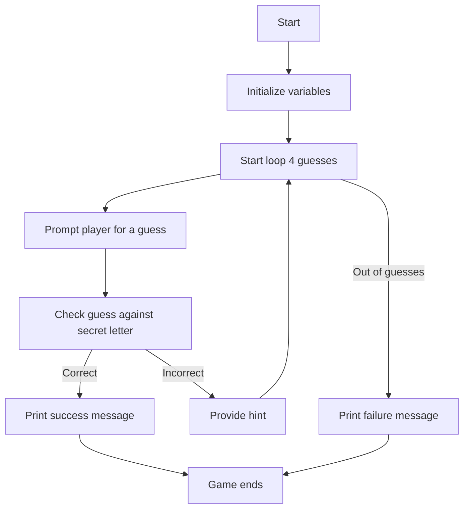
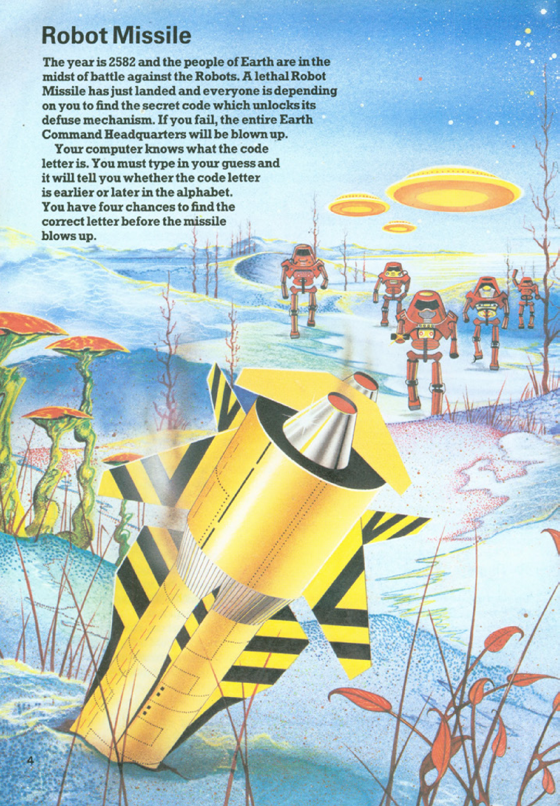
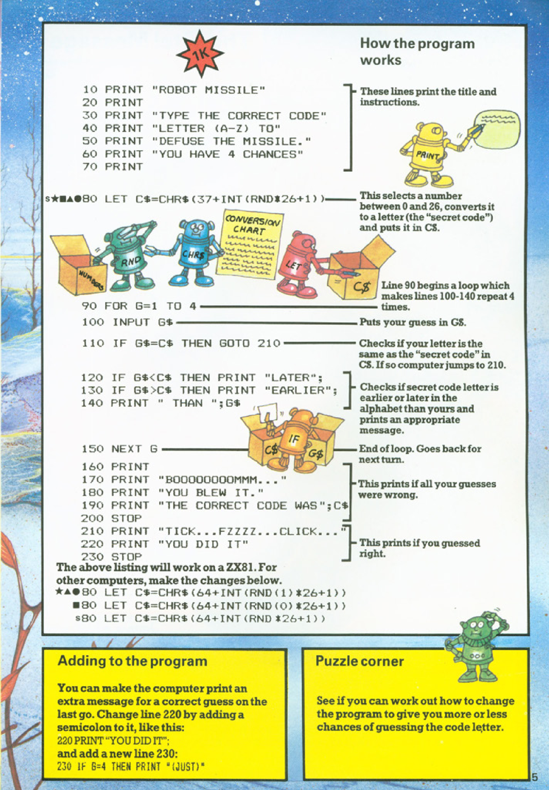

# Robot Missile

**Book**: _Computer Battlegames_  
**Author**: Usborne Publishing

## Story

The year is 2582 and Earth is under threat! A lethal robot missile has landed, and only you can find the secret code to defuse it. You have four chances to guess the correct letter before the missile blows up. Will you save the planet?

## Pseudocode

```plaintext
START
PRINT game title and instructions
GENERATE a random secret letter
FOR 4 GUESSES:
    PROMPT player for a letter
    IF guess matches the secret letter THEN
        PRINT success message
        END
    ELSE
        PROVIDE a hint if the guess is earlier or later in the alphabet
PRINT failure message with the correct letter
END
```

## Flowchart



## Code

<details>
<summary>Pages</summary>

  


</details>

<details>
<summary>ZX-81</summary>

```basic
10 PRINT "ROBOT MISSILE"
20 PRINT
30 PRINT "TYPE THE CORRECT CODE"
40 PRINT "LETTER (A-Z) TO"
50 PRINT "DEFUSE THE MISSILE."
60 PRINT "YOU HAVE 4 CHANCES"
70 PRINT
80 LET C$=CHR$(INT(RND*26)+65)
90 FOR G=1 TO 4
100 INPUT G$
110 IF G$=C$ THEN GOTO 210
120 IF G$<C$ THEN PRINT "EARLIER";
130 IF G$>C$ THEN PRINT "LATER";
140 PRINT "THAN ";G$
150 NEXT G
160 PRINT
170 PRINT "BOOOOBOOOOMMMM..."
180 PRINT "YOU BLEW IT."
190 PRINT "THE CORRECT CODE WAS ";C$
200 STOP
210 PRINT "TICK....FZZZZ....CLICK..."
220 PRINT "YOU DID IT"
230 STOP
```

</details>

<details>
<summary>C#</summary>

```csharp
using System;

class RobotMissile
{
    static void Main()
    {
        Console.WriteLine("Robot Missile\n");
        Console.WriteLine("Type the correct code letter (A-Z) to defuse the missile.");
        Console.WriteLine("You have 4 chances.\n");

        Random random = new Random();
        char secretCode = (char)(random.Next(26) + 'A');

        for (int attempts = 0; attempts < 4; attempts++)
        {
            Console.Write("Enter your guess: ");
            string input = Console.ReadLine().ToUpper();

            if (input.Length != 1 || input[0] < 'A' || input[0] > 'Z')
            {
                Console.WriteLine("Invalid input. Please enter a letter A-Z.");
                attempts--;
                continue;
            }

            char guess = input[0];

            if (guess == secretCode)
            {
                Console.WriteLine("Tick... Fzzzz... Click... You did it!");
                return;
            }

            if (guess < secretCode)
                Console.WriteLine("Later than " + guess);
            else
                Console.WriteLine("Earlier than " + guess);
        }

        Console.WriteLine("Boom... You blew it! The correct code was " + secretCode);
    }
}
```

</details>

<details>
<summary>Python</summary>

```python
import random

print("Robot Missile\n")
print("Type the correct code letter (A-Z) to defuse the missile.")
print("You have 4 chances.\n")

secret_code = chr(random.randint(65, 90))

for _ in range(4):
    guess = input("Enter your guess: ").upper()

    if len(guess) != 1 or not ('A' <= guess <= 'Z'):
        print("Invalid input. Please enter a single letter A-Z.")
        continue

    if guess == secret_code:
        print("Tick... Fzzzz... Click... You did it!")
        break

    if guess < secret_code:
        print(f"Later than {guess}")
    else:
        print(f"Earlier than {guess}")
else:
    print(f"Boom... You blew it! The correct code was {secret_code}")
```

</details>

<details>
<summary>Java</summary>

```java
import java.util.Random;
import java.util.Scanner;

public class RobotMissile {
    public static void main(String[] args) {
        Scanner scanner = new Scanner(System.in);
        Random random = new Random();

        System.out.println("Robot Missile\n");
        System.out.println("Type the correct code letter (A-Z) to defuse the missile.");
        System.out.println("You have 4 chances.\n");

        char secretCode = (char) (random.nextInt(26) + 'A');

        for (int attempts = 0; attempts < 4; attempts++) {
            System.out.print("Enter your guess: ");
            String input = scanner.nextLine().toUpperCase();

            if (input.length() != 1 || input.charAt(0) < 'A' || input.charAt(0) > 'Z') {
                System.out.println("Invalid input. Please enter a single letter A-Z.");
                attempts--;
                continue;
            }

            char guess = input.charAt(0);

            if (guess == secretCode) {
                System.out.println("Tick... Fzzzz... Click... You did it!");
                return;
            }

            if (guess < secretCode) {
                System.out.println("Later than " + guess);
            } else {
                System.out.println("Earlier than " + guess);
            }
        }

        System.out.println("Boom... You blew it! The correct code was " + secretCode);
    }
}
```

</details>

## Explanation

In "Robot Missile," you must guess the secret letter to defuse the missile. You are given hints whether your guess is earlier or later in the alphabet. The game ends either in success if you guess correctly or failure if you run out of attempts.

## Challenges

1. **Adjust difficulty**: Change the number of attempts allowed.
2. **Expand alphabet**: Use numbers or symbols as part of the code.
3. **Add timer**: Limit the total time available to guess.

## Copyright

These programs are adaptations of the original Usborne Computer Guides published in the 1980s. The books are free to download for personal or educational use from [Usborne's Computer and Coding Books](https://usborne.com/row/books/computer-and-coding-books). Programs and adaptations may not be used for commercial purposes.

Return to [Computer Battlegames](./readme.md).
