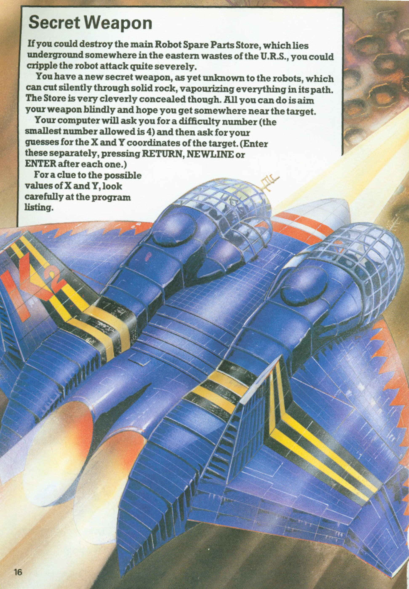
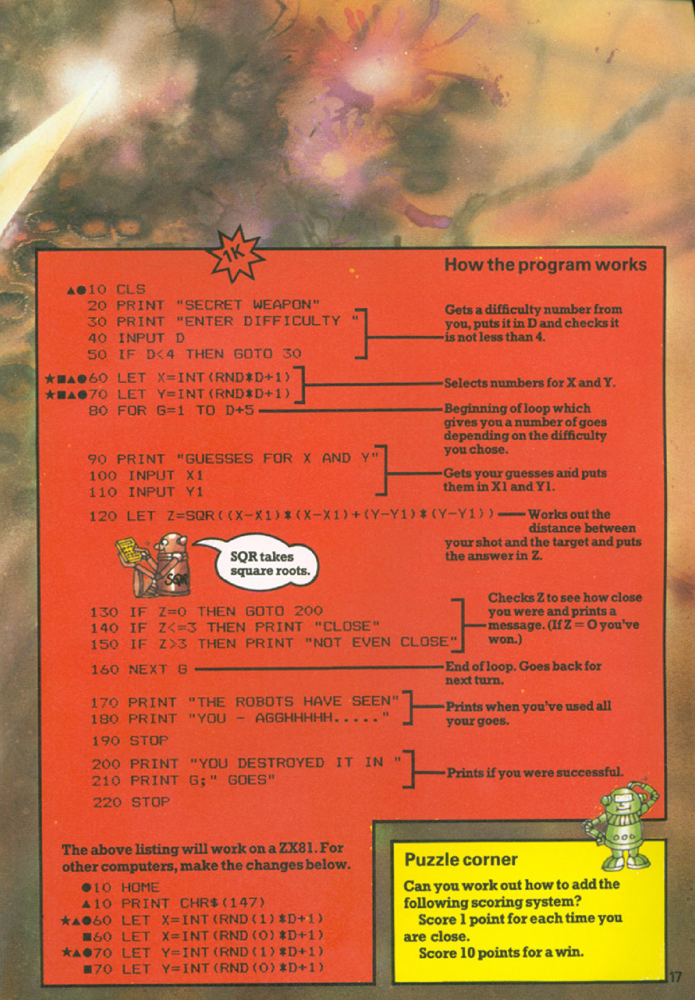

# Secret Weapon

**Book**: _[Computer Battlegames](https://drive.google.com/file/d/0Bxv0SsvibDMTVUExUjFhTURCSU0/view?usp=sharing&resourcekey=0-v2liG0G60g8b7DXjJtDBXg)_  
**Author**:  [Usborne Publishing](https://usborne.com/)    
**Translator**: [Marcus Medina](https://github.com/marcusjobb/UsborneBooks)

## Story

If you could destroy the main Robot Spare Parts Store, which lies underground somewhere in the eastern wastes of the U.R.S., you could cripple the robot attack quite severely.

You have a new secret weapon, as yet unknown to the robots, which can cut silently through solid rock, vaporizing everything in its path. The Store is very cleverly concealed though. All you can do is aim your weapon blindly and hope you get somewhere near the target.

Your computer will ask for a difficulty number (the smallest number allowed is 4) and then ask for your guesses for the X and Y coordinates of the target. (Enter these separately, pressing RETURN, NEWLINE or ENTER after each one.)

For a clue to the possible values of X and Y, look carefully at the program listing.

## Pseudocode

```plaintext
START
Clear screen
Display game title and instructions
Prompt player for difficulty level (D)
Validate difficulty (D >= 4)
Generate random coordinates X and Y within difficulty range
FOR each guess (G) up to D+5:
    Prompt player to input X1 and Y1
    Calculate distance Z = sqrt((X - X1)^2 + (Y - Y1)^2)
    IF Z == 0 THEN
        Display success message
        End game
    ELSE IF Z < 3 THEN
        Display "Close"
    ELSE
        Display "Not even close"
    ENDIF
ENDFOR
Display failure message
END
```

## Flowchart

<div class="mermaid">
flowchart TD
    Start --> ClearScreen["Clear screen"]
    ClearScreen --> Title["Display game title and instructions"]
    Title --> Difficulty["Prompt player for difficulty level"]
    Difficulty --> Validate["Validate difficulty (D >= 4)"]
    Validate --> Generate["Generate random coordinates X and Y"]
    Generate --> GuessLoop["FOR each guess (G) up to D+5"]
    GuessLoop --> InputGuess["Prompt player for X1 and Y1"]
    InputGuess --> Calculate["Calculate distance Z"]
    Calculate -->|Z == 0| Success["Display success message"]
    Success --> End["End game"]
    Calculate -->|Z < 3| Close["Display 'Close'"]
    Close --> GuessLoop
    Calculate -->|Z >= 3| Far["Display 'Not even close'"]
    Far --> GuessLoop
    GuessLoop --> Failure["Display failure message"]
    Failure --> End
</div>

## Code

<details>
<summary>Pages</summary>

  


</details>

<details>
<summary>ZX81 BASIC</summary>

```basic
10 CLS
20 PRINT "SECRET WEAPON"
30 PRINT "ENTER DIFFICULTY "
40 INPUT D
50 IF D<4 THEN GOTO 30
60 LET X=INT(RND*D+1)
70 LET Y=INT(RND*D+1)
80 FOR G=1 TO D+5
90 PRINT "GUESSES FOR X AND Y"
100 INPUT X1
110 INPUT Y1
120 LET Z=SQR((X-X1)*(X-X1)+(Y-Y1)*(Y-Y1))
130 IF Z=0 THEN GOTO 200
140 IF Z<3 THEN PRINT "CLOSE"
150 IF Z>3 THEN PRINT "NOT EVEN CLOSE"
160 NEXT G
170 PRINT "THE ROBOTS HAVE SEEN"
180 PRINT "YOU - AGGHHHH....."
190 PRINT
200 PRINT "YOU DESTROYED IT IN"
210 PRINT G; " GOES"
220 STOP
```

</details>

<details>
<summary>Java</summary>

```java
import java.util.Scanner;
import java.util.Random;

public class SecretWeapon {
    public static void main(String[] args) {
        Scanner scanner = new Scanner(System.in);
        Random random = new Random();

        System.out.println("SECRET WEAPON");
        int difficulty = 0;

        while (difficulty < 4) {
            System.out.print("ENTER DIFFICULTY (minimum 4): ");
            difficulty = scanner.nextInt();
        }

        int targetX = random.nextInt(difficulty) + 1;
        int targetY = random.nextInt(difficulty) + 1;

        for (int g = 1; g <= difficulty + 5; g++) {
            System.out.print("GUESS X: ");
            int guessX = scanner.nextInt();

            System.out.print("GUESS Y: ");
            int guessY = scanner.nextInt();

            double distance = Math.sqrt(Math.pow(targetX - guessX, 2) + Math.pow(targetY - guessY, 2));

            if (distance == 0) {
                System.out.println("YOU DESTROYED IT IN " + g + " GOES!");
                return;
            } else if (distance < 3) {
                System.out.println("CLOSE");
            } else {
                System.out.println("NOT EVEN CLOSE");
            }
        }

        System.out.println("THE ROBOTS HAVE SEEN YOU - AGGHHHH.....");
    }
}
```

</details>

<details>
<summary>Go</summary>

```go
package main

import (
	"fmt"
	"math"
	"math/rand"
	"time"
)

func main() {
	rand.Seed(time.Now().UnixNano())
	fmt.Println("SECRET WEAPON")

	var difficulty int
	for difficulty < 4 {
		fmt.Print("ENTER DIFFICULTY (minimum 4): ")
		fmt.Scan(&difficulty)
	}

	targetX := rand.Intn(difficulty) + 1
	targetY := rand.Intn(difficulty) + 1

	for g := 1; g <= difficulty+5; g++ {
		var guessX, guessY int
		fmt.Print("GUESS X: ")
		fmt.Scan(&guessX)
		fmt.Print("GUESS Y: ")
		fmt.Scan(&guessY)

		distance := math.Sqrt(math.Pow(float64(targetX-guessX), 2) + math.Pow(float64(targetY-guessY), 2))

		if distance == 0 {
			fmt.Printf("YOU DESTROYED IT IN %d GOES!
", g)
			return
		} else if distance < 3 {
			fmt.Println("CLOSE")
		} else {
			fmt.Println("NOT EVEN CLOSE")
		}
	}

	fmt.Println("THE ROBOTS HAVE SEEN YOU - AGGHHHH.....")
}
```

</details>

<details>
<summary>C++</summary>

```cpp
#include <iostream>
#include <cmath>
#include <cstdlib>
#include <ctime>

int main() {
    std::cout << "SECRET WEAPON" << std::endl;

    int difficulty = 0;
    while (difficulty < 4) {
        std::cout << "ENTER DIFFICULTY (minimum 4): ";
        std::cin >> difficulty;
    }

    srand(time(0));
    int targetX = rand() % difficulty + 1;
    int targetY = rand() % difficulty + 1;

    for (int g = 1; g <= difficulty + 5; g++) {
        int guessX, guessY;
        std::cout << "GUESS X: ";
        std::cin >> guessX;
        std::cout << "GUESS Y: ";
        std::cin >> guessY;

        double distance = std::sqrt(std::pow(targetX - guessX, 2) + std::pow(targetY - guessY, 2));

        if (distance == 0) {
            std::cout << "YOU DESTROYED IT IN " << g << " GOES!" << std::endl;
            return 0;
        } else if (distance < 3) {
            std::cout << "CLOSE" << std::endl;
        } else {
            std::cout << "NOT EVEN CLOSE" << std::endl;
        }
    }

    std::cout << "THE ROBOTS HAVE SEEN YOU - AGGHHHH....." << std::endl;
    return 0;
}
```

</details>

<details>
<summary>Rust</summary>

```rust
use std::io;
use rand::Rng;
use std::f64;

fn main() {
    println!("SECRET WEAPON");

    let mut difficulty = 0;
    while difficulty < 4 {
        println!("ENTER DIFFICULTY (minimum 4): ");
        let mut input = String::new();
        io::stdin().read_line(&mut input).unwrap();
        difficulty = input.trim().parse().unwrap_or(0);
    }

    let target_x = rand::thread_rng().gen_range(1..=difficulty);
    let target_y = rand::thread_rng().gen_range(1..=difficulty);

    for g in 1..=difficulty + 5 {
        println!("GUESS X: ");
        let mut input_x = String::new();
        io::stdin().read_line(&mut input_x).unwrap();
        let guess_x: i32 = input_x.trim().parse().unwrap();

        println!("GUESS Y: ");
        let mut input_y = String::new();
        io::stdin().read_line(&mut input_y).unwrap();
        let guess_y: i32 = input_y.trim().parse().unwrap();

        let distance = ((target_x - guess_x).pow(2) + (target_y - guess_y).pow(2)) as f64;

        if distance == 0.0 {
            println!("YOU DESTROYED IT IN {} GOES!", g);
            return;
        } else if distance < 9.0 {
            println!("CLOSE");
        } else {
            println!("NOT EVEN CLOSE");
        }
    }

    println!("THE ROBOTS HAVE SEEN YOU - AGGHHHH.....");
}
```

</details>

<details>
<summary>Pages</summary>

  


</details>

<details>
<summary>C#</summary>

```csharp
using System;

class Program
{
    static void Main()
    {
        Console.Clear();
        Console.WriteLine("SECRET WEAPON");
        Console.WriteLine("ENTER DIFFICULTY (minimum 4):");

        int difficulty;
        do
        {
            if (!int.TryParse(Console.ReadLine(), out difficulty) || difficulty < 4)
            {
                Console.WriteLine("Invalid input. Enter a number >= 4:");
            }
        } while (difficulty < 4);

        Random rand = new Random();
        int targetX = rand.Next(1, difficulty + 1);
        int targetY = rand.Next(1, difficulty + 1);

        for (int g = 1; g <= difficulty + 5; g++)
        {
            int guessX;
            do
            {
                Console.WriteLine("GUESS X:");
            } while (!int.TryParse(Console.ReadLine(), out guessX));

            int guessY;
            do
            {
                Console.WriteLine("GUESS Y:");
            } while (!int.TryParse(Console.ReadLine(), out guessY));

            double distance = Math.Sqrt(Math.Pow(targetX - guessX, 2) + Math.Pow(targetY - guessY, 2));

            if (distance == 0)
            {
                Console.WriteLine($"YOU DESTROYED IT IN {g} GOES!");
                return;
            }
            else if (distance < 3)
            {
                Console.WriteLine("CLOSE");
            }
            else
            {
                Console.WriteLine("NOT EVEN CLOSE");
            }
        }

        Console.WriteLine("THE ROBOTS HAVE SEEN YOU - AGGHHHH.....");
    }
}
```

</details>

<details>
<summary>Python</summary>

```python
import math
import random

def main():
    print("SECRET WEAPON")
    difficulty = 0

    while difficulty < 4:
        try:
            difficulty = int(input("ENTER DIFFICULTY (minimum 4): "))
        except ValueError:
            pass

    target_x = random.randint(1, difficulty)
    target_y = random.randint(1, difficulty)

    for g in range(1, difficulty + 6):
        guess_x = int(input("GUESS X: "))
        guess_y = int(input("GUESS Y: "))

        distance = math.sqrt((target_x - guess_x) ** 2 + (target_y - guess_y) ** 2)

        if distance == 0:
            print(f"YOU DESTROYED IT IN {g} GOES!")
            return
        elif distance < 3:
            print("CLOSE")
        else:
            print("NOT EVEN CLOSE")

    print("THE ROBOTS HAVE SEEN YOU - AGGHHHH.....")

if __name__ == "__main__":
    main()
```

</details>

## Explanation

- The game generates random X and Y coordinates for a target based on the chosen difficulty level.
- The player must guess the coordinates, with feedback given based on how close the guess is.
- The distance is calculated using the Pythagorean theorem.
- The game ends when the player guesses correctly or runs out of attempts.

## Challenges

1. **Scoring System**:
   - Award 1 point for each close guess.
   - Award 10 points for a direct hit.
2. **Increase Difficulty**:
   - Decrease the "close" threshold to make the game harder.
3. **Add Features**:
   - Introduce multiple targets.
   - Add a timer to limit how long players have to make guesses.

## Copyright

These programs are adaptations of the original Usborne Computer Guides published in the 1980s. The books are free to download for personal or educational use from [Usborne's Computer and Coding Books](https://usborne.com/row/books/computer-and-coding-books). Programs and adaptations may not be used for commercial purposes.

Return to [Computer Battlegames](./readme.md).
