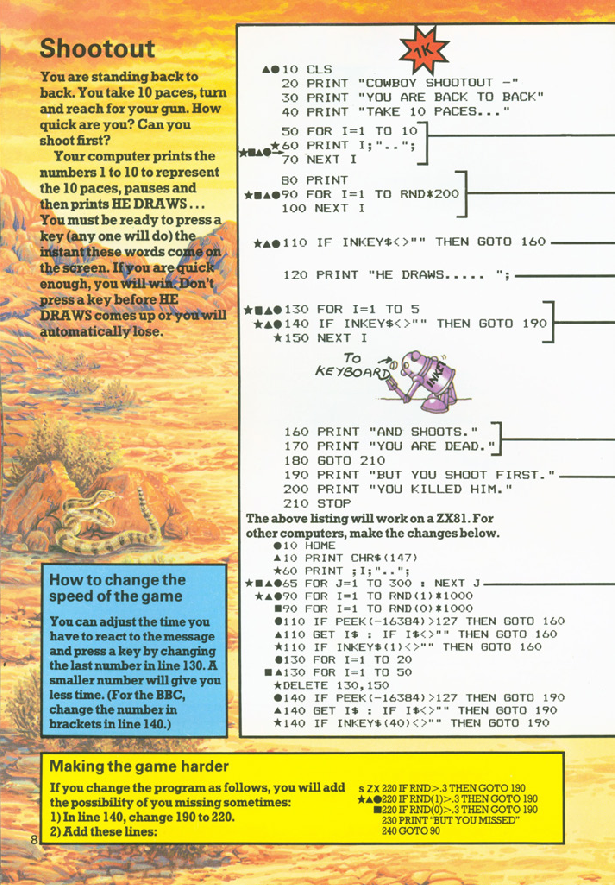

# Shootout

**Book**: _[Computer Battlegames](https://drive.google.com/file/d/0Bxv0SsvibDMTVUExUjFhTURCSU0/view?usp=sharing&resourcekey=0-v2liG0G60g8b7DXjJtDBXg)_  
**Author**:  [Usborne Publishing](https://usborne.com/)    
**Translator**: [Marcus Medina](https://github.com/marcusjobb/UsborneBooks)

## Story

You are standing back to back with an opponent in the ultimate cowboy duel. You take 10 paces, turn, and reach for your gun. Can you shoot faster than your opponent? Or will you be too slow?

Your computer prints the numbers 1 to 10 to represent your 10 paces, pauses, and then prints "HE DRAWS....". You must press any key the moment this appears. If you are quick enough, you win. But if you press too early or wait too long, you lose.

## Pseudocode

```plaintext
START
Clear screen
Display game title and instructions
Print numbers 1 to 10 to simulate paces
Pause for a random amount of time
IF key is pressed during pause THEN
    Display "Cheating! You lose."
    End game
ENDIF
Display "HE DRAWS...."
Start timer to check for input
IF key is pressed quickly THEN
    Display "You shoot first. You win!"
    End game
ELSE
    Display "You are too slow. You lose."
    End game
ENDIF
END
```

## Flowchart

<div class="mermaid">
flowchart TD
    Start --> ClearScreen["Clear screen"]
    ClearScreen --> Title["Display game title and instructions"]
    Title --> Paces["Print numbers 1 to 10"]
    Paces --> Pause["Pause for random time"]
    Pause --> CheckEarly["Check if key pressed during pause"]
    CheckEarly -->|Yes| Cheating["Display 'Cheating! You lose.'"]
    Cheating --> End
    CheckEarly -->|No| Draws["Display 'HE DRAWS....'"]
    Draws --> Reaction["Check reaction time"]
    Reaction -->|Quick| Win["Display 'You shoot first. You win!'"]
    Reaction -->|Slow| Lose["Display 'You are too slow. You lose.'"]
    Win --> End
    Lose --> End
</div>

## Code

<details>
<summary>Pages</summary>

  


</details>

<details>
<summary>C#</summary>

```csharp
using System;
using System.Threading;

class Program
{
    static void Main()
    {
        Console.Clear();
        Console.WriteLine("COWBOY SHOOTOUT");
        Console.WriteLine("YOU ARE BACK TO BACK");
        Console.WriteLine("TAKE 10 PACES...");

        for (int i = 1; i <= 10; i++)
        {
            Console.Write(i + "  ");
            Thread.Sleep(500); // Simulate pacing
        }

        Random rand = new Random();
        Thread.Sleep(rand.Next(1000, 3000)); // Random pause

        if (Console.KeyAvailable)
        {
            Console.WriteLine("\nCheating! You lose.");
            return;
        }

        Console.WriteLine("\nHE DRAWS....");

        DateTime startTime = DateTime.Now;
        while (!Console.KeyAvailable)
        {
            if ((DateTime.Now - startTime).TotalMilliseconds > 2000)
            {
                Console.WriteLine("You are too slow. You lose.");
                return;
            }
        }

        Console.ReadKey(true); // Clear the input buffer
        Console.WriteLine("You shoot first. You win!");
    }
}
```

</details>

<details>
<summary>Python</summary>

```python
import time
import random
import keyboard

def main():
    print("COWBOY SHOOTOUT")
    print("YOU ARE BACK TO BACK")
    print("TAKE 10 PACES...")

    for i in range(1, 11):
        print(i, end="  ", flush=True)
        time.sleep(0.5)  # Simulate pacing

    time.sleep(random.uniform(1, 3))  # Random pause

    if keyboard.is_pressed('any'):  # Detect early input
        print("\nCheating! You lose.")
        return

    print("\nHE DRAWS....")
    start_time = time.time()

    while not keyboard.is_pressed('any'):
        if time.time() - start_time > 2:  # Too slow
            print("You are too slow. You lose.")
            return

    print("You shoot first. You win!")

if __name__ == "__main__":
    main()
```

</details>

<details>
<summary>Java</summary>

```java
import java.util.Scanner;
import java.util.Random;

public class Shootout {
    public static void main(String[] args) {
        Scanner scanner = new Scanner(System.in);
        Random random = new Random();

        System.out.println("COWBOY SHOOTOUT");
        System.out.println("YOU ARE BACK TO BACK");
        System.out.println("TAKE 10 PACES...");

        for (int i = 1; i <= 10; i++) {
            System.out.print(i + "  ");
            try {
                Thread.sleep(500); // Simulate pacing
            } catch (InterruptedException e) {
                e.printStackTrace();
            }
        }

        try {
            Thread.sleep(random.nextInt(2000) + 1000); // Random pause
        } catch (InterruptedException e) {
            e.printStackTrace();
        }

        if (System.in.available() > 0) {
            System.out.println("\nCheating! You lose.");
            return;
        }

        System.out.println("\nHE DRAWS....");
        long startTime = System.currentTimeMillis();

        while (System.in.available() == 0) {
            if (System.currentTimeMillis() - startTime > 2000) {
                System.out.println("You are too slow. You lose.");
                return;
            }
        }

        System.out.println("You shoot first. You win!");
    }
}
```

</details>

<details>
<summary>Go</summary>

```go
package main

import (
	"fmt"
	"math/rand"
	"time"
)

func main() {
	rand.Seed(time.Now().UnixNano())
	fmt.Println("COWBOY SHOOTOUT")
	fmt.Println("YOU ARE BACK TO BACK")
	fmt.Println("TAKE 10 PACES...")

	for i := 1; i <= 10; i++ {
		fmt.Printf("%d  ", i)
		time.Sleep(500 * time.Millisecond)
	}

	time.Sleep(time.Duration(rand.Intn(2000)+1000) * time.Millisecond) // Random pause

	fmt.Println("\nHE DRAWS....")
	start := time.Now()

	var input string
	fmt.Scanln(&input)
	elapsed := time.Since(start)

	if elapsed.Seconds() > 2 {
		fmt.Println("You are too slow. You lose.")
		return
	}

	fmt.Println("You shoot first. You win!")
}
```

</details>

<details>
<summary>C++</summary>

```cpp
#include <iostream>
#include <thread>
#include <chrono>
#include <cstdlib>
#include <ctime>

int main() {
    std::cout << "COWBOY SHOOTOUT" << std::endl;
    std::cout << "YOU ARE BACK TO BACK" << std::endl;
    std::cout << "TAKE 10 PACES..." << std::endl;

    for (int i = 1; i <= 10; i++) {
        std::cout << i << "  ";
        std::this_thread::sleep_for(std::chrono::milliseconds(500));
    }

    srand(time(0));
    std::this_thread::sleep_for(std::chrono::milliseconds(rand() % 2000 + 1000)); // Random pause

    std::cout << "\nHE DRAWS...." << std::endl;

    auto start = std::chrono::steady_clock::now();

    std::string input;
    std::getline(std::cin, input);

    auto end = std::chrono::steady_clock::now();
    auto elapsed = std::chrono::duration_cast<std::chrono::milliseconds>(end - start);

    if (elapsed.count() > 2000) {
        std::cout << "You are too slow. You lose." << std::endl;
    } else {
        std::cout << "You shoot first. You win!" << std::endl;
    }

    return 0;
}
```

</details>

<details>
<summary>Rust</summary>

```rust
use std::io;
use std::time::{Duration, Instant};
use std::thread;
use rand::Rng;

fn main() {
    println!("COWBOY SHOOTOUT");
    println!("YOU ARE BACK TO BACK");
    println!("TAKE 10 PACES...");

    for i in 1..=10 {
        print!("{}  ", i);
        thread::sleep(Duration::from_millis(500));
    }

    let mut rng = rand::thread_rng();
    thread::sleep(Duration::from_millis(rng.gen_range(1000..3000)));

    println!("\nHE DRAWS....");

    let start = Instant::now();
    let mut input = String::new();
    io::stdin().read_line(&mut input).unwrap();

    if start.elapsed().as_secs_f64() > 2.0 {
        println!("You are too slow. You lose.");
    } else {
        println!("You shoot first. You win!");
    }
}
```

</details>

## Explanation

- This game simulates a cowboy shootout by requiring quick reflexes from the player.
- The numbers 1 to 10 represent the paces before the duel.
- Random pauses create suspense and unpredictability.
- The game penalizes players for reacting too early (cheating).
- If the player reacts quickly enough after "HE DRAWS...." is displayed, they win. Otherwise, they lose.

## Challenges

1. **Increase Difficulty**:
   - Reduce the reaction time window from 2 seconds to 1 second.
   - Add distractions during the pacing phase.
2. **Add Features**:
   - Allow for multiplayer mode where two players compete.
   - Introduce a scoring system based on reaction times.
3. **Customize**:
   - Add difficulty levels with varying random pause durations.
   - Include sound effects for added immersion.

## Copyright

These programs are adaptations of the original Usborne Computer Guides published in the 1980s. The books are free to download for personal or educational use from [Usborne's Computer and Coding Books](https://usborne.com/row/books/computer-and-coding-books). Programs and adaptations may not be used for commercial purposes.

Return to [Computer Battlegames](./readme.md).
