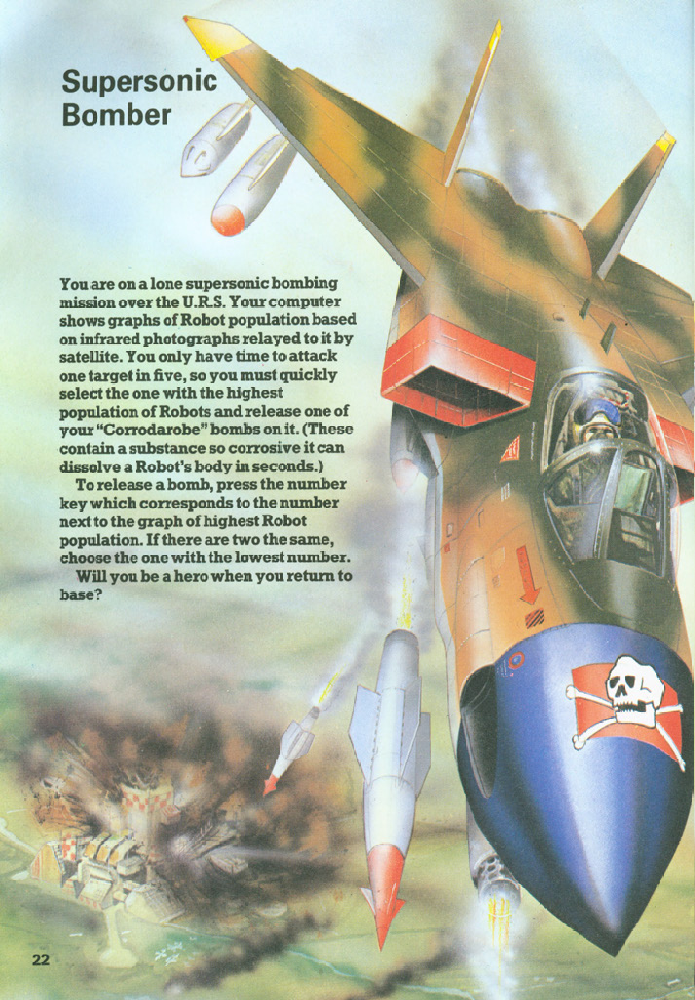
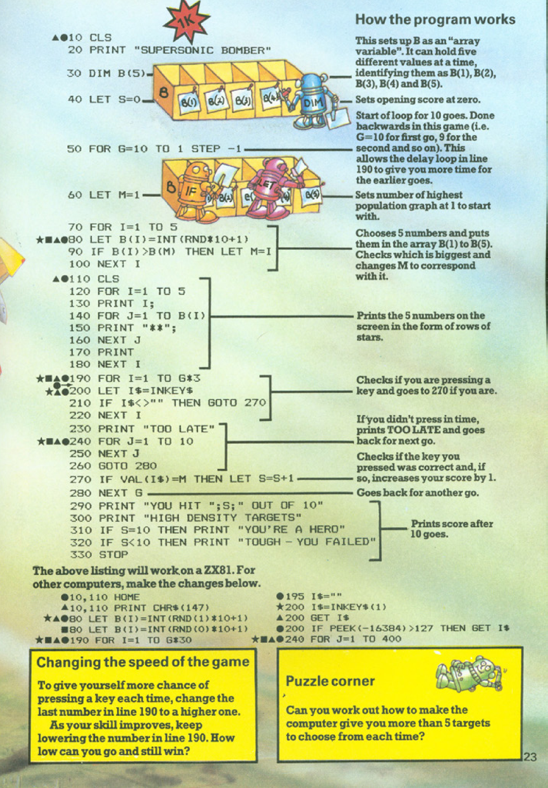

# Supersonic Bomber

**Book**: _[Computer Battlegames](https://drive.google.com/file/d/0Bxv0SsvibDMTVUExUjFhTURCSU0/view?usp=sharing&resourcekey=0-v2liG0G60g8b7DXjJtDBXg)_  
**Author**:  [Usborne Publishing](https://usborne.com/)    
**Translator**: [Marcus Medina](https://github.com/marcusjobb/UsborneBooks)

## Story

You are on a lone supersonic bombing mission over the U.R.S. Your computer shows graphs of Robot population based on infrared photographs relayed to it by satellite. You only have time to attack one target in five, so you must quickly select the one with the highest population of Robots and release one of your "Corrodarobe" bombs on it. (These contain a substance so corrosive it can dissolve a Robot's body in seconds.)

To release a bomb, press the number key which corresponds to the number next to the graph of the highest Robot population. If there are two the same, choose the one with the lowest number.

Will you be a hero when you return to base?

### _Marcus Note_

_Even though I do enjoy the idea of small simple games, I think it would be better to change the name of the bomb to something less destructive. There's a lot of wars in the world already, so I don't want to promote that in any way._

_Maybe the game could be about delivering food to the village with the highest population density._
_or a game about delivering medicine to the village with the highest population density._
_or a game about fighting a forest fire in the section of the forest with the highest amount of fires._

## Pseudocode

```plaintext
START
Initialize score and array B to store 5 random values
FOR each of the 10 rounds:
    Display the graphs with corresponding population sizes
    Player chooses a target
    Check if the chosen target matches the highest population graph
    If correct:
        Increment score
    Else:
        Print "Too Late" or "Incorrect"
END FOR
Display the final score and print success/failure message based on performance
END
```

## Flowchart

<div class="mermaid">
flowchart TD
    Start --> Initialize['Initialize score and targets array']
    Initialize --> RoundLoop['FOR each of 10 rounds']
    RoundLoop --> GenerateRandom['Generate random population values']
    GenerateRandom --> DisplayGraphs['Display graphs and populations']
    DisplayGraphs --> PlayerInput['Player selects a target']
    PlayerInput --> ValidateSelection['Check if selected target is correct']
    ValidateSelection -->|Correct| IncrementScore['Increment score']
    ValidateSelection -->|Incorrect| PrintIncorrect['Print 'Incorrect']
    IncrementScore --> NextRound['Proceed to next round']
    PrintIncorrect --> NextRound
    NextRound -->|End of 10 rounds| FinalScore['Display final score']
    FinalScore --> End['END']
</div>

---

## Code

<details>
<summary>Pages</summary>

  


</details>

<details>
<summary>ZX81 BASIC</summary>

```basic
10 CLS
20 PRINT "SUPERSONIC BOMBER"
30 DIM B(5)
40 LET S=0
50 FOR G=10 TO 1 STEP -1
60 LET M=1
70 FOR I=1 TO 5
80 LET B(I)=INT(RND*10+1)
90 IF B(I)>B(M) THEN LET M=I
100 NEXT I
110 CLS
120 FOR I=1 TO 5
130 PRINT I;
140 FOR J=1 TO B(I)
150 PRINT "*";
160 NEXT J
170 PRINT
180 NEXT I
190 FOR I=1 TO G*3
200 LET I$=INKEY$
210 IF I$<>"" THEN GOTO 270
220 NEXT I
230 PRINT "TOO LATE"
240 FOR J=1 TO 10
250 NEXT J
260 GOTO 280
270 IF VAL(I$)=M THEN LET S=S+1
280 NEXT G
290 PRINT "YOU HIT ";S;" OUT OF 10"
300 PRINT "HIGH DENSITY TARGETS"
310 IF S=10 THEN PRINT "YOU'RE A HERO"
320 IF S<10 THEN PRINT "TOUGH - YOU FAILED"
330 STOP
```

</details>

<details>
<summary>C#</summary>

```csharp
using System;

class SupersonicBomber
{
    static void Main()
    {
        Console.WriteLine("Supersonic Bomber");
        Random random = new Random();
        int score = 0;

        for (int round = 1; round <= 10; round++)
        {
            int[] populations = new int[5];
            for (int i = 0; i < 5; i++)
                populations[i] = random.Next(1, 11);

            int maxIndex = Array.IndexOf(populations, Math.Max(populations));

            Console.WriteLine("Targets:");
            for (int i = 0; i < 5; i++)
                Console.WriteLine($"Target {i + 1}: {populations[i]}");

            Console.Write("Select a target (1-5): ");
            int choice = int.Parse(Console.ReadLine()) - 1;

            if (choice == maxIndex)
            {
                Console.WriteLine("Correct! Highest population hit.");
                score++;
            }
            else
            {
                Console.WriteLine("Incorrect. You missed the highest population.");
            }
        }

        Console.WriteLine($"Final Score: {score} out of 10");
    }
}
```

</details>

<details>
<summary>Python</summary>

```python
import random

print("Supersonic Bomber")
score = 0

for round in range(10):
    populations = [random.randint(1, 10) for _ in range(5)]
    max_index = populations.index(max(populations))

    print("Targets:")
    for i, pop in enumerate(populations, start=1):
        print(f"Target {i}: {pop}")

    choice = int(input("Select a target (1-5): ")) - 1

    if choice == max_index:
        print("Correct! Highest population hit.")
        score += 1
    else:
        print("Incorrect. You missed the highest population.")

print(f"Final Score: {score} out of 10")
```

</details>

<details>
<summary>Java</summary>

```java
import java.util.Random;
import java.util.Scanner;

public class SupersonicBomber {
    public static void main(String[] args) {
        Scanner scanner = new Scanner(System.in);
        Random random = new Random();
        int score = 0;

        System.out.println("Supersonic Bomber");

        for (int round = 1; round <= 10; round++) {
            int[] populations = new int[5];
            for (int i = 0; i < 5; i++) {
                populations[i] = random.nextInt(10) + 1;
            }

            int maxIndex = 0;
            for (int i = 1; i < populations.length; i++) {
                if (populations[i] > populations[maxIndex]) {
                    maxIndex = i;
                }
            }

            System.out.println("Targets:");
            for (int i = 0; i < populations.length; i++) {
                System.out.println("Target " + (i + 1) + ": " + populations[i]);
            }

            System.out.print("Select a target (1-5): ");
            int choice = scanner.nextInt() - 1;

            if (choice == maxIndex) {
                System.out.println("Correct! Highest population hit.");
                score++;
            } else {
                System.out.println("Incorrect. You missed the highest population.");
            }
        }

        System.out.println("Final Score: " + score + " out of 10");
        scanner.close();
    }
}
```

</details>

<details>
<summary>Go</summary>

```go
package main

import (
	"fmt"
	"math/rand"
	"time"
)

func main() {
	rand.Seed(time.Now().UnixNano())
	fmt.Println("Supersonic Bomber")
	score := 0

	for round := 1; round <= 10; round++ {
		targets := make([]int, 5)
		for i := range targets {
			targets[i] = rand.Intn(10) + 1
		}

		maxIndex := 0
		for i, v := range targets {
			if v > targets[maxIndex] {
				maxIndex = i
			}
		}

		fmt.Println("Targets:")
		for i, v := range targets {
			fmt.Printf("Target %d: %d\n", i+1, v)
		}

		fmt.Print("Select a target (1-5): ")
		var choice int
		fmt.Scan(&choice)
		choice--

		if choice == maxIndex {
			fmt.Println("Correct! Highest population hit.")
			score++
		} else {
			fmt.Println("Incorrect. You missed the highest population.")
		}
	}

	fmt.Printf("Final Score: %d out of 10\n", score)
}
```

</details>

---

## Challenges

1. **Increase Difficulty**:

   - Decrease the time available for selecting a target.
   - Add decoy information to mislead the player.

2. **Add Features**:

   - Introduce multiple levels with increasing difficulty.
   - Add a timer for each round.

3. **Customize**:

   - Replace bombing with humanitarian missions, such as delivering supplies or medicine.
   - Incorporate environmental themes like fighting forest fires.

4. **Educational Purpose**:
   - Introduce geography or population density questions for bonus points.
   - Adapt the game for classroom use with embedded quizzes.

---

## Book Information

- **Title**: _Computer Battlegames_
- **Publisher**: Usborne Publishing

## Copyright

These programs are adaptations of the original Usborne Computer Guides published in the 1980s. The books are free to download for personal or educational use from [Usborne's Computer and Coding Books](https://usborne.com/row/books/computer-and-coding-books). Programs and adaptations may not be used for commercial purposes.

Return to [Computer Battlegames](./readme.md).
