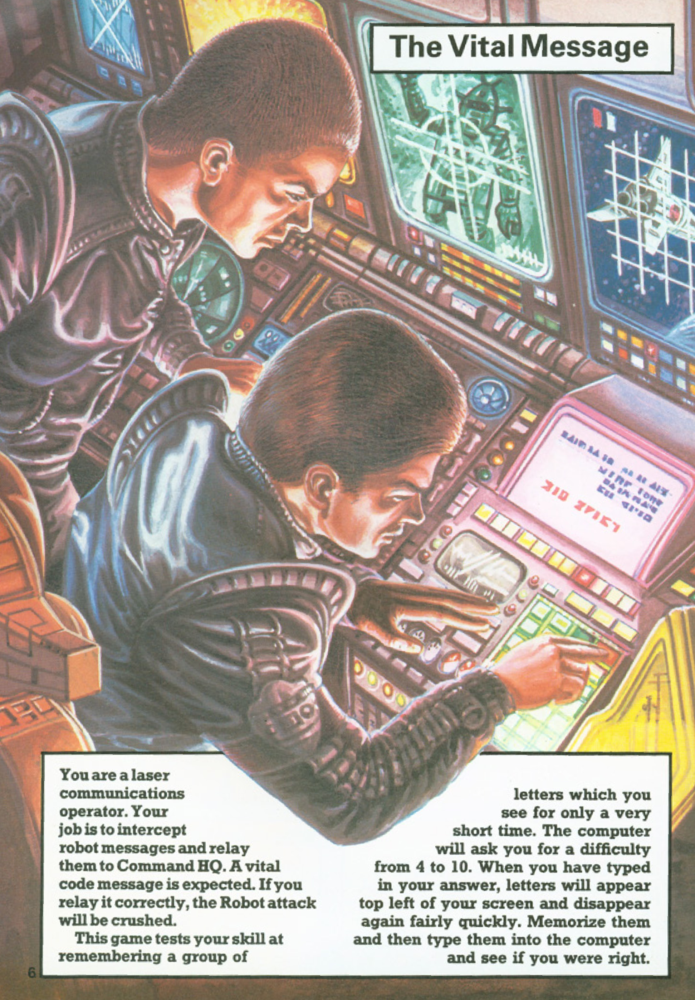
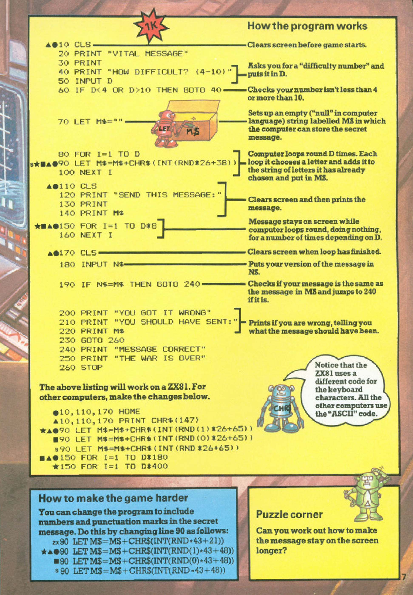

# The Vital Message

**Book**: _[Computer Battlegames](https://drive.google.com/file/d/0Bxv0SsvibDMTVUExUjFhTURCSU0/view?usp=sharing&resourcekey=0-v2liG0G60g8b7DXjJtDBXg)_  
**Author**:  [Usborne Publishing](https://usborne.com/)    
**Translator**: [Marcus Medina](https://github.com/marcusjobb/UsborneBooks)

## Story

You are a laser communications operator. Your job is to intercept robot messages and relay them to Command HQ. A vital code message is expected. If you relay it correctly, the Robot attack will be crushed.

This game tests your skill at remembering a group of letters which you see for only a very short time. The computer will ask you for a difficulty from 4 to 10. When you have typed in your answer, letters will appear top left of your screen and disappear again fairly quickly. Memorize them and then type them into the computer and see if you were right.

## Pseudocode

```plaintext
START
Clear screen
Display game title
Prompt player for difficulty level (4-10)
Validate difficulty level
Generate random message of given length
Clear screen
Display the generated message
Pause for a few seconds
Clear screen
Prompt player to input the message
Compare player input with the original message
IF input matches THEN
    Display success message
    End game
ELSE
    Display failure message
    Show correct message
    End game
END
```

## Flowchart

<div class="mermaid">
flowchart TD
    Start --> ClearScreen["Clear screen"]
    ClearScreen --> Title["Display game title"]
    Title --> Difficulty["Prompt player for difficulty level"]
    Difficulty --> Validate["Validate difficulty level"]
    Validate --> Generate["Generate random message"]
    Generate --> ShowMessage["Display the generated message"]
    ShowMessage --> Pause["Pause for a few seconds"]
    Pause --> ClearScreen2["Clear screen"]
    ClearScreen2 --> InputMessage["Prompt player to input the message"]
    InputMessage --> Compare["Compare input with original message"]
    Compare -->|Match| Success["Display success message"]
    Compare -->|No Match| Failure["Display failure message"]
    Success --> End["End game"]
    Failure --> ShowCorrect["Show correct message"]
    ShowCorrect --> End
</div>

## Code

<details>
<summary>Pages</summary>

  


</details>

<details>
<summary>C#</summary>

```csharp
using System;
using System.Text;

class Program
{
    static void Main()
    {
        Console.Clear();
        Console.WriteLine("VITAL MESSAGE");
        Console.WriteLine("HOW DIFFICULT? (4-10)");

        int difficulty = 0;
        while (difficulty < 4 || difficulty > 10)
        {
            if (!int.TryParse(Console.ReadLine(), out difficulty) || difficulty < 4 || difficulty > 10)
            {
                Console.WriteLine("Please enter a number between 4 and 10.");
            }
        }

        string message = GenerateMessage(difficulty);
        Console.Clear();
        Console.WriteLine("SEND THIS MESSAGE:");
        Console.WriteLine();
        Console.WriteLine(message);

        System.Threading.Thread.Sleep(difficulty * 1000); // Pause to simulate ZX81 delay
        Console.Clear();

        Console.WriteLine("Enter the message:");
        string userInput = Console.ReadLine();

        if (userInput == message)
        {
            Console.WriteLine("MESSAGE CORRECT");
            Console.WriteLine("THE WAR IS OVER");
        }
        else
        {
            Console.WriteLine("YOU GOT IT WRONG");
            Console.WriteLine("YOU SHOULD HAVE SENT:");
            Console.WriteLine(message);
        }
    }

    static string GenerateMessage(int length)
    {
        StringBuilder sb = new StringBuilder();
        Random rand = new Random();
        for (int i = 0; i < length; i++)
        {
            char letter = (char)(rand.Next(26) + 65); // Random letter A-Z
            sb.Append(letter);
        }
        return sb.ToString();
    }
}
```

</details>

<details>
<summary>Python</summary>

```python
import random
import time

def main():
    print("VITAL MESSAGE")
    difficulty = 0
    while difficulty < 4 or difficulty > 10:
        try:
            difficulty = int(input("HOW DIFFICULT? (4-10): "))
        except ValueError:
            pass

    message = generate_message(difficulty)
    print("\nSEND THIS MESSAGE:\n")
    print(message)
    time.sleep(difficulty * 1)  # Pause for a few seconds
    print("\033c", end="")  # Clear screen

    user_input = input("Enter the message: ")
    if user_input == message:
        print("MESSAGE CORRECT")
        print("THE WAR IS OVER")
    else:
        print("YOU GOT IT WRONG")
        print(f"YOU SHOULD HAVE SENT: {message}")

def generate_message(length):
    return ''.join(chr(random.randint(65, 90)) for _ in range(length))

if __name__ == "__main__":
    main()
```

</details>

<details>
<summary>Java</summary>

```java
import java.util.Scanner;
import java.util.Random;

public class VitalMessage {
    public static void main(String[] args) {
        Scanner scanner = new Scanner(System.in);
        Random random = new Random();

        System.out.println("VITAL MESSAGE");
        System.out.println("HOW DIFFICULT? (4-10)");

        int difficulty = 0;
        while (difficulty < 4 || difficulty > 10) {
            if (scanner.hasNextInt()) {
                difficulty = scanner.nextInt();
            }
            if (difficulty < 4 || difficulty > 10) {
                System.out.println("Please enter a number between 4 and 10.");
            }
        }

        String message = generateMessage(difficulty, random);
        System.out.println("SEND THIS MESSAGE:\n");
        System.out.println(message);

        try {
            Thread.sleep(difficulty * 1000); // Pause
        } catch (InterruptedException e) {
            e.printStackTrace();
        }

        System.out.println("\033[H\033[2J"); // Clear screen
        System.out.println("Enter the message:");
        scanner.nextLine(); // Consume newline
        String userInput = scanner.nextLine();

        if (userInput.equals(message)) {
            System.out.println("MESSAGE CORRECT");
            System.out.println("THE WAR IS OVER");
        } else {
            System.out.println("YOU GOT IT WRONG");
            System.out.println("YOU SHOULD HAVE SENT: " + message);
        }
    }

    private static String generateMessage(int length, Random random) {
        StringBuilder sb = new StringBuilder();
        for (int i = 0; i < length; i++) {
            char letter = (char) (random.nextInt(26) + 65); // Random letter A-Z
            sb.append(letter);
        }
        return sb.toString();
    }
}
```

</details>

<details>
<summary>Go</summary>

```go
package main

import (
	"fmt"
	"math/rand"
	"strings"
	"time"
)

func main() {
	rand.Seed(time.Now().UnixNano())
	fmt.Println("VITAL MESSAGE")
	var difficulty int
	for difficulty < 4 || difficulty > 10 {
		fmt.Print("HOW DIFFICULT? (4-10): ")
		fmt.Scan(&difficulty)
	}

	message := generateMessage(difficulty)
	fmt.Println("\nSEND THIS MESSAGE:\n")
	fmt.Println(message)

	time.Sleep(time.Duration(difficulty) * time.Second)
	fmt.Print("\033[H\033[2J") // Clear screen

	fmt.Print("Enter the message: ")
	var userInput string
	fmt.Scan(&userInput)

	if strings.TrimSpace(userInput) == message {
		fmt.Println("MESSAGE CORRECT")
		fmt.Println("THE WAR IS OVER")
	} else {
		fmt.Println("YOU GOT IT WRONG")
		fmt.Printf("YOU SHOULD HAVE SENT: %s\n", message)
	}
}

func generateMessage(length int) string {
	letters := "ABCDEFGHIJKLMNOPQRSTUVWXYZ"
	var message strings.Builder
	for i := 0; i < length; i++ {
		message.WriteByte(letters[rand.Intn(26)])
	}
	return message.String()
}
```

</details>

<details>
<summary>C++</summary>

```cpp
#include <iostream>
#include <string>
#include <cstdlib>
#include <ctime>
#include <thread>
#include <chrono>

std::string generateMessage(int length) {
    std::string message;
    for (int i = 0; i < length; i++) {
        message += char(rand() % 26 + 65); // Random letter A-Z
    }
    return message;
}

int main() {
    srand(time(0));
    std::cout << "VITAL MESSAGE" << std::endl;
    int difficulty = 0;
    while (difficulty < 4 || difficulty > 10) {
        std::cout << "HOW DIFFICULT? (4-10): ";
        std::cin >> difficulty;
    }

    std::string message = generateMessage(difficulty);
    std::cout << "\nSEND THIS MESSAGE:\n" << std::endl;
    std::cout << message << std::endl;

    std::this_thread::sleep_for(std::chrono::seconds(difficulty));
    system("clear");

    std::cout << "Enter the message: ";
    std::string userInput;
    std::cin >> userInput;

    if (userInput == message) {
        std::cout << "MESSAGE CORRECT\nTHE WAR IS OVER" << std::endl;
    } else {
        std::cout << "YOU GOT IT WRONG\nYOU SHOULD HAVE SENT: " << message << std::endl;
    }

    return 0;
}
```

</details>

<details>
<summary>Rust</summary>

```rust
use rand::Rng;
use std::io;
use std::thread;
use std::time::Duration;

fn main() {
    println!("VITAL MESSAGE");

    let mut difficulty = 0;
    while difficulty < 4 || difficulty > 10 {
        println!("HOW DIFFICULT? (4-10): ");
        let mut input = String::new();
        io::stdin().read_line(&mut input).unwrap();
        difficulty = input.trim().parse().unwrap_or(0);
    }

    let message = generate_message(difficulty);
    println!("\nSEND THIS MESSAGE:\n");
    println!("{}", message);

    thread::sleep(Duration::from_secs(difficulty as u64));
    print!("{}[2J", 27 as char); // Clear screen

    println!("Enter the message: ");
    let mut user_input = String::new();
    io::stdin().read_line(&mut user_input).unwrap();

    if user_input.trim() == message {
        println!("MESSAGE CORRECT\nTHE WAR IS OVER");
    } else {
        println!("YOU GOT IT WRONG\nYOU SHOULD HAVE SENT: {}", message);
    }
}

fn generate_message(length: usize) -> String {
    let mut rng = rand::thread_rng();
    (0..length)
        .map(|_| (rng.gen_range(0..26) + 65) as u8 as char)
        .collect()
}
```

</details>

## Explanation

- The game revolves around matching a randomly generated string (message) with user input.
- The string length depends on the chosen difficulty (4-10).
- The random letters are generated using ASCII values (A-Z).
- If the user matches the string correctly, they win.
- A pause simulates the time delay from the original ZX81 BASIC implementation.
- This game enhances memory and attention skills by challenging players to quickly memorize and recall sequences under pressure.

## Challenges

1. **Increase Difficulty**:
   - Extend the range of difficulty levels (e.g., up to 20).
   - Reduce the time available to memorize the message.
2. **Add Features**:
   - Allow players to retry after failure.
   - Add levels with increasing complexity (e.g., symbols, numbers).
3. **Customize**:
   - Allow users to set their preferred difficulty dynamically.
   - Add a scoring system to track performance.

## Copyright

These programs are adaptations of the original Usborne Computer Guides published in the 1980s. The books are free to download for personal or educational use from [Usborne's Computer and Coding Books](https://usborne.com/row/books/computer-and-coding-books). Programs and adaptations may not be used for commercial purposes.

Return to [Computer Battlegames](./readme.md).
