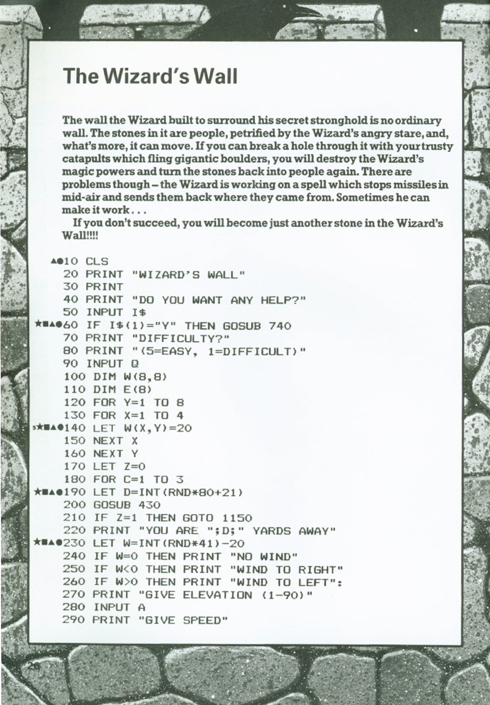
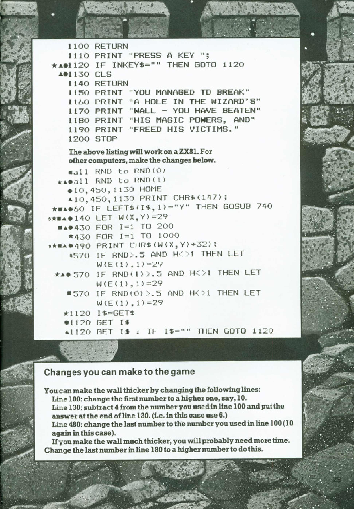

# The Wizard's Wall

**Book**: Computer Battlegames\
**Author**: Usborne Publishing

## Story

The wall the Wizard built to surround his secret stronghold is no ordinary wall. The stones in it are people, petrified by the Wizard's angry stare, and, what’s more, it can move. If you can break a hole through it with your trusty catapults which fling gigantic boulders, you will destroy the Wizard’s magic powers and turn the stones back into people again. There are problems though – the Wizard is working on a spell which stops missiles in mid-air and sends them back where they came from. Sometimes he can make it work...

If you don’t succeed, you will become just another stone in the Wizard’s Wall!!!!

## Pseudocode

```plaintext
START
Clear screen
Display "WIZARD'S WALL"
Ask "DO YOU WANT ANY HELP?"
IF answer = "Y" THEN show full help text
Get difficulty (Q)
Set I = 5-Q
Initialize 8x8 wall array W with 20s
Initialize edge array E for tracking wall edges
Set game over flag Z = 0
FOR rounds C = 1 TO 3:
    Set distance D = RND(20) + 21
    IF wall breached (Z=1) THEN victory message and END
    Display wall cross-section
    Show distance D
    Set wind W = RND(4) - 20
    Display wind direction
    Get elevation angle A and speed V
    Calculate height H = TAN(A)*D - (5*(D-W)^2)/(V*COS(A))^2
    Scale H = INT(H/Q)
    IF 0 < H < 8 THEN:
        Check edges and damage wall
        Update wall state
        IF RND > 0.2 THEN:
            Move wall and recalculate edges
    ELSE display "too near" or "too far" message
    IF RND > 0.2 THEN move wall
NEXT C
Display defeat message
END
```

## Flowchart


## Code

<details>
<summary>Pages</summary>

  




</details>

<details>
<summary>ZX-81 Basic</summary>

## ZX81 BASIC Code

```basic
10 CLS
20 PRINT "WIZARD'S WALL"
30 PRINT
40 PRINT "DO YOU WANT ANY HELP?"
50 INPUT I$
60 IF I$="Y" THEN GOSUB 740
70 PRINT "DIFFICULTY?"
80 INPUT Q
90 LET I=5-Q
100 DIM W(8,8)
110 DIM E(8)
120 FOR Y=1 TO 8
130 FOR X=1 TO 4
140 LET W(X,Y)=20
150 NEXT X
160 NEXT Y
170 LET Z=0
180 FOR C=1 TO 3
190 LET D=INT(RND*20+21)
200 GOSUB 430
210 IF Z=1 THEN GOTO 1150
220 PRINT "YOU ARE ";D;" YARDS AWAY"
230 LET W=INT(RND*4)-20
240 IF W=0 THEN PRINT "NO WIND"
250 IF W<0 THEN PRINT "WIND TO RIGHT"
260 IF W>0 THEN PRINT "WIND TO LEFT";
270 PRINT "GIVE ELEVATION (1-90)"
280 INPUT A
290 PRINT "GIVE SPEED"
300 INPUT V
310 LET H=TAN(A)*D-(5*(D-W)**2)/(V*COS(A))**2
320 LET H=INT(H/Q)
330 IF H<0 AND H>2 THEN GOSUB 540
340 IF H<1 THEN PRINT "SHOT WAS TOO NEAR"
360 IF H>8 THEN PRINT "SHOT WAS TOO FAR"
370 IF RND>.2 THEN GOTO 200
380 PRINT "THE WALL HAS MOVED..."
390 NEXT C
400 PRINT "YOU HAVE BEEN TURNED"
410 PRINT "INTO STONE"
420 STOP
430 FOR I=1 TO 30
440 NEXT I
450 CLS
460 PRINT
470 FOR Y=8 TO 1 STEP -1
480 FOR X=1 TO 8
490 PRINT CHR$(W(X,Y));
500 NEXT X
510 PRINT
520 NEXT Y
530 RETURN
540 GOSUB 650
550 LET W(E(H)-1,H)=0
560 IF V*COS(A)>50 THEN LET W(E(H)-2,H)=0
570 IF RND>.5 AND H<7 THEN LET W(E(1),1)=20
580 IF RND>.5 AND H>5 AND H<8 THEN LET W(E(H+1)-1,H+1)=0
590 IF H>1 THEN GOTO 630
600 FOR Y=2 TO 8
610 IF RND<.5 THEN LET W(Y)-1,Y=0
620 NEXT Y
630 GOSUB 650
640 RETURN
650 FOR X=1 TO 8
660 LET X=1
670 IF W(X,Y)=0 OR X=8 THEN GOTO 700
680 LET X=X+1
690 GOTO 670
700 LET E(Y)=X
710 IF X=1 THEN LET Z=1
720 NEXT Y
730 RETURN
740 PRINT "YOU ARE ATTACKING THE"
750 PRINT "LAST STRONGHOLD OF THE"
760 PRINT "NOTORIOUS WIZARD, WHO"
770 PRINT "IS HIDDEN BEHIND AN"
780 PRINT "ENDLESS STONE WALL."
790 PRINT "EACH STONE BEING ONE"
800 PRINT "OF HIS FORMER VICTIMS."
810 PRINT "ONLY YOU CAN ATTACK,"
820 PRINT "AND FREE THEM FROM"
830 PRINT "HIS MAGIC."
840 PRINT "YOU MUST DESTROY THE"
850 PRINT "WALL USING CATAPULTS."
860 PRINT "BUT BEWARE, THE WIZARD"
870 PRINT "HAS THE POWER TO MOVE"
880 PRINT "THE WALL BACK AND"
890 PRINT "FORTH, AND OCCASIONALLY,"
900 PRINT "TO DEFLECT YOUR SHOTS"
910 PRINT "BACK AT YOU."
920 GOSUB 1110
930 PRINT "AFTER EACH SHOT, YOU ARE"
940 PRINT "SHOWN A CROSS-SECTION"
950 PRINT "OF THE WALL, SHOWING"
960 PRINT "HOW MUCH DAMAGE THERE"
970 PRINT "IS."
980 PRINT "NOTE THERE ARE CERTAIN"
990 PRINT "KEY STONES THAT PRODUCE"
1000 PRINT "LOTS OF DAMAGE, AND"
1010 PRINT "ALSO, THE FASTER THE"
1020 PRINT "BOULDER IS MOVING"
1030 PRINT "HORIZONTALLY, THE MORE"
1040 PRINT "DAMAGE IT WILL CAUSE."
1050 PRINT "CAN YOU DEFEAT THE"
1060 PRINT "WIZARD IN TIME TO SAVE"
1070 PRINT "THE THOUSANDS OF TRAPPED"
1080 PRINT "SOULS......"
1090 GOSUB 1110
1100 RETURN
1110 PRINT "PRESS A KEY ";
1120 IF INKEY$="" THEN GOTO 1120
1130 CLS
1140 RETURN
1150 PRINT "YOU MANAGED TO BREAK"
1160 PRINT "A HOLE IN THE WIZARD'S"
1170 PRINT "WALL - YOU HAVE BEATEN"
1180 PRINT "HIS MAGIC POWERS, AND"
1190 PRINT "FREED HIS VICTIMS."
1200 STOP
```

</details>

<details>
<summary>Python</summary>

```python
import math
import random
import os

class WizardsWall:
    def __init__(self):
        self.wall = [[20 for _ in range(8)] for _ in range(8)]
        self.edge = [0] * 8
        self.game_over = False

    def clear_screen(self):
        os.system('cls' if os.name == 'nt' else 'clear')

    def show_help(self):
        help_text = [
            "You are attacking the last stronghold of the notorious wizard, who is",
            "hidden behind an endless stone wall. Each stone is one of his former",
            "victims. Only you can attack and free them from his magic.",
            "",
            "You must destroy the wall using catapults. But beware, the wizard has",
            "the power to move the wall back and forth, and occasionally to deflect",
            "your shots back at you.",
            "",
            "After each shot, you'll see a cross-section of the wall showing damage.",
            "Note there are certain key stones that produce lots of damage. Also,",
            "the faster the boulder moves horizontally, the more damage it causes.",
            "",
            "Can you defeat the wizard in time to save the thousands of trapped souls?"
        ]
        for line in help_text:
            print(line)
        input("\nPress Enter to continue...")

    def display_wall(self):
        print()
        for y in range(7, -1, -1):
            for x in range(8):
                char = '□' if self.wall[x][y] == 20 else ' '
                print(char, end='')
            print()

    def update_edge_positions(self):
        self.game_over = False
        for y in range(8):
            x = 0
            while x < 8 and self.wall[x][y] != 0:
                x += 1
            self.edge[y] = x
            if x == 1:
                self.game_over = True

    def damage_wall(self, height, speed, angle):
        if not (0 <= height - 1 < 8):
            return

        horiz_velocity = speed * math.cos(math.radians(angle))
        edge_pos = self.edge[height - 1]

        if edge_pos > 0:
            self.wall[edge_pos - 1][height - 1] = 0

        if horiz_velocity > 50 and edge_pos > 1:
            self.wall[edge_pos - 2][height - 1] = 0

        if random.random() > 0.5 and height < 7:
            if self.edge[height] > 0:
                self.wall[self.edge[height] - 1][height] = 0

        self.update_edge_positions()

    def play(self):
        self.clear_screen()
        print("Wizard's Wall")

        if input("Would you like help? (y/n): ").upper().startswith('Y'):
            self.show_help()

        difficulty = int(input("Select difficulty (1-5): "))
        scale_factor = 6 - difficulty

        for round in range(3):
            if self.game_over:
                print("Victory! You've broken through the wall and freed the victims.")
                return

            distance = random.randint(21, 40)
            wind = random.randint(-20, 20)

            self.display_wall()
            print(f"You are {distance} yards away")

            if wind == 0:
                print("No wind")
            elif wind < 0:
                print("Wind to right")
            else:
                print("Wind to left")

            angle = float(input("Enter elevation (1-90): "))
            speed = float(input("Enter speed: "))

            height = math.tan(math.radians(angle)) * distance
            height -= (5 * (distance - wind)**2) / (speed * math.cos(math.radians(angle)))**2
            height = int(height / scale_factor)

            if 1 <= height <= 8:
                if random.random() > 0.2:
                    self.damage_wall(height, speed, angle)
                else:
                    print("The wizard deflected your shot!")
            elif height < 1:
                print("Shot was too near")
            else:
                print("Shot was too far")

            if random.random() > 0.2:
                print("The wall shifts position...")
                for y in range(8):
                    if random.random() > 0.5 and self.edge[y] > 1:
                        self.wall[self.edge[y] - 1][y] = 0
                self.update_edge_positions()

        print("Game over - you've been turned to stone!")

if __name__ == "__main__":
    game = WizardsWall()
    game.play()
```

</details>

<details>
<summary>C#</summary>

```csharp
using System;

class WizardsWall
{
    private int[,] wall = new int[8, 8];
    private int[] edge = new int[8];
    private bool gameOver = false;
    private Random random = new Random();

    private void ShowHelp()
    {
        string[] help = {
            "You are attacking the last stronghold of the notorious wizard, who is",
            "hidden behind an endless stone wall. Each stone is one of his former",
            "victims. Only you can attack and free them from his magic.",
            "",
            "You must destroy the wall using catapults. But beware, the wizard has",
            "the power to move the wall back and forth, and occasionally to deflect",
            "your shots back at you.",
            "",
            "After each shot, you'll see a cross-section of the wall showing damage.",
            "Note there are certain key stones that produce lots of damage. Also,",
            "the faster the boulder moves horizontally, the more damage it causes.",
            "",
            "Can you defeat the wizard in time to save the thousands of trapped souls?"
        };
        foreach (string line in help) Console.WriteLine(line);
        Console.WriteLine("\nPress Enter to continue...");
        Console.ReadLine();
    }

    private void DisplayWall()
    {
        Console.WriteLine();
        for (int y = 7; y >= 0; y--)
        {
            for (int x = 0; x < 8; x++)
            {
                Console.Write(wall[x, y] == 20 ? "□" : " ");
            }
            Console.WriteLine();
        }
    }

    private void UpdateEdgePositions()
    {
        gameOver = false;
        for (int y = 0; y < 8; y++)
        {
            int x = 0;
            while (x < 8 && wall[x, y] == 20) x++;
            edge[y] = x;
            if (x == 1) gameOver = true;
        }
    }

    private void DamageWall(int height, double speed, double angle)
    {
        if (!(0 <= height - 1 && height - 1 < 8)) return;

        double horizVelocity = speed * Math.Cos(angle * Math.PI / 180);
        int edgePos = edge[height - 1];

        if (edgePos > 0)
            wall[edgePos - 1, height - 1] = 0;

        if (horizVelocity > 50 && edgePos > 1)
            wall[edgePos - 2, height - 1] = 0;

        if (random.NextDouble() > 0.5 && height < 7)
            if (edge[height] > 0)
                wall[edge[height] - 1, height] = 0;

        UpdateEdgePositions();
    }

    public void Play()
    {
        Console.Clear();
        Console.WriteLine("Wizard's Wall");

        if (Console.ReadLine().Trim().ToUpper().StartsWith("Y"))
            ShowHelp();

        Console.Write("Select difficulty (1-5): ");
        int difficulty = int.Parse(Console.ReadLine());
        int scaleFactor = 6 - difficulty;

        for (int y = 0; y < 8; y++)
            for (int x = 0; x < 8; x++)
                wall[x, y] = 20;

        for (int round = 0; round < 3; round++)
        {
            if (gameOver)
            {
                Console.WriteLine("Victory! You've broken through the wall and freed the victims.");
                return;
            }

            int distance = random.Next(21, 41);
            int wind = random.Next(-20, 21);

            DisplayWall();
            Console.WriteLine($"You are {distance} yards away");

            Console.WriteLine(wind == 0 ? "No wind" :
                            wind < 0 ? "Wind to right" : "Wind to left");

            Console.Write("Enter elevation (1-90): ");
            double angle = double.Parse(Console.ReadLine());
            Console.Write("Enter speed: ");
            double speed = double.Parse(Console.ReadLine());

            double height = Math.Tan(angle * Math.PI / 180) * distance;
            height -= (5 * Math.Pow(distance - wind, 2)) /
                     Math.Pow(speed * Math.Cos(angle * Math.PI / 180), 2);
            height = Math.Floor(height / scaleFactor);

            if (height >= 1 && height <= 8)
            {
                if (random.NextDouble() > 0.2)
                    DamageWall((int)height, speed, angle);
                else
                    Console.WriteLine("The wizard deflected your shot!");
            }
            else
                Console.WriteLine(height < 1 ? "Shot was too near" : "Shot was too far");

            if (random.NextDouble() > 0.2)
            {
                Console.WriteLine("The wall shifts position...");
                for (int y = 0; y < 8; y++)
                    if (random.NextDouble() > 0.5 && edge[y] > 1)
                        wall[edge[y] - 1, y] = 0;
                UpdateEdgePositions();
            }
        }

        Console.WriteLine("Game over - you've been turned to stone!");
    }

    static void Main()
    {
        new WizardsWall().Play();
    }
}
```

</details>

<details>
<summary>Java</summary>

```java
import java.util.Random;
import java.util.Scanner;

public class WizardsWall {
    private final int[][] wall = new int[8][8];
    private final int[] edge = new int[8];
    private boolean gameOver = false;
    private final Random random = new Random();
    private final Scanner scanner = new Scanner(System.in);

    private void showHelp() {
        String[] help = {
            "You are attacking the last stronghold of the notorious wizard, who is",
            "hidden behind an endless stone wall. Each stone is one of his former",
            "victims. Only you can attack and free them from his magic.",
            "",
            "You must destroy the wall using catapults. But beware, the wizard has",
            "the power to move the wall back and forth, and occasionally to deflect",
            "your shots back at you.",
            "",
            "After each shot, you'll see a cross-section of the wall showing damage.",
            "Note there are certain key stones that produce lots of damage. Also,",
            "the faster the boulder moves horizontally, the more damage it causes.",
            "",
            "Can you defeat the wizard in time to save the thousands of trapped souls?"
        };
        for (String line : help) System.out.println(line);
        System.out.println("\nPress Enter to continue...");
        scanner.nextLine();
    }

    private void displayWall() {
        System.out.println();
        for (int y = 7; y >= 0; y--) {
            for (int x = 0; x < 8; x++) {
                System.out.print(wall[x][y] == 20 ? "□" : " ");
            }
            System.out.println();
        }
    }

    private void updateEdgePositions() {
        gameOver = false;
        for (int y = 0; y < 8; y++) {
            int x = 0;
            while (x < 8 && wall[x][y] == 20) x++;
            edge[y] = x;
            if (x == 1) gameOver = true;
        }
    }

    private void damageWall(int height, double speed, double angle) {
        if (!(0 <= height - 1 && height - 1 < 8)) return;

        double horizVelocity = speed * Math.cos(Math.toRadians(angle));
        int edgePos = edge[height - 1];

        if (edgePos > 0) wall[edgePos - 1][height - 1] = 0;

        if (horizVelocity > 50 && edgePos > 1) wall[edgePos - 2][height - 1] = 0;

        if (random.nextDouble() > 0.5 && height < 7)
            if (edge[height] > 0) wall[edge[height] - 1][height] = 0;

        updateEdgePositions();
    }

    public void play() {
        System.out.println("Wizard's Wall");
        System.out.print("Would you like help? (y/n): ");

        if (scanner.nextLine().trim().toUpperCase().startsWith("Y")) showHelp();

        System.out.print("Select difficulty (1-5): ");
        int difficulty = Integer.parseInt(scanner.nextLine());
        int scaleFactor = 6 - difficulty;

        for (int y = 0; y < 8; y++)
            for (int x = 0; x < 8; x++)
                wall[x][y] = 20;

        for (int round = 0; round < 3; round++) {
            if (gameOver) {
                System.out.println("Victory! You've broken through the wall and freed the victims.");
                return;
            }

            int distance = random.nextInt(20) + 21;
            int wind = random.nextInt(41) - 20;

            displayWall();
            System.out.println("You are " + distance + " yards away");

            if (wind == 0) System.out.println("No wind");
            else System.out.println(wind < 0 ? "Wind to right" : "Wind to left");

            System.out.print("Enter elevation (1-90): ");
            double angle = Double.parseDouble(scanner.nextLine());
            System.out.print("Enter speed: ");
            double speed = Double.parseDouble(scanner.nextLine());

            double height = Math.tan(Math.toRadians(angle)) * distance
                    - (5 * Math.pow(distance - wind, 2))
                    / Math.pow(speed * Math.cos(Math.toRadians(angle)), 2);
            height = Math.floor(height / scaleFactor);

            if (height >= 1 && height <= 8) {
                if (random.nextDouble() > 0.2) {
                    damageWall((int)height, speed, angle);
                } else {
                    System.out.println("The wizard deflected your shot!");
                }
            } else {
                System.out.println(height < 1 ? "Shot was too near" : "Shot was too far");
            }

            if (random.nextDouble() > 0.2) {
                System.out.println("The wall shifts position...");
                for (int y = 0; y < 8; y++)
                    if (random.nextDouble() > 0.5 && edge[y] > 1)
                        wall[edge[y] - 1][y] = 0;
                updateEdgePositions();
            }
        }

        System.out.println("Game over - you've been turned to stone!");
        scanner.close();
    }

    public static void main(String[] args) {
        new WizardsWall().play();
    }
}
```

</details>

<details>
<summary>Go</summary>

```go
package main

import (
    "bufio"
    "fmt"
    "math"
    "math/rand"
    "os"
    "strconv"
    "strings"
    "time"
)

type WizardsWall struct {
    wall     [8][8]int
    edge     [8]int
    gameOver bool
}

func (w *WizardsWall) showHelp() {
    help := []string{
        "You are attacking the last stronghold of the notorious wizard, who is",
        "hidden behind an endless stone wall. Each stone is one of his former",
        "victims. Only you can attack and free them from his magic.",
        "",
        "You must destroy the wall using catapults. But beware, the wizard has",
        "the power to move the wall back and forth, and occasionally to deflect",
        "your shots back at you.",
        "",
        "After each shot, you'll see a cross-section of the wall showing damage.",
        "Note there are certain key stones that produce lots of damage. Also,",
        "the faster the boulder moves horizontally, the more damage it causes.",
        "",
        "Can you defeat the wizard in time to save the thousands of trapped souls?",
    }
    for _, line := range help {
        fmt.Println(line)
    }
    fmt.Print("\nPress Enter to continue...")
    bufio.NewReader(os.Stdin).ReadBytes('\n')
}

func (w *WizardsWall) displayWall() {
    fmt.Println()
    for y := 7; y >= 0; y-- {
        for x := 0; x < 8; x++ {
            if w.wall[x][y] == 20 {
                fmt.Print("□")
            } else {
                fmt.Print(" ")
            }
        }
        fmt.Println()
    }
}

func (w *WizardsWall) updateEdgePositions() {
    w.gameOver = false
    for y := 0; y < 8; y++ {
        x := 0
        for x < 8 && w.wall[x][y] == 20 {
            x++
        }
        w.edge[y] = x
        if x == 1 {
            w.gameOver = true
        }
    }
}

func (w *WizardsWall) damageWall(height int, speed, angle float64) {
    if height-1 < 0 || height-1 >= 8 {
        return
    }

    horizVelocity := speed * math.Cos(angle*math.Pi/180.0)
    edgePos := w.edge[height-1]

    if edgePos > 0 {
        w.wall[edgePos-1][height-1] = 0
    }

    if horizVelocity > 50 && edgePos > 1 {
        w.wall[edgePos-2][height-1] = 0
    }

    if rand.Float64() > 0.5 && height < 7 {
        if w.edge[height] > 0 {
            w.wall[w.edge[height]-1][height] = 0
        }
    }

    w.updateEdgePositions()
}

func (w *WizardsWall) play() {
    reader := bufio.NewReader(os.Stdin)
    fmt.Println("Wizard's Wall")
    fmt.Print("Would you like help? (y/n): ")

    response, _ := reader.ReadString('\n')
    if strings.ToLower(strings.TrimSpace(response))[0] == 'y' {
        w.showHelp()
    }

    fmt.Print("Select difficulty (1-5): ")
    diffStr, _ := reader.ReadString('\n')
    difficulty, _ := strconv.Atoi(strings.TrimSpace(diffStr))
    scaleFactor := 6 - difficulty

    // Initialize wall
    for y := 0; y < 8; y++ {
        for x := 0; x < 8; x++ {
            w.wall[x][y] = 20
        }
    }

    for round := 0; round < 3; round++ {
        if w.gameOver {
            fmt.Println("Victory! You've broken through the wall and freed the victims.")
            return
        }

        distance := rand.Intn(20) + 21
        wind := rand.Intn(41) - 20

        w.displayWall()
        fmt.Printf("You are %d yards away\n", distance)

        if wind == 0 {
            fmt.Println("No wind")
        } else if wind < 0 {
            fmt.Println("Wind to right")
        } else {
            fmt.Println("Wind to left")
        }

        fmt.Print("Enter elevation (1-90): ")
        angleStr, _ := reader.ReadString('\n')
        angle, _ := strconv.ParseFloat(strings.TrimSpace(angleStr), 64)

        fmt.Print("Enter speed: ")
        speedStr, _ := reader.ReadString('\n')
        speed, _ := strconv.ParseFloat(strings.TrimSpace(speedStr), 64)

        height := math.Tan(angle*math.Pi/180.0)*float64(distance) -
            (5*math.Pow(float64(distance-wind), 2))/
            math.Pow(speed*math.Cos(angle*math.Pi/180.0), 2)
        height = math.Floor(height / float64(scaleFactor))

        if height >= 1 && height <= 8 {
            if rand.Float64() > 0.2 {
                w.damageWall(int(height), speed, angle)
            } else {
                fmt.Println("The wizard deflected your shot!")
            }
        } else {
            if height < 1 {
                fmt.Println("Shot was too near")
            } else {
                fmt.Println("Shot was too far")
            }
        }

        if rand.Float64() > 0.2 {
            fmt.Println("The wall shifts position...")
            for y := 0; y < 8; y++ {
                if rand.Float64() > 0.5 && w.edge[y] > 1 {
                    w.wall[w.edge[y]-1][y] = 0
                }
            }
            w.updateEdgePositions()
        }
    }

    fmt.Println("Game over - you've been turned to stone!")
}

func main() {
    rand.Seed(time.Now().UnixNano())
    game := &WizardsWall{}
    game.play()
}
```

</details>

<details>
<summary>C++</summary>

```cpp
#include <iostream>
#include <cmath>
#include <random>
#include <string>
#include <vector>

class WizardsWall {
private:
    int wall[8][8];
    int edge[8];
    bool gameOver = false;
    std::random_device rd;
    std::mt19937 gen{rd()};

    void showHelp() {
        const std::vector<std::string> help = {
            "You are attacking the last stronghold of the notorious wizard, who is",
            "hidden behind an endless stone wall. Each stone is one of his former",
            "victims. Only you can attack and free them from his magic.",
            "",
            "You must destroy the wall using catapults. But beware, the wizard has",
            "the power to move the wall back and forth, and occasionally to deflect",
            "your shots back at you.",
            "",
            "After each shot, you'll see a cross-section of the wall showing damage.",
            "Note there are certain key stones that produce lots of damage. Also,",
            "the faster the boulder moves horizontally, the more damage it causes.",
            "",
            "Can you defeat the wizard in time to save the thousands of trapped souls?"
        };
        for (const auto& line : help) std::cout << line << '\n';
        std::cout << "\nPress Enter to continue...";
        std::cin.get();
    }

    void displayWall() {
        std::cout << '\n';
        for (int y = 7; y >= 0; --y) {
            for (int x = 0; x < 8; ++x) {
                std::cout << (wall[x][y] == 20 ? "□" : " ");
            }
            std::cout << '\n';
        }
    }

    void updateEdgePositions() {
        gameOver = false;
        for (int y = 0; y < 8; ++y) {
            int x = 0;
            while (x < 8 && wall[x][y] == 20) ++x;
            edge[y] = x;
            if (x == 1) gameOver = true;
        }
    }

    void damageWall(int height, double speed, double angle) {
        if (!(0 <= height - 1 && height - 1 < 8)) return;

        double horizVelocity = speed * cos(angle * M_PI / 180.0);
        int edgePos = edge[height - 1];

        if (edgePos > 0) wall[edgePos - 1][height - 1] = 0;

        if (horizVelocity > 50 && edgePos > 1) wall[edgePos - 2][height - 1] = 0;

        std::uniform_real_distribution<> dis(0, 1);
        if (dis(gen) > 0.5 && height < 7)
            if (edge[height] > 0) wall[edge[height] - 1][height] = 0;

        updateEdgePositions();
    }

public:
    WizardsWall() {
        for (int y = 0; y < 8; ++y)
            for (int x = 0; x < 8; ++x)
                wall[x][y] = 20;
    }

    void play() {
        std::cout << "Wizard's Wall\n";
        std::cout << "Would you like help? (y/n): ";

        std::string response;
        std::getline(std::cin, response);
        if (response[0] == 'y' || response[0] == 'Y') showHelp();

        std::cout << "Select difficulty (1-5): ";
        int difficulty;
        std::cin >> difficulty;
        int scaleFactor = 6 - difficulty;

        std::uniform_real_distribution<> dis(0, 1);
        std::uniform_int_distribution<> distDist(21, 40);
        std::uniform_int_distribution<> windDist(-20, 20);

        for (int round = 0; round < 3; ++round) {
            if (gameOver) {
                std::cout << "Victory! You've broken through the wall and freed the victims.\n";
                return;
            }

            int distance = distDist(gen);
            int wind = windDist(gen);

            displayWall();
            std::cout << "You are " << distance << " yards away\n";

            if (wind == 0) std::cout << "No wind\n";
            else std::cout << (wind < 0 ? "Wind to right\n" : "Wind to left\n");

            double angle, speed;
            std::cout << "Enter elevation (1-90): ";
            std::cin >> angle;
            std::cout << "Enter speed: ";
            std::cin >> speed;

            double height = tan(angle * M_PI / 180.0) * distance
                    - (5 * pow(distance - wind, 2))
                    / pow(speed * cos(angle * M_PI / 180.0), 2);
            height = floor(height / scaleFactor);

            if (height >= 1 && height <= 8) {
                if (dis(gen) > 0.2) {
                    damageWall(static_cast<int>(height), speed, angle);
                } else {
                    std::cout << "The wizard deflected your shot!\n";
                }
            } else {
                std::cout << (height < 1 ? "Shot was too near\n" : "Shot was too far\n");
            }

            if (dis(gen) > 0.2) {
                std::cout << "The wall shifts position...\n";
                for (int y = 0; y < 8; ++y)
                    if (dis(gen) > 0.5 && edge[y] > 1)
                        wall[edge[y] - 1][y] = 0;
                updateEdgePositions();
            }
        }

        std::cout << "Game over - you've been turned to stone!\n";
    }
};

int main() {
    WizardsWall game;
    game.play();
    return 0;
}
```

</details>

<details>
<summary>Rust</summary>

```rust
use std::io::{self, Write};
use rand::Rng;

struct WizardsWall {
    wall: [[i32; 8]; 8],
    edge: [i32; 8],
    game_over: bool,
}

impl WizardsWall {
    fn new() -> Self {
        Self {
            wall: [[20; 8]; 8],
            edge: [0; 8],
            game_over: false,
        }
    }

    fn show_help() {
        let help = [
            "You are attacking the last stronghold of the notorious wizard, who is",
            "hidden behind an endless stone wall. Each stone is one of his former",
            "victims. Only you can attack and free them from his magic.",
            "",
            "You must destroy the wall using catapults. But beware, the wizard has",
            "the power to move the wall back and forth, and occasionally to deflect",
            "your shots back at you.",
            "",
            "After each shot, you'll see a cross-section of the wall showing damage.",
            "Note there are certain key stones that produce lots of damage. Also,",
            "the faster the boulder moves horizontally, the more damage it causes.",
            "",
            "Can you defeat the wizard in time to save the thousands of trapped souls?",
        ];
        for line in help.iter() {
            println!("{}", line);
        }
        println!("\nPress Enter to continue...");
        let mut input = String::new();
        io::stdin().read_line(&mut input).unwrap();
    }

    fn display_wall(&self) {
        println!();
        for y in (0..8).rev() {
            for x in 0..8 {
                print!("{}", if self.wall[x][y] == 20 { "□" } else { " " });
            }
            println!();
        }
    }

    fn update_edge_positions(&mut self) {
        self.game_over = false;
        for y in 0..8 {
            let mut x = 0;
            while x < 8 && self.wall[x][y] == 20 {
                x += 1;
            }
            self.edge[y] = x as i32;
            if x == 1 {
                self.game_over = true;
            }
        }
    }

    fn damage_wall(&mut self, height: i32, speed: f64, angle: f64) {
        if !(0 <= height - 1 && height - 1 < 8) {
            return;
        }

        let horiz_velocity = speed * (angle.to_radians().cos());
        let edge_pos = self.edge[(height - 1) as usize];
        let h = (height - 1) as usize;

        if edge_pos > 0 {
            self.wall[(edge_pos - 1) as usize][h] = 0;
        }

        if horiz_velocity > 50.0 && edge_pos > 1 {
            self.wall[(edge_pos - 2) as usize][h] = 0;
        }

        if rand::random::<f64>() > 0.5 && height < 7 {
            if self.edge[height as usize] > 0 {
                self.wall[(self.edge[height as usize] - 1) as usize][height as usize] = 0;
            }
        }

        self.update_edge_positions();
    }

    fn play(&mut self) {
        println!("Wizard's Wall");
        print!("Would you like help? (y/n): ");
        io::stdout().flush().unwrap();

        let mut input = String::new();
        io::stdin().read_line(&mut input).unwrap();
        if input.trim().to_lowercase().starts_with('y') {
            Self::show_help();
        }

        print!("Select difficulty (1-5): ");
        io::stdout().flush().unwrap();
        input.clear();
        io::stdin().read_line(&mut input).unwrap();
        let difficulty: i32 = input.trim().parse().unwrap();
        let scale_factor = 6 - difficulty;

        let mut rng = rand::thread_rng();

        for _ in 0..3 {
            if self.game_over {
                println!("Victory! You've broken through the wall and freed the victims.");
                return;
            }

            let distance = rng.gen_range(21..41);
            let wind = rng.gen_range(-20..21);

            self.display_wall();
            println!("You are {} yards away", distance);

            if wind == 0 {
                println!("No wind");
            } else {
                println!("{}", if wind < 0 { "Wind to right" } else { "Wind to left" });
            }

            print!("Enter elevation (1-90): ");
            io::stdout().flush().unwrap();
            input.clear();
            io::stdin().read_line(&mut input).unwrap();
            let angle: f64 = input.trim().parse().unwrap();

            print!("Enter speed: ");
            io::stdout().flush().unwrap();
            input.clear();
            io::stdin().read_line(&mut input).unwrap();
            let speed: f64 = input.trim().parse().unwrap();

            let height = angle.to_radians().tan() * distance as f64
                - (5.0 * (distance as f64 - wind as f64).powi(2))
                / (speed * angle.to_radians().cos()).powi(2);
            let height = (height / scale_factor as f64).floor();

            if height >= 1.0 && height <= 8.0 {
                if rng.gen::<f64>() > 0.2 {
                    self.damage_wall(height as i32, speed, angle);
                } else {
                    println!("The wizard deflected your shot!");
                }
            } else {
                println!("{}", if height < 1.0 { "Shot was too near" } else { "Shot was too far" });
            }

            if rng.gen::<f64>() > 0.2 {
                println!("The wall shifts position...");
                for y in 0..8 {
                    if rng.gen::<f64>() > 0.5 && self.edge[y] > 1 {
                        self.wall[(self.edge[y] - 1) as usize][y] = 0;
                    }
                }
                self.update_edge_positions();
            }
        }

        println!("Game over - you've been turned to stone!");
    }
}

fn main() {
    let mut game = WizardsWall::new();
    game.play();
}
```

</details>

## Explanation

The Wizard's Wall game requires the player to destroy an enchanted wall by firing boulders at specific angles and speeds. Each turn, the wall's state is displayed, and the player inputs their shot's trajectory. If the shot is successful, a part of the wall is destroyed. If it misses, the Wizard's magic deflects the shot. The game ends when the wall is entirely destroyed (victory) or if the player runs out of turns (failure).

## Challenges

1. **Wall Variations**: Add thicker walls or multiple layers to increase difficulty.
2. **Advanced Deflection**: Introduce moving deflection zones that require precise timing to avoid.
3. **Power-ups**: Include items like explosive boulders or shields to improve player strategy.
4. **Time Pressure**: Implement a timer for each turn to raise the stakes.
5. **Custom Modes**: Allow players to design their own wall layouts for more personalized challenges.

---

**Copyright**  
This implementation is adapted from Usborne's _Computer Battlegames_. Find more resources at [Usborne Publishing](https://usborne.com).
