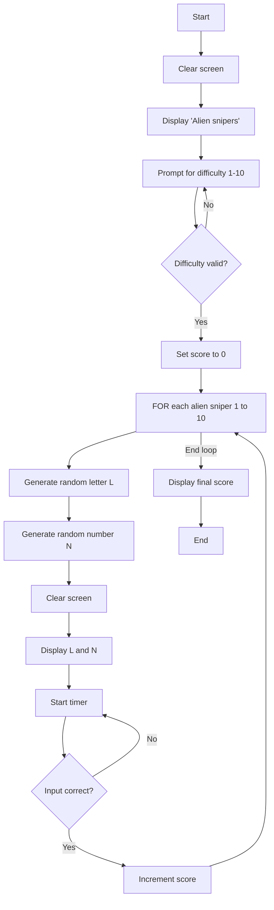
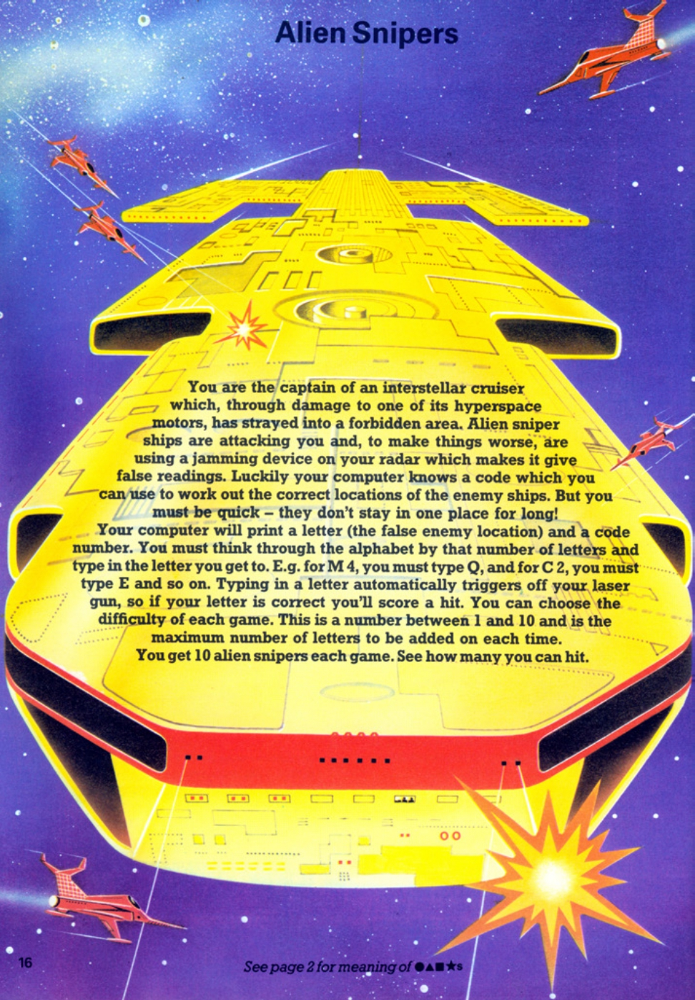
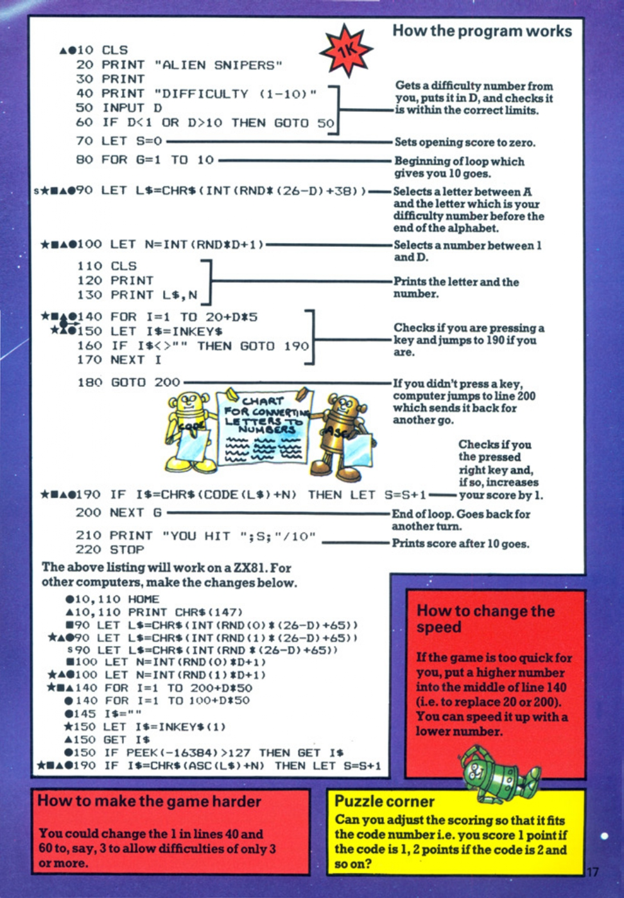

# Alien Snipers

**Book**: _Computer Spacegames_  
**Author**: Usborne Publishing  
**Translator**: [Marcus Medina](https://github.com/marcusjobb/UsborneBooks)

## Story

You are the captain of an interstellar cruiser which, through damage to one of its hyperspace motors, has strayed into a forbidden area. Alien sniper ships are attacking you and, to make things worse, are using a jamming device on your radar which makes it give false readings. Luckily your computer knows a code which you can use to work out the correct locations of the enemy ships. But you must be quick — they don’t stay in one place for long! You get 10 alien snipers each game. See how many you can hit.

## Pseudocode

```plaintext
BEGIN
  Clear screen
  Display "Alien snipers"
  Prompt for difficulty level (1-10)
  IF difficulty out of range THEN prompt again
  Set score to 0
  FOR each alien sniper (1 to 10):
    Generate a random letter (L) within range based on difficulty
    Generate a random number (N) between 1 and difficulty
    Clear screen
    Display L and N
    Start timer
    WHILE timer not expired:
      Check for user input
      IF input is correct THEN increment score and break loop
    END WHILE
  END FOR
  Display final score
END
```

## Flowchart



## Code

<details>
<summary>Pages</summary>

  


</details>

<details>
<summary>ZX-81</summary>

```basic
10 CLS
20 PRINT "ALIEN SNIPERS"
30 PRINT "DIFFICULTY (1-10)"
40 INPUT D
50 IF D<1 OR D>10 THEN GOTO 50
60 LET S=0
70 FOR G=1 TO 10
80 LET L$=CHR$(INT(RND*(26-D)+38))
90 LET N=INT(RND*D+1)
100 CLS
110 PRINT L$,N
120 FOR I=1 TO 20+D*5
130 LET I$=INKEY$
140 IF I$<>"" THEN GOTO 190
150 NEXT I
160 GOTO 200
170 IF I$=CHR$(CODE(L$)+N) THEN LET S=S+1
180 GOTO 200
190 NEXT G
200 PRINT "YOU HIT ";S;"/10"
210 STOP
```

</details>

<details>
<summary>C#</summary>

```csharp
using System;

class AlienSnipers
{
    static void Main()
    {
        Console.Clear();
        Console.WriteLine("Alien snipers");

        int difficulty;
        do
        {
            Console.Write("Difficulty (1-10): ");
        } while (!int.TryParse(Console.ReadLine(), out difficulty) || difficulty < 1 || difficulty > 10);

        int score = 0;
        Random random = new Random();

        for (int i = 0; i < 10; i++)
        {
            char letter = (char)(random.Next(26 - difficulty) + 65);
            int offset = random.Next(1, difficulty + 1);

            Console.Clear();
            Console.WriteLine($"{letter} {offset}");

            var startTime = DateTime.Now;
            bool correct = false;

            while ((DateTime.Now - startTime).TotalMilliseconds < (200 + difficulty * 50))
            {
                if (Console.KeyAvailable)
                {
                    char input = Console.ReadKey(true).KeyChar;
                    if (input == (char)(letter + offset))
                    {
                        score++;
                        correct = true;
                        break;
                    }
                }
            }

            if (!correct)
            {
                Console.WriteLine("Too slow!");
            }
        }

        Console.WriteLine($"You hit {score}/10");
    }
}
```

</details>

<details>
<summary>Python</summary>

```python
import random
import time

print("Alien snipers")

while True:
    try:
        difficulty = int(input("Difficulty (1-10): "))
        if 1 <= difficulty <= 10:
            break
    except ValueError:
        pass

score = 0

for _ in range(10):
    letter = chr(random.randint(65, 65 + (26 - difficulty)))
    offset = random.randint(1, difficulty)

    print(f"{letter} {offset}")
    start_time = time.time()

    correct = False
    while time.time() - start_time < (2 + difficulty * 0.1):
        try:
            user_input = input("Enter your guess: ").strip().upper()
            if len(user_input) == 1 and user_input == chr(ord(letter) + offset):
                score += 1
                correct = True
                break
        except EOFError:
            pass

    if not correct:
        print("Too slow!")

print(f"You hit {score}/10")
```

</details>

<details>
<summary>Java</summary>

```java
import java.util.Random;
import java.util.Scanner;

public class AlienSnipers {
    public static void main(String[] args) {
        Scanner scanner = new Scanner(System.in);
        Random random = new Random();

        System.out.println("Alien snipers");
        int difficulty;
        do {
            System.out.print("Difficulty (1-10): ");
            difficulty = scanner.nextInt();
        } while (difficulty < 1 || difficulty > 10);

        int score = 0;

        for (int i = 0; i < 10; i++) {
            char letter = (char) (random.nextInt(26 - difficulty) + 'A');
            int offset = random.nextInt(difficulty) + 1;

            System.out.println(letter + " " + offset);
            long startTime = System.currentTimeMillis();
            boolean correct = false;

            while (System.currentTimeMillis() - startTime < 200 + difficulty * 50) {
                try {
                    Scanner inputScanner = new Scanner(System.in);
                    char input = inputScanner.next().charAt(0);
                    if (input == letter + offset) {
                        score++;
                        correct = true;
                        break;
                    }
                } catch (Exception e) {
                    // Ignore incorrect inputs
                }
            }

            if (!correct) {
                System.out.println("Too slow!");
            }
        }

        System.out.println("You hit " + score + "/10");
    }
}
```

</details>

<details>
<summary>GoLang</summary>

```go
package main

import (
	"bufio"
	"fmt"
	"math/rand"
	"os"
	"strconv"
	"strings"
	"time"
)

func main() {
	rand.Seed(time.Now().UnixNano())
	reader := bufio.NewReader(os.Stdin)

	fmt.Println("Alien snipers")
	var difficulty int
	for {
		fmt.Print("Difficulty (1-10): ")
		input, _ := reader.ReadString('\n')
		input = strings.TrimSpace(input)
		difficulty, _ = strconv.Atoi(input)
		if difficulty >= 1 && difficulty <= 10 {
			break
		}
	}

	score := 0

	for i := 0; i < 10; i++ {
		letter := rune(rand.Intn(26-difficulty) + 'A')
		offset := rand.Intn(difficulty) + 1

		fmt.Printf("%c %d\n", letter, offset)
		start := time.Now()
		correct := false

		for time.Since(start).Milliseconds() < int64(200+difficulty*50) {
			input, _ := reader.ReadString('\n')
			input = strings.TrimSpace(input)
			if len(input) == 1 && input[0] == byte(letter)+byte(offset) {
				score++
				correct = true
				break
			}
		}

		if !correct {
			fmt.Println("Too slow!")
		}
	}

	fmt.Printf("You hit %d/10\n", score)
}
```

</details>

<details>
<summary>C++</summary>

```cpp
#include <iostream>
#include <cstdlib>
#include <ctime>
#include <conio.h>

using namespace std;

int main() {
    srand(time(0));
    cout << "Alien snipers" << endl;

    int difficulty;
    do {
        cout << "Difficulty (1-10): ";
        cin >> difficulty;
    } while (difficulty < 1 || difficulty > 10);

    int score = 0;

    for (int i = 0; i < 10; i++) {
        char letter = 'A' + (rand() % (26 - difficulty));
        int offset = 1 + (rand() % difficulty);

        cout << letter << " " << offset << endl;
        clock_t start_time = clock();
        bool correct = false;

        while (double(clock() - start_time) / CLOCKS_PER_SEC < 2 + (0.1 * difficulty)) {
            if (_kbhit()) {
                char input = _getch();
                if (input == letter + offset) {
                    score++;
                    correct = true;
                    break;
                }
            }
        }

        if (!correct) {
            cout << "Too slow!" << endl;
        }
    }

    cout << "You hit " << score << "/10" << endl;

    return 0;
}
```

</details>

<details>
<summary>Rust</summary>

```rust
use rand::Rng;
use std::io::{self, Write};
use std::time::{Duration, Instant};

fn main() {
    println!("Alien snipers");

    let mut difficulty = String::new();
    loop {
        print!("Difficulty (1-10): ");
        io::stdout().flush().unwrap();
        io::stdin().read_line(&mut difficulty).unwrap();
        if let Ok(d) = difficulty.trim().parse::<u32>() {
            if (1..=10).contains(&d) {
                difficulty.clear();
                break d;
            }
        }
        difficulty.clear();
    };

    let mut score = 0;

    for _ in 0..10 {
        let letter = ('A' as u8 + rand::thread_rng().gen_range(0..=25 - difficulty as u8)) as char;
        let offset = rand::thread_rng().gen_range(1..=difficulty);

        println!("{} {}", letter, offset);
        let start = Instant::now();

        while start.elapsed() < Duration::from_millis(200 + difficulty * 50) {
            let mut guess = String::new();
            io::stdin().read_line(&mut guess).unwrap();
            if guess.trim().to_uppercase() == ((letter as u8 + offset) as char).to_string() {
                score += 1;
                break;
            }
        }
    }

    println!("You hit {}/10", score);
}
```

</details>

## Explanation

In Alien Snipers, you must find the correct letter by calculating its position based on the random letter (L) displayed and an offset (N). The difficulty determines the range of letters and offsets. The game provides a limited time to input the correct answer, testing both speed and accuracy.

## Challenges

1. **Increase Difficulty**: Reduce the time limit for each turn.
2. **Score Multiplier**: Award more points for higher difficulties.
3. **Multiple Levels**: Add stages with increasing difficulty.

## Copyright

These programs are adaptations of the original Usborne Computer Guides published in the 1980s. The books are free to download for personal or educational use from [Usborne's Computer and Coding Books](https://usborne.com/row/books/computer-and-coding-books). Programs and adaptations may not be used for commercial purposes.

Return to [Computer Spacegames](./readme.md).
