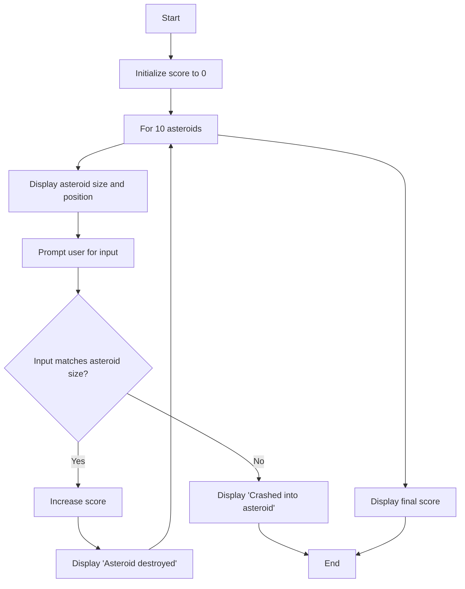
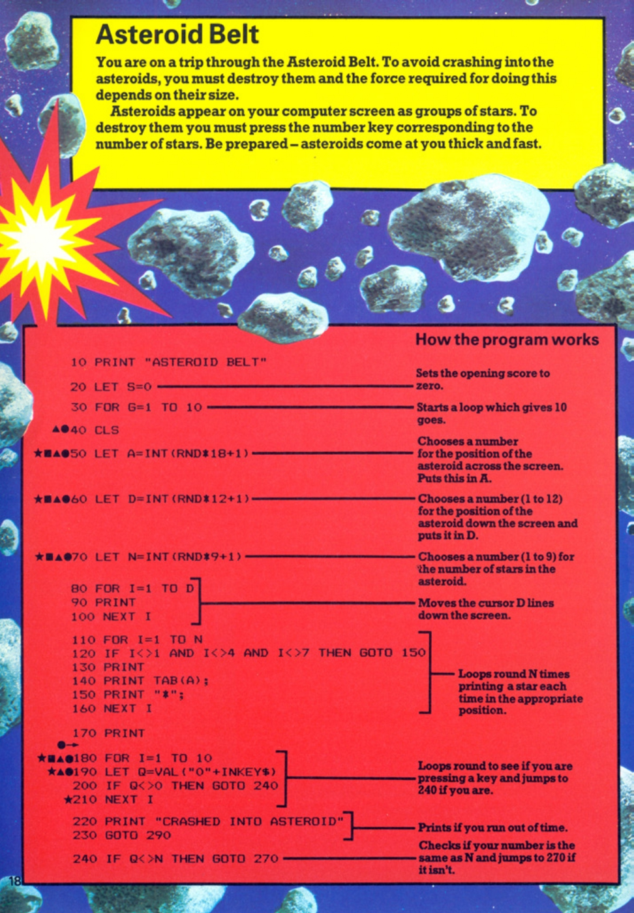
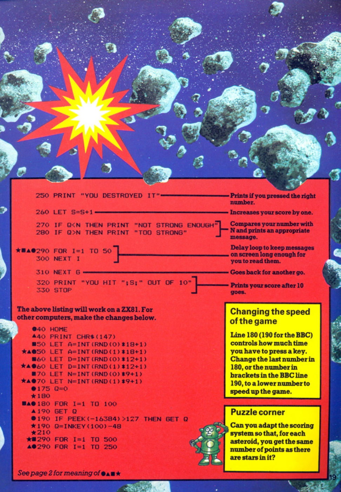

# Asteroid Belt

**Book**: _Computer Spacegames_  
**Author**: Usborne Publishing  
**Translator**: [Marcus Medina](https://github.com/marcusjobb/UsborneBooks)


## Story

You are on a trip through the Asteroid Belt. To avoid crashing into the asteroids, you must destroy them and the force required for doing this depends on their size.

Asteroids appear on your computer screen as groups of stars. To destroy them you must press the number key corresponding to the number of stars. Be prepared – asteroids come at you thick and fast.

## Pseudocode

```plaintext
START
   INITIALIZE score to 0
   FOR 10 ASTEROIDS
      DISPLAY asteroid size and position
      PROMPT user for input
      IF user input matches asteroid size THEN
         INCREASE score
         DISPLAY 'Asteroid destroyed'
      ELSE
         DISPLAY 'Crashed into asteroid'
         END GAME
      END IF
   END FOR
   DISPLAY final score
END
```

## Flowchart



## Code

<details>
<summary>Pages</summary>

  


</details>

<details>
<summary>ZX-81</summary>

```basic
10 PRINT "ASTEROID BELT"
20 LET S=0
30 FOR G=1 TO 10
40 CLS
50 LET A=INT(RND*18+1)
60 LET D=INT(RND*12+1)
70 LET N=INT(RND*9+1)
80 FOR I=1 TO D
90 PRINT
100 NEXT I
110 FOR I=1 TO N
120 IF I<4 AND I<7 THEN GOTO 150
130 PRINT TAB(A);
140 PRINT "*";
150 NEXT I
160 GOTO 170
170 FOR I=1 TO 10
180 LET Q=VAL(INKEY$)
190 IF Q<>0 THEN GOTO 240
200 NEXT I
210 PRINT "CRASHED INTO ASTEROID"
220 GOTO 300
230 LET S=S+1
240 IF Q=N THEN GOTO 260
250 PRINT "YOU DESTROYED IT"
260 LET S=S+1
270 IF Q<N THEN PRINT "NOT STRONG ENOUGH"
280 IF Q>N THEN PRINT "TOO STRONG"
290 FOR I=1 TO 50
300 NEXT I
310 GOTO 30
320 PRINT "YOU HIT ";S;" OUT OF 10"
330 STOP
```

</details>

<details>
<summary>C#</summary>

```csharp
using System;

class AsteroidBelt
{
    static void Main()
    {
        Random rnd = new Random();
        int score = 0;

        Console.WriteLine("Asteroid Belt");

        for (int g = 0; g < 10; g++)
        {
            Console.Clear();
            int position = rnd.Next(1, 19);
            int rowsDown = rnd.Next(1, 12);
            int numStars = rnd.Next(1, 9);

            for (int i = 0; i < rowsDown; i++)
                Console.WriteLine();

            Console.SetCursorPosition(position, Console.CursorTop);
            for (int i = 0; i < numStars; i++)
                Console.Write("*");

            Console.WriteLine();
            Console.Write("Enter number of stars: ");

            if (int.TryParse(Console.ReadLine(), out int input) && input == numStars)
            {
                Console.WriteLine("You destroyed it!");
                score++;
            }
            else
            {
                Console.WriteLine("Crashed into asteroid");
                break;
            }
        }

        Console.WriteLine($"You hit {score} out of 10");
    }
}
```

</details>

<details>
<summary>Python</summary>

```python
import random

def main():
    score = 0

    print("Asteroid Belt")

    for _ in range(10):
        print("\n" * random.randint(1, 12), end="")
        position = random.randint(1, 18)
        num_stars = random.randint(1, 9)

        print(" " * position + "*" * num_stars)

        try:
            guess = int(input("Enter number of stars: "))
            if guess == num_stars:
                print("You destroyed it!")
                score += 1
            else:
                print("Crashed into asteroid")
                break
        except ValueError:
            print("Invalid input. Crashed into asteroid.")
            break

    print(f"You hit {score} out of 10")

if __name__ == "__main__":
    main()
```

</details>

<details>
<summary>Java</summary>

```java
import java.util.*;

public class AsteroidBelt {
    public static void main(String[] args) {
        Random rnd = new Random();
        Scanner scanner = new Scanner(System.in);
        int score = 0;

        System.out.println("Asteroid Belt");

        for (int g = 0; g < 10; g++) {
            System.out.println();
            int position = rnd.nextInt(18) + 1;
            int rowsDown = rnd.nextInt(12) + 1;
            int numStars = rnd.nextInt(9) + 1;

            for (int i = 0; i < rowsDown; i++)
                System.out.println();

            for (int i = 0; i < position; i++)
                System.out.print(" ");
            for (int i = 0; i < numStars; i++)
                System.out.print("*");

            System.out.println();
            System.out.print("Enter number of stars: ");

            try {
                int input = scanner.nextInt();
                if (input == numStars) {
                    System.out.println("You destroyed it!");
                    score++;
                } else {
                    System.out.println("Crashed into asteroid");
                    break;
                }
            } catch (InputMismatchException e) {
                System.out.println("Invalid input. Crashed into asteroid.");
                break;
            }
        }

        System.out.println("You hit " + score + " out of 10");
    }
}
```

</details>

<details>
<summary>GoLang</summary>

```go
package main

import (
	"fmt"
	"math/rand"
	"time"
)

func main() {
	rand.Seed(time.Now().UnixNano())
	score := 0

	fmt.Println("Asteroid Belt")

	for g := 0; g < 10; g++ {
		fmt.Println()
		position := rand.Intn(18) + 1
		rowsDown := rand.Intn(12) + 1
		numStars := rand.Intn(9) + 1

		for i := 0; i < rowsDown; i++ {
			fmt.Println()
		}

		for i := 0; i < position; i++ {
			fmt.Print(" ")
		}
		for i := 0; i < numStars; i++ {
			fmt.Print("*")
		}

		fmt.Println()
		fmt.Print("Enter number of stars: ")
		var input int
		if _, err := fmt.Scan(&input); err == nil {
			if input == numStars {
				fmt.Println("You destroyed it!")
				score++
			} else {
				fmt.Println("Crashed into asteroid")
				break
			}
		} else {
			fmt.Println("Invalid input. Crashed into asteroid.")
			break
		}
	}

	fmt.Printf("You hit %d out of 10\n", score)
}
```

</details>

<details>
<summary>C++</summary>

```cpp
#include <iostream>
#include <cstdlib>
#include <ctime>

using namespace std;

int main() {
    srand(time(0));
    int score = 0;

    cout << "Asteroid Belt" << endl;

    for (int g = 0; g < 10; g++) {
        cout << endl;
        int position = rand() % 18 + 1;
        int rowsDown = rand() % 12 + 1;
        int numStars = rand() % 9 + 1;

        for (int i = 0; i < rowsDown; i++) {
            cout << endl;
        }

        for (int i = 0; i < position; i++) {
            cout << " ";
        }
        for (int i = 0; i < numStars; i++) {
            cout << "*";
        }

        cout << endl;
        cout << "Enter number of stars: ";
        int input;
        cin >> input;

        if (input == numStars) {
            cout << "You destroyed it!" << endl;
            score++;
        } else {
            cout << "Crashed into asteroid" << endl;
            break;
        }
    }

    cout << "You hit " << score << " out of 10" << endl;
    return 0;
}
```

</details>

<details>
<summary>Rust</summary>

```rust
use std::io;
use rand::Rng;

fn main() {
    let mut score = 0;
    let mut rng = rand::thread_rng();

    println!("Asteroid Belt");

    for _ in 0..10 {
        println!("");
        let position: usize = rng.gen_range(1..=18);
        let rows_down: usize = rng.gen_range(1..=12);
        let num_stars: usize = rng.gen_range(1..=9);

        for _ in 0..rows_down {
            println!("");
        }

        print!("{}", " ".repeat(position));
        println!("{}", "*".repeat(num_stars));

        println!("Enter number of stars: ");
        let mut input = String::new();
        io::stdin().read_line(&mut input).unwrap();

        if let Ok(guess) = input.trim().parse::<usize>() {
            if guess == num_stars {
                println!("You destroyed it!");
                score += 1;
            } else {
                println!("Crashed into asteroid");
                break;
            }
        } else {
            println!("Invalid input. Crashed into asteroid.");
            break;
        }
    }

    println!("You hit {} out of 10", score);
}
```

</details>

## Explanation

In Asteroid Belt, the player must observe the number of stars (asteroid size) displayed on the screen and input the correct number to destroy the asteroid. The game ends either after 10 asteroids or if the player inputs incorrect values.

## Challenges

1. **Adjust Speed**: Modify the game to allow more or less time for user input.
2. **Scoring System**: Change the scoring to award points based on asteroid size.
3. **Additional Levels**: Add more rounds with increasing difficulty.

## Copyright

These programs are adaptations of the original Usborne Computer Guides published in the 1980s. The books are free to download for personal or educational use from [Usborne's Computer and Coding Books](https://usborne.com/row/books/computer-and-coding-books). Programs and adaptations may not be used for commercial purposes.

Return to [Computer Spacegames](./readme.md).
