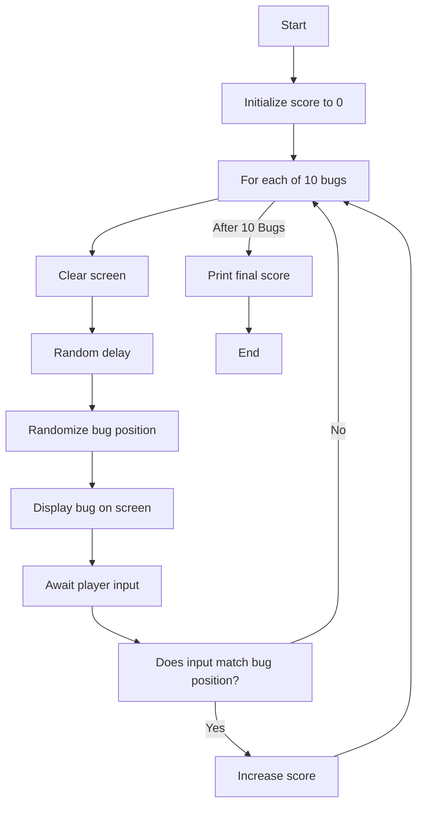
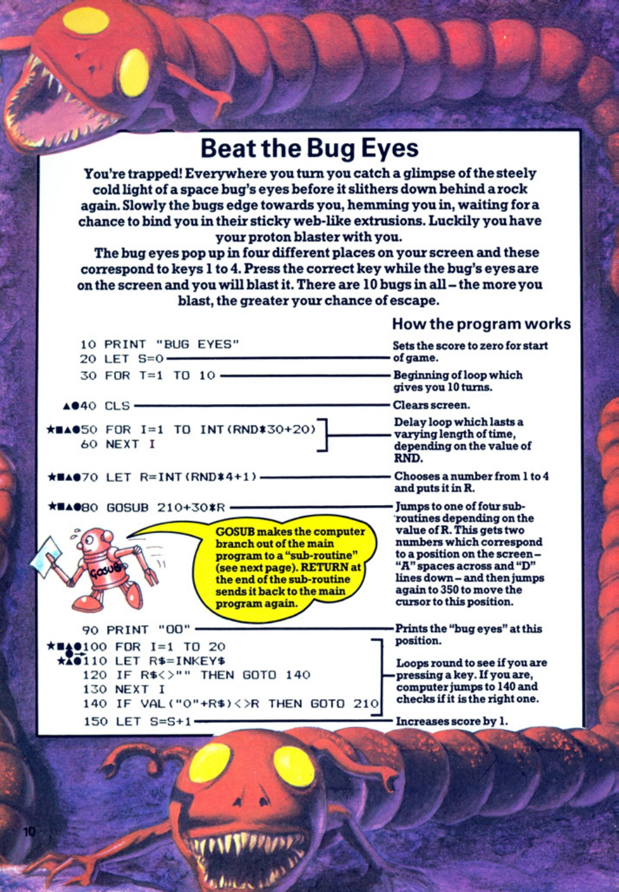
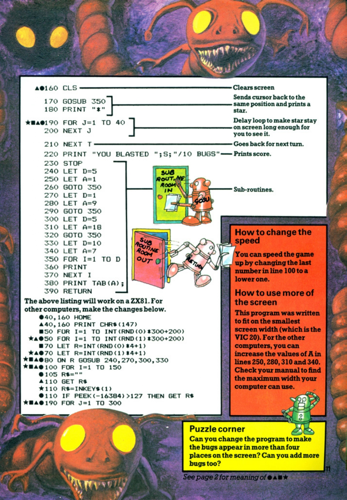

# Beat the Bug Eyes

**Book**: _Computer Spacegames_  
**Author**: Usborne Publishing

## Story

You're trapped! Everywhere you turn, you catch a glimpse of the steely cold light of a space bug's eyes before it slithers down behind a rock again. Slowly the bugs edge towards you, hemming you in, waiting for a chance to bind you in their sticky web-like extrusions. Luckily, you have your proton blaster with you.

The bug eyes pop up in four different places on your screen, corresponding to keys 1 to 4. Press the correct key while the bug's eyes are on the screen, and you will blast it. There are 10 bugs in total. The more you blast, the greater your chance of escape.

## Pseudocode

```plaintext
START
   INITIALIZE score to 0
   LOOP for 10 bugs
      CLEAR screen
      DELAY randomly
      RANDOMIZE bug position
      DISPLAY bug at position
      AWAIT player input
      IF input matches position THEN
         INCREASE score
   END LOOP
   PRINT final score
END
```

## Flowchart



## Code

<details>
<summary>Pages</summary>

  


</details>

<details>
<summary>ZX-81</summary>

```basic
10 PRINT "BUG EYES"
20 LET S=0
30 FOR T=1 TO 10
40 CLS
50 FOR I=1 TO INT(RND*30+20)
60 NEXT I
70 LET R=INT(RND*4+1)
80 GOSUB 210+30*R
90 PRINT "00"
100 FOR I=1 TO 20
110 LET R$=INKEY$
120 IF R$<>"" THEN GOTO 140
130 NEXT I
140 IF VAL(R$)=R THEN GOTO 210
150 LET S=S+1
210 PRINT "YOU BLASTED ";S;"/10 BUGS"
220 STOP
230 LET D=5
240 LET A=1
250 GOTO 350
260 LET A=9
270 GOTO 350
280 LET A=9
290 GOTO 350
300 LET A=18
310 GOTO 350
320 GOTO 350
330 LET D=10
340 LET A=7
350 FOR I=1 TO D
360 PRINT
370 NEXT I
380 PRINT TAB (A) : "*"
390 RETURN
```

</details>

<details>
<summary>C#</summary>

```csharp
using System;
using System.Threading;

class BugEyes
{
    static void Main()
    {
        Random rnd = new Random();
        int score = 0;

        Console.WriteLine("BUG EYES");

        for (int t = 1; t <= 10; t++)
        {
            Console.Clear();
            Thread.Sleep(rnd.Next(500, 1500)); // Random delay

            int bugPosition = rnd.Next(1, 5);
            Console.WriteLine($"BUG AT POSITION {bugPosition}");

            Console.Write("PRESS 1-4: ");
            string input = Console.ReadLine();

            if (int.TryParse(input, out int playerInput) && playerInput == bugPosition)
            {
                score++;
                Console.WriteLine("HIT!");
            }
            else
            {
                Console.WriteLine("MISS!");
            }
        }

        Console.WriteLine($"YOU BLASTED {score}/10 BUGS");
    }
}
```

</details>

<details>
<summary>Python</summary>

```python
import random
import time

def main():
    score = 0
    print("BUG EYES")

    for _ in range(10):
        print("\033[H\033[J", end="")  # Clear screen
        time.sleep(random.uniform(0.5, 1.5))  # Random delay

        bug_position = random.randint(1, 4)
        print(f"BUG AT POSITION {bug_position}")

        player_input = input("PRESS 1-4: ")
        if player_input.isdigit() and int(player_input) == bug_position:
            score += 1
            print("HIT!")
        else:
            print("MISS!")

    print(f"YOU BLASTED {score}/10 BUGS")

if __name__ == "__main__":
    main()
```

</details>

<details>
<summary>Java</summary>

```java
import java.util.Scanner;
import java.util.Random;

public class BugEyes {
    public static void main(String[] args) {
        Random rnd = new Random();
        Scanner scanner = new Scanner(System.in);
        int score = 0;

        System.out.println("BUG EYES");

        for (int t = 1; t <= 10; t++) {
            System.out.print("\033[H\033[J"); // Clear screen
            try {
                Thread.sleep(rnd.nextInt(1000) + 500); // Random delay
            } catch (InterruptedException e) {
                Thread.currentThread().interrupt();
            }

            int bugPosition = rnd.nextInt(4) + 1;
            System.out.println("BUG AT POSITION " + bugPosition);

            System.out.print("PRESS 1-4: ");
            int playerInput = scanner.nextInt();

            if (playerInput == bugPosition) {
                score++;
                System.out.println("HIT!");
            } else {
                System.out.println("MISS!");
            }
        }

        System.out.println("YOU BLASTED " + score + "/10 BUGS");
    }
}
```

</details>

<details>
<summary>GoLang</summary>

```go
package main

import (
    "fmt"
    "math/rand"
    "time"
)

func main() {
    rand.Seed(time.Now().UnixNano())
    score := 0

    fmt.Println("BUG EYES")

    for t := 1; t <= 10; t++ {
        fmt.Print("\033[H\033[J") // Clear screen
        time.Sleep(time.Duration(rand.Intn(1000)+500) * time.Millisecond) // Random delay

        bugPosition := rand.Intn(4) + 1
        fmt.Printf("BUG AT POSITION %d\n", bugPosition)

        var playerInput int
        fmt.Print("PRESS 1-4: ")
        fmt.Scan(&playerInput)

        if playerInput == bugPosition {
            score++
            fmt.Println("HIT!")
        } else {
            fmt.Println("MISS!")
        }
    }

    fmt.Printf("YOU BLASTED %d/10 BUGS\n", score)
}
```

</details>

<details>
<summary>C++</summary>

```cpp
#include <iostream>
#include <cstdlib>
#include <ctime>
#include <thread>
#include <chrono>

using namespace std;

int main() {
    srand(time(0));
    int score = 0;

    cout << "BUG EYES" << endl;

    for (int t = 1; t <= 10; t++) {
        system("clear"); // Clear screen (Linux/Unix)
        this_thread::sleep_for(chrono::milliseconds(rand() % 1000 + 500)); // Random delay

        int bugPosition = rand() % 4 + 1;
        cout << "BUG AT POSITION " << bugPosition << endl;

        cout << "PRESS 1-4: ";
        int playerInput;
        cin >> playerInput;

        if (playerInput == bugPosition) {
            score++;
            cout << "HIT!" << endl;
        } else {
            cout << "MISS!" << endl;
        }
    }

    cout << "YOU BLASTED " << score << "/10 BUGS" << endl;

    return 0;
}
```

</details>

<details>
<summary>Rust</summary>

```rust
use std::io;
use std::thread;
use std::time::Duration;
use rand::Rng;

fn main() {
    let mut score = 0;

    println!("BUG EYES");

    for _ in 0..10 {
        clear_screen();
        let delay = rand::thread_rng().gen_range(500..1500);
        thread::sleep(Duration::from_millis(delay));

        let bug_position = rand::thread_rng().gen_range(1..=4);
        println!("BUG AT POSITION {}", bug_position);

        println!("PRESS 1-4: ");
        let player_input = read_input();

        if let Ok(num) = player_input.parse::<u32>() {
            if num == bug_position {
                score += 1;
                println!("HIT!");
            } else {
                println!("MISS!");
            }
        } else {
            println!("INVALID INPUT!");
        }
    }

    println!("YOU BLASTED {}/10 BUGS", score);
}

fn clear_screen() {
    print!("{}[2J", 27 as char);
    println!("{}[H", 27 as char);
}

fn read_input() -> String {
    let mut input = String::new();
    io::stdin().read_line(&mut input).unwrap();
    input.trim().to_string()
}
```

</details>

## Explanation

In Beat the Bug Eyes, the player has 10 opportunities to hit bugs that appear randomly in one of four positions on the screen. The player must react quickly by pressing the corresponding key. The program tracks the player's score and provides feedback after each attempt.

## Challenges

1. **Speed Adjustment**: Make the game faster or slower by changing the random delay range.
2. **Extended Gameplay**: Allow the player to play more than 10 rounds.
3. **Additional Positions**: Increase the number of positions bugs can appear in.

## Copyright

These programs are adaptations of the original Usborne Computer Guides published in the 1980s. The books are free to download for personal or educational use from [Usborne's Computer and Coding Books](https://usborne.com/row/books/computer-and-coding-books). Programs and adaptations may not be used for commercial purposes.

Return to [Computer Spacegames](./readme.md).
