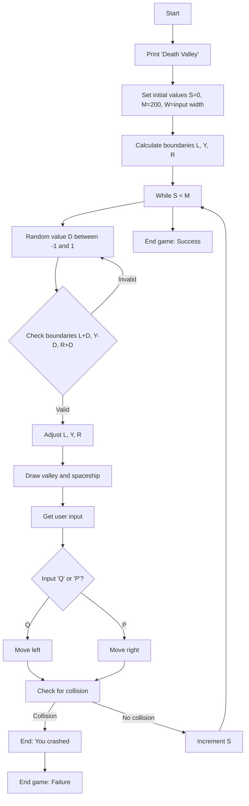

# Death Valley

**Book**: _Computer Spacegames_  
**Author**: Usborne Publishing

## Story

In this game, you must steer your spaceship, the "Speed Dart," through a treacherous narrow passage known as "Death Valley." The player controls the ship by pressing **Q** to move left and **P** to move right. The width of the valley is determined at the start of the game. The goal is to make it through the valley without crashing into the walls.

## Pseudocode

```plaintext
START
PRINT "Death Valley"
SET S = 0  // Number of steps taken
SET M = 200 // Maximum allowed steps
PRINT "Width?"
INPUT W // Get width of valley
SET L = W / 2 // Left boundary
SET Y = W
SET R = W

WHILE S < M
    SET D = RANDOM(-1, 1)
    IF L + D < 0 OR L + D > 20 THEN CONTINUE
    SET L = L + D
    SET Y = Y - D
    SET R = R + D

    PRINT SPACES L THEN PRINT "I"
    PRINT SPACES Y THEN PRINT "*"
    PRINT SPACES R THEN PRINT "I"

    GET INPUT I
    IF I == "Q" THEN Y = Y - 1; R = R + 1
    IF I == "P" THEN Y = Y + 1; R = R - 1

    IF Y < 1 OR R < 1 THEN GOTO END_FAILURE

    INCREMENT S
END_WHILE

END_SUCCESS
PRINT "Well done! You made it through Death Valley."
EXIT

END_FAILURE
PRINT "You crashed into the wall and disintegrated."
EXIT

END
```

## Flowchart



## Code

<details>
<summary>ZX-81</summary>

```basic
10 PRINT "DEATH VALLEY"
20 LET S=0
30 LET M=200
40 PRINT "WIDTH?"
50 INPUT W
60 LET L=INT(W/2)
70 LET L=10
80 LET Y=W
90 LET R=W
100 LET D=INT(RND*3-1)
110 IF L+D<0 OR L+D>20 THEN GOTO 100
120 LET L=L+D
130 LET R=R+D
140 LET Y=Y-D
145 SCROLL
150 LET N=L
160 GOSUB 1000
170 PRINT "I"
180 LET N=Y
190 GOSUB 1000
200 PRINT "I"
210 LET N=R
220 GOSUB 1000
230 PRINT "I"
240 LET I$=INKEY$
250 IF I$="Q" THEN GOTO 280
260 IF I$="P" THEN GOTO 310
270 LET Y=Y-1
280 LET R=R+1
290 LET Y=Y+1
300 LET R=R-1
310 IF Y<1 OR R<1 THEN GOTO 370
320 LET S=S+1
330 IF S<M THEN GOTO 100
340 PRINT "WELL DONE-YOU MADE IT"
350 PRINT "THROUGH DEATH VALLEY"
360 STOP
370 PRINT "YOU CRASHED INTO THE WALL"
380 PRINT "AND DISINTEGRATED"
390 STOP

1000 FOR N=1 TO N
1010 PRINT " ";
1020 NEXT I
1030 RETURN
```

</details>

<details>
<summary>C#</summary>

```csharp
using System;

class Program
{
    static void Main()
    {
        Console.WriteLine("Death Valley");
        int steps = 0;
        const int maxSteps = 200;

        Console.Write("Width? ");
        int width = int.Parse(Console.ReadLine());
        int left = width / 2;
        int middle = width;
        int right = width;

        Random random = new Random();

        while (steps < maxSteps)
        {
            int change = random.Next(-1, 2);
            if (left + change < 0 || right + change > 20)
                continue;

            left += change;
            middle -= change;
            right += change;

            Console.WriteLine(new string(' ', left) + "I");
            Console.WriteLine(new string(' ', middle) + "*");
            Console.WriteLine(new string(' ', right) + "I");

            ConsoleKeyInfo key = Console.ReadKey(true);
            if (key.Key == ConsoleKey.Q)
            {
                middle--;
                right++;
            }
            else if (key.Key == ConsoleKey.P)
            {
                middle++;
                right--;
            }

            if (middle < 1 || right < 1)
            {
                Console.WriteLine("You crashed into the wall and disintegrated.");
                return;
            }

            steps++;
        }

        Console.WriteLine("Well done! You made it through Death Valley.");
    }
}
```

</details>

<details>
<summary>Python</summary>

```python
import random

def main():
    print("Death Valley")
    steps = 0
    max_steps = 200

    width = int(input("Width? "))
    left = width // 2
    middle = width
    right = width

    while steps < max_steps:
        change = random.randint(-1, 1)
        if left + change < 0 or right + change > 20:
            continue

        left += change
        middle -= change
        right += change

        print(" " * left + "I")
        print(" " * middle + "*")
        print(" " * right + "I")

        move = input("Move (Q/P): ").strip().upper()
        if move == "Q":
            middle -= 1
            right += 1
        elif move == "P":
            middle += 1
            right -= 1

        if middle < 1 or right < 1:
            print("You crashed into the wall and disintegrated.")
            return

        steps += 1

    print("Well done! You made it through Death Valley.")

if __name__ == "__main__":
    main()
```

</details>

<details>
<summary>Java</summary>

```java
import java.util.Scanner;
import java.util.Random;

public class DeathValley {
    public static void main(String[] args) {
        Scanner scanner = new Scanner(System.in);
        Random random = new Random();

        System.out.println("Death Valley");
        int steps = 0;
        final int maxSteps = 200;

        System.out.print("Width? ");
        int width = scanner.nextInt();
        int left = width / 2;
        int middle = width;
        int right = width;

        while (steps < maxSteps) {
            int change = random.nextInt(3) - 1;
            if (left + change < 0 || right + change > 20) {
                continue;
            }

            left += change;
            middle -= change;
            right += change;

            System.out.println(" ".repeat(left) + "I");
            System.out.println(" ".repeat(middle) + "*");
            System.out.println(" ".repeat(right) + "I");

            System.out.print("Move (Q/P): ");
            String move = scanner.next().toUpperCase();
            if (move.equals("Q")) {
                middle--;
                right++;
            } else if (move.equals("P")) {
                middle++;
                right--;
            }

            if (middle < 1 || right < 1) {
                System.out.println("You crashed into the wall and disintegrated.");
                scanner.close();
                return;
            }

            steps++;
        }

        System.out.println("Well done! You made it through Death Valley.");
        scanner.close();
    }
}
```

</details>

<details>
<summary>Go</summary>

```go
package main

import (
	"fmt"
	"math/rand"
	"time"
)

func main() {
	rand.Seed(time.Now().UnixNano())
	fmt.Println("Death Valley")
	var steps int
	const maxSteps = 200

	var width int
	fmt.Print("Width? ")
	fmt.Scan(&width)

	left := width / 2
	middle := width
	right := width

	for steps < maxSteps {
		change := rand.Intn(3) - 1
		if left+change < 0 || right+change > 20 {
			continue
		}

		left += change
		middle -= change
		right += change

		fmt.Printf("%sI\n", spaces(left))
		fmt.Printf("%s*\n", spaces(middle))
		fmt.Printf("%sI\n", spaces(right))

		var move string
		fmt.Print("Move (Q/P): ")
		fmt.Scan(&move)

		if move == "Q" {
			middle--
			right++
		} else if move == "P" {
			middle++
			right--
		}

		if middle < 1 || right < 1 {
			fmt.Println("You crashed into the wall and disintegrated.")
			return
		}

		steps++
	}

	fmt.Println("Well done! You made it through Death Valley.")
}

func spaces(n int) string {
	return fmt.Sprintf("%*s", n, "")
}
```

</details>

<details>
<summary>C++</summary>

```cpp
#include <iostream>
#include <cstdlib>
#include <ctime>
#include <string>
using namespace std;

string spaces(int n) {
    return string(n, ' ');
}

int main() {
    srand(time(0));
    cout << "Death Valley" << endl;
    int steps = 0;
    const int maxSteps = 200;

    cout << "Width? ";
    int width;
    cin >> width;

    int left = width / 2;
    int middle = width;
    int right = width;

    while (steps < maxSteps) {
        int change = rand() % 3 - 1;
        if (left + change < 0 || right + change > 20)
            continue;

        left += change;
        middle -= change;
        right += change;

        cout << spaces(left) << "I" << endl;
        cout << spaces(middle) << "*" << endl;
        cout << spaces(right) << "I" << endl;

        cout << "Move (Q/P): ";
        char move;
        cin >> move;
        move = toupper(move);

        if (move == 'Q') {
            middle--;
            right++;
        } else if (move == 'P') {
            middle++;
            right--;
        }

        if (middle < 1 || right < 1) {
            cout << "You crashed into the wall and disintegrated." << endl;
            return 0;
        }

        steps++;
    }

    cout << "Well done! You made it through Death Valley." << endl;
    return 0;
}
```

</details>

<details>
<summary>Rust</summary>

```rust
use rand::Rng;
use std::io;

fn main() {
    println!("Death Valley");
    let mut steps = 0;
    let max_steps = 200;

    println!("Width? ");
    let mut input = String::new();
    io::stdin().read_line(&mut input).unwrap();
    let width: usize = input.trim().parse().unwrap();

    let mut left = width / 2;
    let mut middle = width;
    let mut right = width;

    while steps < max_steps {
        let change = rand::thread_rng().gen_range(-1..=1);
        if (left as isize + change) < 0 || (right as isize + change) > 20 {
            continue;
        }

        left = (left as isize + change) as usize;
        middle = (middle as isize - change) as usize;
        right = (right as isize + change) as usize;

        println!("{}I", " ".repeat(left));
        println!("{}*", " ".repeat(middle));
        println!("{}I", " ".repeat(right));

        println!("Move (Q/P): ");
        input.clear();
        io::stdin().read_line(&mut input).unwrap();
        let move_char = input.trim().to_uppercase();

        if move_char == "Q" {
            middle -= 1;
            right += 1;
        } else if move_char == "P" {
            middle += 1;
            right -= 1;
        }

        if middle < 1 || right < 1 {
            println!("You crashed into the wall and disintegrated.");
            return;
        }

        steps += 1;
    }

    println!("Well done! You made it through Death Valley.");
}
```

</details>

## Explanation

This game challenges the player to navigate a spaceship through a narrow, shifting valley. Each turn, the valley's boundaries shift slightly. The player uses the **Q** and **P** keys to move left and right, avoiding collisions with the walls. If the spaceship touches the wall, the game ends in failure. Successfully surviving all turns results in victory.

## Challenges

1. **Increase Difficulty**: Reduce the valley's width dynamically as the game progresses.
2. **Add Obstacles**: Introduce obstacles within the valley that the player must avoid.
3. **Variable Speeds**: Make the valley's scrolling speed increase over time.

## Copyright

These programs are adaptations of the original Usborne Computer Guides published in the 1980s. The books are free to download for personal or educational use from [Usborne's Computer and Coding Books](https://usborne.com/row/books/computer-and-coding-books). Programs and adaptations may not be used for commercial purposes.

Return to [Computer Spacegames](./readme.md).
