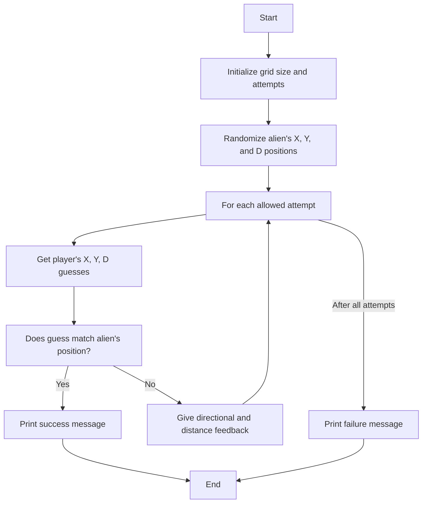
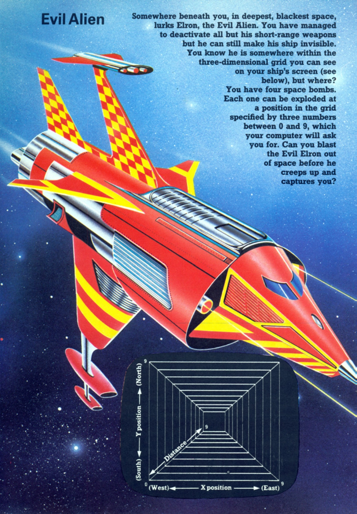
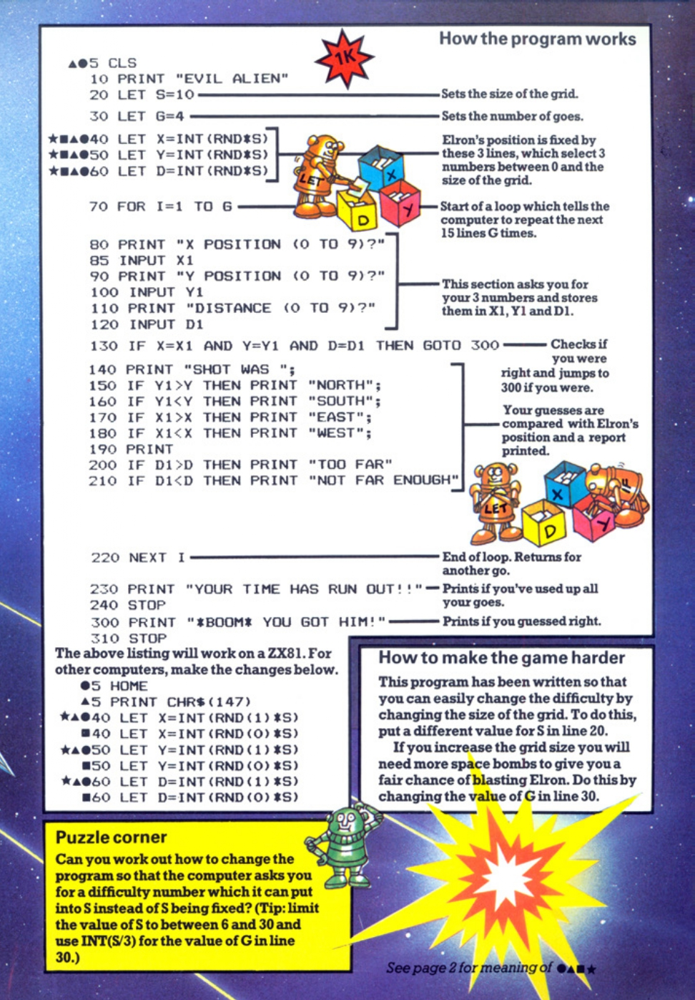

# Evil Alien

**Book**: _Computer Spacegames_  
**Author**: Usborne Publishing

## Story

Somewhere in the deepest, blackest space lurks Elron, the Evil Alien. You have managed to deactivate all but his short-range weapons, but he can still make his ship invisible. Elron hides somewhere within a three-dimensional grid displayed on your screen. You have four space bombs and must guess his position to blast him out of space before he captures you. Can you succeed?

## Pseudocode

```plaintext
START
   INITIALIZE grid size and attempts
   RANDOMIZE alien's X, Y, and D positions
   LOOP for allowed attempts
      GET player's guess for X, Y, and D
      IF guess matches alien's position THEN
         PRINT success message
         EXIT
      ELSE
         GIVE directional feedback (NORTH, SOUTH, etc.)
         GIVE distance feedback (TOO FAR or NOT FAR ENOUGH)
   END LOOP
   PRINT failure message if unsuccessful
END
```

## Flowchart



## Code

<details>
<summary>Pages</summary>

  


</details>

<details>
<summary>ZX-81</summary>

```basic
10 CLS
20 LET S=10
30 LET G=4
40 LET X=INT(RND*S)
50 LET Y=INT(RND*S)
60 LET D=INT(RND*S)
70 FOR I=1 TO G
80 PRINT "X POSITION (0 TO 9)? "
85 INPUT X1
90 PRINT "Y POSITION (0 TO 9)? "
100 INPUT Y1
110 PRINT "DISTANCE (0 TO 9)? "
120 INPUT D1
130 IF X1=X AND Y1=Y AND D1=D THEN GOTO 300
140 PRINT "SHOT WAS ";
150 IF Y1>Y THEN PRINT "NORTH";
160 IF Y1<Y THEN PRINT "SOUTH";
170 IF X1>X THEN PRINT "EAST";
180 IF X1<X THEN PRINT "WEST";
190 PRINT
200 IF D1>D THEN PRINT "TOO FAR"
210 IF D1<D THEN PRINT "NOT FAR ENOUGH"
220 NEXT I
230 PRINT "YOUR TIME HAS RUN OUT!!!"
240 STOP
300 PRINT "*BOOM* YOU GOT HIM!"
```

</details>

<details>
<summary>C#</summary>

```csharp
using System;

class EvilAlien
{
    static void Main()
    {
        Random rnd = new Random();
        int gridSize = 10;
        int attempts = 4;
        int alienX = rnd.Next(0, gridSize);
        int alienY = rnd.Next(0, gridSize);
        int alienD = rnd.Next(0, gridSize);

        Console.WriteLine("EVIL ALIEN");

        for (int i = 0; i < attempts; i++)
        {
            Console.Write("X POSITION (0 TO 9)? ");
            int playerX = int.Parse(Console.ReadLine());

            Console.Write("Y POSITION (0 TO 9)? ");
            int playerY = int.Parse(Console.ReadLine());

            Console.Write("DISTANCE (0 TO 9)? ");
            int playerD = int.Parse(Console.ReadLine());

            if (playerX == alienX && playerY == alienY && playerD == alienD)
            {
                Console.WriteLine("*BOOM* YOU GOT HIM!");
                return;
            }

            Console.Write("SHOT WAS ");
            if (playerY > alienY) Console.Write("NORTH ");
            if (playerY < alienY) Console.Write("SOUTH ");
            if (playerX > alienX) Console.Write("EAST ");
            if (playerX < alienX) Console.Write("WEST ");
            Console.WriteLine();

            if (playerD > alienD)
                Console.WriteLine("TOO FAR");
            else if (playerD < alienD)
                Console.WriteLine("NOT FAR ENOUGH");
        }

        Console.WriteLine("YOUR TIME HAS RUN OUT!!!");
    }
}
```

</details>

<details>
<summary>Python</summary>

```python
import random

def main():
    grid_size = 10
    attempts = 4
    alien_x = random.randint(0, grid_size - 1)
    alien_y = random.randint(0, grid_size - 1)
    alien_d = random.randint(0, grid_size - 1)

    print("EVIL ALIEN")

    for _ in range(attempts):
        player_x = int(input("X POSITION (0 TO 9)? "))
        player_y = int(input("Y POSITION (0 TO 9)? "))
        player_d = int(input("DISTANCE (0 TO 9)? "))

        if player_x == alien_x and player_y == alien_y and player_d == alien_d:
            print("*BOOM* YOU GOT HIM!")
            return

        print("SHOT WAS", end=" ")
        if player_y > alien_y:
            print("NORTH", end=" ")
        if player_y < alien_y:
            print("SOUTH", end=" ")
        if player_x > alien_x:
            print("EAST", end=" ")
        if player_x < alien_x:
            print("WEST", end=" ")
        print()

        if player_d > alien_d:
            print("TOO FAR")
        elif player_d < alien_d:
            print("NOT FAR ENOUGH")

    print("YOUR TIME HAS RUN OUT!!!")

if __name__ == "__main__":
    main()
```

</details>

<details>
<summary>Java</summary>

```java
import java.util.Scanner;
import java.util.Random;

public class EvilAlien {
    public static void main(String[] args) {
        Random rnd = new Random();
        int gridSize = 10;
        int attempts = 4;
        int alienX = rnd.nextInt(gridSize);
        int alienY = rnd.nextInt(gridSize);
        int alienD = rnd.nextInt(gridSize);

        System.out.println("EVIL ALIEN");

        Scanner scanner = new Scanner(System.in);

        for (int i = 0; i < attempts; i++) {
            System.out.print("X POSITION (0 TO 9)? ");
            int playerX = scanner.nextInt();

            System.out.print("Y POSITION (0 TO 9)? ");
            int playerY = scanner.nextInt();

            System.out.print("DISTANCE (0 TO 9)? ");
            int playerD = scanner.nextInt();

            if (playerX == alienX && playerY == alienY && playerD == alienD) {
                System.out.println("*BOOM* YOU GOT HIM!");
                return;
            }

            System.out.print("SHOT WAS ");
            if (playerY > alienY) System.out.print("NORTH ");
            if (playerY < alienY) System.out.print("SOUTH ");
            if (playerX > alienX) System.out.print("EAST ");
            if (playerX < alienX) System.out.print("WEST ");
            System.out.println();

            if (playerD > alienD)
                System.out.println("TOO FAR");
            else if (playerD < alienD)
                System.out.println("NOT FAR ENOUGH");
        }

        System.out.println("YOUR TIME HAS RUN OUT!!!");
    }
}
```

</details>

<details>
<summary>GoLang</summary>

```go
package main

import (
    "fmt"
    "math/rand"
    "time"
)

func main() {
    rand.Seed(time.Now().UnixNano())
    gridSize := 10
    attempts := 4
    alienX := rand.Intn(gridSize)
    alienY := rand.Intn(gridSize)
    alienD := rand.Intn(gridSize)

    fmt.Println("EVIL ALIEN")

    for i := 0; i < attempts; i++ {
        var playerX, playerY, playerD int
        fmt.Print("X POSITION (0 TO 9)? ")
        fmt.Scan(&playerX)
        fmt.Print("Y POSITION (0 TO 9)? ")
        fmt.Scan(&playerY)
        fmt.Print("DISTANCE (0 TO 9)? ")
        fmt.Scan(&playerD)

        if playerX == alienX && playerY == alienY && playerD == alienD {
            fmt.Println("*BOOM* YOU GOT HIM!")
            return
        }

        fmt.Print("SHOT WAS ")
        if playerY > alienY {
            fmt.Print("NORTH ")
        }
        if playerY < alienY {
            fmt.Print("SOUTH ")
        }
        if playerX > alienX {
            fmt.Print("EAST ")
        }
        if playerX < alienX {
            fmt.Print("WEST ")
        }
        fmt.Println()

        if playerD > alienD {
            fmt.Println("TOO FAR")
        } else if playerD < alienD {
            fmt.Println("NOT FAR ENOUGH")
        }
    }

    fmt.Println("YOUR TIME HAS RUN OUT!!!")
}
```

</details>

<details>
<summary>C++</summary>

```cpp
#include <iostream>
#include <cstdlib>
#include <ctime>

using namespace std;

int main() {
    srand(time(0));
    int gridSize = 10;
    int attempts = 4;
    int alienX = rand() % gridSize;
    int alienY = rand() % gridSize;
    int alienD = rand() % gridSize;

    cout << "EVIL ALIEN" << endl;

    for (int i = 0; i < attempts; i++) {
        int playerX, playerY, playerD;
        cout << "X POSITION (0 TO 9)? ";
        cin >> playerX;
        cout << "Y POSITION (0 TO 9)? ";
        cin >> playerY;
        cout << "DISTANCE (0 TO 9)? ";
        cin >> playerD;

        if (playerX == alienX && playerY == alienY && playerD == alienD) {
            cout << "*BOOM* YOU GOT HIM!" << endl;
            return 0;
        }

        cout << "SHOT WAS ";
        if (playerY > alienY) {
            cout << "NORTH ";
        }
        if (playerY < alienY) {
            cout << "SOUTH ";
        }
        if (playerX > alienX) {
            cout << "EAST ";
        }
        if (playerX < alienX) {
            cout << "WEST ";
        }
        cout << endl;

        if (playerD > alienD) {
            cout << "TOO FAR" << endl;
        } else if (playerD < alienD) {
            cout << "NOT FAR ENOUGH" << endl;
        }
    }

    cout << "YOUR TIME HAS RUN OUT!!!" << endl;
    return 0;
}
```

</details>

<details>
<summary>Rust</summary>

```rust
use std::io;
use rand::Rng;

fn main() {
    let grid_size = 10;
    let attempts = 4;
    let alien_x = rand::thread_rng().gen_range(0..grid_size);
    let alien_y = rand::thread_rng().gen_range(0..grid_size);
    let alien_d = rand::thread_rng().gen_range(0..grid_size);

    println!("EVIL ALIEN");

    for _ in 0..attempts {
        let player_x = read_input("X POSITION (0 TO 9)? ");
        let player_y = read_input("Y POSITION (0 TO 9)? ");
        let player_d = read_input("DISTANCE (0 TO 9)? ");

        if player_x == alien_x && player_y == alien_y && player_d == alien_d {
            println!("*BOOM* YOU GOT HIM!");
            return;
        }

        print!("SHOT WAS ");
        if player_y > alien_y {
            print!("NORTH ");
        }
        if player_y < alien_y {
            print!("SOUTH ");
        }
        if player_x > alien_x {
            print!("EAST ");
        }
        if player_x < alien_x {
            print!("WEST ");
        }
        println!();

        if player_d > alien_d {
            println!("TOO FAR");
        } else if player_d < alien_d {
            println!("NOT FAR ENOUGH");
        }
    }

    println!("YOUR TIME HAS RUN OUT!!!");
}

fn read_input(prompt: &str) -> i32 {
    println!("{}", prompt);
    let mut input = String::new();
    io::stdin().read_line(&mut input).unwrap();
    input.trim().parse().unwrap()
}
```

</details>

## Explanation

In Evil Alien, the player guesses the coordinates (X, Y) and distance (D) of Elron's hidden ship within a grid. The program provides directional feedback (e.g., "NORTH") and distance feedback (e.g., "TOO FAR") to help the player refine their guesses. The player has limited attempts to find and destroy Elron.

## Challenges

1. **Grid Size**: Increase or decrease the grid size to adjust difficulty.
2. **Attempt Limit**: Allow the player to choose a custom number of attempts.
3. **Replayability**: Add an option to restart the game after winning or losing.

## Copyright

These programs are adaptations of the original Usborne Computer Guides published in the 1980s. The books are free to download for personal or educational use from [Usborne's Computer and Coding Books](https://usborne.com/row/books/computer-and-coding-books). Programs and adaptations may not be used for commercial purposes.

Return to [Computer Spacegames](./readme.md).

