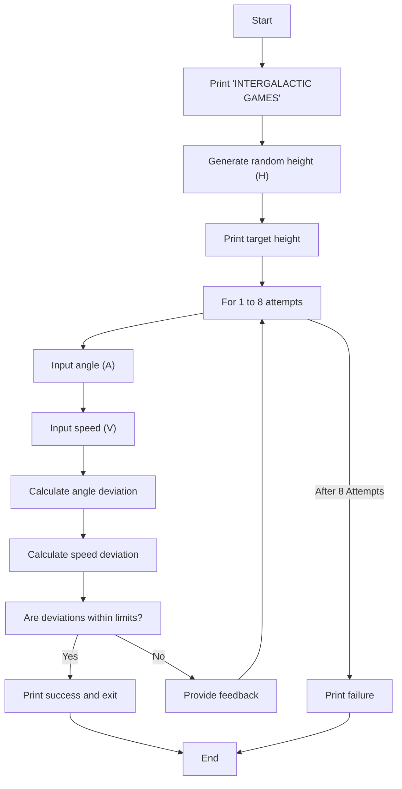
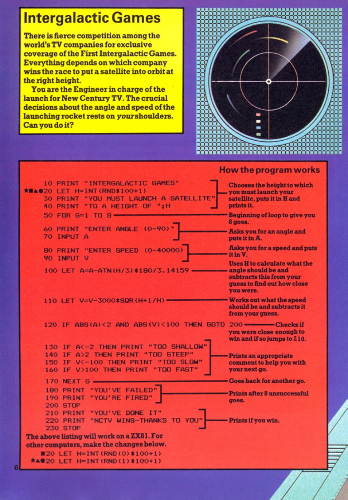
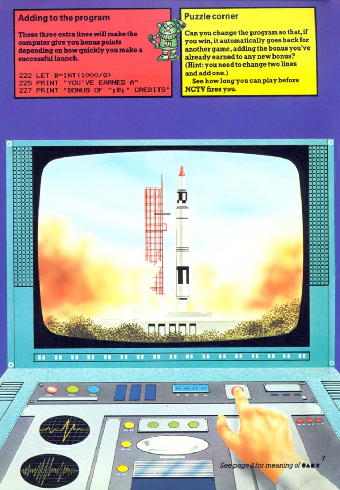

# Intergalactic Games

**Book**: _Computer Spacegames_  
**Author**: Usborne Publishing

## Story

You are the engineer in charge of launching a satellite into orbit for New Century TV during the First Intergalactic Games. The crucial decisions about the angle and speed of the rocket rest entirely on your shoulders. Can you successfully place the satellite into orbit?

## Pseudocode

```plaintext
START
   PRINT game title "INTERGALACTIC GAMES"
   GENERATE random height (H) for the satellite (1 to 100)
   DISPLAY the target height for the satellite
   LOOP for 8 attempts
      INPUT angle (A)
      INPUT speed (V)
      CALCULATE deviation from correct angle (A)
      CALCULATE deviation from correct speed (V)
      IF deviations within acceptable limits THEN
         PRINT success message
         EXIT loop
      ELSE
         PROVIDE feedback on errors
   END LOOP
   PRINT failure message if unsuccessful
END
```

## Flowchart



## Code

<details>
<summary>Pages</summary>

  


</details>

<details>
<summary>ZX-81</summary>

```basic
10 PRINT "INTERGALACTIC GAMES"
20 LET H=INT(RND*100+1)
30 PRINT "YOU MUST LAUNCH A SATELLITE"
40 PRINT "TO A HEIGHT OF ";H
50 FOR G=1 TO 8
60 PRINT "ENTER ANGLE (0-90)";
70 INPUT A
80 PRINT "ENTER SPEED (0-40000)";
90 INPUT V
100 LET A=A-ATN(H/3)*180/3.14159
110 LET V=V-3000*SQR(H+1/H)
120 IF ABS(A)<2 AND ABS(V)<100 THEN GOTO 200
130 IF A<-2 THEN PRINT "TOO SHALLOW"
140 IF A>2 THEN PRINT "TOO STEEP"
150 IF V<-100 THEN PRINT "TOO SLOW"
160 IF V>100 THEN PRINT "TOO FAST"
170 NEXT G
180 PRINT "YOU'VE FAILED"
190 PRINT "YOU'RE FIRED"
200 PRINT "YOU'VE DONE IT"
210 PRINT "NCTV WINS-THANKS TO YOU"
220 STOP
```

</details>

<details>
<summary>C#</summary>

```csharp
using System;

class IntergalacticGames
{
    static void Main()
    {
        Random rnd = new Random();
        int height = rnd.Next(1, 101); // Random height between 1 and 100

        Console.WriteLine("INTERGALACTIC GAMES");
        Console.WriteLine("YOU MUST LAUNCH A SATELLITE");
        Console.WriteLine($"TO A HEIGHT OF {height}");

        for (int attempts = 1; attempts <= 8; attempts++)
        {
            Console.Write("ENTER ANGLE (0-90): ");
            double angle = Convert.ToDouble(Console.ReadLine());

            Console.Write("ENTER SPEED (0-40000): ");
            double speed = Convert.ToDouble(Console.ReadLine());

            double correctAngle = Math.Atan(height / 3.0) * (180 / Math.PI);
            double correctSpeed = 3000 * Math.Sqrt(height + (1.0 / height));

            double angleDeviation = angle - correctAngle;
            double speedDeviation = speed - correctSpeed;

            if (Math.Abs(angleDeviation) < 2 && Math.Abs(speedDeviation) < 100)
            {
                Console.WriteLine("YOU'VE DONE IT");
                Console.WriteLine("NCTV WINS-THANKS TO YOU");
                return;
            }

            if (angleDeviation < -2)
                Console.WriteLine("TOO SHALLOW");
            else if (angleDeviation > 2)
                Console.WriteLine("TOO STEEP");

            if (speedDeviation < -100)
                Console.WriteLine("TOO SLOW");
            else if (speedDeviation > 100)
                Console.WriteLine("TOO FAST");
        }

        Console.WriteLine("YOU'VE FAILED");
        Console.WriteLine("YOU'RE FIRED");
    }
}
```

</details>

<details>
<summary>Python</summary>

```python
import math
import random

def main():
    height = random.randint(1, 100)  # Random height between 1 and 100

    print("INTERGALACTIC GAMES")
    print("YOU MUST LAUNCH A SATELLITE")
    print(f"TO A HEIGHT OF {height}")

    for attempt in range(1, 9):
        angle = float(input("ENTER ANGLE (0-90): "))
        speed = float(input("ENTER SPEED (0-40000): "))

        correct_angle = math.atan(height / 3.0) * (180 / math.pi)
        correct_speed = 3000 * math.sqrt(height + (1.0 / height))

        angle_deviation = angle - correct_angle
        speed_deviation = speed - correct_speed

        if abs(angle_deviation) < 2 and abs(speed_deviation) < 100:
            print("YOU'VE DONE IT")
            print("NCTV WINS-THANKS TO YOU")
            return

        if angle_deviation < -2:
            print("TOO SHALLOW")
        elif angle_deviation > 2:
            print("TOO STEEP")

        if speed_deviation < -100:
            print("TOO SLOW")
        elif speed_deviation > 100:
            print("TOO FAST")

    print("YOU'VE FAILED")
    print("YOU'RE FIRED")

if __name__ == "__main__":
    main()
```

</details>

<details>
<summary>Java</summary>

```java
import java.util.Scanner;
import java.util.Random;

public class IntergalacticGames {
    public static void main(String[] args) {
        Random rnd = new Random();
        int height = rnd.nextInt(100) + 1; // Random height between 1 and 100

        System.out.println("INTERGALACTIC GAMES");
        System.out.println("YOU MUST LAUNCH A SATELLITE");
        System.out.println("TO A HEIGHT OF " + height);

        Scanner scanner = new Scanner(System.in);

        for (int attempts = 1; attempts <= 8; attempts++) {
            System.out.print("ENTER ANGLE (0-90): ");
            double angle = scanner.nextDouble();

            System.out.print("ENTER SPEED (0-40000): ");
            double speed = scanner.nextDouble();

            double correctAngle = Math.atan(height / 3.0) * (180 / Math.PI);
            double correctSpeed = 3000 * Math.sqrt(height + (1.0 / height));

            double angleDeviation = angle - correctAngle;
            double speedDeviation = speed - correctSpeed;

            if (Math.abs(angleDeviation) < 2 && Math.abs(speedDeviation) < 100) {
                System.out.println("YOU'VE DONE IT");
                System.out.println("NCTV WINS-THANKS TO YOU");
                return;
            }

            if (angleDeviation < -2) {
                System.out.println("TOO SHALLOW");
            } else if (angleDeviation > 2) {
                System.out.println("TOO STEEP");
            }

            if (speedDeviation < -100) {
                System.out.println("TOO SLOW");
            } else if (speedDeviation > 100) {
                System.out.println("TOO FAST");
            }
        }

        System.out.println("YOU'VE FAILED");
        System.out.println("YOU'RE FIRED");
    }
}
```

</details>

<details>
<summary>GoLang</summary>

```go
package main

import (
    "fmt"
    "math"
    "math/rand"
    "time"
)

func main() {
    rand.Seed(time.Now().UnixNano())
    height := rand.Intn(100) + 1 // Random height between 1 and 100

    fmt.Println("INTERGALACTIC GAMES")
    fmt.Println("YOU MUST LAUNCH A SATELLITE")
    fmt.Printf("TO A HEIGHT OF %d\n", height)

    for attempts := 1; attempts <= 8; attempts++ {
        var angle, speed float64
        fmt.Print("ENTER ANGLE (0-90): ")
        fmt.Scan(&angle)
        fmt.Print("ENTER SPEED (0-40000): ")
        fmt.Scan(&speed)

        correctAngle := math.Atan(float64(height)/3.0) * (180 / math.Pi)
        correctSpeed := 3000 * math.Sqrt(float64(height)+(1.0/float64(height)))

        angleDeviation := angle - correctAngle
        speedDeviation := speed - correctSpeed

        if math.Abs(angleDeviation) < 2 && math.Abs(speedDeviation) < 100 {
            fmt.Println("YOU'VE DONE IT")
            fmt.Println("NCTV WINS-THANKS TO YOU")
            return
        }

        if angleDeviation < -2 {
            fmt.Println("TOO SHALLOW")
        } else if angleDeviation > 2 {
            fmt.Println("TOO STEEP")
        }

        if speedDeviation < -100 {
            fmt.Println("TOO SLOW")
        } else if speedDeviation > 100 {
            fmt.Println("TOO FAST")
        }
    }

    fmt.Println("YOU'VE FAILED")
    fmt.Println("YOU'RE FIRED")
}
```

</details>

<details>
<summary>C++</summary>

```cpp
#include <iostream>
#include <cmath>
#include <cstdlib>
#include <ctime>

using namespace std;

int main() {
    srand(time(0));
    int height = rand() % 100 + 1; // Random height between 1 and 100

    cout << "INTERGALACTIC GAMES" << endl;
    cout << "YOU MUST LAUNCH A SATELLITE" << endl;
    cout << "TO A HEIGHT OF " << height << endl;

    for (int attempts = 1; attempts <= 8; attempts++) {
        double angle, speed;
        cout << "ENTER ANGLE (0-90): ";
        cin >> angle;
        cout << "ENTER SPEED (0-40000): ";
        cin >> speed;

        double correctAngle = atan(height / 3.0) * (180 / M_PI);
        double correctSpeed = 3000 * sqrt(height + (1.0 / height));

        double angleDeviation = angle - correctAngle;
        double speedDeviation = speed - correctSpeed;

        if (fabs(angleDeviation) < 2 && fabs(speedDeviation) < 100) {
            cout << "YOU'VE DONE IT" << endl;
            cout << "NCTV WINS-THANKS TO YOU" << endl;
            return 0;
        }

        if (angleDeviation < -2) {
            cout << "TOO SHALLOW" << endl;
        } else if (angleDeviation > 2) {
            cout << "TOO STEEP" << endl;
        }

        if (speedDeviation < -100) {
            cout << "TOO SLOW" << endl;
        } else if (speedDeviation > 100) {
            cout << "TOO FAST" << endl;
        }
    }

    cout << "YOU'VE FAILED" << endl;
    cout << "YOU'RE FIRED" << endl;

    return 0;
}
```

</details>

<details>
<summary>Rust</summary>

```rust
use std::io;
use rand::Rng;
use std::f64::consts::PI;

fn main() {
    let height: f64 = rand::thread_rng().gen_range(1.0..101.0); // Random height between 1 and 100

    println!("INTERGALACTIC GAMES");
    println!("YOU MUST LAUNCH A SATELLITE");
    println!("TO A HEIGHT OF {:.0}", height);

    for _ in 0..8 {
        let angle: f64 = read_input("ENTER ANGLE (0-90): ");
        let speed: f64 = read_input("ENTER SPEED (0-40000): ");

        let correct_angle = (height / 3.0).atan() * (180.0 / PI);
        let correct_speed = 3000.0 * (height + (1.0 / height)).sqrt();

        let angle_deviation = angle - correct_angle;
        let speed_deviation = speed - correct_speed;

        if angle_deviation.abs() < 2.0 && speed_deviation.abs() < 100.0 {
            println!("YOU'VE DONE IT");
            println!("NCTV WINS-THANKS TO YOU");
            return;
        }

        if angle_deviation < -2.0 {
            println!("TOO SHALLOW");
        } else if angle_deviation > 2.0 {
            println!("TOO STEEP");
        }

        if speed_deviation < -100.0 {
            println!("TOO SLOW");
        } else if speed_deviation > 100.0 {
            println!("TOO FAST");
        }
    }

    println!("YOU'VE FAILED");
    println!("YOU'RE FIRED");
}

fn read_input(prompt: &str) -> f64 {
    println!("{}", prompt);
    let mut input = String::new();
    io::stdin().read_line(&mut input).unwrap();
    input.trim().parse().unwrap()
}
```

</details>

## Explanation

This game simulates launching a satellite by guessing the correct angle and speed. The program compares the player's inputs with the calculated ideal values and provides feedback. The player has up to 8 attempts to achieve a successful launch.

## Challenges

1. **Bonus Points**: Add a scoring system that rewards fewer attempts.
2. **Replayability**: Modify the game to allow restarting after a win.
3. **Difficulty Levels**: Introduce variable target heights for added challenge.

## Copyright

These programs are adaptations of the original Usborne Computer Guides published in the 1980s. The books are free to download for personal or educational use from [Usborne's Computer and Coding Books](https://usborne.com/row/books/computer-and-coding-books). Programs and adaptations may not be used for commercial purposes.

Return to [Computer Spacegames](./readme.md).
