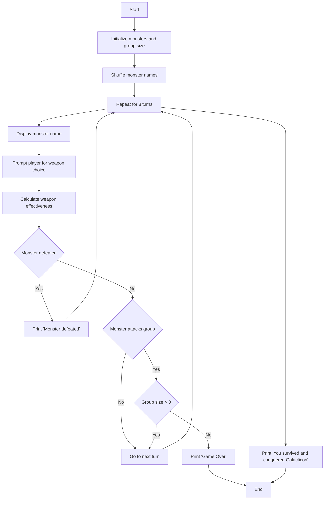
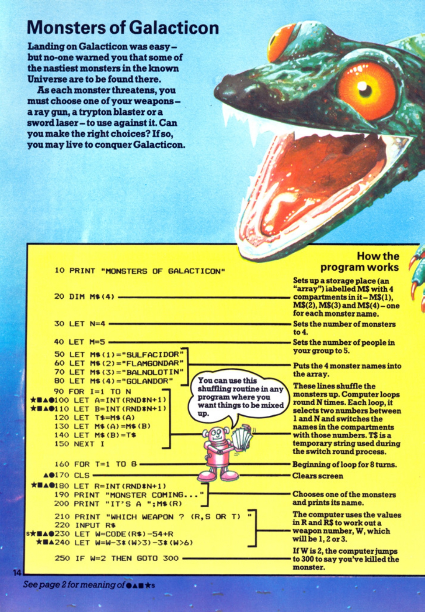
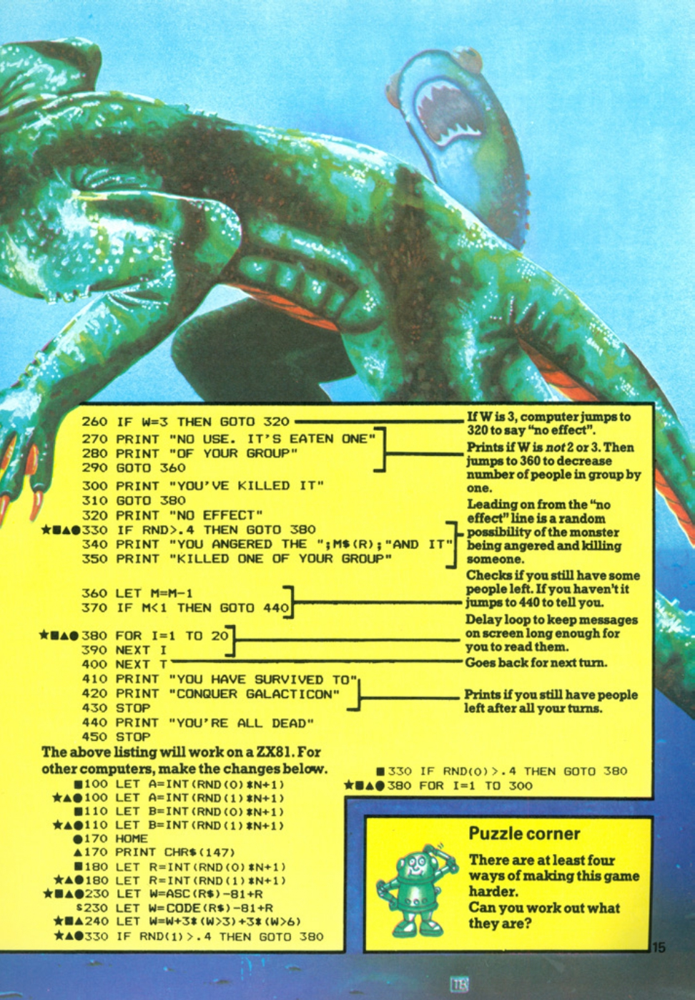

# Monsters of Galacticon

**Book**: _Computer Spacegames_  
**Author**: Usborne Publishing

## Story

Landing on Galacticon was easy, but no one warned you that some of the nastiest monsters in the known Universe are to be found there.

As each monster threatens, you must choose one of your weapons – a ray gun, a trypton blaster, or a sword laser – to use against it. Can you make the right choices? If so, you may live to conquer Galacticon.

## Pseudocode

```plaintext
START
   INITIALIZE monsters, group size
   SHUFFLE monster names
   FOR 8 TURNS
      DISPLAY monster name
      PROMPT player for weapon choice
      CALCULATE weapon effectiveness
      IF monster defeated THEN
         PRINT 'Monster defeated'
      ELSE
         CHECK if monster attacks group
         IF group size <= 0 THEN
            PRINT 'Game Over'
            END GAME
         END IF
      END IF
   END TURN
   PRINT 'You survived and conquered Galacticon'
END
```

## Flowchart



## Code

<details>
<summary>Pages</summary>

  


</details>

<details>
<summary>ZX-81</summary>

```basic
10 PRINT "MONSTERS OF GALACTICON"
20 DIM M$(4)
30 LET N=4
40 LET M=5
50 LET M$(1)="SULFAMICOR"
60 LET M$(2)="FLAMGONDAR"
70 LET M$(3)="BALNOLOTIN"
80 LET M$(4)="GOLANDER"
90 FOR I=1 TO N
100 LET A=INT(RND*N+1)
110 LET B=INT(RND*N+1)
120 LET T$=M$(A)
130 LET M$(A)=M$(B)
140 LET M$(B)=T$
150 NEXT I
160 FOR T=1 TO 8
170 CLS
180 LET R=INT(RND*N+1)
190 PRINT "MONSTER COMING..."
200 PRINT "IT'S A ";M$(R)
210 PRINT "WHICH WEAPON? (R,S OR T) "
220 INPUT W$
230 LET W=CODE(W$)-54+R
240 LET W=W-3*(W>3)-3*(W<6)
250 IF W=2 THEN GOTO 300
260 IF W=3 THEN GOTO 320
270 PRINT "NO USE IT'S EATEN ONE"
280 PRINT "OF YOUR GROUP"
290 GOTO 360
300 PRINT "YOU'VE KILLED IT"
310 GOTO 380
320 PRINT "NO EFFECT"
330 IF RND()>.4 THEN GOTO 380
340 PRINT "YOU ANGERED THE ";M$(R);" AND IT KILLED ONE OF YOUR GROUP"
350 GOTO 360
360 LET M=M-1
370 IF M<1 THEN GOTO 440
380 FOR I=1 TO 20
390 NEXT I
400 GOTO 160
410 PRINT "YOU HAVE SURVIVED TO"
420 PRINT "CONQUER GALACTICON"
430 STOP
440 PRINT "YOU'RE ALL DEAD"
450 STOP
```

</details>

<details>
<summary>C#</summary>

```csharp
using System;

class MonstersOfGalacticon
{
    static void Main()
    {
        string[] monsters = { "Sulfamicor", "Flamgondar", "Balnolotin", "Golander" };
        int groupSize = 5;
        Random rnd = new Random();

        // Shuffle monsters
        for (int i = 0; i < monsters.Length; i++)
        {
            int swapIndex = rnd.Next(monsters.Length);
            string temp = monsters[i];
            monsters[i] = monsters[swapIndex];
            monsters[swapIndex] = temp;
        }

        Console.WriteLine("MONSTERS OF GALACTICON");

        for (int turn = 1; turn <= 8; turn++)
        {
            Console.Clear();
            int monsterIndex = rnd.Next(monsters.Length);
            Console.WriteLine($"MONSTER COMING... IT'S A {monsters[monsterIndex]}");
            Console.Write("WHICH WEAPON? (R,S OR T): ");
            char weapon = Console.ReadKey().KeyChar;
            Console.WriteLine();

            int weaponEffectiveness = (weapon - 'R') + monsterIndex + 1;
            weaponEffectiveness -= (weaponEffectiveness > 3) ? 3 : 0;

            if (weaponEffectiveness == 2)
            {
                Console.WriteLine("YOU'VE KILLED IT");
            }
            else
            {
                Console.WriteLine("NO EFFECT");
                if (rnd.NextDouble() > 0.4)
                {
                    Console.WriteLine($"YOU ANGERED THE {monsters[monsterIndex]} AND IT KILLED ONE OF YOUR GROUP");
                    groupSize--;
                }

                if (groupSize <= 0)
                {
                    Console.WriteLine("YOU'RE ALL DEAD");
                    return;
                }
            }

            System.Threading.Thread.Sleep(1000); // Delay for message
        }

        Console.WriteLine("YOU HAVE SURVIVED TO CONQUER GALACTICON");
    }
}
```

</details>

<details>
<summary>Python</summary>

```python
import random

def main():
    monsters = ["Sulfamicor", "Flamgondar", "Balnolotin", "Golander"]
    group_size = 5
    random.shuffle(monsters)

    print("MONSTERS OF GALACTICON")

    for turn in range(8):
        print("\nMONSTER COMING...")
        monster = random.choice(monsters)
        print(f"IT'S A {monster}")
        weapon = input("WHICH WEAPON? (R,S OR T): ").upper()

        weapon_effectiveness = ord(weapon) - ord('R') + monsters.index(monster) + 1
        weapon_effectiveness -= 3 if weapon_effectiveness > 3 else 0

        if weapon_effectiveness == 2:
            print("YOU'VE KILLED IT")
        else:
            print("NO EFFECT")
            if random.random() > 0.4:
                print(f"YOU ANGERED THE {monster} AND IT KILLED ONE OF YOUR GROUP")
                group_size -= 1

                if group_size <= 0:
                    print("YOU'RE ALL DEAD")
                    return

        input("Press Enter to continue...")

    print("YOU HAVE SURVIVED TO CONQUER GALACTICON")

if __name__ == "__main__":
    main()
```

</details>

<details>
<summary>Java</summary>

```java
import java.util.*;

public class MonstersOfGalacticon {
    public static void main(String[] args) {
        String[] monsters = {"Sulfamicor", "Flamgondar", "Balnolotin", "Golander"};
        int groupSize = 5;
        List<String> monsterList = Arrays.asList(monsters);
        Collections.shuffle(monsterList);

        Scanner scanner = new Scanner(System.in);
        System.out.println("MONSTERS OF GALACTICON");

        for (int turn = 0; turn < 8; turn++) {
            System.out.println("\nMONSTER COMING...");
            String monster = monsterList.get(new Random().nextInt(monsters.length));
            System.out.println("IT'S A " + monster);
            System.out.print("WHICH WEAPON? (R,S OR T): ");
            char weapon = scanner.next().toUpperCase().charAt(0);

            int weaponEffectiveness = (weapon - 'R') + monsterList.indexOf(monster) + 1;
            weaponEffectiveness -= (weaponEffectiveness > 3) ? 3 : 0;

            if (weaponEffectiveness == 2) {
                System.out.println("YOU'VE KILLED IT");
            } else {
                System.out.println("NO EFFECT");
                if (new Random().nextDouble() > 0.4) {
                    System.out.println("YOU ANGERED THE " + monster + " AND IT KILLED ONE OF YOUR GROUP");
                    groupSize--;
                }

                if (groupSize <= 0) {
                    System.out.println("YOU'RE ALL DEAD");
                    return;
                }
            }
        }

        System.out.println("YOU HAVE SURVIVED TO CONQUER GALACTICON");
    }
}
```

</details>

<details>
<summary>GoLang</summary>

```go
package main

import (
	"fmt"
	"math/rand"
	"time"
)

func main() {
	rand.Seed(time.Now().UnixNano())
	monsters := []string{"Sulfamicor", "Flamgondar", "Balnolotin", "Golander"}
	groupSize := 5

	fmt.Println("MONSTERS OF GALACTICON")

	for turn := 1; turn <= 8; turn++ {
		fmt.Println("\nMONSTER COMING...")
		monster := monsters[rand.Intn(len(monsters))]
		fmt.Printf("IT'S A %s\n", monster)
		fmt.Print("WHICH WEAPON? (R,S OR T): ")
		var weapon string
		fmt.Scan(&weapon)

		weaponEffectiveness := int(weapon[0]) - 'R' + 1 + rand.Intn(len(monsters))
		if weaponEffectiveness > 3 {
			weaponEffectiveness -= 3
		}

		if weaponEffectiveness == 2 {
			fmt.Println("YOU'VE KILLED IT")
		} else {
			fmt.Println("NO EFFECT")
			if rand.Float64() > 0.4 {
				fmt.Printf("YOU ANGERED THE %s AND IT KILLED ONE OF YOUR GROUP\n", monster)
				groupSize--
			}

			if groupSize <= 0 {
				fmt.Println("YOU'RE ALL DEAD")
				return
			}
		}
	}

	fmt.Println("YOU HAVE SURVIVED TO CONQUER GALACTICON")
}
```

</details>

<details>
<summary>C++</summary>

```cpp
#include <iostream>
#include <vector>
#include <algorithm>
#include <cstdlib>
#include <ctime>

using namespace std;

int main() {
    srand(time(0));
    vector<string> monsters = {"Sulfamicor", "Flamgondar", "Balnolotin", "Golander"};
    int groupSize = 5;

    cout << "MONSTERS OF GALACTICON" << endl;

    for (int turn = 1; turn <= 8; turn++) {
        cout << "\nMONSTER COMING..." << endl;
        string monster = monsters[rand() % monsters.size()];
        cout << "IT'S A " << monster << endl;
        cout << "WHICH WEAPON? (R,S OR T): ";
        char weapon;
        cin >> weapon;

        int weaponEffectiveness = (weapon - 'R') + 1 + (rand() % monsters.size());
        if (weaponEffectiveness > 3) {
            weaponEffectiveness -= 3;
        }

        if (weaponEffectiveness == 2) {
            cout << "YOU'VE KILLED IT" << endl;
        } else {
            cout << "NO EFFECT" << endl;
            if ((rand() % 10) / 10.0 > 0.4) {
                cout << "YOU ANGERED THE " << monster << " AND IT KILLED ONE OF YOUR GROUP" << endl;
                groupSize--;
            }

            if (groupSize <= 0) {
                cout << "YOU'RE ALL DEAD" << endl;
                return 0;
            }
        }
    }

    cout << "YOU HAVE SURVIVED TO CONQUER GALACTICON" << endl;
    return 0;
}
```

</details>

<details>
<summary>Rust</summary>

```rust
use std::io;
use rand::seq::SliceRandom;
use rand::Rng;

fn main() {
    let mut monsters = vec!["Sulfamicor", "Flamgondar", "Balnolotin", "Golander"];
    let mut group_size = 5;
    let mut rng = rand::thread_rng();

    println!("MONSTERS OF GALACTICON");

    for _ in 0..8 {
        println!("\nMONSTER COMING...");
        let monster = monsters.choose(&mut rng).unwrap();
        println!("IT'S A {}", monster);

        println!("WHICH WEAPON? (R,S OR T): ");
        let mut weapon = String::new();
        io::stdin().read_line(&mut weapon).unwrap();
        let weapon = weapon.trim().chars().next().unwrap_or('R');

        let weapon_effectiveness = (weapon as u8 - b'R') + rng.gen_range(1..=4);
        let adjusted_effectiveness = if weapon_effectiveness > 3 {
            weapon_effectiveness - 3
        } else {
            weapon_effectiveness
        };

        if adjusted_effectiveness == 2 {
            println!("YOU'VE KILLED IT");
        } else {
            println!("NO EFFECT");
            if rng.gen_bool(0.6) {
                println!("YOU ANGERED THE {} AND IT KILLED ONE OF YOUR GROUP", monster);
                group_size -= 1;
            }

            if group_size <= 0 {
                println!("YOU'RE ALL DEAD");
                return;
            }
        }
    }

    println!("YOU HAVE SURVIVED TO CONQUER GALACTICON");
}
```

</details>

## Explanation

In Monsters of Galacticon, the player must strategically choose weapons to defeat randomly selected monsters. Each choice is evaluated for effectiveness, and the game continues for 8 turns. The player wins if their group survives all turns.

## Challenges

1. **Weapon Effectiveness**: Adjust the effectiveness calculation for more variability.
2. **Group Size**: Start with fewer group members for increased difficulty.
3. **More Monsters**: Add more monsters to the array to increase variety.

## Copyright

These programs are adaptations of the original Usborne Computer Guides published in the 1980s. The books are free to download for personal or educational use from [Usborne's Computer and Coding Books](https://usborne.com/row/books/computer-and-coding-books). Programs and adaptations may not be used for commercial purposes.

Return to [Computer Spacegames](./readme.md).
