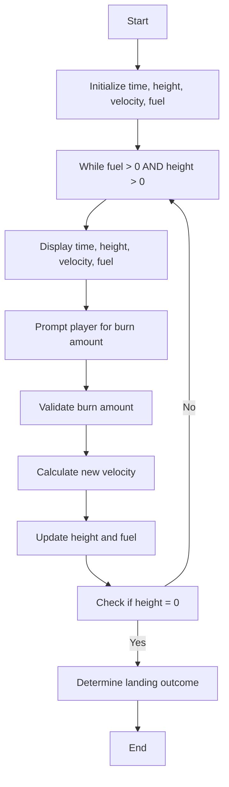
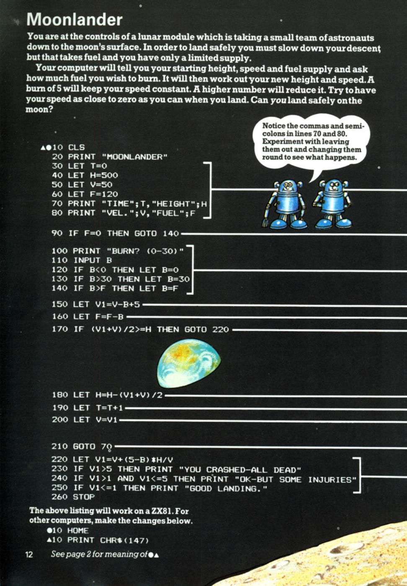
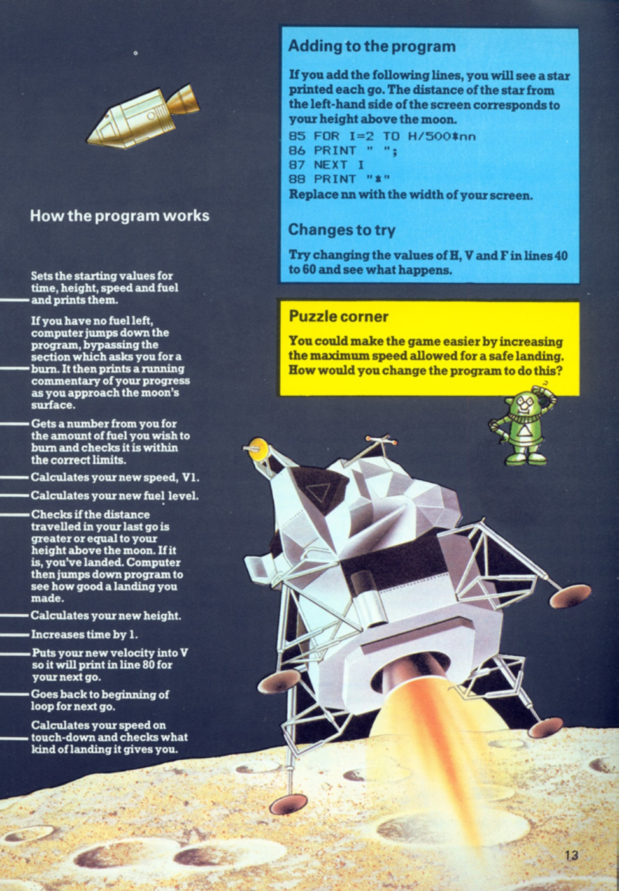

# Moonlander

**Book**: _Computer Spacegames_  
**Author**: Usborne Publishing

## Story

You are at the controls of a lunar module that is taking a small team of astronauts down to the moon's surface. In order to land safely, you must slow down your descent, but that takes fuel, and you have only a limited supply. 

Your computer will tell you your starting height, speed, and fuel supply and ask how much fuel you wish to burn. It will then calculate your new height and speed. A burn of 5 will keep your speed constant, while a higher number will reduce it. Try to have your speed as close to zero as you can when you land. Can you land safely on the moon?

## Pseudocode

```plaintext
START
   INITIALIZE time, height, velocity, fuel
   WHILE fuel > 0 AND height > 0
      DISPLAY time, height, velocity, fuel
      PROMPT player for burn amount
      VALIDATE burn amount
      CALCULATE new velocity
      UPDATE height and fuel
      CHECK if height is zero
         IF TRUE THEN DETERMINE landing outcome
   END WHILE
   PRINT landing result
END
```

## Flowchart



## Code

<details>
<summary>Pages</summary>

  


</details>

<details>
<summary>ZX-81</summary>

```basic
10 CLS
20 PRINT "MOONLANDER"
30 LET T=0
40 LET H=500
50 LET V=120
60 LET F=120
70 PRINT "TIME";T,"HEIGHT";H
80 PRINT "VEL.";V,"FUEL";F
90 IF F=0 THEN GOTO 140
100 PRINT "BURN? (0-30)"
110 INPUT B
120 IF B<0 THEN LET B=0
130 IF B>30 THEN LET B=30
140 IF B>F THEN LET B=F
150 LET V1=V+(5-B)
160 LET F=F-B
170 IF (V1+V)/2>=H THEN GOTO 220
180 LET H=H-(V1+V)/2
190 LET T=T+1
200 LET V=V1
210 GOTO 70
220 LET V1=V+(5-B)
230 IF V1>5 THEN PRINT "YOU CRASHED-ALL DEAD"
240 IF V1>1 AND V1<=5 THEN PRINT "OK-BUT SOME INJURIES"
250 IF V1<=1 THEN PRINT "GOOD LANDING."
260 STOP
```

</details>

<details>
<summary>C#</summary>

```csharp
using System;

class Moonlander
{
    static void Main()
    {
        int time = 0, height = 500, velocity = 120, fuel = 120;
        Console.WriteLine("MOONLANDER");

        while (fuel > 0 && height > 0)
        {
            Console.WriteLine($"TIME: {time} HEIGHT: {height} VEL.: {velocity} FUEL: {fuel}");
            Console.Write("BURN? (0-30): ");
            int burn = int.Parse(Console.ReadLine());

            if (burn < 0) burn = 0;
            if (burn > 30) burn = 30;
            if (burn > fuel) burn = fuel;

            int newVelocity = velocity + (5 - burn);
            fuel -= burn;

            if ((velocity + newVelocity) / 2 >= height)
            {
                if (newVelocity > 5)
                    Console.WriteLine("YOU CRASHED-ALL DEAD");
                else if (newVelocity > 1)
                    Console.WriteLine("OK-BUT SOME INJURIES");
                else
                    Console.WriteLine("GOOD LANDING.");
                return;
            }

            height -= (velocity + newVelocity) / 2;
            velocity = newVelocity;
            time++;
        }

        Console.WriteLine("OUT OF FUEL. CRASH!");
    }
}
```

</details>

<details>
<summary>Python</summary>

```python
def main():
    time, height, velocity, fuel = 0, 500, 120, 120
    print("MOONLANDER")

    while fuel > 0 and height > 0:
        print(f"TIME: {time} HEIGHT: {height} VEL.: {velocity} FUEL: {fuel}")
        burn = int(input("BURN? (0-30): "))

        burn = max(0, min(30, burn))
        if burn > fuel:
            burn = fuel

        new_velocity = velocity + (5 - burn)
        fuel -= burn

        if (velocity + new_velocity) / 2 >= height:
            if new_velocity > 5:
                print("YOU CRASHED-ALL DEAD")
            elif new_velocity > 1:
                print("OK-BUT SOME INJURIES")
            else:
                print("GOOD LANDING.")
            return

        height -= (velocity + new_velocity) / 2
        velocity = new_velocity
        time += 1

    print("OUT OF FUEL. CRASH!")

if __name__ == "__main__":
    main()
```

</details>

<details>
<summary>Java</summary>

```java
import java.util.Scanner;

public class Moonlander {
    public static void main(String[] args) {
        Scanner scanner = new Scanner(System.in);
        int time = 0, height = 500, velocity = 120, fuel = 120;
        System.out.println("MOONLANDER");

        while (fuel > 0 && height > 0) {
            System.out.printf("TIME: %d HEIGHT: %d VEL.: %d FUEL: %d\n", time, height, velocity, fuel);
            System.out.print("BURN? (0-30): ");
            int burn = scanner.nextInt();

            burn = Math.max(0, Math.min(30, burn));
            if (burn > fuel) burn = fuel;

            int newVelocity = velocity + (5 - burn);
            fuel -= burn;

            if ((velocity + newVelocity) / 2 >= height) {
                if (newVelocity > 5)
                    System.out.println("YOU CRASHED-ALL DEAD");
                else if (newVelocity > 1)
                    System.out.println("OK-BUT SOME INJURIES");
                else
                    System.out.println("GOOD LANDING.");
                return;
            }

            height -= (velocity + newVelocity) / 2;
            velocity = newVelocity;
            time++;
        }

        System.out.println("OUT OF FUEL. CRASH!");
    }
}
```

</details>

<details>
<summary>GoLang</summary>

```go
package main

import (
	"fmt"
	"math"
)

func main() {
	time, height, velocity, fuel := 0, 500, 120, 120
	fmt.Println("MOONLANDER")

	for fuel > 0 && height > 0 {
		fmt.Printf("TIME: %d HEIGHT: %d VEL.: %d FUEL: %d\n", time, height, velocity, fuel)
		var burn int
		fmt.Print("BURN? (0-30): ")
		fmt.Scan(&burn)

		burn = int(math.Max(0, math.Min(30, float64(burn))))
		if burn > fuel {
			burn = fuel
		}

		newVelocity := velocity + (5 - burn)
		fuel -= burn

		if (velocity+newVelocity)/2 >= height {
			if newVelocity > 5 {
				fmt.Println("YOU CRASHED-ALL DEAD")
			} else if newVelocity > 1 {
				fmt.Println("OK-BUT SOME INJURIES")
			} else {
				fmt.Println("GOOD LANDING.")
			}
			return
		}

		height -= (velocity + newVelocity) / 2
		velocity = newVelocity
		time++
	}

	fmt.Println("OUT OF FUEL. CRASH!")
}
```

</details>

<details>
<summary>C++</summary>

```cpp
#include <iostream>
#include <algorithm>

using namespace std;

int main() {
    int time = 0, height = 500, velocity = 120, fuel = 120;
    cout << "MOONLANDER" << endl;

    while (fuel > 0 && height > 0) {
        cout << "TIME: " << time << " HEIGHT: " << height << " VEL.: " << velocity << " FUEL: " << fuel << endl;
        int burn;
        cout << "BURN? (0-30): ";
        cin >> burn;

        burn = max(0, min(30, burn));
        if (burn > fuel) burn = fuel;

        int newVelocity = velocity + (5 - burn);
        fuel -= burn;

        if ((velocity + newVelocity) / 2 >= height) {
            if (newVelocity > 5)
                cout << "YOU CRASHED-ALL DEAD" << endl;
            else if (newVelocity > 1)
                cout << "OK-BUT SOME INJURIES" << endl;
            else
                cout << "GOOD LANDING." << endl;
            return 0;
        }

        height -= (velocity + newVelocity) / 2;
        velocity = newVelocity;
        time++;
    }

    cout << "OUT OF FUEL. CRASH!" << endl;
    return 0;
}
```

</details>

<details>
<summary>Rust</summary>

```rust
use std::io;

fn main() {
    let mut time = 0;
    let mut height = 500;
    let mut velocity = 120;
    let mut fuel = 120;

    println!("MOONLANDER");

    while fuel > 0 && height > 0 {
        println!("TIME: {} HEIGHT: {} VEL.: {} FUEL: {}", time, height, velocity, fuel);
        println!("BURN? (0-30): ");

        let mut input = String::new();
        io::stdin().read_line(&mut input).unwrap();
        let burn: i32 = input.trim().parse().unwrap_or(0);

        let burn = burn.clamp(0, 30);
        let burn = burn.min(fuel);

        let new_velocity = velocity + (5 - burn);
        fuel -= burn;

        if (velocity + new_velocity) / 2 >= height {
            if new_velocity > 5 {
                println!("YOU CRASHED-ALL DEAD");
            } else if new_velocity > 1 {
                println!("OK-BUT SOME INJURIES");
            } else {
                println!("GOOD LANDING.");
            }
            return;
        }

        height -= (velocity + new_velocity) / 2;
        velocity = new_velocity;
        time += 1;
    }

    println!("OUT OF FUEL. CRASH!");
}
```

</details>

## Explanation

In Moonlander, the player must control the descent of a lunar module by managing its fuel and velocity. Each turn, the player specifies how much fuel to burn, which impacts the velocity and the descent. The goal is to land with a velocity close to zero. If the velocity is too high, the module will crash.

## Challenges

1. **Fuel Limit**: Experiment with reducing or increasing the initial fuel supply to adjust difficulty.
2. **Velocity Tolerance**: Change the thresholds for a safe landing.
3. **Height Variation**: Start from a different initial height to make the game easier or harder.

## Copyright

These programs are adaptations of the original Usborne Computer Guides published in the 1980s. The books are free to download for personal or educational use from [Usborne's Computer and Coding Books](https://usborne.com/row/books/computer-and-coding-books). Programs and adaptations may not be used for commercial purposes.

Return to [Computer Spacegames](./readme.md).

