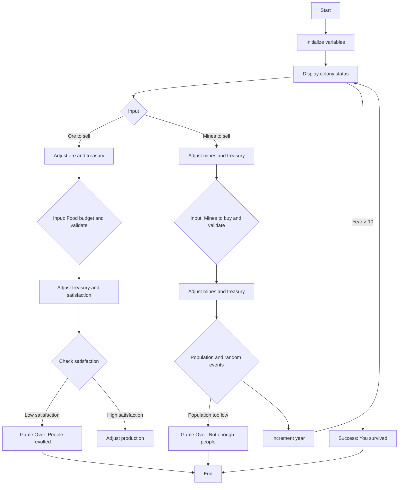
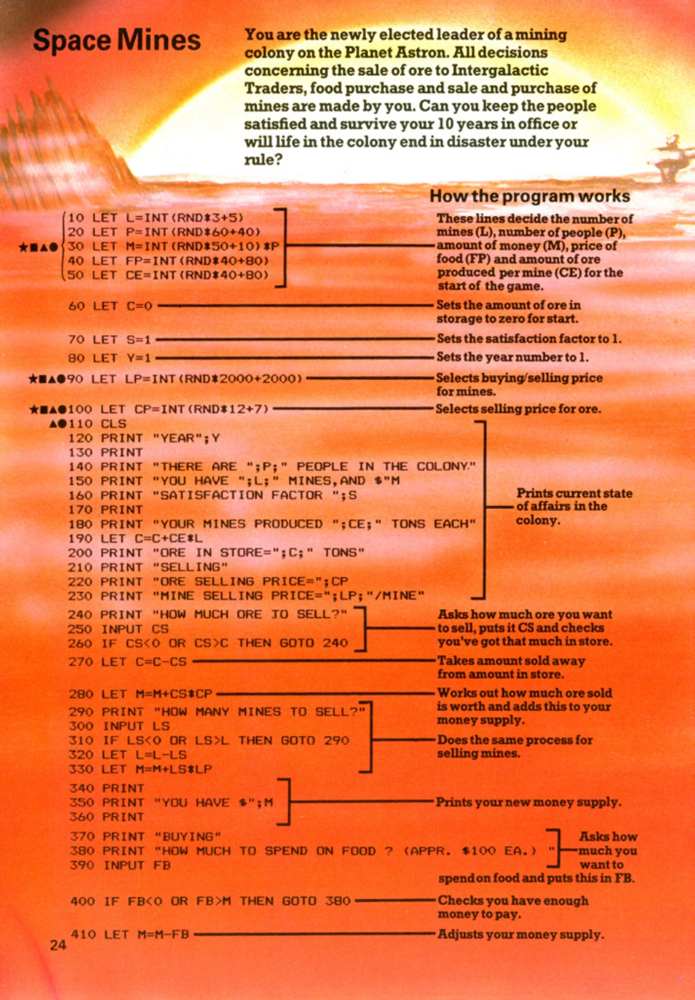
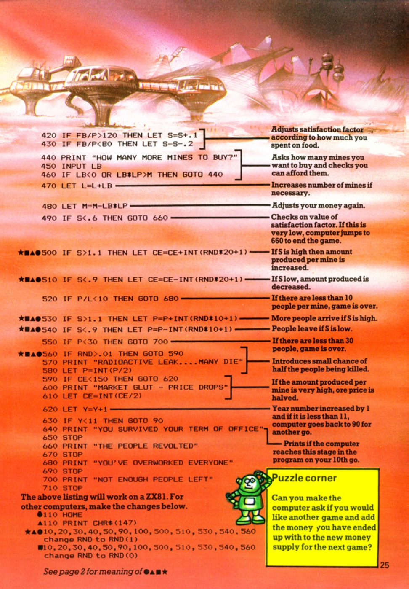

# Space Mines

**Book**: _Computer Spacegames_  
**Author**: Usborne Publishing

## Story

You are the newly elected leader of a mining colony on the planet Astron. All decisions concerning the sale of ore to Intergalactic Traders, food purchase, and the sale or purchase of mines are made by you. Can you keep the people satisfied and survive your 10 years in office, or will life in the colony end in disaster under your rule?

## Pseudocode

```plaintext
START
Initialize variables: mines, population, treasury, food price, ore production, stored ore, satisfaction, year counter

WHILE year is within 10 years
    Display current colony status (people, mines, money, satisfaction)
    Calculate yearly ore production and update storage
    Display selling prices for ore and mines

    Ask player to input amount of ore to sell
    Validate and adjust ore storage and treasury

    Ask player to input number of mines to sell
    Validate and adjust mines and treasury

    Ask player to input food budget
    Validate and adjust treasury and satisfaction

    Ask player to input number of mines to buy
    Validate and adjust mines and treasury

    Check satisfaction levels and adjust production
    Handle random population events and disasters

    Increment year
END WHILE

Display success or failure message
END
```

## Flowchart



## Code

<details>
<summary>Pages</summary>

  


</details>

<details>
<summary>ZX-81</summary>

```basic
10 LET L=INT(RND*3+5)
20 LET P=INT(RND*40+40)
30 LET M=INT(RND*50+10)
40 LET F=INT(RND*40+80)
50 LET CE=INT(RND*40+80)
60 LET C=0
70 LET S=1
80 LET Y=1
90 LET LP=INT(RND*2000+2000)
100 CLS
110 PRINT "YEAR";Y
120 PRINT "THERE ARE ";P;" PEOPLE IN THE COLONY."
130 PRINT "YOU HAVE ";M;" MINES, AND ";$M
140 PRINT "SATISFACTION FACTOR ";S
150 PRINT
160 PRINT "YOUR MINES PRODUCED ";CE;" TONS EACH"
170 LET C=C+CE*L
180 PRINT "ORE IN STORE=";C;" TONS"
190 PRINT "SELLING"
200 PRINT "ORE SELLING PRICE=";CP
210 PRINT "MINE SELLING PRICE=";LP;"/MINE"
220 PRINT "HOW MUCH ORE TO SELL?"
230 INPUT CS
240 IF CS>C THEN GOTO 240
250 LET C=C-CS
260 LET M=M+CS\LP
270 PRINT "HOW MANY MINES TO SELL?"
280 INPUT LS
290 IF LS>M OR LS<L THEN GOTO 290
300 LET L=L-LS
310 LET M=M-LS
320 LET L=L$LP
330 PRINT "YOU HAVE ";M
340 PRINT
350 PRINT "BUYING"
360 PRINT "HOW MUCH TO SPEND ON FOOD ? (APPR. 100 EA.)"
370 INPUT FB
380 IF FB<0 OR FB>M THEN GOTO 380
400 LET M=M-FB
410 IF FB/P>120 THEN LET S=S+.1
420 IF FB/P<80 THEN LET S=S-.2
430 PRINT "HOW MANY MORE MINES TO BUY?"
440 INPUT LB
450 IF LB<0 OR LB\LP>M THEN GOTO 440
460 LET L=L+LB
470 LET M=M-LB\LP
480 IF S<.6 THEN GOTO 660
500 IF S>1.1 THEN LET CE=CE+INT(RND*20+1)
510 IF S<.9 THEN LET CE=CE-INT(RND*20+1)
520 IF P<10 THEN GOTO 680
530 IF S>1.1 THEN LET P=P+INT(RND*10+1)
540 IF S<.9 THEN LET P=P-INT(RND*10+1)
550 IF P>30 THEN GOTO 700
560 IF RND>.01 THEN GOTO 590
570 PRINT "RADIOACTIVE LEAK... MANY DIE"
580 LET P=INT(P/2)
590 IF CE>50 THEN GOTO 620
600 PRINT "MARKET GLUT - PRICE DROPS"
610 LET CE=INT(CE/2)
620 LET Y=Y+1
630 IF Y<11 THEN GOTO 90
640 PRINT "YOU SURVIVED YOUR TERM OF OFFICE"
650 STOP
660 PRINT "THE PEOPLE REVOLTED"
670 STOP
680 PRINT "YOU'VE OVERWORKED EVERYONE"
690 STOP
700 PRINT "NOT ENOUGH PEOPLE LEFT"
710 STOP
```

</details>

<details>
<summary>C#</summary>

```csharp
using System;

class SpaceMines
{
    static void Main()
    {
        Random random = new Random();

        int mines = random.Next(3, 8); // Number of mines
        int people = random.Next(40, 81); // Population
        int money = random.Next(50, 61); // Treasury money
        int foodPrice = random.Next(40, 121); // Food price per unit
        int oreProduction = random.Next(40, 121); // Ore production per mine
        int oreStorage = 0; // Stored ore
        double satisfaction = 1.0; // Satisfaction factor
        int year = 1;

        while (year <= 10)
        {
            Console.Clear();
            Console.WriteLine($"Year {year}");
            Console.WriteLine($"Population: {people}, Mines: {mines}, Money: ${money}");
            Console.WriteLine($"Satisfaction Factor: {satisfaction:F1}");

            // Ore production and storage
            int yearlyOre = oreProduction * mines;
            oreStorage += yearlyOre;
            Console.WriteLine($"Ore Produced: {yearlyOre} tons, Total Ore: {oreStorage} tons");

            // Ore selling
            int orePrice = random.Next(2000, 4001);
            Console.WriteLine($"Ore Selling Price: ${orePrice}");
            int oreToSell;
            do
            {
                Console.Write("How much ore to sell? ");
            } while (!int.TryParse(Console.ReadLine(), out oreToSell) || oreToSell < 0);
            if (oreToSell > oreStorage)
            {
                Console.WriteLine("Not enough ore. Try again.");
                continue;
            }
            oreStorage -= oreToSell;
            money += oreToSell * orePrice;

            // Mine selling
            int minesToSell;
            do
            {
                Console.Write("How many mines to sell? ");
            } while (!int.TryParse(Console.ReadLine(), out minesToSell) || minesToSell < 0);
            if (minesToSell > mines)
            {
                Console.WriteLine("Not enough mines. Try again.");
                continue;
            }
            mines -= minesToSell;
            money += minesToSell * orePrice;

            // Food purchasing
            int foodBudget;
            do
            {
                Console.Write("How much money to spend on food? ");
            } while (!int.TryParse(Console.ReadLine(), out foodBudget) || foodBudget < 0);
            if (foodBudget > money)
            {
                Console.WriteLine("Not enough money. Try again.");
                continue;
            }
            money -= foodBudget;
            satisfaction += (foodBudget / (double)people) > 120 ? 0.1 : -0.2;

            // Mine buying
            int minesToBuy;
            do
            {
                Console.Write("How many mines to buy? ");
            } while (!int.TryParse(Console.ReadLine(), out minesToBuy) || minesToBuy < 0);
            int mineCost = random.Next(2000, 4001);
            if (minesToBuy * mineCost > money)
            {
                Console.WriteLine("Not enough money. Try again.");
                continue;
            }
            mines += minesToBuy;
            money -= minesToBuy * mineCost;

            // Satisfaction check
            if (satisfaction < 0.6)
            {
                Console.WriteLine("The people revolted. Game Over.");
                break;
            }

            // Random events
            if (random.NextDouble() < 0.01)
            {
                Console.WriteLine("Radioactive leak! Half the population died.");
                people /= 2;
            }

            year++;
        }

        if (year > 10)
        {
            Console.WriteLine("You survived your term of office. Congratulations!");
        }
    }
}
```

</details>

<details>
<summary>C# (SOLID OOP)</summary>

```csharp
public class SalesManager
{
    private readonly Random random;

    public SalesManager(Random random)
    {
        this.random = random;
    }

    public void HandleTransaction<T>(
        string itemName,
        Func<int> getCurrentAmount,
        Action<int> updateAmount,
        Func<int> getPricePerUnit,
        Action<int> updateMoney,
        TransactionType type)
    {
        int currentAmount = getCurrentAmount();
        int pricePerUnit = getPricePerUnit();

        string prompt = $"How many {itemName} to {type.ToString().ToLower()}? ";
        string errorMessage = type == TransactionType.Sell
            ? $"Not enough {itemName}. Try again."
            : "Not enough money. Try again.";

        int amount = InputValidator.GetValidInput(
            prompt,
            count => ValidateTransaction(count, currentAmount, pricePerUnit, type),
            errorMessage
        );

        updateAmount(type == TransactionType.Sell ? -amount : amount);
        updateMoney(type == TransactionType.Sell
            ? amount * pricePerUnit
            : -amount * pricePerUnit);
    }

    private bool ValidateTransaction(int amount, int currentAmount, int price, TransactionType type)
    {
        return type == TransactionType.Sell
            ? amount <= currentAmount
            : amount * price <= currentAmount;
    }
}

public enum TransactionType
{
    Buy,
    Sell
}

// Användning i MineManager:
public class MineManager
{
    private readonly SalesManager salesManager;

    public MineManager(Random random)
    {
        this.salesManager = new SalesManager(random);
    }

    public void ManageMines(ColonyResources resources)
    {
        // Sälja gruvor
        salesManager.HandleTransaction<int>(
            "mines",
            () => resources.Mines,
            amount => resources.Mines += amount,
            () => random.Next(2000, 4001),
            amount => resources.Money += amount,
            TransactionType.Sell
        );

        // Köpa gruvor
        salesManager.HandleTransaction<int>(
            "mines",
            () => resources.Money,
            amount => resources.Money += amount,
            () => random.Next(2000, 4001),
            amount => resources.Money += amount,
            TransactionType.Buy
        );
    }
}
```

</details>

<details>
<summary>Python</summary>

```python
import random

def main():
    # Initialize variables
    mines = random.randint(3, 7)
    population = random.randint(40, 80)
    money = random.randint(50, 60)
    ore_storage = 0
    satisfaction = 1.0
    year = 1

    while year <= 10:
        print(f"\nYear {year}")
        print(f"Population: {population}, Mines: {mines}, Money: ${money}")
        print(f"Satisfaction Factor: {satisfaction:.1f}")

        # Ore production
        ore_production = random.randint(40, 120) * mines
        ore_storage += ore_production
        print(f"Ore Produced: {ore_production} tons, Total Ore: {ore_storage} tons")

        # Sell ore
        ore_price = random.randint(2000, 4000)
        print(f"Ore Selling Price: ${ore_price}")
        ore_to_sell = int(input("How much ore to sell? "))
        if ore_to_sell > ore_storage:
            print("Not enough ore. Try again.")
            continue
        ore_storage -= ore_to_sell
        money += ore_to_sell * ore_price

        # Sell mines
        mines_to_sell = int(input("How many mines to sell? "))
        if mines_to_sell > mines:
            print("Not enough mines. Try again.")
            continue
        mines -= mines_to_sell
        money += mines_to_sell * ore_price

        # Buy food
        food_budget = int(input("How much money to spend on food? "))
        if food_budget > money:
            print("Not enough money. Try again.")
            continue
        money -= food_budget
        satisfaction += 0.1 if food_budget / population > 120 else -0.2

        # Buy mines
        mine_cost = random.randint(2000, 4000)
        mines_to_buy = int(input("How many mines to buy? "))
        if mines_to_buy * mine_cost > money:
            print("Not enough money. Try again.")
            continue
        mines += mines_to_buy
        money -= mines_to_buy * mine_cost

        # Check satisfaction
        if satisfaction < 0.6:
            print("The people revolted. Game Over.")
            break

        # Random events
        if random.random() < 0.01:
            print("Radioactive leak! Half the population died.")
            population //= 2

        year += 1

    if year > 10:
        print("You survived your term of office. Congratulations!")

if __name__ == "__main__":
    main()
```

</details>

<details>
<summary>Java</summary>

```java
import java.util.Random;
import java.util.Scanner;

public class Colony {
    static int mines;
    static int population;
    static int money;
    static int oreStorage;
    static double satisfaction;
    static int year;
    static Random random = new Random();
    static Scanner scanner = new Scanner(System.in);

    public static void main(String[] args) {
        initializeGame();
        while (true) {
            displayStatus();
            manageOre();
            manageMines();
            manageFood();
            advanceYear();
        }
    }

    static void initializeGame() {
        mines = random.nextInt(5) + 3;
        population = random.nextInt(41) + 40;
        money = random.nextInt(11) + 50;
        oreStorage = 0;
        satisfaction = 1.0;
        year = 1;
    }

    static void displayStatus() {
        System.out.print("\033[H\033[2J");
        System.out.flush();
        System.out.printf("Year %d%n", year);
        System.out.printf("Population: %d, Mines: %d, Money: $%d%n", population, mines, money);
        System.out.printf("Satisfaction Factor: %.1f%n", satisfaction);
    }

    static void manageOre() {
        int oreProduction = random.nextInt(81) + 40 * mines;
        oreStorage += oreProduction;
        System.out.printf("Ore Produced: %d tons, Total Ore: %d tons%n", oreProduction, oreStorage);
        int orePrice = random.nextInt(2001) + 2000;
        System.out.printf("Ore Selling Price: $%d%n", orePrice);

        try {
            System.out.print("How much ore to sell? ");
            int oreToSell = Integer.parseInt(scanner.nextLine());
            if (oreToSell > oreStorage) {
                System.out.println("Not enough ore. Try again.");
                return;
            }
            oreStorage -= oreToSell;
            money += oreToSell * orePrice;
        } catch (NumberFormatException e) {
            System.out.println("Invalid input. Please enter a number.");
        }
    }

    static void manageMines() {
        try {
            System.out.print("How many mines to sell? ");
            int minesToSell = Integer.parseInt(scanner.nextLine());
            if (minesToSell > mines) {
                System.out.println("Not enough mines. Try again.");
                return;
            }
            mines -= minesToSell;
            money += minesToSell * (random.nextInt(2001) + 2000);

            System.out.print("How many mines to buy? ");
            int minesToBuy = Integer.parseInt(scanner.nextLine());
            int mineCost = random.nextInt(2001) + 2000;
            if (minesToBuy * mineCost > money) {
                System.out.println("Not enough money. Try again.");
                return;
            }
            mines += minesToBuy;
            money -= minesToBuy * mineCost;
        } catch (NumberFormatException e) {
            System.out.println("Invalid input. Please enter a number.");
        }
    }

    static void manageFood() {
        try {
            System.out.print("How much money to spend on food? ");
            int foodBudget = Integer.parseInt(scanner.nextLine());
            if (foodBudget > money) {
                System.out.println("Not enough money. Try again.");
                return;
            }
            money -= foodBudget;
            satisfaction += (foodBudget / (double)population) > 120 ? 0.1 : -0.2;
        } catch (NumberFormatException e) {
            System.out.println("Invalid input. Please enter a number.");
        }
    }

    static void advanceYear() {
        if (satisfaction < 0.6) {
            System.out.println("The people revolted. Game Over.");
            System.exit(0);
        }
        if (random.nextDouble() < 0.01) {
            System.out.println("Radioactive leak! Half the population died.");
            population /= 2;
        }
        year++;
        if (year > 10) {
            System.out.println("You survived your term of office. Congratulations!");
            System.exit(0);
        }
    }
}
```

</details>

<details>
<summary>Java (SOLID OOP)</summary>

```java
import java.util.Random;
import java.util.Scanner;

public class ColonyGame {
    private final Colony colony;
    private final GameUI ui;
    private final MarketManager marketManager;
    private final Random random;

    public ColonyGame() {
        this.random = new Random();
        this.ui = new ConsoleUI();
        this.colony = new Colony();
        this.marketManager = new MarketManager(random);
    }

    public void run() {
        initializeGame();
        while (true) {
            ui.displayStatus(colony);
            handleTurn();
            if (!advanceYear()) break;
        }
    }

    private void initializeGame() {
        colony.setMines(random.nextInt(5) + 3)
             .setPopulation(random.nextInt(41) + 40)
             .setMoney(random.nextInt(11) + 50)
             .setOreStorage(0)
             .setSatisfaction(1.0)
             .setYear(1);
    }

    private void handleTurn() {
        handleResourceManagement();
        handleTrading();
        handleFoodDistribution();
    }

    private void handleResourceManagement() {
        int production = colony.produceOre(random);
        ui.displayProduction(production, colony.getOreStorage());
    }

    private void handleTrading() {
        Trade<Ore> oreTrade = new Trade<>(new Ore(colony.getOreStorage()), marketManager.getOrePrice());
        Trade<Mine> mineTrade = new Trade<>(new Mine(colony.getMines()), marketManager.getMinePrice());

        TradeExecutor executor = new TradeExecutor(colony, ui);
        executor.executeTrade(oreTrade, "ore");
        executor.executeTrade(mineTrade, "mine");
    }

    private void handleFoodDistribution() {
        FoodManager foodManager = new FoodManager(colony);
        int budget = ui.getFoodBudget(colony.getMoney());
        foodManager.distributeFoodAndUpdateSatisfaction(budget);
    }

    private boolean advanceYear() {
        if (colony.getSatisfaction() < 0.6) {
            ui.showGameOver("The people revolted.");
            return false;
        }

        if (random.nextDouble() < 0.01) {
            colony.handleDisaster();
            ui.showDisasterMessage();
        }

        colony.incrementYear();

        if (colony.getYear() > 10) {
            ui.showVictoryMessage();
            return false;
        }
        return true;
    }
}

interface Tradeable {
    int getQuantity();
    void setQuantity(int quantity);
    int getValue();
}

class Ore implements Tradeable {
    private int quantity;

    public Ore(int quantity) {
        this.quantity = quantity;
    }

    @Override
    public int getQuantity() { return quantity; }

    @Override
    public void setQuantity(int quantity) { this.quantity = quantity; }

    @Override
    public int getValue() { return quantity; }
}

class Mine implements Tradeable {
    private int quantity;

    public Mine(int quantity) {
        this.quantity = quantity;
    }

    @Override
    public int getQuantity() { return quantity; }

    @Override
    public void setQuantity(int quantity) { this.quantity = quantity; }

    @Override
    public int getValue() { return quantity; }
}

class Trade<T extends Tradeable> {
    private final T commodity;
    private final int price;

    public Trade(T commodity, int price) {
        this.commodity = commodity;
        this.price = price;
    }

    public T getCommodity() { return commodity; }
    public int getPrice() { return price; }
}

class TradeExecutor {
    private final Colony colony;
    private final GameUI ui;

    public TradeExecutor(Colony colony, GameUI ui) {
        this.colony = colony;
        this.ui = ui;
    }

    public <T extends Tradeable> void executeTrade(Trade<T> trade, String commodityName) {
        int sellQuantity = ui.getTradeQuantity("sell", commodityName, trade.getCommodity().getQuantity());
        if (sellQuantity > 0) {
            colony.addMoney(sellQuantity * trade.getPrice());
            trade.getCommodity().setQuantity(trade.getCommodity().getQuantity() - sellQuantity);
        }

        int buyQuantity = ui.getTradeQuantity("buy", commodityName, colony.getMoney() / trade.getPrice());
        if (buyQuantity > 0) {
            colony.spendMoney(buyQuantity * trade.getPrice());
            trade.getCommodity().setQuantity(trade.getCommodity().getQuantity() + buyQuantity);
        }
    }
}

class Colony {
    private int mines;
    private int population;
    private int money;
    private int oreStorage;
    private double satisfaction;
    private int year;

    // Getters and setters with builder pattern
    public Colony setMines(int mines) { this.mines = mines; return this; }
    public Colony setPopulation(int population) { this.population = population; return this; }
    public Colony setMoney(int money) { this.money = money; return this; }
    public Colony setOreStorage(int oreStorage) { this.oreStorage = oreStorage; return this; }
    public Colony setSatisfaction(double satisfaction) { this.satisfaction = satisfaction; return this; }
    public Colony setYear(int year) { this.year = year; return this; }

    // Getters
    public int getMines() { return mines; }
    public int getPopulation() { return population; }
    public int getMoney() { return money; }
    public int getOreStorage() { return oreStorage; }
    public double getSatisfaction() { return satisfaction; }
    public int getYear() { return year; }

    public void addMoney(int amount) { money += amount; }
    public void spendMoney(int amount) { money -= amount; }
    public void incrementYear() { year++; }

    public int produceOre(Random random) {
        int production = random.nextInt(81) + 40 * mines;
        oreStorage += production;
        return production;
    }

    public void handleDisaster() {
        population /= 2;
    }
}

interface GameUI {
    void displayStatus(Colony colony);
    void displayProduction(int production, int storage);
    int getTradeQuantity(String action, String commodity, int maximum);
    int getFoodBudget(int availableMoney);
    void showGameOver(String message);
    void showDisasterMessage();
    void showVictoryMessage();
}

class ConsoleUI implements GameUI {
    private final Scanner scanner;

    public ConsoleUI() {
        this.scanner = new Scanner(System.in);
    }

    @Override
    public void displayStatus(Colony colony) {
        System.out.print("\033[H\033[2J");
        System.out.flush();
        System.out.printf("Year %d%n", colony.getYear());
        System.out.printf("Population: %d, Mines: %d, Money: $%d%n",
            colony.getPopulation(), colony.getMines(), colony.getMoney());
        System.out.printf("Satisfaction Factor: %.1f%n", colony.getSatisfaction());
    }

    @Override
    public void displayProduction(int production, int storage) {
        System.out.printf("Ore Produced: %d tons, Total Ore: %d tons%n", production, storage);
    }

    @Override
    public int getTradeQuantity(String action, String commodity, int maximum) {
        try {
            System.out.printf("How much %s to %s? ", commodity, action);
            int quantity = Integer.parseInt(scanner.nextLine());
            return quantity <= maximum ? quantity : 0;
        } catch (NumberFormatException e) {
            return 0;
        }
    }

    @Override
    public int getFoodBudget(int availableMoney) {
        try {
            System.out.print("How much money to spend on food? ");
            int budget = Integer.parseInt(scanner.nextLine());
            return budget <= availableMoney ? budget : 0;
        } catch (NumberFormatException e) {
            return 0;
        }
    }

    @Override
    public void showGameOver(String message) {
        System.out.println(message + " Game Over.");
    }

    @Override
    public void showDisasterMessage() {
        System.out.println("Radioactive leak! Half the population died.");
    }

    @Override
    public void showVictoryMessage() {
        System.out.println("You survived your term of office. Congratulations!");
    }
}

class MarketManager {
    private final Random random;

    public MarketManager(Random random) {
        this.random = random;
    }

    public int getOrePrice() {
        return random.nextInt(2001) + 2000;
    }

    public int getMinePrice() {
        return random.nextInt(2001) + 2000;
    }
}

class FoodManager {
    private final Colony colony;

    public FoodManager(Colony colony) {
        this.colony = colony;
    }

    public void distributeFoodAndUpdateSatisfaction(int budget) {
        if (budget > 0) {
            colony.spendMoney(budget);
            double satisfactionChange = (budget / (double)colony.getPopulation()) > 120 ? 0.1 : -0.2;
            colony.setSatisfaction(colony.getSatisfaction() + satisfactionChange);
        }
    }
}

```

</details>

<details>
<summary>Go</summary>

```go
package main

import (
	"fmt"
	"math/rand"
	"time"
)

func main() {
	// Initialize variables
	rand.Seed(time.Now().UnixNano())
	mines := rand.Intn(5) + 3         // 3 to 7 mines
	population := rand.Intn(41) + 40 // 40 to 80 people
	money := rand.Intn(11) + 50      // 50 to 60 money
	oreStorage := 0                  // Stored ore
	satisfaction := 1.0              // Satisfaction factor
	year := 1

	for year <= 10 {
		fmt.Printf("\nYear %d\n", year)
		fmt.Printf("Population: %d, Mines: %d, Money: $%d\n", population, mines, money)
		fmt.Printf("Satisfaction Factor: %.1f\n", satisfaction)

		// Ore production
		oreProduction := (rand.Intn(81) + 40) * mines // 40 to 120 ore per mine
		oreStorage += oreProduction
		fmt.Printf("Ore Produced: %d tons, Total Ore: %d tons\n", oreProduction, oreStorage)

		// Sell ore
		orePrice := rand.Intn(2001) + 2000 // 2000 to 4000
		fmt.Printf("Ore Selling Price: $%d\n", orePrice)
		fmt.Print("How much ore to sell? ")
		var oreToSell int
		fmt.Scan(&oreToSell)
		if oreToSell > oreStorage {
			fmt.Println("Not enough ore. Try again.")
			continue
		}
		oreStorage -= oreToSell
		money += oreToSell * orePrice

		// Sell mines
		fmt.Print("How many mines to sell? ")
		var minesToSell int
		fmt.Scan(&minesToSell)
		if minesToSell > mines {
			fmt.Println("Not enough mines. Try again.")
			continue
		}
		mines -= minesToSell
		money += minesToSell * orePrice

		// Buy food
		fmt.Print("How much money to spend on food? ")
		var foodBudget int
		fmt.Scan(&foodBudget)
		if foodBudget > money {
			fmt.Println("Not enough money. Try again.")
			continue
		}
		money -= foodBudget
		if float64(foodBudget)/float64(population) > 120 {
			satisfaction += 0.1
		} else {
			satisfaction -= 0.2
		}

		// Buy mines
		mineCost := rand.Intn(2001) + 2000 // 2000 to 4000
		fmt.Print("How many mines to buy? ")
		var minesToBuy int
		fmt.Scan(&minesToBuy)
		if minesToBuy*mineCost > money {
			fmt.Println("Not enough money. Try again.")
			continue
		}
		mines += minesToBuy
		money -= minesToBuy * mineCost

		// Check satisfaction
		if satisfaction < 0.6 {
			fmt.Println("The people revolted. Game Over.")
			break
		}

		// Random events
		if rand.Float64() < 0.01 {
			fmt.Println("Radioactive leak! Half the population died.")
			population /= 2
		}

		// Increment year
		year++
	}

	if year > 10 {
		fmt.Println("You survived your term of office. Congratulations!")
	}
}
```

</details>

<details>
<summary>C++</summary>

```cpp
#include <iostream>
#include <cstdlib>
#include <ctime>
using namespace std;

int main() {
    srand(time(0));

    // Initialize variables
    int mines = rand() % 5 + 3;        // 3 to 7 mines
    int population = rand() % 41 + 40; // 40 to 80 people
    int money = rand() % 11 + 50;      // 50 to 60 money
    int oreStorage = 0;                // Stored ore
    double satisfaction = 1.0;         // Satisfaction factor
    int year = 1;

    while (year <= 10) {
        cout << "\nYear " << year << endl;
        cout << "Population: " << population << ", Mines: " << mines << ", Money: $" << money << endl;
        cout << "Satisfaction Factor: " << satisfaction << endl;

        // Ore production
        int oreProduction = (rand() % 81 + 40) * mines; // 40 to 120 ore per mine
        oreStorage += oreProduction;
        cout << "Ore Produced: " << oreProduction << " tons, Total Ore: " << oreStorage << " tons" << endl;

        // Sell ore
        int orePrice = rand() % 2001 + 2000; // 2000 to 4000
        cout << "Ore Selling Price: $" << orePrice << endl;
        cout << "How much ore to sell? ";
        int oreToSell;
        cin >> oreToSell;
        if (oreToSell > oreStorage) {
            cout << "Not enough ore. Try again." << endl;
            continue;
        }
        oreStorage -= oreToSell;
        money += oreToSell * orePrice;

        // Sell mines
        cout << "How many mines to sell? ";
        int minesToSell;
        cin >> minesToSell;
        if (minesToSell > mines) {
            cout << "Not enough mines. Try again." << endl;
            continue;
        }
        mines -= minesToSell;
        money += minesToSell * orePrice;

        // Buy food
        cout << "How much money to spend on food? ";
        int foodBudget;
        cin >> foodBudget;
        if (foodBudget > money) {
            cout << "Not enough money. Try again." << endl;
            continue;
        }
        money -= foodBudget;
        satisfaction += (static_cast<double>(foodBudget) / population > 120) ? 0.1 : -0.2;

        // Buy mines
        int mineCost = rand() % 2001 + 2000; // 2000 to 4000
        cout << "How many mines to buy? ";
        int minesToBuy;
        cin >> minesToBuy;
        if (minesToBuy * mineCost > money) {
            cout << "Not enough money. Try again." << endl;
            continue;
        }
        mines += minesToBuy;
        money -= minesToBuy * mineCost;

        // Check satisfaction
        if (satisfaction < 0.6) {
            cout << "The people revolted. Game Over." << endl;
            break;
        }

        // Random events
        if (static_cast<double>(rand()) / RAND_MAX < 0.01) {
            cout << "Radioactive leak! Half the population died." << endl;
            population /= 2;
        }

        // Increment year
        year++;
    }

    if (year > 10) {
        cout << "You survived your term of office. Congratulations!" << endl;
    }

    return 0;
}
```

</details>

<details>
<summary>Rust</summary>

```rust
use rand::Rng;
use std::io;

fn main() {
    // Initialize variables
    let mut rng = rand::thread_rng();
    let mut mines = rng.gen_range(3..=7); // 3 to 7 mines
    let mut population = rng.gen_range(40..=80); // 40 to 80 people
    let mut money = rng.gen_range(50..=60); // 50 to 60 money
    let mut ore_storage = 0; // Stored ore
    let mut satisfaction = 1.0; // Satisfaction factor
    let mut year = 1;

    while year <= 10 {
        println!("\nYear {}", year);
        println!("Population: {}, Mines: {}, Money: ${}", population, mines, money);
        println!("Satisfaction Factor: {:.1}", satisfaction);

        // Ore production
        let ore_production = rng.gen_range(40..=120) * mines;
        ore_storage += ore_production;
        println!(
            "Ore Produced: {} tons, Total Ore: {} tons",
            ore_production, ore_storage
        );

        // Sell ore
        let ore_price = rng.gen_range(2000..=4000);
        println!("Ore Selling Price: ${}", ore_price);
        println!("How much ore to sell?");
        let ore_to_sell = get_input();
        if ore_to_sell > ore_storage {
            println!("Not enough ore. Try again.");
            continue;
        }
        ore_storage -= ore_to_sell;
        money += ore_to_sell * ore_price;

        // Sell mines
        println!("How many mines to sell?");
        let mines_to_sell = get_input();
        if mines_to_sell > mines {
            println!("Not enough mines. Try again.");
            continue;
        }
        mines -= mines_to_sell;
        money += mines_to_sell * ore_price;

        // Buy food
        println!("How much money to spend on food?");
        let food_budget = get_input();
        if food_budget > money {
            println!("Not enough money. Try again.");
            continue;
        }
        money -= food_budget;
        satisfaction += if food_budget as f64 / population as f64 > 120.0 {
            0.1
        } else {
            -0.2
        };

        // Buy mines
        let mine_cost = rng.gen_range(2000..=4000);
        println!("How many mines to buy?");
        let mines_to_buy = get_input();
        if mines_to_buy * mine_cost > money {
            println!("Not enough money. Try again.");
            continue;
        }
        mines += mines_to_buy;
        money -= mines_to_buy * mine_cost;

        // Check satisfaction
        if satisfaction < 0.6 {
            println!("The people revolted. Game Over.");
            break;
        }

        // Random events
        if rng.gen_bool(0.01) {
            println!("Radioactive leak! Half the population died.");
            population /= 2;
        }

        // Increment year
        year += 1;
    }

    if year > 10 {
        println!("You survived your term of office. Congratulations!");
    }
}

// Helper function to get user input
fn get_input() -> i32 {
    let mut input = String::new();
    io::stdin()
        .read_line(&mut input)
        .expect("Failed to read input");
    input.trim().parse::<i32>().expect("Please enter a valid number")
}
```

</details>

## Explanation

This game simulates the management of a mining colony where the player must make strategic decisions about resource management, trade, and the well-being of their citizens. Players input values for selling ore, managing mines, and purchasing food to maintain satisfaction and ensure the colony's survival over 10 years.

## Challenges

1. **Dynamic Pricing**: Introduce fluctuating market prices for ore and food to make planning harder.
2. **Natural Disasters**: Add more random events, such as earthquakes, that can damage mines or reduce population.
3. **Population Growth**: Introduce mechanics where population increases or decreases based on player decisions.

## Copyright

These programs are adaptations of the original Usborne Computer Guides published in the 1980s. The books are free to download for personal or educational use from [Usborne's Computer and Coding Books](https://usborne.com/row/books/computer-and-coding-books). Programs and adaptations may not be used for commercial purposes.

Return to [Computer Spacegames](./readme.md).
