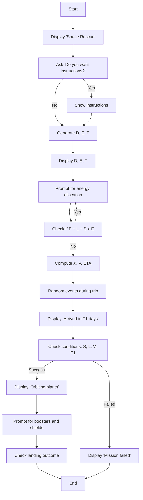
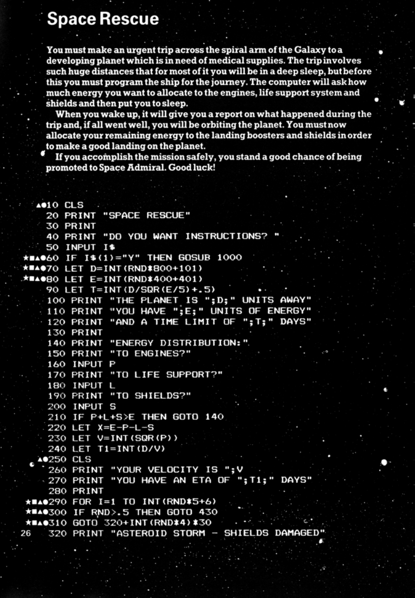
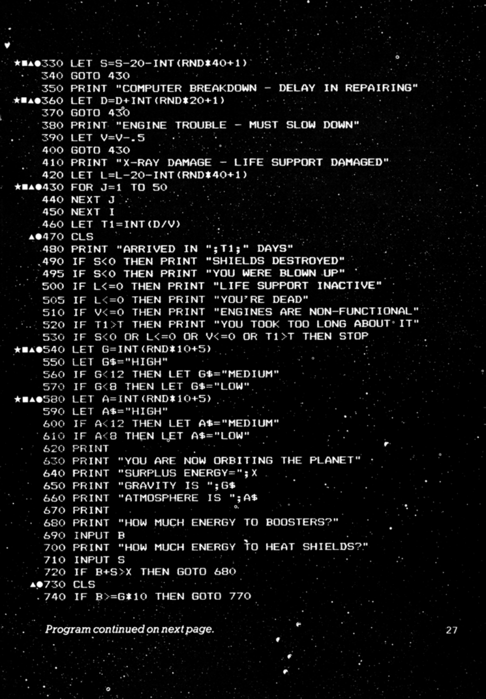
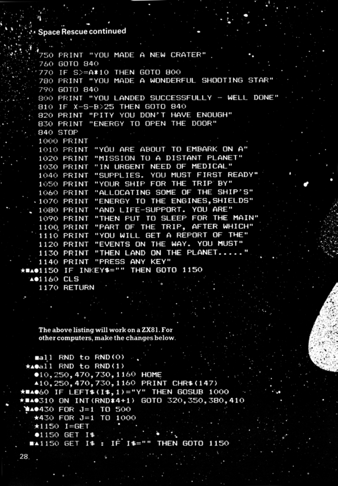

# Space Rescue

**Book**: _Computer Spacegames_  
**Author**: Usborne Publishing

## Story

You must make an urgent trip across the spiral arm of the Galaxy to a developing planet in need of medical supplies. The trip involves such huge distances that for most of it you will be in a deep sleep. Before this, you must program the ship for the journey. The computer will ask how much energy you want to allocate to the engines, life support systems, and shields, and then put you to sleep.

When you wake up, the computer will give you a report on what happened during the trip. If all went well, you will be orbiting the planet. You must now allocate your remaining energy to the landing boosters and shields to make a good landing on the planet.

If you accomplish the mission safely, you stand a good chance of being promoted to Space Admiral. Good luck!

## Pseudocode

```plaintext
START
  DISPLAY "Space Rescue"
  ASK "Do you want instructions?"
  IF YES THEN SHOW INSTRUCTIONS

  GENERATE Random distance D (800 to 900)
  GENERATE Random energy E (400 to 800)
  CALCULATE travel time T

  DISPLAY D, E, T
  PROMPT "Allocate energy:"
  GET energy to Engines P, Life support L, Shields S

  IF P + L + S > E THEN PROMPT AGAIN

  COMPUTE remaining energy X = E - P - L - S
  COMPUTE velocity V
  COMPUTE estimated time ETA

  FOR Random events during trip DO
    IF ASTEROID STORM THEN REDUCE S
    IF COMPUTER BREAKDOWN THEN ADD DELAY TO ETA
    IF ENGINE TROUBLE THEN REDUCE V
    IF LIFE SUPPORT DAMAGE THEN REDUCE L
  END LOOP

  DISPLAY "Arrived in T1 days"
  CHECK CONDITIONS:
    IF S <= 0 THEN DISPLAY "Shields destroyed"
    IF L <= 0 THEN DISPLAY "Life support inactive"
    IF V <= 0 THEN DISPLAY "Engines failed"
    IF T1 > T THEN DISPLAY "Took too long"

  IF CONDITIONS OK THEN
    DISPLAY "Orbiting planet"
    PROMPT "Allocate energy to boosters and shields"
    IF BOOSTERS + SHIELDS > X THEN PROMPT AGAIN
    CHECK LANDING OUTCOME
  ELSE
    DISPLAY "Mission failed"
END
```

## Flowchart



## Code

<details>
<summary>Pages</summary>

  
  


</details>

<details>
<summary>ZX-81</summary>

```basic
10 CLS
20 PRINT "SPACE RESCUE"
30 PRINT
40 PRINT "DO YOU WANT INSTRUCTIONS?"
50 INPUT I$
60 IF I$(1)="Y" THEN GOSUB 1000
70 LET D=INT(RND*800+101)
80 LET E=INT(RND*400+401)
90 LET T=INT(D/SQR(E/5)+.5)
100 PRINT "THE PLANET IS ";D;" UNITS AWAY"
110 PRINT "YOU HAVE ";E;" UNITS OF ENERGY"
120 PRINT "AND A TIME LIMIT OF ";T;" DAYS"
130 PRINT
140 PRINT "ENERGY DISTRIBUTION:"
150 PRINT "TO ENGINES?"
160 INPUT P
170 PRINT "TO LIFE SUPPORT?"
180 INPUT L
190 PRINT "TO SHIELDS?"
200 INPUT S
210 IF P+L+S>E THEN GOTO 140
220 LET X=E-P-L-S
230 LET V=INT(SQR(P))
240 LET T1=INT(D/V)
250 CLS
260 PRINT "YOUR VELOCITY IS ";V
270 PRINT "YOU HAVE AN ETA OF ";T1;" DAYS"
280 PRINT
290 FOR I=1 TO INT(RND*5+6)
300 IF RND>.5 THEN GOTO 430
310 GOTO 320+INT(RND*4)*30
320 PRINT "ASTEROID STORM - SHIELDS DAMAGED"
330 LET S=S-20-INT(RND*40+1)
340 GOTO 430
350 PRINT "COMPUTER BREAKDOWN - DELAY IN REPAIRING"
360 LET D=D+INT(RND*20+1)
370 GOTO 430
380 PRINT "ENGINE TROUBLE - MUST SLOW DOWN"
390 LET V=V-5
400 GOTO 430
410 PRINT "X-RAY DAMAGE - LIFE SUPPORT DAMAGED"
420 LET L=L-20-INT(RND*40+1)
430 FOR J=1 TO 50
440 NEXT J
450 NEXT I
460 LET T1=INT(D/V)
470 CLS
480 PRINT "ARRIVED IN ";T1;" DAYS"
490 IF S<0 THEN PRINT "SHIELDS DESTROYED"
495 IF S<0 THEN PRINT "YOU WERE BLOWN UP"
500 IF L<0 THEN PRINT "LIFE SUPPORT INACTIVE"
505 IF L<0 THEN PRINT "YOU'RE DEAD"
510 IF V<0 THEN PRINT "ENGINES ARE NON-FUNCTIONAL"
520 IF T1>T THEN PRINT "YOU TOOK TOO LONG ABOUT IT"
530 IF S<0 OR L<0 OR V<0 OR T1>T THEN STOP
540 LET G=INT(RND*10+5)
550 LET G$="HIGH"
560 IF G<12 THEN LET G$="MEDIUM"
570 IF G<8 THEN LET G$="LOW"
580 LET A=INT(RND*10+5)
590 LET A$="HIGH"
600 IF A<12 THEN LET A$="MEDIUM"
610 IF A<8 THEN LET A$="LOW"
620 PRINT
630 PRINT "YOU ARE NOW ORBITING THE PLANET"
640 PRINT "SURPLUS ENERGY=";X
650 PRINT "GRAVITY IS ";G$
660 PRINT "ATMOSPHERE IS ";A$
670 PRINT
680 PRINT "HOW MUCH ENERGY TO BOOSTERS?"
690 INPUT B
700 PRINT "HOW MUCH ENERGY TO HEAT SHIELDS?"
710 INPUT S
720 IF B+S>X THEN GOTO 680
730 CLS
740 IF B>=G*10 THEN GOTO 770
750 PRINT "YOU MADE A NEW CRATER"
760 GOTO 940
770 IF S>=A*10 THEN GOTO 800
780 PRINT "YOU MADE A WONDERFUL SHOOTING STAR"
790 GOTO 940
800 PRINT "YOU LANDED SUCCESSFULLY - WELL DONE"
810 IF X-S-B>25 THEN GOTO 840
820 PRINT "PITY YOU DON’T HAVE ENOUGH"
830 PRINT "ENERGY TO OPEN THE DOOR"
840 STOP
1000 PRINT
1010 PRINT "YOU ARE ABOUT TO EMBARK ON A"
1020 PRINT "MISSION TO A DISTANT PLANET"
1030 PRINT "IN URGENT NEED OF MEDICAL"
1040 PRINT "SUPPLIES. YOU MUST FIRST READY"
1050 PRINT "YOUR SHIP FOR THE TRIP BY"
1060 PRINT "ALLOCATING SOME OF THE SHIP’S"
1070 PRINT "ENERGY TO THE ENGINES,SHIELDS"
1080 PRINT "AND LIFE-SUPPORT. YOU ARE"
1090 PRINT "THEN PUT TO SLEEP FOR THE MAIN"
1100 PRINT "PART OF THE TRIP, AFTER WHICH"
1110 PRINT "YOU WILL GET A REPORT OF THE"
1120 PRINT "EVENTS ON THE WAY. YOU MUST"
1130 PRINT "THEN LAND ON THE PLANET....."
1140 PRINT "PRESS ANY KEY"
1150 IF INKEY$="" THEN GOTO 1150
1160 CLS
1170 RETURN
```

</details>

<details>
<summary>C#</summary>

```csharp
using System;

class SpaceRescue
{
    static void Main()
    {
        Console.WriteLine("Space Rescue");
        Console.WriteLine("Do you want instructions? (Y/N)");
        string input = Console.ReadLine()?.ToUpper();

        if (input == "Y")
        {
            ShowInstructions();
        }

        Random rnd = new Random();
        int distance = rnd.Next(800, 901);
        int energy = rnd.Next(400, 801);
        int timeLimit = (int)(distance / Math.Sqrt(energy / 5.0) + 0.5);

        Console.WriteLine($"The planet is {distance} units away.");
        Console.WriteLine($"You have {energy} units of energy.");
        Console.WriteLine($"And a time limit of {timeLimit} days.");

        int engines, lifeSupport, shields;
        while (true)
        {
            Console.WriteLine("Allocate energy:");
            Console.Write("To engines? ");
            engines = ParseInput();

            Console.Write("To life support? ");
            lifeSupport = ParseInput();

            Console.Write("To shields? ");
            shields = ParseInput();

            if (engines + lifeSupport + shields > energy)
            {
                Console.WriteLine("Allocation exceeds total energy. Try again.");
            }
            else
            {
                break;
            }
        }

        int remainingEnergy = energy - (engines + lifeSupport + shields);
        int velocity = (int)Math.Sqrt(engines);
        int eta = (int)(distance / (double)velocity);

        Console.WriteLine($"Velocity: {velocity}");
        Console.WriteLine($"Estimated time of arrival: {eta} days");

        SimulateJourney(rnd, ref shields, ref lifeSupport, ref velocity, ref eta);

        if (shields <= 0 || lifeSupport <= 0 || velocity <= 0 || eta > timeLimit)
        {
            Console.WriteLine("Mission failed due to critical issues.");
            return;
        }

        Console.WriteLine("You have arrived at the destination!");
        Console.WriteLine($"Remaining energy: {remainingEnergy}");

        Console.WriteLine("Allocate energy for landing:");
        int boosters, landingShields;
        while (true)
        {
            Console.Write("To boosters? ");
            boosters = ParseInput();

            Console.Write("To landing shields? ");
            landingShields = ParseInput();

            if (boosters + landingShields > remainingEnergy)
            {
                Console.WriteLine("Allocation exceeds remaining energy. Try again.");
            }
            else
            {
                break;
            }
        }

        PerformLanding(boosters, landingShields);
    }

    static void ShowInstructions()
    {
        Console.WriteLine("Your mission is to deliver medical supplies to a distant planet.");
        Console.WriteLine("Allocate energy to engines, life support, and shields for the journey.");
        Console.WriteLine("During the trip, random events may occur that affect your systems.");
        Console.WriteLine("After arriving, allocate remaining energy for a safe landing.");
    }

    static int ParseInput()
    {
        while (true)
        {
            if (int.TryParse(Console.ReadLine(), out int value) && value >= 0)
            {
                return value;
            }
            Console.WriteLine("Invalid input. Please enter a positive integer.");
        }
    }

    static void SimulateJourney(Random rnd, ref int shields, ref int lifeSupport, ref int velocity, ref int eta)
    {
        for (int i = 0; i < rnd.Next(5, 11); i++)
        {
            double eventChance = rnd.NextDouble();
            if (eventChance < 0.25)
            {
                Console.WriteLine("Asteroid storm! Shields damaged.");
                shields -= rnd.Next(10, 41);
            }
            else if (eventChance < 0.5)
            {
                Console.WriteLine("Computer breakdown! Delay added.");
                eta += rnd.Next(1, 5);
            }
            else if (eventChance < 0.75)
            {
                Console.WriteLine("Engine trouble! Velocity reduced.");
                velocity -= rnd.Next(1, 5);
            }
            else
            {
                Console.WriteLine("Life support damage! Supplies reduced.");
                lifeSupport -= rnd.Next(10, 41);
            }

            if (shields <= 0 || lifeSupport <= 0 || velocity <= 0)
            {
                Console.WriteLine("Critical failure during the journey.");
                return;
            }
        }
    }

    static void PerformLanding(int boosters, int landingShields)
    {
        Console.WriteLine("Performing landing...");
        if (boosters >= 50 && landingShields >= 50)
        {
            Console.WriteLine("Landing successful! Well done, Space Admiral!");
        }
        else
        {
            Console.WriteLine("Landing failed. Better luck next time.");
        }
    }
}
```

</details>

<details>
<summary>Python</summary>

```python
import math
import random

def show_instructions():
    print("Your mission is to deliver medical supplies to a distant planet.")
    print("Allocate energy to engines, life support, and shields for the journey.")
    print("During the trip, random events may occur that affect your systems.")
    print("After arriving, allocate remaining energy for a safe landing.")

def get_positive_input(prompt):
    while True:
        try:
            value = int(input(prompt))
            if value >= 0:
                return value
            else:
                print("Please enter a non-negative number.")
        except ValueError:
            print("Invalid input. Please enter a valid integer.")

def simulate_journey(shields, life_support, velocity, eta):
    for _ in range(random.randint(5, 10)):
        event_chance = random.random()
        if event_chance < 0.25:
            print("Asteroid storm! Shields damaged.")
            shields -= random.randint(10, 40)
        elif event_chance < 0.5:
            print("Computer breakdown! Delay added.")
            eta += random.randint(1, 4)
        elif event_chance < 0.75:
            print("Engine trouble! Velocity reduced.")
            velocity -= random.randint(1, 4)
        else:
            print("Life support damage! Supplies reduced.")
            life_support -= random.randint(10, 40)

        if shields <= 0 or life_support <= 0 or velocity <= 0:
            print("Critical failure during the journey.")
            return shields, life_support, velocity, eta
    return shields, life_support, velocity, eta

def perform_landing(remaining_energy):
    while True:
        boosters = get_positive_input("How much energy to boosters? ")
        landing_shields = get_positive_input("How much energy to heat shields? ")

        if boosters + landing_shields > remaining_energy:
            print("Allocation exceeds remaining energy. Try again.")
        else:
            break

    gravity = random.randint(5, 15)
    atmosphere = random.randint(5, 15)

    if boosters >= gravity * 10 and landing_shields >= atmosphere * 10:
        print("Landing successful! Well done, Space Admiral!")
    else:
        if boosters < gravity * 10:
            print("You made a new crater.")
        if landing_shields < atmosphere * 10:
            print("You made a wonderful shooting star.")

def main():
    print("Space Rescue")
    if input("Do you want instructions? (Y/N): ").strip().upper() == "Y":
        show_instructions()

    distance = random.randint(800, 900)
    energy = random.randint(400, 800)
    time_limit = math.ceil(distance / math.sqrt(energy / 5.0))

    print(f"The planet is {distance} units away.")
    print(f"You have {energy} units of energy.")
    print(f"And a time limit of {time_limit} days.")

    while True:
        print("Allocate energy:")
        engines = get_positive_input("To engines? ")
        life_support = get_positive_input("To life support? ")
        shields = get_positive_input("To shields? ")

        if engines + life_support + shields > energy:
            print("Allocation exceeds total energy. Try again.")
        else:
            break

    remaining_energy = energy - (engines + life_support + shields)
    velocity = int(math.sqrt(engines))
    eta = math.ceil(distance / velocity)

    print(f"Velocity: {velocity}")
    print(f"Estimated time of arrival: {eta} days")

    shields, life_support, velocity, eta = simulate_journey(shields, life_support, velocity, eta)

    if shields <= 0 or life_support <= 0 or velocity <= 0 or eta > time_limit:
        print("Mission failed due to critical issues.")
        return

    print("You have arrived at the destination!")
    print(f"Remaining energy: {remaining_energy}")

    perform_landing(remaining_energy)

if __name__ == "__main__":
    main()
```

</details>

<details>
<summary>Java</summary>

```java
import java.util.Scanner;
import java.util.Random;

public class SpaceRescue {
    public static void main(String[] args) {
        Scanner scanner = new Scanner(System.in);
        Random random = new Random();

        System.out.println("Space Rescue");
        System.out.print("Do you want instructions? (Y/N): ");
        String input = scanner.nextLine().trim().toUpperCase();

        if (input.equals("Y")) {
            showInstructions();
        }

        int distance = random.nextInt(101) + 800; // Random distance between 800 and 900
        int energy = random.nextInt(401) + 400; // Random energy between 400 and 800
        int timeLimit = (int) Math.ceil(distance / Math.sqrt(energy / 5.0));

        System.out.println("The planet is " + distance + " units away.");
        System.out.println("You have " + energy + " units of energy.");
        System.out.println("And a time limit of " + timeLimit + " days.");

        int engines, lifeSupport, shields;

        while (true) {
            System.out.println("Allocate energy:");
            System.out.print("To engines? ");
            engines = getPositiveInput(scanner);

            System.out.print("To life support? ");
            lifeSupport = getPositiveInput(scanner);

            System.out.print("To shields? ");
            shields = getPositiveInput(scanner);

            if (engines + lifeSupport + shields > energy) {
                System.out.println("Allocation exceeds total energy. Try again.");
            } else {
                break;
            }
        }

        int remainingEnergy = energy - (engines + lifeSupport + shields);
        int velocity = (int) Math.sqrt(engines);
        int eta = (int) Math.ceil((double) distance / velocity);

        System.out.println("Velocity: " + velocity);
        System.out.println("Estimated time of arrival: " + eta + " days");

        int[] results = simulateJourney(random, shields, lifeSupport, velocity, eta);

        shields = results[0];
        lifeSupport = results[1];
        velocity = results[2];
        eta = results[3];

        if (shields <= 0 || lifeSupport <= 0 || velocity <= 0 || eta > timeLimit) {
            System.out.println("Mission failed due to critical issues.");
            return;
        }

        System.out.println("You have arrived at the destination!");
        System.out.println("Remaining energy: " + remainingEnergy);

        performLanding(scanner, random, remainingEnergy);
    }

    public static void showInstructions() {
        System.out.println("Your mission is to deliver medical supplies to a distant planet.");
        System.out.println("Allocate energy to engines, life support, and shields for the journey.");
        System.out.println("During the trip, random events may occur that affect your systems.");
        System.out.println("After arriving, allocate remaining energy for a safe landing.");
    }

    public static int getPositiveInput(Scanner scanner) {
        while (true) {
            try {
                int value = Integer.parseInt(scanner.nextLine().trim());
                if (value >= 0) {
                    return value;
                } else {
                    System.out.println("Please enter a non-negative number.");
                }
            } catch (NumberFormatException e) {
                System.out.println("Invalid input. Please enter a valid integer.");
            }
        }
    }

    public static int[] simulateJourney(Random random, int shields, int lifeSupport, int velocity, int eta) {
        for (int i = 0; i < random.nextInt(6) + 5; i++) { // Random 5-10 events
            double eventChance = random.nextDouble();
            if (eventChance < 0.25) {
                System.out.println("Asteroid storm! Shields damaged.");
                shields -= random.nextInt(31) + 10; // Damage between 10 and 40
            } else if (eventChance < 0.5) {
                System.out.println("Computer breakdown! Delay added.");
                eta += random.nextInt(4) + 1; // Delay between 1 and 4 days
            } else if (eventChance < 0.75) {
                System.out.println("Engine trouble! Velocity reduced.");
                velocity -= random.nextInt(4) + 1; // Velocity loss between 1 and 4
            } else {
                System.out.println("Life support damage! Supplies reduced.");
                lifeSupport -= random.nextInt(31) + 10; // Damage between 10 and 40
            }

            if (shields <= 0 || lifeSupport <= 0 || velocity <= 0) {
                System.out.println("Critical failure during the journey.");
                return new int[] { shields, lifeSupport, velocity, eta };
            }
        }
        return new int[] { shields, lifeSupport, velocity, eta };
    }

    public static void performLanding(Scanner scanner, Random random, int remainingEnergy) {
        int boosters, landingShields;

        while (true) {
            System.out.print("How much energy to boosters? ");
            boosters = getPositiveInput(scanner);

            System.out.print("How much energy to heat shields? ");
            landingShields = getPositiveInput(scanner);

            if (boosters + landingShields > remainingEnergy) {
                System.out.println("Allocation exceeds remaining energy. Try again.");
            } else {
                break;
            }
        }

        int gravity = random.nextInt(11) + 5; // Gravity between 5 and 15
        int atmosphere = random.nextInt(11) + 5; // Atmosphere between 5 and 15

        if (boosters >= gravity * 10 && landingShields >= atmosphere * 10) {
            System.out.println("Landing successful! Well done, Space Admiral!");
        } else {
            if (boosters < gravity * 10) {
                System.out.println("You made a new crater.");
            }
            if (landingShields < atmosphere * 10) {
                System.out.println("You made a wonderful shooting star.");
            }
        }
    }
}
```

</details>

<details>
<summary>Go</summary>

```go
package main

import (
	"fmt"
	"math"
	"math/rand"
	"time"
)

func main() {
	rand.Seed(time.Now().UnixNano())
	fmt.Println("Space Rescue")
	fmt.Print("Do you want instructions? (Y/N): ")
	var input string
	fmt.Scanln(&input)

	if input == "Y" || input == "y" {
		showInstructions()
	}

	distance := rand.Intn(101) + 800 // Random distance between 800 and 900
	energy := rand.Intn(401) + 400  // Random energy between 400 and 800
	timeLimit := int(math.Ceil(float64(distance) / math.Sqrt(float64(energy)/5)))

	fmt.Printf("The planet is %d units away.\n", distance)
	fmt.Printf("You have %d units of energy.\n", energy)
	fmt.Printf("And a time limit of %d days.\n", timeLimit)

	var engines, lifeSupport, shields int
	for {
		fmt.Println("Allocate energy:")
		engines = getPositiveInput("To engines? ")
		lifeSupport = getPositiveInput("To life support? ")
		shields = getPositiveInput("To shields? ")

		if engines+lifeSupport+shields > energy {
			fmt.Println("Allocation exceeds total energy. Try again.")
		} else {
			break
		}
	}

	remainingEnergy := energy - (engines + lifeSupport + shields)
	velocity := int(math.Sqrt(float64(engines)))
	eta := int(math.Ceil(float64(distance) / float64(velocity)))

	fmt.Printf("Velocity: %d\n", velocity)
	fmt.Printf("Estimated time of arrival: %d days\n", eta)

	shields, lifeSupport, velocity, eta = simulateJourney(shields, lifeSupport, velocity, eta)

	if shields <= 0 || lifeSupport <= 0 || velocity <= 0 || eta > timeLimit {
		fmt.Println("Mission failed due to critical issues.")
		return
	}

	fmt.Println("You have arrived at the destination!")
	fmt.Printf("Remaining energy: %d\n", remainingEnergy)

	performLanding(remainingEnergy)
}

func showInstructions() {
	fmt.Println("Your mission is to deliver medical supplies to a distant planet.")
	fmt.Println("Allocate energy to engines, life support, and shields for the journey.")
	fmt.Println("During the trip, random events may occur that affect your systems.")
	fmt.Println("After arriving, allocate remaining energy for a safe landing.")
}

func getPositiveInput(prompt string) int {
	var value int
	for {
		fmt.Print(prompt)
		_, err := fmt.Scan(&value)
		if err == nil && value >= 0 {
			return value
		}
		fmt.Println("Invalid input. Please enter a non-negative number.")
	}
}

func simulateJourney(shields, lifeSupport, velocity, eta int) (int, int, int, int) {
	for i := 0; i < rand.Intn(6)+5; i++ { // Random 5-10 events
		eventChance := rand.Float64()
		switch {
		case eventChance < 0.25:
			fmt.Println("Asteroid storm! Shields damaged.")
			shields -= rand.Intn(31) + 10 // Damage between 10 and 40
		case eventChance < 0.5:
			fmt.Println("Computer breakdown! Delay added.")
			eta += rand.Intn(4) + 1 // Delay between 1 and 4 days
		case eventChance < 0.75:
			fmt.Println("Engine trouble! Velocity reduced.")
			velocity -= rand.Intn(4) + 1 // Velocity loss between 1 and 4
		default:
			fmt.Println("Life support damage! Supplies reduced.")
			lifeSupport -= rand.Intn(31) + 10 // Damage between 10 and 40
		}

		if shields <= 0 || lifeSupport <= 0 || velocity <= 0 {
			fmt.Println("Critical failure during the journey.")
			return shields, lifeSupport, velocity, eta
		}
	}
	return shields, lifeSupport, velocity, eta
}

func performLanding(remainingEnergy int) {
	var boosters, landingShields int

	for {
		boosters = getPositiveInput("How much energy to boosters? ")
		landingShields = getPositiveInput("How much energy to heat shields? ")

		if boosters+landingShields > remainingEnergy {
			fmt.Println("Allocation exceeds remaining energy. Try again.")
		} else {
			break
		}
	}

	gravity := rand.Intn(11) + 5    // Gravity between 5 and 15
	atmosphere := rand.Intn(11) + 5 // Atmosphere between 5 and 15

	if boosters >= gravity*10 && landingShields >= atmosphere*10 {
		fmt.Println("Landing successful! Well done, Space Admiral!")
	} else {
		if boosters < gravity*10 {
			fmt.Println("You made a new crater.")
		}
		if landingShields < atmosphere*10 {
			fmt.Println("You made a wonderful shooting star.")
		}
	}
}
```

</details>

<details>
<summary>C++</summary>

```cpp
#include <iostream>
#include <cmath>
#include <cstdlib>
#include <ctime>

using namespace std;

void showInstructions() {
    cout << "Your mission is to deliver medical supplies to a distant planet." << endl;
    cout << "Allocate energy to engines, life support, and shields for the journey." << endl;
    cout << "During the trip, random events may occur that affect your systems." << endl;
    cout << "After arriving, allocate remaining energy for a safe landing." << endl;
}

int getPositiveInput(string prompt) {
    int value;
    while (true) {
        cout << prompt;
        cin >> value;
        if (cin.fail() || value < 0) {
            cin.clear();
            cin.ignore(numeric_limits<streamsize>::max(), '\n');
            cout << "Invalid input. Please enter a non-negative number." << endl;
        } else {
            return value;
        }
    }
}

void simulateJourney(int &shields, int &lifeSupport, int &velocity, int &eta) {
    for (int i = 0; i < rand() % 6 + 5; i++) { // Random 5-10 events
        double eventChance = static_cast<double>(rand()) / RAND_MAX;

        if (eventChance < 0.25) {
            cout << "Asteroid storm! Shields damaged." << endl;
            shields -= rand() % 31 + 10; // Damage between 10 and 40
        } else if (eventChance < 0.5) {
            cout << "Computer breakdown! Delay added." << endl;
            eta += rand() % 4 + 1; // Delay between 1 and 4 days
        } else if (eventChance < 0.75) {
            cout << "Engine trouble! Velocity reduced." << endl;
            velocity -= rand() % 4 + 1; // Velocity loss between 1 and 4
        } else {
            cout << "Life support damage! Supplies reduced." << endl;
            lifeSupport -= rand() % 31 + 10; // Damage between 10 and 40
        }

        if (shields <= 0 || lifeSupport <= 0 || velocity <= 0) {
            cout << "Critical failure during the journey." << endl;
            return;
        }
    }
}

void performLanding(int remainingEnergy) {
    int boosters, landingShields;

    while (true) {
        boosters = getPositiveInput("How much energy to boosters? ");
        landingShields = getPositiveInput("How much energy to heat shields? ");

        if (boosters + landingShields > remainingEnergy) {
            cout << "Allocation exceeds remaining energy. Try again." << endl;
        } else {
            break;
        }
    }

    int gravity = rand() % 11 + 5;    // Gravity between 5 and 15
    int atmosphere = rand() % 11 + 5; // Atmosphere between 5 and 15

    if (boosters >= gravity * 10 && landingShields >= atmosphere * 10) {
        cout << "Landing successful! Well done, Space Admiral!" << endl;
    } else {
        if (boosters < gravity * 10) {
            cout << "You made a new crater." << endl;
        }
        if (landingShields < atmosphere * 10) {
            cout << "You made a wonderful shooting star." << endl;
        }
    }
}

int main() {
    srand(static_cast<unsigned>(time(0)));

    cout << "Space Rescue" << endl;
    cout << "Do you want instructions? (Y/N): ";
    char input;
    cin >> input;
    cin.ignore();

    if (toupper(input) == 'Y') {
        showInstructions();
    }

    int distance = rand() % 101 + 800; // Random distance between 800 and 900
    int energy = rand() % 401 + 400;  // Random energy between 400 and 800
    int timeLimit = static_cast<int>(ceil(static_cast<double>(distance) / sqrt(static_cast<double>(energy) / 5)));

    cout << "The planet is " << distance << " units away." << endl;
    cout << "You have " << energy << " units of energy." << endl;
    cout << "And a time limit of " << timeLimit << " days." << endl;

    int engines, lifeSupport, shields;

    while (true) {
        cout << "Allocate energy:" << endl;
        engines = getPositiveInput("To engines? ");
        lifeSupport = getPositiveInput("To life support? ");
        shields = getPositiveInput("To shields? ");

        if (engines + lifeSupport + shields > energy) {
            cout << "Allocation exceeds total energy. Try again." << endl;
        } else {
            break;
        }
    }

    int remainingEnergy = energy - (engines + lifeSupport + shields);
    int velocity = static_cast<int>(sqrt(engines));
    int eta = static_cast<int>(ceil(static_cast<double>(distance) / velocity));

    cout << "Velocity: " << velocity << endl;
    cout << "Estimated time of arrival: " << eta << " days" << endl;

    simulateJourney(shields, lifeSupport, velocity, eta);

    if (shields <= 0 || lifeSupport <= 0 || velocity <= 0 || eta > timeLimit) {
        cout << "Mission failed due to critical issues." << endl;
        return 0;
    }

    cout << "You have arrived at the destination!" << endl;
    cout << "Remaining energy: " << remainingEnergy << endl;

    performLanding(remainingEnergy);

    return 0;
}
```

</details>

<details>
<summary>Rust</summary>

```rust
use rand::Rng;
use std::io;

fn main() {
    println!("Space Rescue");
    println!("Do you want instructions? (Y/N): ");
    let mut input = String::new();
    io::stdin().read_line(&mut input).unwrap();

    if input.trim().eq_ignore_ascii_case("Y") {
        show_instructions();
    }

    let mut rng = rand::thread_rng();
    let distance = rng.gen_range(800..=900); // Random distance between 800 and 900
    let energy = rng.gen_range(400..=800);  // Random energy between 400 and 800
    let time_limit = (distance as f64 / (energy as f64 / 5.0).sqrt()).ceil() as i32;

    println!("The planet is {} units away.", distance);
    println!("You have {} units of energy.", energy);
    println!("And a time limit of {} days.", time_limit);

    let (engines, life_support, shields) = loop {
        println!("Allocate energy:");
        let engines = get_positive_input("To engines? ");
        let life_support = get_positive_input("To life support? ");
        let shields = get_positive_input("To shields? ");

        if engines + life_support + shields > energy {
            println!("Allocation exceeds total energy. Try again.");
        } else {
            break (engines, life_support, shields);
        }
    };

    let mut remaining_energy = energy - (engines + life_support + shields);
    let mut velocity = (engines as f64).sqrt() as i32;
    let mut eta = (distance as f64 / velocity as f64).ceil() as i32;

    println!("Velocity: {}", velocity);
    println!("Estimated time of arrival: {} days", eta);

    let (shields, life_support, velocity, eta) =
        simulate_journey(&mut rng, shields, life_support, velocity, eta);

    if shields <= 0 || life_support <= 0 || velocity <= 0 || eta > time_limit {
        println!("Mission failed due to critical issues.");
        return;
    }

    println!("You have arrived at the destination!");
    println!("Remaining energy: {}", remaining_energy);

    perform_landing(&mut rng, remaining_energy);
}

fn show_instructions() {
    println!("Your mission is to deliver medical supplies to a distant planet.");
    println!("Allocate energy to engines, life support, and shields for the journey.");
    println!("During the trip, random events may occur that affect your systems.");
    println!("After arriving, allocate remaining energy for a safe landing.");
}

fn get_positive_input(prompt: &str) -> i32 {
    loop {
        println!("{}", prompt);
        let mut input = String::new();
        io::stdin().read_line(&mut input).unwrap();

        match input.trim().parse::<i32>() {
            Ok(value) if value >= 0 => return value,
            _ => println!("Invalid input. Please enter a non-negative number."),
        }
    }
}

fn simulate_journey(
    rng: &mut impl Rng,
    mut shields: i32,
    mut life_support: i32,
    mut velocity: i32,
    mut eta: i32,
) -> (i32, i32, i32, i32) {
    for _ in 0..rng.gen_range(5..=10) {
        let event_chance = rng.gen::<f64>();

        if event_chance < 0.25 {
            println!("Asteroid storm! Shields damaged.");
            shields -= rng.gen_range(10..=40);
        } else if event_chance < 0.5 {
            println!("Computer breakdown! Delay added.");
            eta += rng.gen_range(1..=4);
        } else if event_chance < 0.75 {
            println!("Engine trouble! Velocity reduced.");
            velocity -= rng.gen_range(1..=4);
        } else {
            println!("Life support damage! Supplies reduced.");
            life_support -= rng.gen_range(10..=40);
        }

        if shields <= 0 || life_support <= 0 || velocity <= 0 {
            println!("Critical failure during the journey.");
            return (shields, life_support, velocity, eta);
        }
    }

    (shields, life_support, velocity, eta)
}

fn perform_landing(rng: &mut impl Rng, remaining_energy: i32) {
    let boosters;
    let landing_shields;

    loop {
        boosters = get_positive_input("How much energy to boosters? ");
        landing_shields = get_positive_input("How much energy to heat shields? ");

        if boosters + landing_shields > remaining_energy {
            println!("Allocation exceeds remaining energy. Try again.");
        } else {
            break;
        }
    }

    let gravity = rng.gen_range(5..=15);    // Gravity between 5 and 15
    let atmosphere = rng.gen_range(5..=15); // Atmosphere between 5 and 15

    if boosters >= gravity * 10 && landing_shields >= atmosphere * 10 {
        println!("Landing successful! Well done, Space Admiral!");
    } else {
        if boosters < gravity * 10 {
            println!("You made a new crater.");
        }
        if landing_shields < atmosphere * 10 {
            println!("You made a wonderful shooting star.");
        }
    }
}
```

</details>

## Explanation

The game simulates a space rescue mission where players allocate energy to complete their task. It involves decision-making and managing risks during a journey filled with random challenges.

**Explanation**:

- **Energy Allocation**: The player decides how to distribute energy among engines, life support systems, and shields. These allocations directly impact the ship's ability to travel quickly, survive random events, and maintain life support during the journey.
- **Random Events**: During the journey, random events such as asteroid storms, computer breakdowns, engine trouble, or life support failures occur. These events can reduce shields, delay the journey, or damage critical systems, forcing the player to adapt.
- **Travel and Arrival**: The ship's velocity, based on engine energy allocation, determines the estimated travel time. The player must ensure that all systems remain functional and the journey is completed within the allowed time.
- **Landing**: Upon reaching the destination, the player uses the remaining energy to allocate power to boosters and heat shields. These allocations must account for the planet's gravity and atmospheric conditions to ensure a safe landing.
- **Mission Success**: Success depends on the player's ability to balance energy allocations wisely, navigate random events, and safely land the ship on the target planet.

## Challenges

1. **Increase difficulty**: Add stricter limits or additional random events.
2. **Upgrade system**: Add upgrades to improve engines or shields.
3. **Planet diversity**: Have different types of planets with unique challenges.

## Copyright

These programs are adaptations of the original Usborne Computer Guides published in the 1980s. They are free to download for personal or educational use from [Usborne's Computer and Coding Books](https://usborne.com/row/books/computer-and-coding-books).
