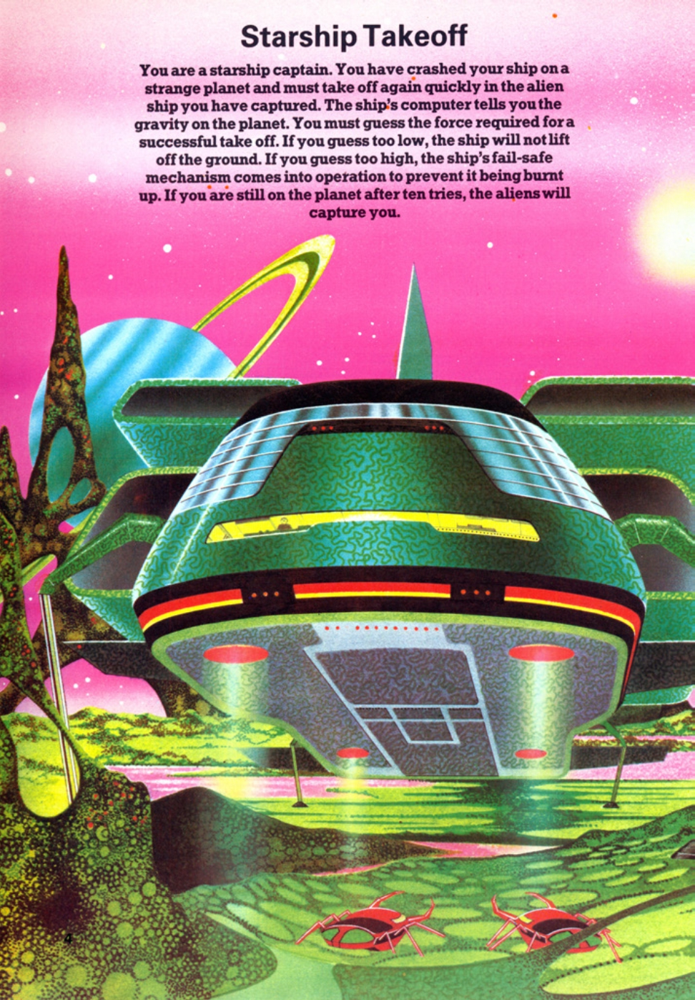
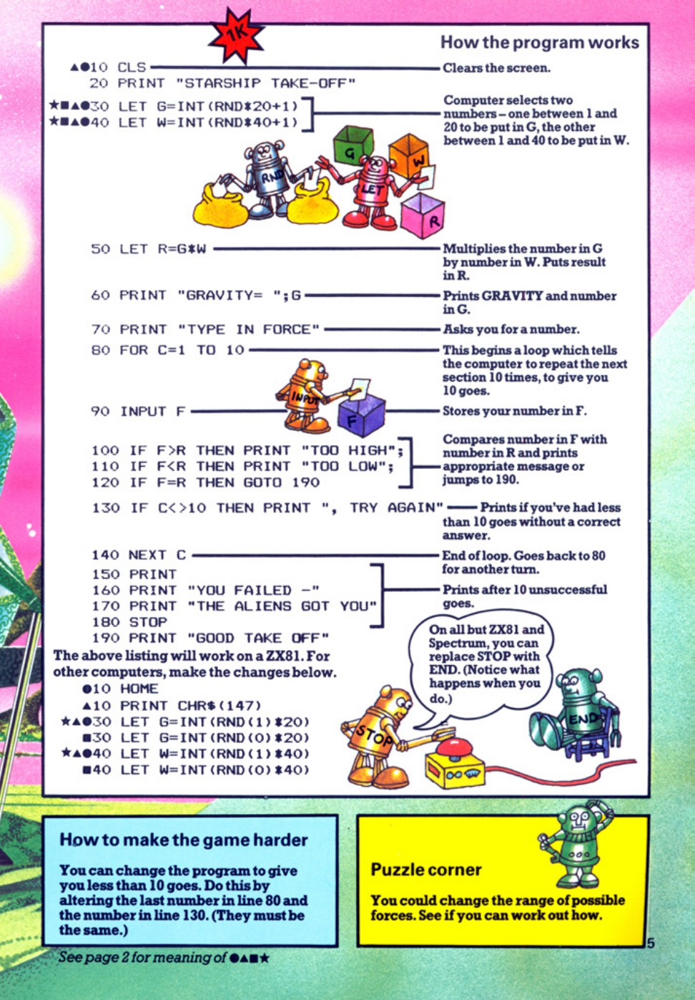

# Starship Takeoff

**Book**: _Computer Spacegames_  
**Author**: Usborne Publishing

## Story

In _Starship Takeoff_, you play as a starship captain who has crashed on an alien planet. The gravity is unknown, and your computer calculates the exact force needed to lift off. Your mission is to guess the correct force to escape. Guess too low, and the ship won’t lift off. Guess too high, and the fail-safe mechanism activates to prevent damage. You have ten attempts to get it right before aliens capture you.

## Pseudocode

```plaintext
START
  CLEAR screen
  DISPLAY "STARSHIP TAKE-OFF"
  SET gravity (G) to a random number between 1 and 20
  SET weight (W) to a random number between 1 and 40
  SET required force (R) = G * W
  DISPLAY "GRAVITY = G"
  FOR attempt = 1 to 10 DO
    PROMPT user for force (F)
    IF F > R THEN
      DISPLAY "TOO HIGH"
    ELSE IF F < R THEN
      DISPLAY "TOO LOW"
    ELSE
      DISPLAY "GOOD TAKE OFF"
      END
    END IF
    IF attempt < 10 THEN
      PROMPT "TRY AGAIN"
    END IF
  END FOR
  DISPLAY "YOU FAILED - THE ALIENS GOT YOU"
END
```

## Flowchart

<div class="mermaid">
flowchart TD
    A[Start] --> B[Clear Screen]
    B --> C[Display 'STARSHIP TAKE-OFF']
    C --> D[Set G = Random 1-20]
    D --> E[Set W = Random 1-40]
    E --> F[Set R = G * W]
    F --> G[Display 'GRAVITY = G']
    G --> H[For attempt = 1 to 10]
    H --> I[Prompt user for F]
    I --> J{F == R?}
    J -->|Yes| K[Display 'GOOD TAKE-OFF']
    K --> L[End]
    J -->|No| M{F > R?}
    M -->|Yes| N[Display 'TOO HIGH']
    M -->|No| O[Display 'TOO LOW']
    N --> P{attempt < 10?}
    O --> P
    P -->|Yes| Q[Prompt 'TRY AGAIN']
    Q --> I
    P -->|No| R[Display 'YOU FAILED - THE ALIENS GOT YOU']
    R --> L
</div>

## Code

<details>
<summary>Pages</summary>




</details>

<details>
<summary>ZX-81</summary>

```basic
10 CLS
20 PRINT "STARSHIP TAKE-OFF"
30 LET G=INT(RND*20+1)
40 LET W=INT(RND*40+1)
50 LET R=G*W
60 PRINT "GRAVITY=";G
70 PRINT "TYPE IN FORCE"
80 FOR C=1 TO 10
90 INPUT F
100 IF F>R THEN PRINT "TOO HIGH";
110 IF F<R THEN PRINT "TOO LOW";
120 IF F=R THEN GOTO 190
130 IF C<10 THEN PRINT " , TRY AGAIN"
140 NEXT C
150 PRINT
160 PRINT "YOU FAILED -"
170 PRINT "THE ALIENS GOT YOU"
180 STOP
190 PRINT "GOOD TAKE OFF"
```

</details>

<details>
<summary>C#</summary>

```csharp
using System;

class StarshipTakeoff
{
    static void Main()
    {
        Console.Clear();
        Console.WriteLine("STARSHIP TAKE-OFF");

        Random random = new Random();
        int gravity = random.Next(1, 21);
        int weight = random.Next(1, 41);
        int requiredForce = gravity * weight;

        Console.WriteLine($"GRAVITY = {gravity}");

        for (int attempt = 1; attempt <= 10; attempt++)
        {
            int userForce;
            do
            {
                Console.Write("TYPE IN FORCE: ");
            } while (!int.TryParse(Console.ReadLine(), out userForce) || userForce < 0);

            if (userForce > requiredForce)
            {
                Console.Write("TOO HIGH");
            }
            else if (userForce < requiredForce)
            {
                Console.Write("TOO LOW");
            }
            else
            {
                Console.WriteLine("GOOD TAKE OFF");
                return;
            }

            if (attempt < 10)
            {
                Console.WriteLine(", TRY AGAIN");
            }
        }

        Console.WriteLine();
        Console.WriteLine("YOU FAILED - THE ALIENS GOT YOU");
    }
}
```

</details>

<details>
<summary>Python</summary>

```python
import random

print("STARSHIP TAKE-OFF")

gravity = random.randint(1, 20)
weight = random.randint(1, 40)
required_force = gravity * weight

print(f"GRAVITY = {gravity}")

for attempt in range(1, 11):
    user_force = int(input("TYPE IN FORCE: "))

    if user_force > required_force:
        print("TOO HIGH", end="")
    elif user_force < required_force:
        print("TOO LOW", end="")
    else:
        print("GOOD TAKE OFF")
        break

    if attempt < 10:
        print(", TRY AGAIN")
else:
    print("\nYOU FAILED - THE ALIENS GOT YOU")
```

</details>

<details>
<summary>Java</summary>

```java
import java.util.Scanner;
import java.util.Random;

public class StarshipTakeoff {
    public static void main(String[] args) {
        Scanner scanner = new Scanner(System.in);
        Random random = new Random();

        System.out.println("STARSHIP TAKE-OFF");
        int gravity = random.nextInt(20) + 1;
        int weight = random.nextInt(40) + 1;
        int requiredForce = gravity * weight;

        System.out.println("GRAVITY = " + gravity);

        for (int attempt = 1; attempt <= 10; attempt++) {
            System.out.print("TYPE IN FORCE: ");
            int userForce = scanner.nextInt();

            if (userForce > requiredForce) {
                System.out.print("TOO HIGH");
            } else if (userForce < requiredForce) {
                System.out.print("TOO LOW");
            } else {
                System.out.println("GOOD TAKE OFF");
                return;
            }

            if (attempt < 10) {
                System.out.println(", TRY AGAIN");
            }
        }

        System.out.println();
        System.out.println("YOU FAILED - THE ALIENS GOT YOU");
    }
}
```

</details>

<details>
<summary>GoLang</summary>

```go
package main

import (
	"fmt"
	"math/rand"
	"time"
)

func main() {
	rand.Seed(time.Now().UnixNano())
	gravity := rand.Intn(20) + 1
	weight := rand.Intn(40) + 1
	requiredForce := gravity * weight

	fmt.Println("STARSHIP TAKE-OFF")
	fmt.Printf("GRAVITY = %d\n", gravity)

	for attempt := 1; attempt <= 10; attempt++ {
		var userForce int
		fmt.Print("TYPE IN FORCE: ")
		fmt.Scan(&userForce)

		if userForce > requiredForce {
			fmt.Print("TOO HIGH")
		} else if userForce < requiredForce {
			fmt.Print("TOO LOW")
		} else {
			fmt.Println("GOOD TAKE OFF")
			return
		}

		if attempt < 10 {
			fmt.Println(", TRY AGAIN")
		}
	}

	fmt.Println()
	fmt.Println("YOU FAILED - THE ALIENS GOT YOU")
}
```

</details>

<details>
<summary>C++</summary>

```cpp
#include <iostream>
#include <cstdlib>
#include <ctime>

using namespace std;

int main() {
    srand(time(0));

    int gravity = rand() % 20 + 1;
    int weight = rand() % 40 + 1;
    int requiredForce = gravity * weight;

    cout << "STARSHIP TAKE-OFF" << endl;
    cout << "GRAVITY = " << gravity << endl;

    for (int attempt = 1; attempt <= 10; attempt++) {
        int userForce;
        cout << "TYPE IN FORCE: ";
        cin >> userForce;

        if (userForce > requiredForce) {
            cout << "TOO HIGH";
        } else if (userForce < requiredForce) {
            cout << "TOO LOW";
        } else {
            cout << "GOOD TAKE OFF" << endl;
            return 0;
        }

        if (attempt < 10) {
            cout << ", TRY AGAIN" << endl;
        }
    }

    cout << endl;
    cout << "YOU FAILED - THE ALIENS GOT YOU" << endl;

    return 0;
}
```

</details>

<details>
<summary>Rust</summary>

```rust
use rand::Rng;
use std::io;

fn main() {
    let mut rng = rand::thread_rng();
    let gravity: i32 = rng.gen_range(1..=20);
    let weight: i32 = rng.gen_range(1..=40);
    let required_force = gravity * weight;

    println!("STARSHIP TAKE-OFF");
    println!("GRAVITY = {}", gravity);

    for attempt in 1..=10 {
        println!("TYPE IN FORCE: ");

        let mut input = String::new();
        io::stdin().read_line(&mut input).unwrap();
        let user_force: i32 = input.trim().parse().unwrap();

        if user_force > required_force {
            print!("TOO HIGH");
        } else if user_force < required_force {
            print!("TOO LOW");
        } else {
            println!("GOOD TAKE OFF");
            return;
        }

        if attempt < 10 {
            println!(", TRY AGAIN");
        }
    }

    println!();
    println!("YOU FAILED - THE ALIENS GOT YOU");
}
```

</details>

## Explanation

- The game randomly generates a gravity value and a weight value, then calculates the required force (G \* W).
- The player must guess this force within 10 attempts.
- Feedback is provided after each guess: "TOO HIGH", "TOO LOW", or "GOOD TAKE-OFF".
- If the player fails all 10 attempts, they lose the game and are "captured by aliens".

## Challenges

1. **Increase Difficulty**: Limit the range of gravity and weight to make guessing harder.
2. **Add Features**: Introduce a timer to add pressure or a scoring system.
3. **Customize**: Add a storyline or visuals to enhance the immersion.

## Copyright

These programs are adaptations of the original Usborne Computer Guides published in the 1980s. The books are free to download for personal or educational use from [Usborne's Computer and Coding Books](https://usborne.com/row/books/computer-and-coding-books). Programs and adaptations may not be used for commercial purposes.

Return to [Computer Spacegames](./readme.md).
