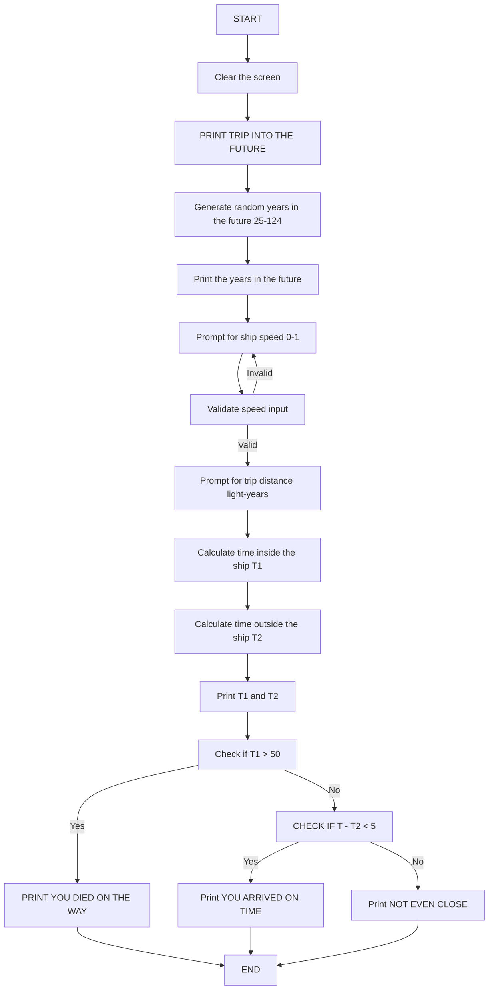

# Trip into the Future

**Book**: _Computer Spacegames_  
**Author**: Unknown (Usborne Publishing)

## Story

Imagine you are in a spaceship traveling nearly as fast as light. Strangely, time is passing more slowly inside your spaceship than outside. So, having set off on a long, fast space trip, you can return to Earth further in the future than the clocks inside your ship indicate.

In this game, the computer tells you how many years must elapse on Earth before you return. You then decide the length of your trip (in light years) and the speed of your ship (as a fraction of the speed of light) to achieve this. Be careful not to travel too far or too slowly, or you will die of old age on the way.

## Pseudocode

```plaintext
START
    CLEAR THE SCREEN
    PRINT "TRIP INTO THE FUTURE" // ZX-81 remains in CAPS
    GENERATE RANDOM YEARS IN THE FUTURE (25-124)
    PRINT THE YEARS IN THE FUTURE
    PROMPT FOR SHIP SPEED (0-1)
    VALIDATE SPEED INPUT
    PROMPT FOR TRIP DISTANCE (LIGHT YEARS)
    CALCULATE TIME INSIDE THE SHIP (T1)
    CALCULATE TIME OUTSIDE THE SHIP (T2)
    PRINT TIMES (T1 AND T2)
    CHECK IF T1 > 50
        IF TRUE, PRINT "YOU DIED ON THE WAY" AND END
    CHECK IF |T - T2| < 5
        IF TRUE, PRINT "YOU ARRIVED ON TIME"
        ELSE PRINT "NOT EVEN CLOSE"
END
```

## Flowchart



## Code

<details>
<summary>ZX-81</summary>

```basic
10 CLS
20 PRINT "TRIP INTO THE FUTURE"
30 LET T=INT(RND*100+25)
40 PRINT "YOU WISH TO RETURN ";T
50 PRINT "YEARS IN THE FUTURE."
60 PRINT
70 PRINT "SPEED OF SHIP (0-1)"
80 INPUT V
90 IF V>=1 OR V<=0 THEN GOTO 70
100 PRINT "DISTANCE OF TRIP"
110 INPUT D
120 LET T1=D/V
130 LET T2=T1/SQR(1-V*V)
140 PRINT "YOU TOOK ";T1;" YEARS"
150 PRINT "AND ARRIVED ";T2;" YEARS"
160 PRINT "IN THE FUTURE."
170 IF T1>50 THEN GOTO 210
180 IF ABS(T-T2)<5 THEN PRINT "YOU ARRIVED ON TIME"
190 IF ABS(T-T2)>5 THEN PRINT "NOT EVEN CLOSE"
200 STOP
210 PRINT "YOU DIED ON THE WAY"
220 STOP
```

</details>

<details>
<summary>C#</summary>

```csharp
using System;

class Program
{
    static void Main()
    {
        Console.Clear();
        Console.WriteLine("Trip into the future");

        Random random = new Random();
        int T = random.Next(25, 125);
        Console.WriteLine($"You wish to return {T} years in the future.");

        double V;
        do
        {
            Console.Write("SPEED OF SHIP (0-1): ");
            V = Convert.ToDouble(Console.ReadLine());
        } while (V <= 0 || V >= 1);

        Console.Write("DISTANCE OF TRIP: ");
        double D = Convert.ToDouble(Console.ReadLine());

        double T1 = D / V;
        double T2 = T1 / Math.Sqrt(1 - V * V);

        Console.WriteLine($"You took {T1:F2} years");
        Console.WriteLine($"And arrived {T2:F2} years in the future.");

        if (T1 > 50)
        {
            Console.WriteLine("You died on the way");
        }
        else if (Math.Abs(T - T2) < 5)
        {
            Console.WriteLine("You arrived on time");
        }
        else
        {
            Console.WriteLine("Not even close");
        }
    }
}
```

</details>

<details>
<summary>Python</summary>

```python
import math
import random

print("Trip into the future")

T = random.randint(25, 124)
print(f"You wish to return {T} years in the future.")

while True:
    V = float(input("SPEED OF SHIP (0-1): "))
    if 0 < V < 1:
        break

D = float(input("DISTANCE OF TRIP: "))

T1 = D / V
T2 = T1 / math.sqrt(1 - V**2)

print(f"You took {T1:.2f} years")
print(f"And arrived {T2:.2f} years in the future.")

if T1 > 50:
    print("You died on the way")
elif abs(T - T2) < 5:
    print("You arrived on time")
else:
    print("Not even close")
```

</details>

<details>
<summary>Java</summary>

```java
import java.util.Scanner;
import java.util.Random;

public class TripIntoTheFuture {
    public static void main(String[] args) {
        Scanner scanner = new Scanner(System.in);
        Random random = new Random();

        System.out.println("TRIP INTO THE FUTURE");

        int T = random.nextInt(100) + 25;
        System.out.println("YOU WISH TO RETURN " + T + " YEARS IN THE FUTURE.");

        double V;
        do {
            System.out.print("SPEED OF SHIP (0-1): ");
            V = scanner.nextDouble();
        } while (V <= 0 || V >= 1);

        System.out.print("DISTANCE OF TRIP: ");
        double D = scanner.nextDouble();

        double T1 = D / V;
        double T2 = T1 / Math.sqrt(1 - V * V);

        System.out.println("YOU TOOK " + String.format("%.2f", T1) + " YEARS");
        System.out.println("AND ARRIVED " + String.format("%.2f", T2) + " YEARS IN THE FUTURE.");

        if (T1 > 50) {
            System.out.println("YOU DIED ON THE WAY");
        } else if (Math.abs(T - T2) < 5) {
            System.out.println("YOU ARRIVED ON TIME");
        } else {
            System.out.println("NOT EVEN CLOSE");
        }

        scanner.close();
    }
}
```

</details>

<details>
<summary>GoLang</summary>

```go
package main

import (
	"fmt"
	"math"
	"math/rand"
	"time"
)

func main() {
	fmt.Println("TRIP INTO THE FUTURE")

	rand.Seed(time.Now().UnixNano())
	T := rand.Intn(100) + 25
	fmt.Printf("YOU WISH TO RETURN %d YEARS IN THE FUTURE.\n", T)

	var V float64
	for {
		fmt.Print("SPEED OF SHIP (0-1): ")
		fmt.Scan(&V)
		if V > 0 && V < 1 {
			break
		}
	}

	var D float64
	fmt.Print("DISTANCE OF TRIP: ")
	fmt.Scan(&D)

	T1 := D / V
	T2 := T1 / math.Sqrt(1-V*V)

	fmt.Printf("YOU TOOK %.2f YEARS\n", T1)
	fmt.Printf("AND ARRIVED %.2f YEARS IN THE FUTURE.\n", T2)

	if T1 > 50 {
		fmt.Println("YOU DIED ON THE WAY")
	} else if math.Abs(float64(T)-T2) < 5 {
		fmt.Println("YOU ARRIVED ON TIME")
	} else {
		fmt.Println("NOT EVEN CLOSE")
	}
}
```

</details>

<details>
<summary>C++</summary>

```cpp
#include <iostream>
#include <cmath>
#include <cstdlib>
#include <ctime>

int main() {
    std::srand(std::time(0));

    std::cout << "TRIP INTO THE FUTURE\n";

    int T = std::rand() % 100 + 25;
    std::cout << "YOU WISH TO RETURN " << T << " YEARS IN THE FUTURE.\n";

    double V;
    do {
        std::cout << "SPEED OF SHIP (0-1): ";
        std::cin >> V;
    } while (V <= 0 || V >= 1);

    double D;
    std::cout << "DISTANCE OF TRIP: ";
    std::cin >> D;

    double T1 = D / V;
    double T2 = T1 / std::sqrt(1 - V * V);

    std::cout << "YOU TOOK " << T1 << " YEARS\n";
    std::cout << "AND ARRIVED " << T2 << " YEARS IN THE FUTURE.\n";

    if (T1 > 50) {
        std::cout << "YOU DIED ON THE WAY\n";
    } else if (std::abs(T - T2) < 5) {
        std::cout << "YOU ARRIVED ON TIME\n";
    } else {
        std::cout << "NOT EVEN CLOSE\n";
    }

    return 0;
}
```

</details>

<details>
<summary>Rust</summary>

```rust
use rand::Rng;
use std::f64;
use std::io;

fn main() {
    println!("TRIP INTO THE FUTURE");

    let mut rng = rand::thread_rng();
    let t: i32 = rng.gen_range(25..125);
    println!("YOU WISH TO RETURN {} YEARS IN THE FUTURE.", t);

    let v: f64 = loop {
        println!("SPEED OF SHIP (0-1): ");
        let mut input = String::new();
        io::stdin().read_line(&mut input).unwrap();
        if let Ok(value) = input.trim().parse() {
            if value > 0.0 && value < 1.0 {
                break value;
            }
        }
    };

    println!("DISTANCE OF TRIP: ");
    let mut input = String::new();
    io::stdin().read_line(&mut input).unwrap();
    let d: f64 = input.trim().parse().unwrap();

    let t1 = d / v;
    let t2 = t1 / (1.0 - v * v).sqrt();

    println!("YOU TOOK {:.2} YEARS", t1);
    println!("AND ARRIVED {:.2} YEARS IN THE FUTURE.", t2);

    if t1 > 50.0 {
        println!("YOU DIED ON THE WAY");
    } else if (t as f64 - t2).abs() < 5.0 {
        println!("YOU ARRIVED ON TIME");
    } else {
        println!("NOT EVEN CLOSE");
    }
}
```

</details>

## Explanation

This game simulates a futuristic journey where the player must balance speed and distance to match a given time in the future. The player inputs the speed and distance, and the program calculates the time passed inside and outside the spaceship using relativistic formulas. Success depends on ensuring the time calculated matches the given target within a small margin of error.

## Challenges

1. **Wider Time Range**: Modify the random time generator to include a broader range of years.
2. **Higher Precision**: Increase the required precision for a successful arrival.
3. **Adjust Lifetime**: Allow players to set a custom maximum lifetime for their journey.

## Copyright

These programs are adaptations of the original Usborne Computer Guides published in the 1980s. The books are free to download for personal or educational use from [Usborne's Computer and Coding Books](https://usborne.com/row/books/computer-and-coding-books). Programs and adaptations may not be used for commercial purposes.

Return to [Computer Spacegames](./readme.md).

