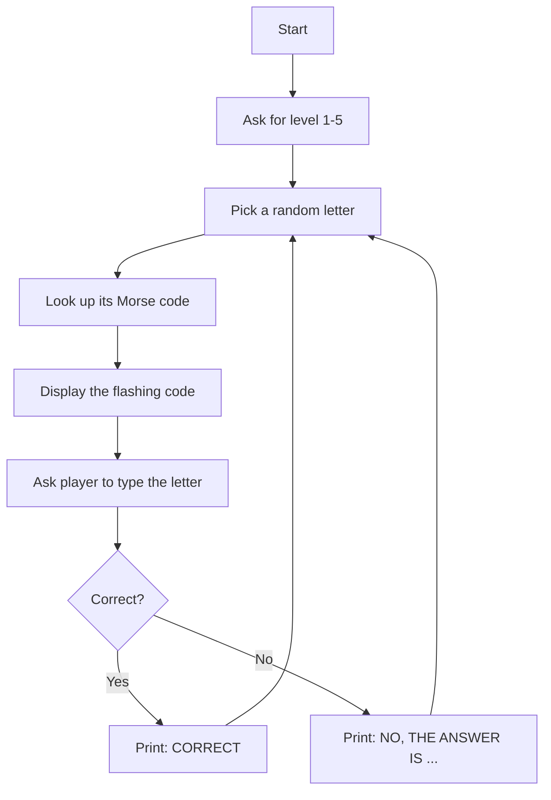
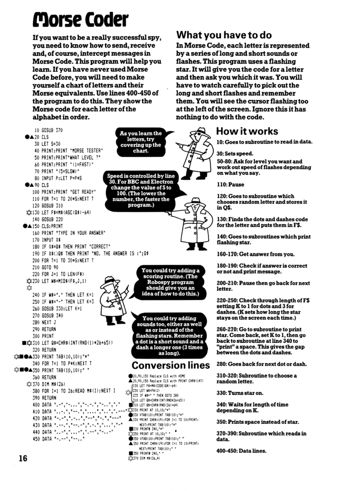

# Morse Coder

**Book**: _Computer Spy Games_   
**Author**: [Jenny Tyler and Chris Oxlade](https://github.com/marcusjobb/UsborneBooks)  
**Translator**: [Marcus Medina](http://marcusmedina.pro)  

## Story

If you want to be a really successful spy, you need to know how to send, receive and, of course, intercept messages in Morse Code. This program will help you learn. If you have never used Morse Code before, you will need to make yourself a chart of letters and their Morse equivalents.

In Morse Code, each letter is represented by a series of long and short sounds or flashes. This program uses a flashing star. It will give you the code for a letter and then ask you which it was. You will have to watch carefully to pick out the long and short flashes and remember them.

## Pseudocode

```plaintext
ASK for a level (1 = fast, 5 = slow)
LOOP forever
    PICK a random letter A-Z
    LOOK UP its Morse code (dots and dashes)
    DISPLAY the code as a sequence of flashes, timed by the chosen level
    ASK the player to type the letter it represents
    IF correct THEN print "CORRECT"
    ELSE print "NO, THE ANSWER IS" and the letter
END LOOP
```

## Flowchart



## Code

<details>
<summary>Pages</summary>



</details>

<details>
<summary>ZX-81 BASIC</summary>

```basic
10 GOSUB 370
20 CLS
30 LET S=30
40 PRINT:PRINT "MORSE TESTER"
50 PRINT:PRINT "WHAT LEVEL ?"
60 PRINT:PRINT "(1=FAST)"
70 PRINT "(5=SLOW)"
80 INPUT P:LET P=P*S
90 CLS
100 PRINT:PRINT "GET READY"
110 FOR T=1 TO 20*S:NEXT T
120 GOSUB 310
130 LET F$=M$(ASC(Q$)-64)
140 GOSUB 220
150 CLS:PRINT
160 PRINT "TYPE IN YOUR ANSWER"
170 INPUT X$
180 IF X$=Q$ THEN PRINT "CORRECT"
190 IF X$<>Q$ THEN PRINT "NO. THE ANSWER IS :";Q$
200 FOR T=1 TO 30*S:NEXT T
210 GOTO 90
220 FOR J=1 TO LEN(F$)
230 LET W$=MID$(F$,J,1)
240 IF W$="." THEN LET K=1
250 IF W$="-" THEN LET K=3
260 GOSUB 330:LET K=1
270 GOSUB 340
280 NEXT J
290 RETURN
300 PRINT
310 LET Q$=CHR$(INT(RND(1)*26+65))
320 RETURN
330 PRINT TAB(10,10);"*"
340 FOR T=1 TO P*K:NEXT T
350 PRINT TAB(10,10);" "
360 RETURN
370 DIM M$(26)
380 FOR I=1 TO 26:READ M$(I):NEXT I
390 RETURN
400 DATA ".-","-...","-.-.","-..","."
410 DATA "..-.","--.","....","..","---."
420 DATA "-.-",".-..","--","-.","---"
430 DATA ".--.","--.-",".-.","...","-"
440 DATA "..-","...-",".--","-..-","-.--"
450 DATA "--.."
```

</details>

<details>
<summary>C#</summary>

```csharp
using System;
using System.Threading;

class MorseCoder
{
    static string[] morse = {
        ".-", "-...", "-.-.", "-..", ".", "..-.", "--.", "....", "..", ".---",
        "-.-", ".-..", "--", "-.", "---", ".--.", "--.-", ".-.", "...", "-",
        "..-", "...-", ".--", "-..-", "-.--", "--.."
    };
    static Random rnd = new Random();

    static void Main()
    {
        Console.WriteLine("MORSE TESTER");
        Console.Write("\nWHAT LEVEL? (1=FAST, 5=SLOW): ");
        if (!int.TryParse(Console.ReadLine(), out int level)) level = 3;
        int speed = level * 150;

        while (true)
        {
            Console.WriteLine("\nGET READY");
            Thread.Sleep(500);

            char letter = (char)('A' + rnd.Next(26));
            string code = morse[letter - 'A'];

            Console.Write("Flashing: ");
            foreach (char c in code)
            {
                Console.Write("*");
                Thread.Sleep(c == '.' ? speed : speed * 3);
                Console.Write("\b \b");
                Thread.Sleep(speed);
            }
            Console.WriteLine();

            Console.Write("\nType in your answer: ");
            string answer = Console.ReadLine()?.Trim().ToUpper();
            if (answer == null) return;

            if (answer == letter.ToString())
                Console.WriteLine("CORRECT");
            else
                Console.WriteLine($"NO. THE ANSWER IS : {letter}");
        }
    }
}
```

</details>

<details>
<summary>Python</summary>

```python
import random
import time

MORSE = [
    ".-", "-...", "-.-.", "-..", ".", "..-.", "--.", "....", "..", ".---",
    "-.-", ".-..", "--", "-.", "---", ".--.", "--.-", ".-.", "...", "-",
    "..-", "...-", ".--", "-..-", "-.--", "--..",
]


def morse_coder():
    print("MORSE TESTER")
    try:
        level = int(input("\nWHAT LEVEL? (1=FAST, 5=SLOW): "))
    except ValueError:
        level = 3
    speed = level * 0.15

    while True:
        print("\nGET READY")
        time.sleep(0.5)

        letter = chr(random.randint(0, 25) + ord("A"))
        code = MORSE[ord(letter) - ord("A")]

        print("Flashing: ", end="", flush=True)
        for ch in code:
            print("*", end="", flush=True)
            time.sleep(speed if ch == "." else speed * 3)
            print("\b \b", end="", flush=True)
            time.sleep(speed)
        print()

        answer = input("\nType in your answer: ").strip().upper()

        if answer == letter:
            print("CORRECT")
        else:
            print(f"NO. THE ANSWER IS : {letter}")


if __name__ == "__main__":
    morse_coder()
```

</details>

<details>
<summary>Java</summary>

```java
import java.util.Random;
import java.util.Scanner;

public class MorseCoder {
    static String[] morse = {
        ".-", "-...", "-.-.", "-..", ".", "..-.", "--.", "....", "..", ".---",
        "-.-", ".-..", "--", "-.", "---", ".--.", "--.-", ".-.", "...", "-",
        "..-", "...-", ".--", "-..-", "-.--", "--.."
    };
    static Random rnd = new Random();
    static Scanner scanner = new Scanner(System.in);

    public static void main(String[] args) throws InterruptedException {
        System.out.println("MORSE TESTER");
        System.out.print("\nWHAT LEVEL? (1=FAST, 5=SLOW): ");
        int level;
        try {
            level = Integer.parseInt(scanner.nextLine().trim());
        } catch (NumberFormatException e) {
            level = 3;
        }
        int speed = level * 150;

        while (true) {
            System.out.println("\nGET READY");
            Thread.sleep(500);

            char letter = (char) ('A' + rnd.nextInt(26));
            String code = morse[letter - 'A'];

            System.out.print("Flashing: ");
            for (char c : code.toCharArray()) {
                System.out.print("*");
                Thread.sleep(c == '.' ? speed : speed * 3);
                System.out.print("\b \b");
                Thread.sleep(speed);
            }
            System.out.println();

            System.out.print("\nType in your answer: ");
            if (!scanner.hasNextLine()) return;
            String answer = scanner.nextLine().trim().toUpperCase();

            if (answer.equals(String.valueOf(letter)))
                System.out.println("CORRECT");
            else
                System.out.println("NO. THE ANSWER IS : " + letter);
        }
    }
}
```

</details>

<details>
<summary>Go</summary>

```go
package main

import (
	"bufio"
	"fmt"
	"math/rand"
	"os"
	"strconv"
	"strings"
	"time"
)

var morse = []string{
	".-", "-...", "-.-.", "-..", ".", "..-.", "--.", "....", "..", ".---",
	"-.-", ".-..", "--", "-.", "---", ".--.", "--.-", ".-.", "...", "-",
	"..-", "...-", ".--", "-..-", "-.--", "--..",
}

func main() {
	rand.Seed(time.Now().UnixNano())
	reader := bufio.NewReader(os.Stdin)

	fmt.Println("MORSE TESTER")
	fmt.Print("\nWHAT LEVEL? (1=FAST, 5=SLOW): ")
	line, err := reader.ReadString('\n')
	if err != nil {
		return
	}
	level, convErr := strconv.Atoi(strings.TrimSpace(line))
	if convErr != nil {
		level = 3
	}
	speed := time.Duration(level*150) * time.Millisecond

	for {
		fmt.Println("\nGET READY")
		time.Sleep(500 * time.Millisecond)

		letter := byte('A' + rand.Intn(26))
		code := morse[letter-'A']

		fmt.Print("Flashing: ")
		for _, c := range code {
			fmt.Print("*")
			if c == '.' {
				time.Sleep(speed)
			} else {
				time.Sleep(speed * 3)
			}
			fmt.Print("\b \b")
			time.Sleep(speed)
		}
		fmt.Println()

		fmt.Print("\nType in your answer: ")
		line, err := reader.ReadString('\n')
		if err != nil {
			return
		}
		answer := strings.ToUpper(strings.TrimSpace(line))

		if answer == string(letter) {
			fmt.Println("CORRECT")
		} else {
			fmt.Printf("NO. THE ANSWER IS : %c\n", letter)
		}
	}
}
```

</details>

<details>
<summary>C++</summary>

```cpp
#include <iostream>
#include <string>
#include <cstdlib>
#include <ctime>
#include <thread>
#include <chrono>
#include <algorithm>

std::string morse[26] = {
    ".-", "-...", "-.-.", "-..", ".", "..-.", "--.", "....", "..", ".---",
    "-.-", ".-..", "--", "-.", "---", ".--.", "--.-", ".-.", "...", "-",
    "..-", "...-", ".--", "-..-", "-.--", "--.."
};

int main() {
    srand(time(0));

    std::cout << "MORSE TESTER" << std::endl;
    std::cout << "\nWHAT LEVEL? (1=FAST, 5=SLOW): ";
    std::string input;
    std::getline(std::cin, input);
    int level;
    try {
        level = std::stoi(input);
    } catch (...) {
        level = 3;
    }
    int speed = level * 150;

    while (true) {
        std::cout << "\nGET READY" << std::endl;
        std::this_thread::sleep_for(std::chrono::milliseconds(500));

        char letter = 'A' + rand() % 26;
        std::string code = morse[letter - 'A'];

        std::cout << "Flashing: ";
        for (char c : code) {
            std::cout << "*" << std::flush;
            std::this_thread::sleep_for(std::chrono::milliseconds(c == '.' ? speed : speed * 3));
            std::cout << "\b \b" << std::flush;
            std::this_thread::sleep_for(std::chrono::milliseconds(speed));
        }
        std::cout << std::endl;

        std::cout << "\nType in your answer: ";
        if (!std::getline(std::cin, input)) return 0;
        std::transform(input.begin(), input.end(), input.begin(), ::toupper);

        if (input.length() == 1 && input[0] == letter)
            std::cout << "CORRECT" << std::endl;
        else
            std::cout << "NO. THE ANSWER IS : " << letter << std::endl;
    }
}
```

</details>

## Explanation

A random letter's Morse code flashes on screen, timed to the speed level you chose, and you have to type which letter it was. Watch the pattern of short and long flashes carefully — a dash lasts three times as long as a dot.

## Challenges

1. **Scoring**: Add a scoring routine, as the book itself suggests — the Robospy program should give you an idea of how to do it.
2. **Sound**: Add sound as well as, or instead of, the flashing star.
3. **Reverse mode**: Show the letter and ask the player to type the Morse code back.

## Copyright

These programs are adaptations of the original Usborne Computer Guides published in the 1980s. The books are free to download for personal or educational use from [Usborne's Computer and Coding Books](https://usborne.com/row/books/computer-and-coding-books). Programs and adaptations may not be used for commercial purposes.

Return to [Computer Spy Games](./readme.md).
