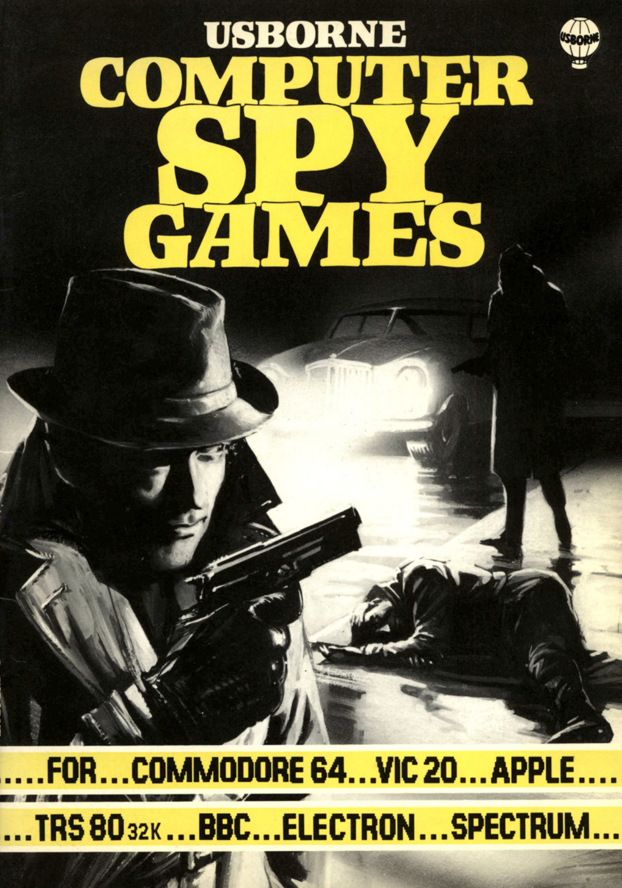

# Computer Spy Games

## About the Book

_Computer Spy Games_ is one of the classic Usborne computer books from the 1980s, putting kids and adults in the shoes of a secret agent — sending coded messages, tailing enemy spies, and pulling off a full rendezvous mission against the clock. Originally written for early home computers like the ZX-81 and Commodore 64, the book made programming approachable and fun through spy-themed stories and challenges.

## Games Included

The book contains the following games:

1. [**Spy Eyes**](./spy_eyes.md) - Watch nine numbers carefully and spot which one moves.
2. [**Searchlight**](./searchlight.md) - Sneak across enemy territory, dodging a sweeping searchlight.
3. [**Robospy**](./robospy.md) - Track an agent's turns and repeat his exact sequence of moves.
4. [**Spy Q Test**](./spy_q_test.md) - Sort incoming numbers into order to climb the spy grades.
5. [**Secret Message Maker**](./secret_message_maker.md) - Code and decode secret messages for your friends.
6. [**Rendezvous**](./rendezvous.md) - A full spy mission: find the key, grab the case, and make the handoff before the last flight leaves.
7. [**Morse Coder**](./morse_coder.md) - Learn to read Morse code from a flashing star.

## Why Adapt This Book?

The games in _Computer Spy Games_ are timeless examples of how coding can be fun, educational, and creative. By adapting these games into modern programming languages, we:

- Keep the magic of the original book alive for new generations.
- Provide a hands-on way to learn coding concepts.
- Honor the creativity and innovation of 1980s computing.

## Organization

Each game from the book is presented in its own Markdown file. These files include:

- **The story** behind the game.
- **Code translations** in modern languages: C#, Python, Java, Go, and C++.
- **Beginner-friendly comments** to help new coders understand key concepts.
- **Challenges** to make the games harder or expand their functionality.

You can explore each game by navigating through the files in this folder.

## Copyright Notice

These programs are adaptations of the original Usborne Computer Guides published in the 1980s. The books are free to download for personal or educational use from [Usborne's Computer and Coding Books](https://usborne.com/row/books/computer-and-coding-books). Programs and adaptations may not be used for commercial purposes.
