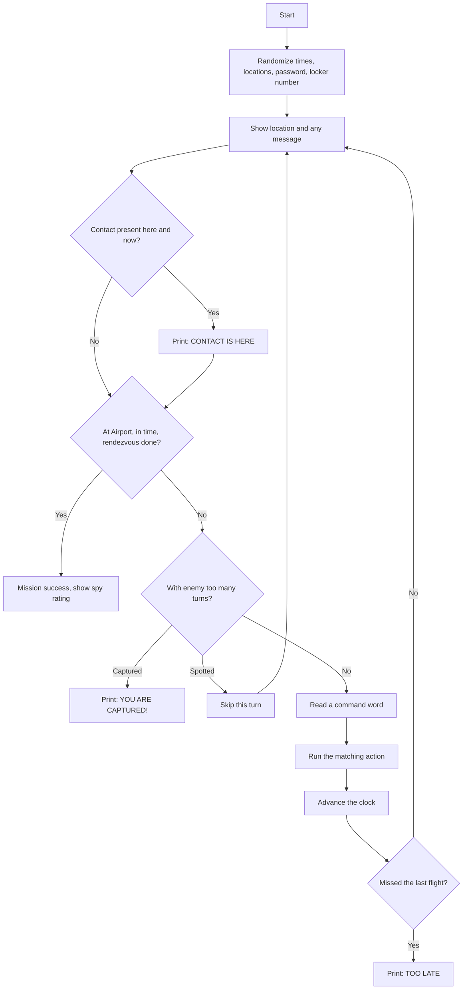
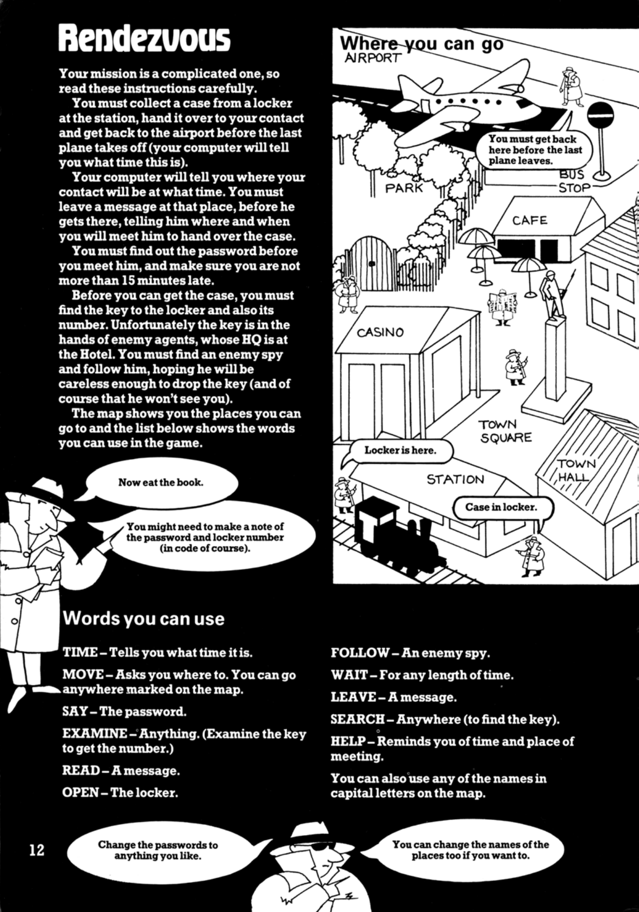
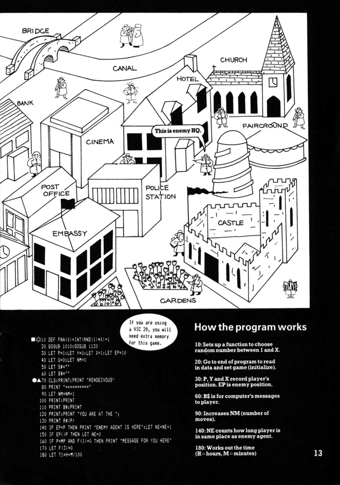
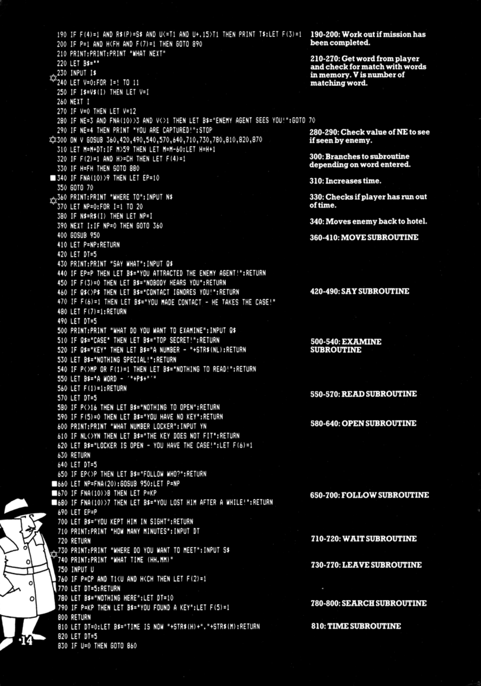
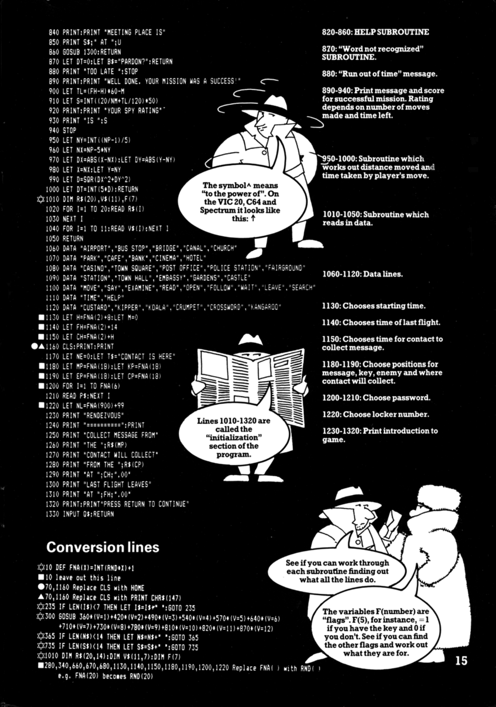

# Rendezvous

**Book**: _Computer Spy Games_   
**Author**: [Jenny Tyler and Chris Oxlade](https://github.com/marcusjobb/UsborneBooks)  
**Translator**: [Marcus Medina](http://marcusmedina.pro)  

## Story

Your mission is a complicated one, so read these instructions carefully.

You must collect a case from a locker at the station, hand it over to your contact and get back to the airport before the last plane takes off (your computer will tell you what time this is).

Your computer will tell you where your contact will be at what time. You must leave a message at that place, before he gets there, telling him where and when you will meet him to hand over the case.

You must find out the password before you meet him, and make sure you are not more than 15 minutes late.

Before you can get the case, you must find the key to the locker and also its number. Unfortunately the key is in the hands of enemy agents, whose HQ is at the Hotel. You must find an enemy spy and follow him, hoping he will be careless enough to drop the key (and of course that he won't see you).

The map shows you the places you can go to: Airport, Bus Stop, Bridge, Canal, Church, Park, Cafe, Bank, Cinema, Hotel, Casino, Town Square, Post Office, Police Station, Fairground, Station, Town Hall, Embassy, Gardens and Castle.

### Words you can use

- **MOVE** — Asks you where to. You can go anywhere marked on the map.
- **SAY** — The password.
- **EXAMINE** — Anything. (Examine the key to get the number.)
- **READ** — A message.
- **OPEN** — The locker.
- **FOLLOW** — An enemy spy.
- **WAIT** — For any length of time.
- **LEAVE** — A message.
- **SEARCH** — Anywhere (to find the key).
- **TIME** — Tells you what time it is.
- **HELP** — Reminds you of time and place of meeting.

You can also use any of the place names in capital letters on the map. You might need to make a note of the password and locker number (in code of course).

## Pseudocode

```plaintext
SET random start time, last-flight time, contact-collection time
SET random locations for: message, key, enemy agent, contact pickup point
SET random password and random locker number
SET player at the Airport

LOOP forever
    IF message-left conditions are met AND contact's hour has arrived THEN contact is now waiting
    IF player is at the meeting place within 15 minutes of the meeting time THEN contact is present
    IF player is back at Airport, before the last flight, and the password exchange succeeded THEN WIN
    DISPLAY current location and any message
    IF stayed with enemy 3 turns running (bad luck) THEN "ENEMY AGENT SEES YOU!" and skip this turn
    IF stayed with enemy 4 turns running THEN CAPTURED - lose
    READ a command word
    DISPATCH to MOVE / SAY / EXAMINE / READ / OPEN / FOLLOW / WAIT / LEAVE / SEARCH / TIME / HELP
    ADVANCE the clock by however long that action took
    IF the last flight's hour has arrived THEN TOO LATE - lose
END LOOP
```

## Flowchart



## Code

<details>
<summary>Pages</summary>

  
  
  


</details>

<details>
<summary>ZX-81 BASIC</summary>

```basic
10 DEF FNA(X)=INT(RND(1)*X)+1
20 GOSUB 1010:GOSUB 1130
30 LET P=1:LET Y=0:LET X=1:LET EP=10
40 LET U=0:LET NM=0
50 LET S$=""
60 LET B$=""
70 CLS:PRINT:PRINT "RENDEZVOUS"
80 PRINT "==========="
90 LET NM=NM+1
100 PRINT:PRINT
110 PRINT B$:PRINT
120 PRINT:PRINT "YOU ARE AT THE ";
130 PRINT R$(P)
140 IF EP=P THEN PRINT "ENEMY AGENT IS HERE":LET NE=NE+1
150 IF EP<>P THEN LET NE=0
160 IF P=MP AND F(1)=0 THEN PRINT "MESSAGE FOR YOU HERE"
170 LET F(3)=0
180 LET T1=H+M/100
190 IF F(4)=1 AND R$(P)=S$ AND U<=T1 AND U+.15>T1 THEN PRINT T$:LET F(3)=1
200 IF P=1 AND H<FH AND F(7)=1 THEN GOTO 890
210 PRINT:PRINT:PRINT "WHAT NEXT"
220 LET B$=""
230 INPUT I$
240 LET V=0:FOR I=1 TO 11
250 IF I$=V$(I) THEN LET V=I
260 NEXT I
270 IF V=0 THEN LET V=12
280 IF NE=3 AND FNA(10)>3 AND V<>1 THEN LET B$="ENEMY AGENT SEES YOU!":GOTO 70
290 IF NE=4 THEN PRINT "YOU ARE CAPTURED!":STOP
300 ON V GOSUB 360,420,490,540,570,640,710,730,780,810,820,870
310 LET M=M+DT:IF M>59 THEN LET M=M-60:LET H=H+1
320 IF F(2)=1 AND H>=CH THEN LET F(4)=1
330 IF H=FH THEN GOTO 880
340 IF FNA(10)>9 THEN LET EP=10
350 GOTO 70
360 PRINT:PRINT "WHERE TO":INPUT N$
370 LET NP=0:FOR I=1 TO 20
380 IF N$=R$(I) THEN LET NP=I
390 NEXT I:IF NP=0 THEN GOTO 360
400 GOSUB 950
410 LET P=NP:RETURN
420 LET DT=5
430 PRINT:PRINT "SAY WHAT":INPUT Q$
440 IF EP=P THEN LET B$="YOU ATTRACTED THE ENEMY AGENT!":RETURN
450 IF F(3)=0 THEN LET B$="NOBODY HEARS YOU":RETURN
460 IF Q$<>P$ THEN LET B$="CONTACT IGNORES YOU!":RETURN
470 IF F(6)=1 THEN LET B$="YOU MADE CONTACT - HE TAKES THE CASE!"
480 LET F(7)=1:RETURN
490 LET DT=5
500 PRINT:PRINT "WHAT DO YOU WANT TO EXAMINE":INPUT Q$
510 IF Q$="CASE" THEN LET B$="TOP SECRET!":RETURN
520 IF Q$="KEY" THEN LET B$="A NUMBER - "+STR$(NL):RETURN
530 LET B$="NOTHING SPECIAL!":RETURN
540 IF P<>MP OR F(1)=1 THEN LET B$="NOTHING TO READ!":RETURN
550 LET B$="A WORD - '"+P$+"'"
560 LET F(1)=1:RETURN
570 LET DT=5
580 IF P<>16 THEN LET B$="NOTHING TO OPEN":RETURN
590 IF F(5)=0 THEN LET B$="YOU HAVE NO KEY":RETURN
600 PRINT:PRINT "WHAT NUMBER LOCKER":INPUT YN
610 IF NL<>YN THEN LET B$="THE KEY DOES NOT FIT":RETURN
620 LET B$="LOCKER IS OPEN - YOU HAVE THE CASE!":LET F(6)=1
630 RETURN
640 LET DT=5
650 IF EP<>P THEN LET B$="FOLLOW WHO?":RETURN
660 LET NP=FNA(20):GOSUB 950:LET P=NP
670 IF FNA(10)>8 THEN LET P=KP
680 IF FNA(10)>7 THEN LET B$="YOU LOST HIM AFTER A WHILE!":RETURN
690 LET EP=P
700 LET B$="YOU KEPT HIM IN SIGHT":RETURN
710 PRINT:PRINT "HOW MANY MINUTES":INPUT DT
720 RETURN
730 PRINT:PRINT "WHERE DO YOU WANT TO MEET":INPUT S$
740 PRINT:PRINT "WHAT TIME (HH.MM)"
750 INPUT U
760 IF P=CP AND T1<U AND H<CH THEN LET F(2)=1
770 LET DT=5:RETURN
780 LET B$="NOTHING HERE":LET DT=10
790 IF P=KP THEN LET B$="YOU FOUND A KEY":LET F(5)=1
800 RETURN
810 LET DT=0:LET B$="TIME IS NOW "+STR$(H)+"."+STR$(M):RETURN
820 LET DT=5
830 IF U=0 THEN GOTO 860
840 PRINT:PRINT "MEETING PLACE IS"
850 PRINT S$;" AT ";U
860 GOSUB 1300:RETURN
870 LET DT=0:LET B$="PARDON?":RETURN
880 PRINT "TOO LATE":STOP
890 PRINT:PRINT "WELL DONE. YOUR MISSION WAS A SUCCESS!"
900 LET TL=(FH-H)*60-M
910 LET S=INT((20/NM+TL/120)*50)
920 PRINT:PRINT "YOUR SPY RATING"
930 PRINT "IS ";S
940 STOP
950 LET NY=INT((NP-1)/5)
960 LET NX=NP-5*NY
970 LET DX=ABS(X-NX):LET DY=ABS(Y-NY)
980 LET X=NX:LET Y=NY
990 LET D=SQR(DX^2+DY^2)
1000 LET DT=INT(5*D):RETURN
1010 DIM R$(20),V$(11),F(7)
1020 FOR I=1 TO 20:READ R$(I)
1030 NEXT I
1040 FOR I=1 TO 11:READ V$(I):NEXT I
1050 RETURN
1060 DATA "AIRPORT","BUS STOP","BRIDGE","CANAL","CHURCH"
1070 DATA "PARK","CAFE","BANK","CINEMA","HOTEL"
1080 DATA "CASINO","TOWN SQUARE","POST OFFICE","POLICE STATION","FAIRGROUND"
1090 DATA "STATION","TOWN HALL","EMBASSY","GARDENS","CASTLE"
1100 DATA "MOVE","SAY","EXAMINE","READ","OPEN","FOLLOW","WAIT","LEAVE","SEARCH"
1110 DATA "TIME","HELP"
1120 DATA "CUSTARD","KIPPER","KOALA","CRUMPET","CROSSWORD","KANGAROO"
1130 LET H=FNA(2)+8:LET M=0
1140 LET FH=FNA(2)+14
1150 LET CH=FNA(2)+H
1160 CLS:PRINT:PRINT
1170 LET NE=0:LET T$="CONTACT IS HERE"
1180 LET MP=FNA(18):LET KP=FNA(18)
1190 LET EP=FNA(18):LET CP=FNA(18)
1200 FOR I=1 TO FNA(6)
1210 READ P$:NEXT I
1220 LET NL=FNA(900)+99
1230 PRINT "RENDEZVOUS"
1240 PRINT "==========":PRINT
1250 PRINT "COLLECT MESSAGE FROM"
1260 PRINT "THE ";R$(MP)
1270 PRINT "CONTACT WILL COLLECT"
1280 PRINT "FROM THE ";R$(CP)
1290 PRINT "AT ";CH;".00"
1300 PRINT "LAST FLIGHT LEAVES"
1310 PRINT "AT ";FH;".00"
1320 PRINT:PRINT "PRESS RETURN TO CONTINUE"
1330 INPUT Q$:RETURN
```

</details>

<details>
<summary>C#</summary>

```csharp
using System;

class Rendezvous
{
    static Random rnd = new Random();
    static string[] locations = { "", "AIRPORT", "BUS STOP", "BRIDGE", "CANAL", "CHURCH",
        "PARK", "CAFE", "BANK", "CINEMA", "HOTEL", "CASINO", "TOWN SQUARE", "POST OFFICE",
        "POLICE STATION", "FAIRGROUND", "STATION", "TOWN HALL", "EMBASSY", "GARDENS", "CASTLE" };
    static string[] verbs = { "", "MOVE", "SAY", "EXAMINE", "READ", "OPEN", "FOLLOW", "WAIT", "LEAVE", "SEARCH", "TIME", "HELP" };
    static string[] passwords = { "CUSTARD", "KIPPER", "KOALA", "CRUMPET", "CROSSWORD", "KANGAROO" };

    static int p, x, y, ep, u, nm, ne, mp, kp, cp, nl, h, m, fh, ch, dt;
    static double uVal = 0, t1;
    static int[] f = new int[8];
    static string s = "", b = "", password;

    static int Fna(int n) => rnd.Next(n) + 1;

    static void Main()
    {
        p = 1; y = 0; x = 1; ep = 10;
        u = 0; nm = 0;
        h = Fna(2) + 8; m = 0;
        fh = Fna(2) + 14;
        ch = Fna(2) + h;
        ne = 0;
        mp = Fna(18); kp = Fna(18);
        ep = Fna(18); cp = Fna(18);
        password = passwords[rnd.Next(passwords.Length)];
        nl = Fna(900) + 99;

        Console.WriteLine("RENDEZVOUS");
        Console.WriteLine("===========\n");
        Console.WriteLine($"COLLECT MESSAGE FROM THE {locations[mp]}");
        Console.WriteLine($"CONTACT WILL COLLECT FROM THE {locations[cp]}");
        Console.WriteLine($"AT {ch}.00");
        Console.WriteLine($"LAST FLIGHT LEAVES AT {fh}.00");
        Console.Write("\nPRESS RETURN TO CONTINUE");
        Console.ReadLine();

        while (true)
        {
            Console.WriteLine("\nRENDEZVOUS");
            Console.WriteLine("===========");
            nm++;
            Console.WriteLine();
            Console.WriteLine(b);
            b = "";
            Console.WriteLine($"\nYOU ARE AT THE {locations[p]}");

            if (ep == p) { Console.WriteLine("ENEMY AGENT IS HERE"); ne++; }
            else ne = 0;

            if (p == mp && f[1] == 0) Console.WriteLine("MESSAGE FOR YOU HERE");

            f[3] = 0;
            t1 = h + m / 100.0;
            if (f[4] == 1 && locations[p] == s && u <= t1 && u + 0.15 > t1)
            {
                Console.WriteLine("CONTACT IS HERE");
                f[3] = 1;
            }

            if (p == 1 && h < fh && f[7] == 1) { Win(); return; }

            Console.Write("\nWHAT NEXT: ");
            string input = Console.ReadLine()?.Trim().ToUpper();
            if (input == null) return;

            int v = 0;
            for (int i = 1; i <= 11; i++)
                if (input == verbs[i]) v = i;
            if (v == 0) v = 12;

            if (ne == 3 && Fna(10) > 3 && v != 1) { b = "ENEMY AGENT SEES YOU!"; continue; }
            if (ne == 4) { Console.WriteLine("YOU ARE CAPTURED!"); return; }

            bool quit = Dispatch(v);
            if (quit) return;

            m += dt;
            if (m > 59) { m -= 60; h++; }
            if (f[2] == 1 && h >= ch) f[4] = 1;
            if (h == fh) { Console.WriteLine("TOO LATE"); return; }
            if (Fna(10) > 9) ep = 10;
        }
    }

    static bool Dispatch(int v)
    {
        switch (v)
        {
            case 1: return Move();
            case 2: return Say();
            case 3: return Examine();
            case 4: return Read();
            case 5: return Open();
            case 6: return Follow();
            case 7: return Wait();
            case 8: return Leave();
            case 9: return Search();
            case 10: return Time();
            case 11: return Help();
            default: dt = 0; b = "PARDON?"; return false;
        }
    }

    static bool Move()
    {
        while (true)
        {
            Console.Write("\nWHERE TO: ");
            string n = Console.ReadLine()?.Trim().ToUpper();
            if (n == null) return true;
            int np = 0;
            for (int i = 1; i <= 20; i++)
                if (n == locations[i]) np = i;
            if (np == 0) continue;
            Travel(np);
            p = np;
            return false;
        }
    }

    static void Travel(int np)
    {
        int ny = (np - 1) / 5;
        int nx = np - 5 * ny;
        int dx = Math.Abs(x - nx), dy = Math.Abs(y - ny);
        x = nx; y = ny;
        double d = Math.Sqrt(dx * dx + dy * dy);
        dt = (int)(5 * d);
    }

    static bool Say()
    {
        dt = 5;
        Console.Write("\nSAY WHAT: ");
        string q = Console.ReadLine()?.Trim().ToUpper();
        if (q == null) return true;
        if (ep == p) { b = "YOU ATTRACTED THE ENEMY AGENT!"; return false; }
        if (f[3] == 0) { b = "NOBODY HEARS YOU"; return false; }
        if (q != password) { b = "CONTACT IGNORES YOU!"; return false; }
        if (f[6] == 1) b = "YOU MADE CONTACT - HE TAKES THE CASE!";
        f[7] = 1;
        return false;
    }

    static bool Examine()
    {
        dt = 5;
        Console.Write("\nWHAT DO YOU WANT TO EXAMINE: ");
        string q = Console.ReadLine()?.Trim().ToUpper();
        if (q == null) return true;
        if (q == "CASE") { b = "TOP SECRET!"; return false; }
        if (q == "KEY") { b = $"A NUMBER - {nl}"; return false; }
        b = "NOTHING SPECIAL!";
        return false;
    }

    static bool Read()
    {
        if (p != mp || f[1] == 1) { b = "NOTHING TO READ!"; return false; }
        b = $"A WORD - '{password}'";
        f[1] = 1;
        return false;
    }

    static bool Open()
    {
        dt = 5;
        if (p != 16) { b = "NOTHING TO OPEN"; return false; }
        if (f[5] == 0) { b = "YOU HAVE NO KEY"; return false; }
        Console.Write("\nWHAT NUMBER LOCKER: ");
        string input = Console.ReadLine();
        if (input == null) return true;
        if (!int.TryParse(input.Trim(), out int yn) || yn != nl) { b = "THE KEY DOES NOT FIT"; return false; }
        b = "LOCKER IS OPEN - YOU HAVE THE CASE!";
        f[6] = 1;
        return false;
    }

    static bool Follow()
    {
        dt = 5;
        if (ep != p) { b = "FOLLOW WHO?"; return false; }
        int np = Fna(20);
        Travel(np);
        p = np;
        if (Fna(10) > 8) p = kp;
        if (Fna(10) > 7) { b = "YOU LOST HIM AFTER A WHILE!"; return false; }
        ep = p;
        b = "YOU KEPT HIM IN SIGHT";
        return false;
    }

    static bool Wait()
    {
        Console.Write("\nHOW MANY MINUTES: ");
        string input = Console.ReadLine();
        if (input == null) return true;
        if (!int.TryParse(input.Trim(), out dt)) dt = 0;
        return false;
    }

    static bool Leave()
    {
        Console.Write("\nWHERE DO YOU WANT TO MEET: ");
        s = Console.ReadLine()?.Trim().ToUpper();
        if (s == null) return true;
        Console.Write("\nWHAT TIME (HH.MM): ");
        string input = Console.ReadLine();
        if (input == null) return true;
        double.TryParse(input.Trim(), out uVal);
        if (p == cp && t1 < uVal && h < ch) f[2] = 1;
        u = (int)uVal;
        dt = 5;
        return false;
    }

    static bool Search()
    {
        b = "NOTHING HERE"; dt = 10;
        if (p == kp) { b = "YOU FOUND A KEY"; f[5] = 1; }
        return false;
    }

    static bool Time()
    {
        dt = 0;
        b = $"TIME IS NOW {h}.{m:D2}";
        return false;
    }

    static bool Help()
    {
        dt = 5;
        if (uVal != 0)
        {
            Console.WriteLine("\nMEETING PLACE IS");
            Console.WriteLine($"{s} AT {uVal}");
        }
        Console.WriteLine($"LAST FLIGHT LEAVES AT {fh}.00");
        return false;
    }

    static void Win()
    {
        Console.WriteLine("\nWELL DONE. YOUR MISSION WAS A SUCCESS!");
        int tl = (fh - h) * 60 - m;
        int score = (int)((20.0 / nm + tl / 120.0) * 50);
        Console.WriteLine($"\nYOUR SPY RATING IS {score}");
    }
}
```

</details>

<details>
<summary>Python</summary>

```python
import random
import math

LOCATIONS = ["", "AIRPORT", "BUS STOP", "BRIDGE", "CANAL", "CHURCH",
    "PARK", "CAFE", "BANK", "CINEMA", "HOTEL", "CASINO", "TOWN SQUARE", "POST OFFICE",
    "POLICE STATION", "FAIRGROUND", "STATION", "TOWN HALL", "EMBASSY", "GARDENS", "CASTLE"]
VERBS = ["", "MOVE", "SAY", "EXAMINE", "READ", "OPEN", "FOLLOW", "WAIT", "LEAVE", "SEARCH", "TIME", "HELP"]
PASSWORDS = ["CUSTARD", "KIPPER", "KOALA", "CRUMPET", "CROSSWORD", "KANGAROO"]


def fna(n):
    return random.randint(1, n)


class Game:
    def __init__(self):
        self.p = 1
        self.x = 1
        self.y = 0
        self.u = 0
        self.u_val = 0.0
        self.nm = 0
        self.ne = 0
        self.s = ""
        self.b = ""
        self.f = [0] * 8
        self.dt = 0
        self.t1 = 0.0

        self.h = fna(2) + 8
        self.m = 0
        self.fh = fna(2) + 14
        self.ch = fna(2) + self.h
        self.mp = fna(18)
        self.kp = fna(18)
        self.ep = fna(18)
        self.cp = fna(18)
        self.password = random.choice(PASSWORDS)
        self.nl = fna(900) + 99

    def travel(self, np):
        ny = (np - 1) // 5
        nx = np - 5 * ny
        dx = abs(self.x - nx)
        dy = abs(self.y - ny)
        self.x, self.y = nx, ny
        d = math.sqrt(dx * dx + dy * dy)
        self.dt = int(5 * d)

    def intro(self):
        print("RENDEZVOUS")
        print("===========\n")
        print(f"COLLECT MESSAGE FROM THE {LOCATIONS[self.mp]}")
        print(f"CONTACT WILL COLLECT FROM THE {LOCATIONS[self.cp]}")
        print(f"AT {self.ch}.00")
        print(f"LAST FLIGHT LEAVES AT {self.fh}.00")
        input("\nPRESS RETURN TO CONTINUE")

    def move(self):
        while True:
            n = input("\nWHERE TO: ").strip().upper()
            np = 0
            for i in range(1, 21):
                if n == LOCATIONS[i]:
                    np = i
            if np == 0:
                continue
            self.travel(np)
            self.p = np
            return False

    def say(self):
        self.dt = 5
        q = input("\nSAY WHAT: ").strip().upper()
        if self.ep == self.p:
            self.b = "YOU ATTRACTED THE ENEMY AGENT!"
            return False
        if self.f[3] == 0:
            self.b = "NOBODY HEARS YOU"
            return False
        if q != self.password:
            self.b = "CONTACT IGNORES YOU!"
            return False
        if self.f[6] == 1:
            self.b = "YOU MADE CONTACT - HE TAKES THE CASE!"
        self.f[7] = 1
        return False

    def examine(self):
        self.dt = 5
        q = input("\nWHAT DO YOU WANT TO EXAMINE: ").strip().upper()
        if q == "CASE":
            self.b = "TOP SECRET!"
        elif q == "KEY":
            self.b = f"A NUMBER - {self.nl}"
        else:
            self.b = "NOTHING SPECIAL!"
        return False

    def read(self):
        if self.p != self.mp or self.f[1] == 1:
            self.b = "NOTHING TO READ!"
            return False
        self.b = f"A WORD - '{self.password}'"
        self.f[1] = 1
        return False

    def open_locker(self):
        self.dt = 5
        if self.p != 16:
            self.b = "NOTHING TO OPEN"
            return False
        if self.f[5] == 0:
            self.b = "YOU HAVE NO KEY"
            return False
        try:
            yn = int(input("\nWHAT NUMBER LOCKER: ").strip())
        except ValueError:
            yn = -1
        if yn != self.nl:
            self.b = "THE KEY DOES NOT FIT"
            return False
        self.b = "LOCKER IS OPEN - YOU HAVE THE CASE!"
        self.f[6] = 1
        return False

    def follow(self):
        self.dt = 5
        if self.ep != self.p:
            self.b = "FOLLOW WHO?"
            return False
        np = fna(20)
        self.travel(np)
        self.p = np
        if fna(10) > 8:
            self.p = self.kp
        if fna(10) > 7:
            self.b = "YOU LOST HIM AFTER A WHILE!"
            return False
        self.ep = self.p
        self.b = "YOU KEPT HIM IN SIGHT"
        return False

    def wait(self):
        try:
            self.dt = int(input("\nHOW MANY MINUTES: ").strip())
        except ValueError:
            self.dt = 0
        return False

    def leave(self):
        self.s = input("\nWHERE DO YOU WANT TO MEET: ").strip().upper()
        try:
            self.u_val = float(input("\nWHAT TIME (HH.MM): ").strip())
        except ValueError:
            self.u_val = 0.0
        if self.p == self.cp and self.t1 < self.u_val and self.h < self.ch:
            self.f[2] = 1
        self.u = self.u_val
        self.dt = 5
        return False

    def search(self):
        self.b = "NOTHING HERE"
        self.dt = 10
        if self.p == self.kp:
            self.b = "YOU FOUND A KEY"
            self.f[5] = 1
        return False

    def time(self):
        self.dt = 0
        self.b = f"TIME IS NOW {self.h}.{self.m:02d}"
        return False

    def help(self):
        self.dt = 5
        if self.u_val != 0:
            print("\nMEETING PLACE IS")
            print(f"{self.s} AT {self.u_val}")
        print(f"LAST FLIGHT LEAVES AT {self.fh}.00")
        return False

    def win(self):
        print("\nWELL DONE. YOUR MISSION WAS A SUCCESS!")
        tl = (self.fh - self.h) * 60 - self.m
        score = int((20 / self.nm + tl / 120) * 50)
        print(f"\nYOUR SPY RATING IS {score}")

    def dispatch(self, v):
        actions = {
            1: self.move, 2: self.say, 3: self.examine, 4: self.read,
            5: self.open_locker, 6: self.follow, 7: self.wait,
            8: self.leave, 9: self.search, 10: self.time, 11: self.help,
        }
        if v in actions:
            return actions[v]()
        self.dt = 0
        self.b = "PARDON?"
        return False

    def play(self):
        self.intro()
        while True:
            print("\nRENDEZVOUS")
            print("===========")
            self.nm += 1
            print()
            print(self.b)
            self.b = ""
            print(f"\nYOU ARE AT THE {LOCATIONS[self.p]}")

            if self.ep == self.p:
                print("ENEMY AGENT IS HERE")
                self.ne += 1
            else:
                self.ne = 0

            if self.p == self.mp and self.f[1] == 0:
                print("MESSAGE FOR YOU HERE")

            self.f[3] = 0
            self.t1 = self.h + self.m / 100
            if self.f[4] == 1 and LOCATIONS[self.p] == self.s and self.u <= self.t1 < self.u + 0.15:
                print("CONTACT IS HERE")
                self.f[3] = 1

            if self.p == 1 and self.h < self.fh and self.f[7] == 1:
                self.win()
                return

            command = input("\nWHAT NEXT: ").strip().upper()

            v = 0
            for i in range(1, 12):
                if command == VERBS[i]:
                    v = i
            if v == 0:
                v = 12

            if self.ne == 3 and fna(10) > 3 and v != 1:
                self.b = "ENEMY AGENT SEES YOU!"
                continue
            if self.ne == 4:
                print("YOU ARE CAPTURED!")
                return

            self.dispatch(v)

            self.m += self.dt
            if self.m > 59:
                self.m -= 60
                self.h += 1
            if self.f[2] == 1 and self.h >= self.ch:
                self.f[4] = 1
            if self.h == self.fh:
                print("TOO LATE")
                return
            if fna(10) > 9:
                self.ep = 10


if __name__ == "__main__":
    Game().play()
```

</details>

<details>
<summary>Java</summary>

```java
import java.util.Random;
import java.util.Scanner;

public class Rendezvous {
    static String[] locations = { "", "AIRPORT", "BUS STOP", "BRIDGE", "CANAL", "CHURCH",
        "PARK", "CAFE", "BANK", "CINEMA", "HOTEL", "CASINO", "TOWN SQUARE", "POST OFFICE",
        "POLICE STATION", "FAIRGROUND", "STATION", "TOWN HALL", "EMBASSY", "GARDENS", "CASTLE" };
    static String[] verbs = { "", "MOVE", "SAY", "EXAMINE", "READ", "OPEN", "FOLLOW", "WAIT", "LEAVE", "SEARCH", "TIME", "HELP" };
    static String[] passwords = { "CUSTARD", "KIPPER", "KOALA", "CRUMPET", "CROSSWORD", "KANGAROO" };
    static Random rnd = new Random();
    static Scanner scanner = new Scanner(System.in);

    static int p, x, y, ep, u, nm, ne, mp, kp, cp, nl, h, m, fh, ch, dt;
    static double uVal = 0, t1;
    static int[] f = new int[8];
    static String s = "", b = "", password;

    static int fna(int n) { return rnd.nextInt(n) + 1; }

    public static void main(String[] args) {
        p = 1; y = 0; x = 1;
        u = 0; nm = 0;
        h = fna(2) + 8; m = 0;
        fh = fna(2) + 14;
        ch = fna(2) + h;
        ne = 0;
        mp = fna(18); kp = fna(18);
        ep = fna(18); cp = fna(18);
        password = passwords[rnd.nextInt(passwords.length)];
        nl = fna(900) + 99;

        System.out.println("RENDEZVOUS");
        System.out.println("===========\n");
        System.out.println("COLLECT MESSAGE FROM THE " + locations[mp]);
        System.out.println("CONTACT WILL COLLECT FROM THE " + locations[cp]);
        System.out.println("AT " + ch + ".00");
        System.out.println("LAST FLIGHT LEAVES AT " + fh + ".00");
        System.out.print("\nPRESS RETURN TO CONTINUE");
        if (!scanner.hasNextLine()) return;
        scanner.nextLine();

        while (true) {
            System.out.println("\nRENDEZVOUS");
            System.out.println("===========");
            nm++;
            System.out.println();
            System.out.println(b);
            b = "";
            System.out.println("\nYOU ARE AT THE " + locations[p]);

            if (ep == p) { System.out.println("ENEMY AGENT IS HERE"); ne++; }
            else ne = 0;

            if (p == mp && f[1] == 0) System.out.println("MESSAGE FOR YOU HERE");

            f[3] = 0;
            t1 = h + m / 100.0;
            if (f[4] == 1 && locations[p].equals(s) && u <= t1 && u + 0.15 > t1) {
                System.out.println("CONTACT IS HERE");
                f[3] = 1;
            }

            if (p == 1 && h < fh && f[7] == 1) { win(); return; }

            System.out.print("\nWHAT NEXT: ");
            if (!scanner.hasNextLine()) return;
            String input = scanner.nextLine().trim().toUpperCase();

            int v = 0;
            for (int i = 1; i <= 11; i++)
                if (input.equals(verbs[i])) v = i;
            if (v == 0) v = 12;

            if (ne == 3 && fna(10) > 3 && v != 1) { b = "ENEMY AGENT SEES YOU!"; continue; }
            if (ne == 4) { System.out.println("YOU ARE CAPTURED!"); return; }

            if (dispatch(v)) return;

            m += dt;
            if (m > 59) { m -= 60; h++; }
            if (f[2] == 1 && h >= ch) f[4] = 1;
            if (h == fh) { System.out.println("TOO LATE"); return; }
            if (fna(10) > 9) ep = 10;
        }
    }

    static boolean dispatch(int v) {
        switch (v) {
            case 1: return move();
            case 2: return say();
            case 3: return examine();
            case 4: return read();
            case 5: return open();
            case 6: return follow();
            case 7: return wait_();
            case 8: return leave();
            case 9: return search();
            case 10: return time_();
            case 11: return help();
            default: dt = 0; b = "PARDON?"; return false;
        }
    }

    static boolean move() {
        while (true) {
            System.out.print("\nWHERE TO: ");
            if (!scanner.hasNextLine()) return true;
            String n = scanner.nextLine().trim().toUpperCase();
            int np = 0;
            for (int i = 1; i <= 20; i++)
                if (n.equals(locations[i])) np = i;
            if (np == 0) continue;
            travel(np);
            p = np;
            return false;
        }
    }

    static void travel(int np) {
        int ny = (np - 1) / 5;
        int nx = np - 5 * ny;
        int dx = Math.abs(x - nx), dy = Math.abs(y - ny);
        x = nx; y = ny;
        double d = Math.sqrt(dx * dx + dy * dy);
        dt = (int) (5 * d);
    }

    static boolean say() {
        dt = 5;
        System.out.print("\nSAY WHAT: ");
        if (!scanner.hasNextLine()) return true;
        String q = scanner.nextLine().trim().toUpperCase();
        if (ep == p) { b = "YOU ATTRACTED THE ENEMY AGENT!"; return false; }
        if (f[3] == 0) { b = "NOBODY HEARS YOU"; return false; }
        if (!q.equals(password)) { b = "CONTACT IGNORES YOU!"; return false; }
        if (f[6] == 1) b = "YOU MADE CONTACT - HE TAKES THE CASE!";
        f[7] = 1;
        return false;
    }

    static boolean examine() {
        dt = 5;
        System.out.print("\nWHAT DO YOU WANT TO EXAMINE: ");
        if (!scanner.hasNextLine()) return true;
        String q = scanner.nextLine().trim().toUpperCase();
        if (q.equals("CASE")) b = "TOP SECRET!";
        else if (q.equals("KEY")) b = "A NUMBER - " + nl;
        else b = "NOTHING SPECIAL!";
        return false;
    }

    static boolean read() {
        if (p != mp || f[1] == 1) { b = "NOTHING TO READ!"; return false; }
        b = "A WORD - '" + password + "'";
        f[1] = 1;
        return false;
    }

    static boolean open() {
        dt = 5;
        if (p != 16) { b = "NOTHING TO OPEN"; return false; }
        if (f[5] == 0) { b = "YOU HAVE NO KEY"; return false; }
        System.out.print("\nWHAT NUMBER LOCKER: ");
        if (!scanner.hasNextLine()) return true;
        int yn;
        try { yn = Integer.parseInt(scanner.nextLine().trim()); } catch (NumberFormatException e) { yn = -1; }
        if (yn != nl) { b = "THE KEY DOES NOT FIT"; return false; }
        b = "LOCKER IS OPEN - YOU HAVE THE CASE!";
        f[6] = 1;
        return false;
    }

    static boolean follow() {
        dt = 5;
        if (ep != p) { b = "FOLLOW WHO?"; return false; }
        int np = fna(20);
        travel(np);
        p = np;
        if (fna(10) > 8) p = kp;
        if (fna(10) > 7) { b = "YOU LOST HIM AFTER A WHILE!"; return false; }
        ep = p;
        b = "YOU KEPT HIM IN SIGHT";
        return false;
    }

    static boolean wait_() {
        System.out.print("\nHOW MANY MINUTES: ");
        if (!scanner.hasNextLine()) return true;
        try { dt = Integer.parseInt(scanner.nextLine().trim()); } catch (NumberFormatException e) { dt = 0; }
        return false;
    }

    static boolean leave() {
        System.out.print("\nWHERE DO YOU WANT TO MEET: ");
        if (!scanner.hasNextLine()) return true;
        s = scanner.nextLine().trim().toUpperCase();
        System.out.print("\nWHAT TIME (HH.MM): ");
        if (!scanner.hasNextLine()) return true;
        try { uVal = Double.parseDouble(scanner.nextLine().trim()); } catch (NumberFormatException e) { uVal = 0; }
        if (p == cp && t1 < uVal && h < ch) f[2] = 1;
        u = (int) uVal;
        dt = 5;
        return false;
    }

    static boolean search() {
        b = "NOTHING HERE"; dt = 10;
        if (p == kp) { b = "YOU FOUND A KEY"; f[5] = 1; }
        return false;
    }

    static boolean time_() {
        dt = 0;
        b = "TIME IS NOW " + h + "." + String.format("%02d", m);
        return false;
    }

    static boolean help() {
        dt = 5;
        if (uVal != 0) {
            System.out.println("\nMEETING PLACE IS");
            System.out.println(s + " AT " + uVal);
        }
        System.out.println("LAST FLIGHT LEAVES AT " + fh + ".00");
        return false;
    }

    static void win() {
        System.out.println("\nWELL DONE. YOUR MISSION WAS A SUCCESS!");
        int tl = (fh - h) * 60 - m;
        int score = (int) ((20.0 / nm + tl / 120.0) * 50);
        System.out.println("\nYOUR SPY RATING IS " + score);
    }
}
```

</details>

<details>
<summary>Go</summary>

```go
package main

import (
	"bufio"
	"fmt"
	"math"
	"math/rand"
	"os"
	"strconv"
	"strings"
	"time"
)

var locations = []string{"", "AIRPORT", "BUS STOP", "BRIDGE", "CANAL", "CHURCH",
	"PARK", "CAFE", "BANK", "CINEMA", "HOTEL", "CASINO", "TOWN SQUARE", "POST OFFICE",
	"POLICE STATION", "FAIRGROUND", "STATION", "TOWN HALL", "EMBASSY", "GARDENS", "CASTLE"}
var verbs = []string{"", "MOVE", "SAY", "EXAMINE", "READ", "OPEN", "FOLLOW", "WAIT", "LEAVE", "SEARCH", "TIME", "HELP"}
var passwords = []string{"CUSTARD", "KIPPER", "KOALA", "CRUMPET", "CROSSWORD", "KANGAROO"}

var p, x, y, ep, u, nm, ne, mp, kp, cp, nl, h, m, fh, ch, dt int
var uVal, t1 float64
var f [8]int
var s, b, password string
var reader *bufio.Reader

func fna(n int) int { return rand.Intn(n) + 1 }

func readLine() (string, bool) {
	line, err := reader.ReadString('\n')
	if err != nil {
		return "", false
	}
	return strings.TrimRight(line, "\r\n"), true
}

func travel(np int) {
	ny := (np - 1) / 5
	nx := np - 5*ny
	dx := x - nx
	if dx < 0 {
		dx = -dx
	}
	dy := y - ny
	if dy < 0 {
		dy = -dy
	}
	x, y = nx, ny
	d := math.Sqrt(float64(dx*dx + dy*dy))
	dt = int(5 * d)
}

func move() bool {
	for {
		fmt.Print("\nWHERE TO: ")
		n, ok := readLine()
		if !ok {
			return true
		}
		n = strings.ToUpper(strings.TrimSpace(n))
		np := 0
		for i := 1; i <= 20; i++ {
			if n == locations[i] {
				np = i
			}
		}
		if np == 0 {
			continue
		}
		travel(np)
		p = np
		return false
	}
}

func say() bool {
	dt = 5
	fmt.Print("\nSAY WHAT: ")
	q, ok := readLine()
	if !ok {
		return true
	}
	q = strings.ToUpper(strings.TrimSpace(q))
	if ep == p {
		b = "YOU ATTRACTED THE ENEMY AGENT!"
		return false
	}
	if f[3] == 0 {
		b = "NOBODY HEARS YOU"
		return false
	}
	if q != password {
		b = "CONTACT IGNORES YOU!"
		return false
	}
	if f[6] == 1 {
		b = "YOU MADE CONTACT - HE TAKES THE CASE!"
	}
	f[7] = 1
	return false
}

func examine() bool {
	dt = 5
	fmt.Print("\nWHAT DO YOU WANT TO EXAMINE: ")
	q, ok := readLine()
	if !ok {
		return true
	}
	q = strings.ToUpper(strings.TrimSpace(q))
	if q == "CASE" {
		b = "TOP SECRET!"
	} else if q == "KEY" {
		b = fmt.Sprintf("A NUMBER - %d", nl)
	} else {
		b = "NOTHING SPECIAL!"
	}
	return false
}

func read() bool {
	if p != mp || f[1] == 1 {
		b = "NOTHING TO READ!"
		return false
	}
	b = fmt.Sprintf("A WORD - '%s'", password)
	f[1] = 1
	return false
}

func open_() bool {
	dt = 5
	if p != 16 {
		b = "NOTHING TO OPEN"
		return false
	}
	if f[5] == 0 {
		b = "YOU HAVE NO KEY"
		return false
	}
	fmt.Print("\nWHAT NUMBER LOCKER: ")
	line, ok := readLine()
	if !ok {
		return true
	}
	yn, err := strconv.Atoi(strings.TrimSpace(line))
	if err != nil {
		yn = -1
	}
	if yn != nl {
		b = "THE KEY DOES NOT FIT"
		return false
	}
	b = "LOCKER IS OPEN - YOU HAVE THE CASE!"
	f[6] = 1
	return false
}

func follow() bool {
	dt = 5
	if ep != p {
		b = "FOLLOW WHO?"
		return false
	}
	np := fna(20)
	travel(np)
	p = np
	if fna(10) > 8 {
		p = kp
	}
	if fna(10) > 7 {
		b = "YOU LOST HIM AFTER A WHILE!"
		return false
	}
	ep = p
	b = "YOU KEPT HIM IN SIGHT"
	return false
}

func waitCmd() bool {
	fmt.Print("\nHOW MANY MINUTES: ")
	line, ok := readLine()
	if !ok {
		return true
	}
	v, err := strconv.Atoi(strings.TrimSpace(line))
	if err != nil {
		v = 0
	}
	dt = v
	return false
}

func leave() bool {
	fmt.Print("\nWHERE DO YOU WANT TO MEET: ")
	line, ok := readLine()
	if !ok {
		return true
	}
	s = strings.ToUpper(strings.TrimSpace(line))
	fmt.Print("\nWHAT TIME (HH.MM): ")
	line, ok = readLine()
	if !ok {
		return true
	}
	v, err := strconv.ParseFloat(strings.TrimSpace(line), 64)
	if err != nil {
		v = 0
	}
	uVal = v
	if p == cp && t1 < uVal && h < ch {
		f[2] = 1
	}
	u = int(uVal)
	dt = 5
	return false
}

func search() bool {
	b = "NOTHING HERE"
	dt = 10
	if p == kp {
		b = "YOU FOUND A KEY"
		f[5] = 1
	}
	return false
}

func timeCmd() bool {
	dt = 0
	b = fmt.Sprintf("TIME IS NOW %d.%02d", h, m)
	return false
}

func help() bool {
	dt = 5
	if uVal != 0 {
		fmt.Println("\nMEETING PLACE IS")
		fmt.Printf("%s AT %v\n", s, uVal)
	}
	fmt.Printf("LAST FLIGHT LEAVES AT %d.00\n", fh)
	return false
}

func dispatch(v int) bool {
	switch v {
	case 1:
		return move()
	case 2:
		return say()
	case 3:
		return examine()
	case 4:
		return read()
	case 5:
		return open_()
	case 6:
		return follow()
	case 7:
		return waitCmd()
	case 8:
		return leave()
	case 9:
		return search()
	case 10:
		return timeCmd()
	case 11:
		return help()
	default:
		dt = 0
		b = "PARDON?"
		return false
	}
}

func win() {
	fmt.Println("\nWELL DONE. YOUR MISSION WAS A SUCCESS!")
	tl := (fh-h)*60 - m
	score := int((20.0/float64(nm) + float64(tl)/120.0) * 50)
	fmt.Printf("\nYOUR SPY RATING IS %d\n", score)
}

func main() {
	rand.Seed(time.Now().UnixNano())
	reader = bufio.NewReader(os.Stdin)

	p, y, x = 1, 0, 1
	h = fna(2) + 8
	m = 0
	fh = fna(2) + 14
	ch = fna(2) + h
	mp, kp = fna(18), fna(18)
	ep, cp = fna(18), fna(18)
	password = passwords[rand.Intn(len(passwords))]
	nl = fna(900) + 99

	fmt.Println("RENDEZVOUS")
	fmt.Println("===========\n")
	fmt.Printf("COLLECT MESSAGE FROM THE %s\n", locations[mp])
	fmt.Printf("CONTACT WILL COLLECT FROM THE %s\n", locations[cp])
	fmt.Printf("AT %d.00\n", ch)
	fmt.Printf("LAST FLIGHT LEAVES AT %d.00\n", fh)
	fmt.Print("\nPRESS RETURN TO CONTINUE")
	if _, ok := readLine(); !ok {
		return
	}

	for {
		fmt.Println("\nRENDEZVOUS")
		fmt.Println("===========")
		nm++
		fmt.Println()
		fmt.Println(b)
		b = ""
		fmt.Printf("\nYOU ARE AT THE %s\n", locations[p])

		if ep == p {
			fmt.Println("ENEMY AGENT IS HERE")
			ne++
		} else {
			ne = 0
		}

		if p == mp && f[1] == 0 {
			fmt.Println("MESSAGE FOR YOU HERE")
		}

		f[3] = 0
		t1 = float64(h) + float64(m)/100
		if f[4] == 1 && locations[p] == s && float64(u) <= t1 && float64(u)+0.15 > t1 {
			fmt.Println("CONTACT IS HERE")
			f[3] = 1
		}

		if p == 1 && h < fh && f[7] == 1 {
			win()
			return
		}

		fmt.Print("\nWHAT NEXT: ")
		line, ok := readLine()
		if !ok {
			return
		}
		input := strings.ToUpper(strings.TrimSpace(line))

		v := 0
		for i := 1; i <= 11; i++ {
			if input == verbs[i] {
				v = i
			}
		}
		if v == 0 {
			v = 12
		}

		if ne == 3 && fna(10) > 3 && v != 1 {
			b = "ENEMY AGENT SEES YOU!"
			continue
		}
		if ne == 4 {
			fmt.Println("YOU ARE CAPTURED!")
			return
		}

		if dispatch(v) {
			return
		}

		m += dt
		if m > 59 {
			m -= 60
			h++
		}
		if f[2] == 1 && h >= ch {
			f[4] = 1
		}
		if h == fh {
			fmt.Println("TOO LATE")
			return
		}
		if fna(10) > 9 {
			ep = 10
		}
	}
}
```

</details>

<details>
<summary>C++</summary>

```cpp
#include <iostream>
#include <string>
#include <cmath>
#include <cstdlib>
#include <ctime>
#include <algorithm>

std::string locations[21] = { "", "AIRPORT", "BUS STOP", "BRIDGE", "CANAL", "CHURCH",
    "PARK", "CAFE", "BANK", "CINEMA", "HOTEL", "CASINO", "TOWN SQUARE", "POST OFFICE",
    "POLICE STATION", "FAIRGROUND", "STATION", "TOWN HALL", "EMBASSY", "GARDENS", "CASTLE" };
std::string verbs[12] = { "", "MOVE", "SAY", "EXAMINE", "READ", "OPEN", "FOLLOW", "WAIT", "LEAVE", "SEARCH", "TIME", "HELP" };
std::string passwords[6] = { "CUSTARD", "KIPPER", "KOALA", "CRUMPET", "CROSSWORD", "KANGAROO" };

int p, x, y, ep, u, nm, ne, mp, kp, cp, nl, h, m, fh, ch, dt;
double uVal = 0, t1;
int f[8] = {0};
std::string s, b, password;

int fna(int n) { return rand() % n + 1; }

std::string upper(std::string str) {
    std::transform(str.begin(), str.end(), str.begin(), ::toupper);
    return str;
}

void travel(int np) {
    int ny = (np - 1) / 5;
    int nx = np - 5 * ny;
    int dx = std::abs(x - nx), dy = std::abs(y - ny);
    x = nx; y = ny;
    double d = std::sqrt((double)(dx * dx + dy * dy));
    dt = (int)(5 * d);
}

bool moveCmd() {
    while (true) {
        std::cout << "\nWHERE TO: ";
        std::string n;
        if (!std::getline(std::cin, n)) return true;
        n = upper(n);
        int np = 0;
        for (int i = 1; i <= 20; i++)
            if (n == locations[i]) np = i;
        if (np == 0) continue;
        travel(np);
        p = np;
        return false;
    }
}

bool say() {
    dt = 5;
    std::cout << "\nSAY WHAT: ";
    std::string q;
    if (!std::getline(std::cin, q)) return true;
    q = upper(q);
    if (ep == p) { b = "YOU ATTRACTED THE ENEMY AGENT!"; return false; }
    if (f[3] == 0) { b = "NOBODY HEARS YOU"; return false; }
    if (q != password) { b = "CONTACT IGNORES YOU!"; return false; }
    if (f[6] == 1) b = "YOU MADE CONTACT - HE TAKES THE CASE!";
    f[7] = 1;
    return false;
}

bool examine() {
    dt = 5;
    std::cout << "\nWHAT DO YOU WANT TO EXAMINE: ";
    std::string q;
    if (!std::getline(std::cin, q)) return true;
    q = upper(q);
    if (q == "CASE") b = "TOP SECRET!";
    else if (q == "KEY") b = "A NUMBER - " + std::to_string(nl);
    else b = "NOTHING SPECIAL!";
    return false;
}

bool readMsg() {
    if (p != mp || f[1] == 1) { b = "NOTHING TO READ!"; return false; }
    b = "A WORD - '" + password + "'";
    f[1] = 1;
    return false;
}

bool openLocker() {
    dt = 5;
    if (p != 16) { b = "NOTHING TO OPEN"; return false; }
    if (f[5] == 0) { b = "YOU HAVE NO KEY"; return false; }
    std::cout << "\nWHAT NUMBER LOCKER: ";
    std::string line;
    if (!std::getline(std::cin, line)) return true;
    int yn;
    try { yn = std::stoi(line); } catch (...) { yn = -1; }
    if (yn != nl) { b = "THE KEY DOES NOT FIT"; return false; }
    b = "LOCKER IS OPEN - YOU HAVE THE CASE!";
    f[6] = 1;
    return false;
}

bool follow() {
    dt = 5;
    if (ep != p) { b = "FOLLOW WHO?"; return false; }
    int np = fna(20);
    travel(np);
    p = np;
    if (fna(10) > 8) p = kp;
    if (fna(10) > 7) { b = "YOU LOST HIM AFTER A WHILE!"; return false; }
    ep = p;
    b = "YOU KEPT HIM IN SIGHT";
    return false;
}

bool waitCmd() {
    std::cout << "\nHOW MANY MINUTES: ";
    std::string line;
    if (!std::getline(std::cin, line)) return true;
    try { dt = std::stoi(line); } catch (...) { dt = 0; }
    return false;
}

bool leave() {
    std::cout << "\nWHERE DO YOU WANT TO MEET: ";
    std::string line;
    if (!std::getline(std::cin, line)) return true;
    s = upper(line);
    std::cout << "\nWHAT TIME (HH.MM): ";
    if (!std::getline(std::cin, line)) return true;
    try { uVal = std::stod(line); } catch (...) { uVal = 0; }
    if (p == cp && t1 < uVal && h < ch) f[2] = 1;
    u = (int)uVal;
    dt = 5;
    return false;
}

bool search() {
    b = "NOTHING HERE"; dt = 10;
    if (p == kp) { b = "YOU FOUND A KEY"; f[5] = 1; }
    return false;
}

bool timeCmd() {
    dt = 0;
    char buf[32];
    snprintf(buf, sizeof(buf), "TIME IS NOW %d.%02d", h, m);
    b = buf;
    return false;
}

bool help() {
    dt = 5;
    if (uVal != 0) {
        std::cout << "\nMEETING PLACE IS" << std::endl;
        std::cout << s << " AT " << uVal << std::endl;
    }
    std::cout << "LAST FLIGHT LEAVES AT " << fh << ".00" << std::endl;
    return false;
}

bool dispatch(int v) {
    switch (v) {
        case 1: return moveCmd();
        case 2: return say();
        case 3: return examine();
        case 4: return readMsg();
        case 5: return openLocker();
        case 6: return follow();
        case 7: return waitCmd();
        case 8: return leave();
        case 9: return search();
        case 10: return timeCmd();
        case 11: return help();
        default: dt = 0; b = "PARDON?"; return false;
    }
}

void win() {
    std::cout << "\nWELL DONE. YOUR MISSION WAS A SUCCESS!" << std::endl;
    int tl = (fh - h) * 60 - m;
    int score = (int)((20.0 / nm + tl / 120.0) * 50);
    std::cout << "\nYOUR SPY RATING IS " << score << std::endl;
}

int main() {
    srand(time(0));
    p = 1; y = 0; x = 1;
    h = fna(2) + 8; m = 0;
    fh = fna(2) + 14;
    ch = fna(2) + h;
    mp = fna(18); kp = fna(18);
    ep = fna(18); cp = fna(18);
    password = passwords[rand() % 6];
    nl = fna(900) + 99;

    std::cout << "RENDEZVOUS" << std::endl;
    std::cout << "===========\n" << std::endl;
    std::cout << "COLLECT MESSAGE FROM THE " << locations[mp] << std::endl;
    std::cout << "CONTACT WILL COLLECT FROM THE " << locations[cp] << std::endl;
    std::cout << "AT " << ch << ".00" << std::endl;
    std::cout << "LAST FLIGHT LEAVES AT " << fh << ".00" << std::endl;
    std::cout << "\nPRESS RETURN TO CONTINUE";
    std::string line;
    if (!std::getline(std::cin, line)) return 0;

    while (true) {
        std::cout << "\nRENDEZVOUS" << std::endl;
        std::cout << "===========" << std::endl;
        nm++;
        std::cout << std::endl;
        std::cout << b << std::endl;
        b = "";
        std::cout << "\nYOU ARE AT THE " << locations[p] << std::endl;

        if (ep == p) { std::cout << "ENEMY AGENT IS HERE" << std::endl; ne++; }
        else ne = 0;

        if (p == mp && f[1] == 0) std::cout << "MESSAGE FOR YOU HERE" << std::endl;

        f[3] = 0;
        t1 = h + m / 100.0;
        if (f[4] == 1 && locations[p] == s && u <= t1 && u + 0.15 > t1) {
            std::cout << "CONTACT IS HERE" << std::endl;
            f[3] = 1;
        }

        if (p == 1 && h < fh && f[7] == 1) { win(); return 0; }

        std::cout << "\nWHAT NEXT: ";
        if (!std::getline(std::cin, line)) return 0;
        std::string input = upper(line);

        int v = 0;
        for (int i = 1; i <= 11; i++)
            if (input == verbs[i]) v = i;
        if (v == 0) v = 12;

        if (ne == 3 && fna(10) > 3 && v != 1) { b = "ENEMY AGENT SEES YOU!"; continue; }
        if (ne == 4) { std::cout << "YOU ARE CAPTURED!" << std::endl; return 0; }

        if (dispatch(v)) return 0;

        m += dt;
        if (m > 59) { m -= 60; h++; }
        if (f[2] == 1 && h >= ch) f[4] = 1;
        if (h == fh) { std::cout << "TOO LATE" << std::endl; return 0; }
        if (fna(10) > 9) ep = 10;
    }
}
```

</details>

## Explanation

A full spy mission: find the key by tailing an enemy agent from his hideout, open the station locker to get the case, read the message that reveals the password, leave word for your contact telling him where and when to meet you, say the password when he's actually there, and make it back to the airport before the last flight — all while managing the clock and staying out of the enemy agent's way. Your final spy rating rewards doing it in fewer moves with more time to spare.

## Challenges

1. **New passwords and places**: Change the passwords or the map's place names, as the book itself suggests.
2. **More locations**: Extend the map with new places to visit.
3. **Multiple contacts**: Add a second contact who must also be found and briefed.

## Copyright

These programs are adaptations of the original Usborne Computer Guides published in the 1980s. The books are free to download for personal or educational use from [Usborne's Computer and Coding Books](https://usborne.com/row/books/computer-and-coding-books). Programs and adaptations may not be used for commercial purposes.

Return to [Computer Spy Games](./readme.md).
