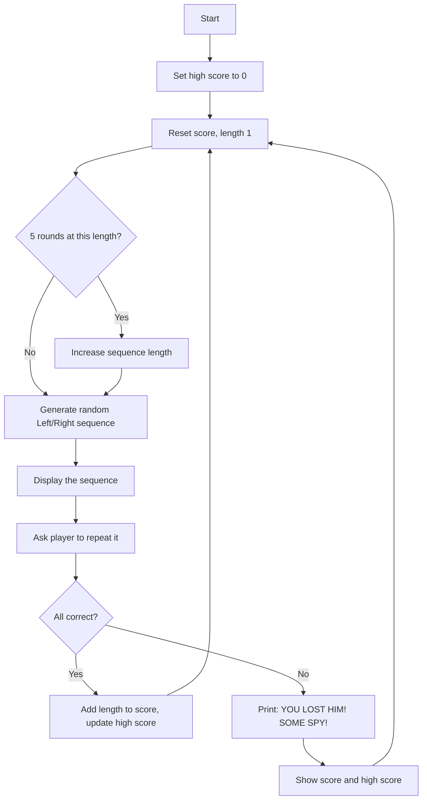
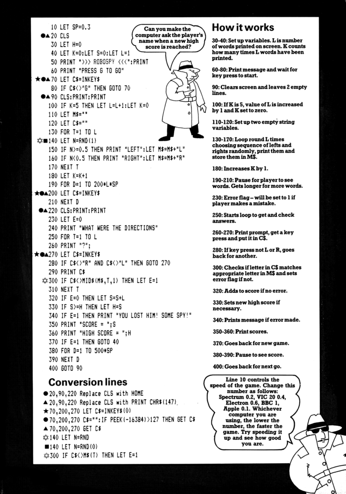

# Robospy

**Book**: _[Computer Spy Games](https://drive.google.com/file/d/0Bxv0SsvibDMTdGY0VEQzSGZnelU/view?resourcekey=0-twRy7ZBMfpwWVPpIrYm3rA)_  

**Author**: [Jenny Tyler and Chris Oxlade](https://github.com/marcusjobb/UsborneBooks)  
**Translator**: [Marcus Medina](http://marcusmedina.pro)  

## Story

You are in control of Robospy — a unique remote-operation tracking device which secretly follows enemy agents. You receive details of an agent's movements through the streets — whether he turns left or right — and you must copy these movements exactly when you send signals to Robospy, so that it can stay in touch with the agent.

Unfortunately the agent knows that Robospy is following him. He makes your job harder the longer it keeps up. He has also managed to tamper with your signalling device, re-arranging the keys in an attempt to confuse you. This means that you press L (for left) with your right hand and R (for right) with your left. Can you stick with him, or will he shake you off?

## Pseudocode

```plaintext
SET high_score = 0
LOOP forever
    SET score = 0, sequence_length = 1, rounds_since_increase = 0
    LOOP until mistake
        IF 5 rounds have passed at this length THEN increase sequence_length
        GENERATE random sequence of Left/Right of current length
        DISPLAY the sequence
        ASK player to repeat the directions, one at a time
        IF any direction wrong THEN
            PRINT "YOU LOST HIM! SOME SPY!"
            mark mistake
        ELSE
            ADD sequence_length to score
            IF score > high_score THEN update high_score
        END IF
        PRINT score and high score
    END LOOP
END LOOP
```

## Flowchart



## Code

<details>
<summary>Pages</summary>

  


</details>

<details>
<summary>ZX-81 BASIC</summary>

```basic
10 LET SP=0.3
20 CLS
30 LET H=0
40 LET K=0:LET S=0:LET L=1
50 PRINT ">>> ROBOSPY <<<":PRINT
60 PRINT "PRESS G TO GO"
70 LET C$=INKEY$
80 IF C$<>"G" THEN GOTO 70
90 CLS:PRINT:PRINT
100 IF K=5 THEN LET L=L+1:LET K=0
110 LET M$=""
120 LET C$=""
130 FOR T=1 TO L
140 LET N=RND(1)
150 IF N>=0.5 THEN PRINT "LEFT":LET M$=M$+"L"
160 IF N<0.5 THEN PRINT "RIGHT":LET M$=M$+"R"
170 NEXT T
180 LET K=K+1
190 FOR D=1 TO 200*L*SP
200 LET C$=INKEY$
210 NEXT D
220 CLS:PRINT:PRINT
230 LET E=0
240 PRINT "WHAT WERE THE DIRECTIONS"
250 FOR T=1 TO L
260 PRINT "?";
270 LET C$=INKEY$
280 IF C$<>"R" AND C$<>"L" THEN GOTO 270
290 PRINT C$
300 IF C$<>MID$(M$,T,1) THEN LET E=1
310 NEXT T
320 IF E=0 THEN LET S=S+L
330 IF S>=H THEN LET H=S
340 IF E=1 THEN PRINT "YOU LOST HIM! SOME SPY!"
350 PRINT "SCORE = ";S
360 PRINT "HIGH SCORE = ";H
370 IF E=1 THEN GOTO 40
380 FOR D=1 TO 500*SP
390 NEXT D
400 GOTO 90
```

</details>

<details>
<summary>C#</summary>

```csharp
using System;

class Robospy
{
    static Random rnd = new Random();

    static void Main()
    {
        int high = 0;

        while (true)
        {
            int score = 0, length = 1, roundsAtLength = 0;
            bool mistake = false;

            while (!mistake)
            {
                if (roundsAtLength == 5) { length++; roundsAtLength = 0; }

                string sequence = "";
                Console.WriteLine("Watch the agent:");
                for (int t = 0; t < length; t++)
                {
                    bool left = rnd.NextDouble() >= 0.5;
                    Console.WriteLine(left ? "LEFT" : "RIGHT");
                    sequence += left ? "L" : "R";
                }
                roundsAtLength++;

                Console.WriteLine("\nWhat were the directions?");
                bool error = false;
                for (int t = 0; t < length; t++)
                {
                    Console.Write("? ");
                    string input = Console.ReadLine()?.Trim().ToUpper();
                    if (input == null) return;
                    char c = input.Length > 0 ? input[0] : ' ';
                    if (c != 'L' && c != 'R') { t--; continue; }
                    if (c != sequence[t]) error = true;
                }

                if (!error) score += length;
                if (score >= high) high = score;

                if (error)
                {
                    Console.WriteLine("YOU LOST HIM! SOME SPY!");
                    mistake = true;
                }
                Console.WriteLine($"SCORE = {score}");
                Console.WriteLine($"HIGH SCORE = {high}");
            }
        }
    }
}
```

</details>

<details>
<summary>Python</summary>

```python
import random

def robospy():
    high = 0

    while True:
        score = 0
        length = 1
        rounds_at_length = 0
        mistake = False

        while not mistake:
            if rounds_at_length == 5:
                length += 1
                rounds_at_length = 0

            sequence = ""
            print("Watch the agent:")
            for _ in range(length):
                left = random.random() >= 0.5
                print("LEFT" if left else "RIGHT")
                sequence += "L" if left else "R"
            rounds_at_length += 1

            print("\nWhat were the directions?")
            error = False
            t = 0
            while t < length:
                c = input("? ").strip().upper()
                c = c[0] if c else ""
                if c not in ("L", "R"):
                    continue
                if c != sequence[t]:
                    error = True
                t += 1

            if not error:
                score += length
            if score >= high:
                high = score

            if error:
                print("YOU LOST HIM! SOME SPY!")
                mistake = True
            print(f"SCORE = {score}")
            print(f"HIGH SCORE = {high}")

if __name__ == "__main__":
    robospy()
```

</details>

<details>
<summary>Java</summary>

```java
import java.util.Random;
import java.util.Scanner;

public class Robospy {
    static Random rnd = new Random();
    static Scanner scanner = new Scanner(System.in);

    public static void main(String[] args) {
        int high = 0;

        while (true) {
            int score = 0, length = 1, roundsAtLength = 0;
            boolean mistake = false;

            while (!mistake) {
                if (roundsAtLength == 5) { length++; roundsAtLength = 0; }

                StringBuilder sequence = new StringBuilder();
                System.out.println("Watch the agent:");
                for (int t = 0; t < length; t++) {
                    boolean left = rnd.nextDouble() >= 0.5;
                    System.out.println(left ? "LEFT" : "RIGHT");
                    sequence.append(left ? 'L' : 'R');
                }
                roundsAtLength++;

                System.out.println("\nWhat were the directions?");
                boolean error = false;
                int t = 0;
                while (t < length) {
                    System.out.print("? ");
                    if (!scanner.hasNextLine()) return;
                    String input = scanner.nextLine().trim().toUpperCase();
                    char c = input.isEmpty() ? ' ' : input.charAt(0);
                    if (c != 'L' && c != 'R') continue;
                    if (c != sequence.charAt(t)) error = true;
                    t++;
                }

                if (!error) score += length;
                if (score >= high) high = score;

                if (error) {
                    System.out.println("YOU LOST HIM! SOME SPY!");
                    mistake = true;
                }
                System.out.println("SCORE = " + score);
                System.out.println("HIGH SCORE = " + high);
            }
        }
    }
}
```

</details>

<details>
<summary>Go</summary>

```go
package main

import (
	"bufio"
	"fmt"
	"math/rand"
	"os"
	"strings"
	"time"
)

func main() {
	rand.Seed(time.Now().UnixNano())
	reader := bufio.NewReader(os.Stdin)
	high := 0

	for {
		score, length, roundsAtLength := 0, 1, 0
		mistake := false

		for !mistake {
			if roundsAtLength == 5 {
				length++
				roundsAtLength = 0
			}

			var sequence strings.Builder
			fmt.Println("Watch the agent:")
			for t := 0; t < length; t++ {
				left := rand.Float64() >= 0.5
				if left {
					fmt.Println("LEFT")
					sequence.WriteByte('L')
				} else {
					fmt.Println("RIGHT")
					sequence.WriteByte('R')
				}
			}
			roundsAtLength++
			seq := sequence.String()

			fmt.Println("\nWhat were the directions?")
			error := false
			t := 0
			for t < length {
				fmt.Print("? ")
				line, err := reader.ReadString('\n')
				if err != nil {
					return
				}
				input := strings.ToUpper(strings.TrimSpace(line))
				if input == "" {
					continue
				}
				c := input[0]
				if c != 'L' && c != 'R' {
					continue
				}
				if c != seq[t] {
					error = true
				}
				t++
			}

			if !error {
				score += length
			}
			if score >= high {
				high = score
			}

			if error {
				fmt.Println("YOU LOST HIM! SOME SPY!")
				mistake = true
			}
			fmt.Printf("SCORE = %d\n", score)
			fmt.Printf("HIGH SCORE = %d\n", high)
		}
	}
}
```

</details>

<details>
<summary>C++</summary>

```cpp
#include <iostream>
#include <string>
#include <cstdlib>
#include <ctime>
#include <algorithm>

int main() {
    srand(time(0));
    int high = 0;

    while (true) {
        int score = 0, length = 1, roundsAtLength = 0;
        bool mistake = false;

        while (!mistake) {
            if (roundsAtLength == 5) { length++; roundsAtLength = 0; }

            std::string sequence;
            std::cout << "Watch the agent:" << std::endl;
            for (int t = 0; t < length; t++) {
                bool left = (rand() % 2) == 0;
                std::cout << (left ? "LEFT" : "RIGHT") << std::endl;
                sequence += left ? 'L' : 'R';
            }
            roundsAtLength++;

            std::cout << "\nWhat were the directions?" << std::endl;
            bool error = false;
            int t = 0;
            while (t < length) {
                std::cout << "? ";
                std::string input;
                if (!std::getline(std::cin, input)) return 0;
                std::transform(input.begin(), input.end(), input.begin(), ::toupper);
                if (input.empty()) continue;
                char c = input[0];
                if (c != 'L' && c != 'R') continue;
                if (c != sequence[t]) error = true;
                t++;
            }

            if (!error) score += length;
            if (score >= high) high = score;

            if (error) {
                std::cout << "YOU LOST HIM! SOME SPY!" << std::endl;
                mistake = true;
            }
            std::cout << "SCORE = " << score << std::endl;
            std::cout << "HIGH SCORE = " << high << std::endl;
        }
    }
}
```

</details>

## Explanation

The agent turns left or right a number of times, and you must watch and repeat his exact sequence of turns. Every five successful rounds, the sequence grows by one step. One wrong direction and you lose him — but your best run is kept as a high score for the rest of the session.

## Challenges

1. **Name the high score**: Ask for the player's name when a new high score is reached, as the book itself suggests.
2. **Speed control**: Make the reveal speed increase as the sequence grows.
3. **Two agents**: Track two independent sequences at once.

## Copyright

These programs are adaptations of the original Usborne Computer Guides published in the 1980s. The books are free to download for personal or educational use from [Usborne's Computer and Coding Books](https://usborne.com/row/books/computer-and-coding-books). Programs and adaptations may not be used for commercial purposes.

Return to [Computer Spy Games](./readme.md).
