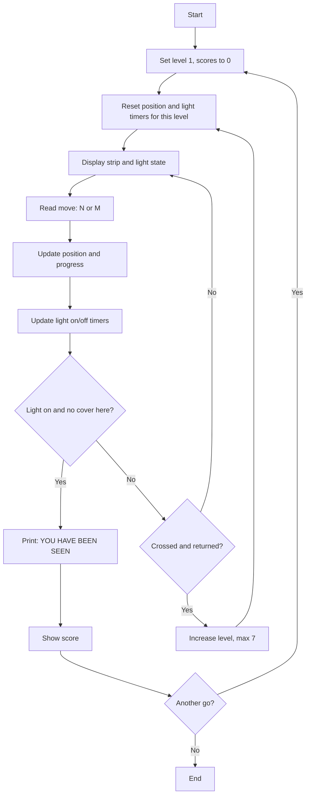
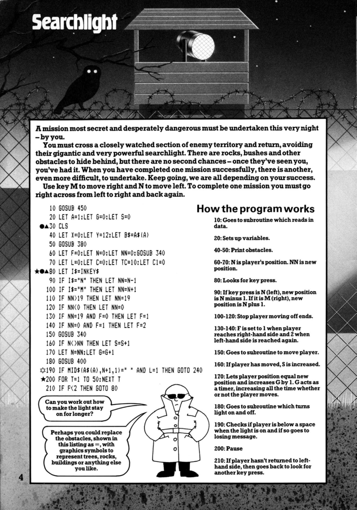
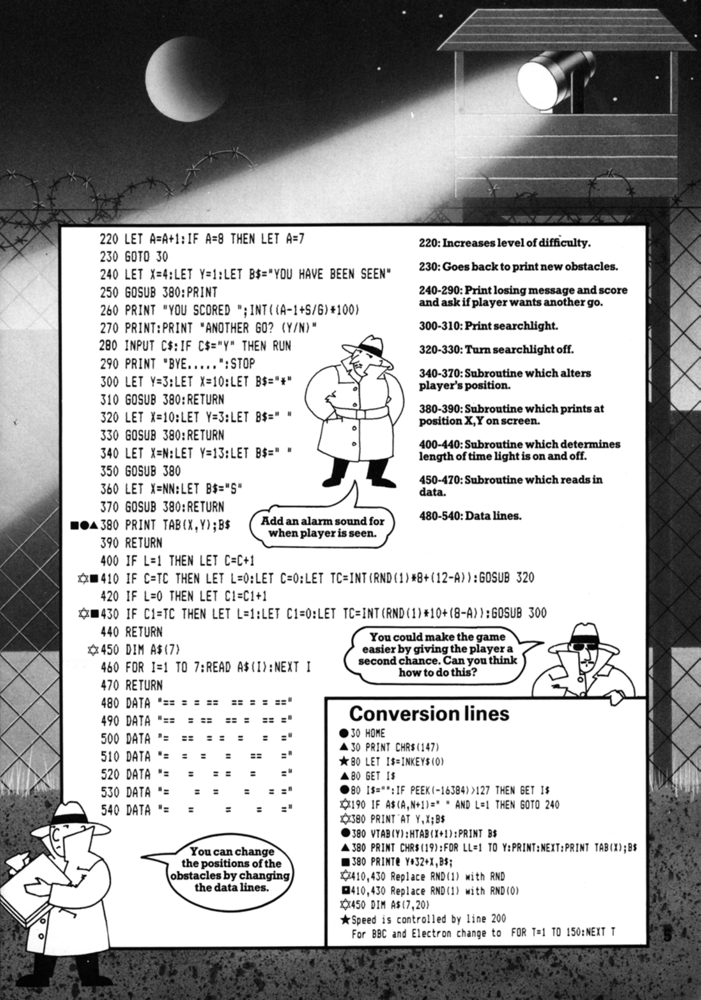

# Searchlight

**Book**: _[Computer Spy Games](https://drive.google.com/file/d/0Bxv0SsvibDMTdGY0VEQzSGZnelU/view?resourcekey=0-twRy7ZBMfpwWVPpIrYm3rA)_  

**Author**: [Jenny Tyler and Chris Oxlade](https://github.com/marcusjobb/UsborneBooks)  
**Translator**: [Marcus Medina](http://marcusmedina.pro)  

## Story

A mission most secret and desperately dangerous must be undertaken this very night — by you.

You must cross a closely watched section of enemy territory and return, avoiding their gigantic and very powerful searchlight. There are rocks, bushes and other obstacles to hide behind, but there are no second chances — once they've seen you, you've had it. When you have completed one mission successfully, there is another, even more difficult, to undertake. Keep going, we are all depending on your success.

Use key M to move right and N to move left. To complete one mission you must go right across from left to right and back again.

## Pseudocode

```plaintext
SET level = 1, score_moves = 0, score_ticks = 0
LOOP forever
    SET position = 0, progress = 0 (not yet crossed)
    SET light = off, with random on/off timers scaled by level
    LOOP until caught or mission complete
        DISPLAY strip with player position and light state
        READ move (N = left, M = right)
        UPDATE position, clamp to track ends
        IF position reached right end THEN progress = 1
        IF position reached left end AND progress = 1 THEN progress = complete
        UPDATE light timers (toggle on/off on schedule)
        IF moved THEN increase score_moves
        INCREASE score_ticks
        IF light is on AND no cover at position THEN
            PRINT "YOU HAVE BEEN SEEN"
            PRINT score based on level and move ratio
            ASK "ANOTHER GO?"
            IF yes THEN reset everything and restart ELSE end
        END IF
    END LOOP
    INCREASE level (max 7)
END LOOP
```

## Flowchart



## Code

<details>
<summary>Pages</summary>

  


</details>

<details>
<summary>ZX-81 BASIC</summary>

```basic
10 GOSUB 450
20 LET A=1:LET G=0:LET S=0
30 CLS
40 LET X=0:LET Y=12:LET B$=A$(A)
50 GOSUB 380
60 LET F=0:LET N=0:LET NN=0:GOSUB 340
70 LET L=0:LET C=0:LET TC=10:LET C1=0
80 LET I$=INKEY$
90 IF I$="N" THEN LET NN=N-1
100 IF I$="M" THEN LET NN=N+1
110 IF NN>19 THEN LET NN=19
120 IF NN<0 THEN LET NN=0
130 IF NN=19 AND F=0 THEN LET F=1
140 IF NN=0 AND F=1 THEN LET F=2
150 GOSUB 340
160 IF N<>NN THEN LET S=S+1
170 LET N=NN:LET G=G+1
180 GOSUB 400
190 IF MID$(A$(A),N+1,1)=" " AND L=1 THEN GOTO 240
200 FOR T=1 TO 50:NEXT T
210 IF F<2 THEN GOTO 80
220 LET A=A+1:IF A=8 THEN LET A=7
230 GOTO 30
240 LET X=4:LET Y=1:LET B$="YOU HAVE BEEN SEEN"
250 GOSUB 380:PRINT
260 PRINT "YOU SCORED ";INT((A-1+S/G)*100)
270 PRINT:PRINT "ANOTHER GO? (Y/N)"
280 INPUT C$:IF C$="Y" THEN RUN
290 PRINT "BYE.....":STOP
300 LET Y=3:LET X=10:LET B$="*"
310 GOSUB 380:RETURN
320 LET X=10:LET Y=3:LET B$=" "
330 GOSUB 380:RETURN
340 LET X=N:LET Y=13:LET B$=" "
350 GOSUB 380
360 LET X=NN:LET B$="S"
370 GOSUB 380:RETURN
380 PRINT TAB(X,Y);B$
390 RETURN
400 IF L=1 THEN LET C=C+1
410 IF C=TC THEN LET L=0:LET C=0:LET TC=INT(RND(1)*8+(12-A)):GOSUB 320
420 IF L=0 THEN LET C1=C1+1
430 IF C1=TC THEN LET L=1:LET C1=0:LET TC=INT(RND(1)*10+(8-A)):GOSUB 300
440 RETURN
450 DIM A$(7)
460 FOR I=1 TO 7:READ A$(I):NEXT I
470 RETURN
480 DATA "== = = ==  == = = =="
490 DATA "==  = ==  == =  == ="
500 DATA "=  ==  = =  =    = ="
510 DATA "=  =  =   =    ==   "
520 DATA "=    =    = =  =    "
530 DATA "=     =  =    =   =="
540 DATA "=  =     =   =    = "
```

</details>

<details>
<summary>C#</summary>

```csharp
using System;

class Searchlight
{
    static string[] rows = {
        "== = = ==  == = = ==",
        "==  = ==  == =  == =",
        "=  ==  = =  =    = =",
        "=  =  =   =    ==   ",
        "=    =    = =  =    ",
        "=     =  =    =   ==",
        "=  =     =   =    = ",
    };
    static Random rnd = new Random();

    static void Main()
    {
        int level = 0;
        long score = 0, ticks = 0;

        while (true)
        {
            int n = 0, progress = 0;
            bool light = false;
            int c = 0, c1 = 0, tc = 10;

            while (true)
            {
                Console.Write("[");
                for (int i = 0; i < 20; i++)
                    Console.Write(i == n ? "P" : ".");
                Console.WriteLine(light ? "] LIGHT ON" : "] light off");

                Console.Write("Move (N=left, M=right): ");
                string key = Console.ReadLine()?.Trim().ToUpper();
                if (key == null) return;

                int nn = n;
                if (key == "N") nn = n - 1;
                if (key == "M") nn = n + 1;
                nn = Math.Clamp(nn, 0, 19);

                if (nn == 19 && progress == 0) progress = 1;
                if (nn == 0 && progress == 1) progress = 2;

                if (light) c++;
                if (c == tc) { light = false; c = 0; tc = rnd.Next(8) + (12 - (level + 1)); }
                if (!light) c1++;
                if (c1 == tc) { light = true; c1 = 0; tc = rnd.Next(10) + (8 - (level + 1)); }

                if (n != nn) score++;
                n = nn;
                ticks++;

                if (rows[level][n] == ' ' && light)
                {
                    Console.WriteLine("\nYOU HAVE BEEN SEEN");
                    Console.WriteLine($"YOU SCORED {(int)((level + (double)score / ticks) * 100)}");
                    Console.Write("Another go? (Y/N): ");
                    string again = Console.ReadLine()?.Trim().ToUpper();
                    if (again == "Y")
                    {
                        level = 0; score = 0; ticks = 0;
                        goto restart;
                    }
                    Console.WriteLine("BYE.....");
                    return;
                }

                if (progress == 2) break;
            }

            level++;
            if (level > 6) level = 6;
            restart: ;
        }
    }
}
```

</details>

<details>
<summary>Python</summary>

```python
import random

ROWS = [
    "== = = ==  == = = ==",
    "==  = ==  == =  == =",
    "=  ==  = =  =    = =",
    "=  =  =   =    ==   ",
    "=    =    = =  =    ",
    "=     =  =    =   ==",
    "=  =     =   =    = ",
]

def searchlight():
    level = 0
    score = 0
    ticks = 0

    while True:
        n = 0
        progress = 0
        light = False
        c = 0
        c1 = 0
        tc = 10

        while True:
            strip = "".join("P" if i == n else "." for i in range(20))
            print(f"[{strip}] {'LIGHT ON' if light else 'light off'}")

            key = input("Move (N=left, M=right): ").strip().upper()

            nn = n
            if key == "N":
                nn = n - 1
            elif key == "M":
                nn = n + 1
            nn = max(0, min(19, nn))

            if nn == 19 and progress == 0:
                progress = 1
            if nn == 0 and progress == 1:
                progress = 2

            if light:
                c += 1
            if c == tc:
                light = False
                c = 0
                tc = random.randint(0, 7) + (12 - (level + 1))
            if not light:
                c1 += 1
            if c1 == tc:
                light = True
                c1 = 0
                tc = random.randint(0, 9) + (8 - (level + 1))

            if n != nn:
                score += 1
            n = nn
            ticks += 1

            if ROWS[level][n] == " " and light:
                print("\nYOU HAVE BEEN SEEN")
                print(f"YOU SCORED {int((level + score / ticks) * 100)}")
                again = input("Another go? (Y/N): ").strip().upper()
                if again == "Y":
                    level, score, ticks = 0, 0, 0
                    break
                print("BYE.....")
                return

            if progress == 2:
                level = min(level + 1, 6)
                break
        else:
            continue

if __name__ == "__main__":
    searchlight()
```

</details>

<details>
<summary>Java</summary>

```java
import java.util.Random;
import java.util.Scanner;

public class Searchlight {
    static String[] rows = {
        "== = = ==  == = = ==",
        "==  = ==  == =  == =",
        "=  ==  = =  =    = =",
        "=  =  =   =    ==   ",
        "=    =    = =  =    ",
        "=     =  =    =   ==",
        "=  =     =   =    = ",
    };
    static Random rnd = new Random();
    static Scanner scanner = new Scanner(System.in);

    public static void main(String[] args) {
        int level = 0;
        long score = 0, ticks = 0;

        outer:
        while (true) {
            int n = 0, progress = 0;
            boolean light = false;
            int c = 0, c1 = 0, tc = 10;

            while (true) {
                StringBuilder strip = new StringBuilder();
                for (int i = 0; i < 20; i++) strip.append(i == n ? 'P' : '.');
                System.out.println("[" + strip + "] " + (light ? "LIGHT ON" : "light off"));

                System.out.print("Move (N=left, M=right): ");
                if (!scanner.hasNextLine()) return;
                String key = scanner.nextLine().trim().toUpperCase();

                int nn = n;
                if (key.equals("N")) nn = n - 1;
                if (key.equals("M")) nn = n + 1;
                nn = Math.max(0, Math.min(19, nn));

                if (nn == 19 && progress == 0) progress = 1;
                if (nn == 0 && progress == 1) progress = 2;

                if (light) c++;
                if (c == tc) { light = false; c = 0; tc = rnd.nextInt(8) + (12 - (level + 1)); }
                if (!light) c1++;
                if (c1 == tc) { light = true; c1 = 0; tc = rnd.nextInt(10) + (8 - (level + 1)); }

                if (n != nn) score++;
                n = nn;
                ticks++;

                if (rows[level].charAt(n) == ' ' && light) {
                    System.out.println("\nYOU HAVE BEEN SEEN");
                    System.out.println("YOU SCORED " + (int) ((level + (double) score / ticks) * 100));
                    System.out.print("Another go? (Y/N): ");
                    if (!scanner.hasNextLine()) return;
                    String again = scanner.nextLine().trim().toUpperCase();
                    if (again.equals("Y")) {
                        level = 0; score = 0; ticks = 0;
                        continue outer;
                    }
                    System.out.println("BYE.....");
                    return;
                }

                if (progress == 2) break;
            }

            level = Math.min(level + 1, 6);
        }
    }
}
```

</details>

<details>
<summary>Go</summary>

```go
package main

import (
	"bufio"
	"fmt"
	"math/rand"
	"os"
	"strings"
	"time"
)

var rows = []string{
	"== = = ==  == = = ==",
	"==  = ==  == =  == =",
	"=  ==  = =  =    = =",
	"=  =  =   =    ==   ",
	"=    =    = =  =    ",
	"=     =  =    =   ==",
	"=  =     =   =    = ",
}

func main() {
	rand.Seed(time.Now().UnixNano())
	reader := bufio.NewReader(os.Stdin)

	level := 0
	var score, ticks int64

outer:
	for {
		n, progress := 0, 0
		light := false
		c, c1, tc := 0, 0, 10

		for {
			strip := make([]byte, 20)
			for i := range strip {
				if i == n {
					strip[i] = 'P'
				} else {
					strip[i] = '.'
				}
			}
			state := "light off"
			if light {
				state = "LIGHT ON"
			}
			fmt.Printf("[%s] %s\n", string(strip), state)

			fmt.Print("Move (N=left, M=right): ")
			line, err := reader.ReadString('\n')
			if err != nil {
				return
			}
			key := strings.ToUpper(strings.TrimSpace(line))

			nn := n
			if key == "N" {
				nn = n - 1
			}
			if key == "M" {
				nn = n + 1
			}
			if nn < 0 {
				nn = 0
			}
			if nn > 19 {
				nn = 19
			}

			if nn == 19 && progress == 0 {
				progress = 1
			}
			if nn == 0 && progress == 1 {
				progress = 2
			}

			if light {
				c++
			}
			if c == tc {
				light = false
				c = 0
				tc = rand.Intn(8) + (12 - (level + 1))
			}
			if !light {
				c1++
			}
			if c1 == tc {
				light = true
				c1 = 0
				tc = rand.Intn(10) + (8 - (level + 1))
			}

			if n != nn {
				score++
			}
			n = nn
			ticks++

			if rows[level][n] == ' ' && light {
				fmt.Println("\nYOU HAVE BEEN SEEN")
				fmt.Printf("YOU SCORED %d\n", int(float64(level)+float64(score)/float64(ticks)*100+float64(level)*0))
				fmt.Printf("YOU SCORED %d\n", int((float64(level)+float64(score)/float64(ticks))*100))
				fmt.Print("Another go? (Y/N): ")
				line, err := reader.ReadString('\n')
				if err != nil {
					return
				}
				if strings.ToUpper(strings.TrimSpace(line)) == "Y" {
					level, score, ticks = 0, 0, 0
					continue outer
				}
				fmt.Println("BYE.....")
				return
			}

			if progress == 2 {
				break
			}
		}

		level++
		if level > 6 {
			level = 6
		}
	}
}
```

</details>

<details>
<summary>C++</summary>

```cpp
#include <iostream>
#include <string>
#include <cstdlib>
#include <ctime>
#include <algorithm>

std::string rows[7] = {
    "== = = ==  == = = ==",
    "==  = ==  == =  == =",
    "=  ==  = =  =    = =",
    "=  =  =   =    ==   ",
    "=    =    = =  =    ",
    "=     =  =    =   ==",
    "=  =     =   =    = ",
};

int main() {
    srand(time(0));
    int level = 0;
    long score = 0, ticks = 0;

    while (true) {
        int n = 0, progress = 0;
        bool light = false;
        int c = 0, c1 = 0, tc = 10;
        bool caught = false;

        while (true) {
            std::string strip(20, '.');
            strip[n] = 'P';
            std::cout << "[" << strip << "] " << (light ? "LIGHT ON" : "light off") << std::endl;

            std::cout << "Move (N=left, M=right): ";
            std::string key;
            if (!std::getline(std::cin, key)) return 0;
            std::transform(key.begin(), key.end(), key.begin(), ::toupper);

            int nn = n;
            if (key == "N") nn = n - 1;
            if (key == "M") nn = n + 1;
            nn = std::max(0, std::min(19, nn));

            if (nn == 19 && progress == 0) progress = 1;
            if (nn == 0 && progress == 1) progress = 2;

            if (light) c++;
            if (c == tc) { light = false; c = 0; tc = rand() % 8 + (12 - (level + 1)); }
            if (!light) c1++;
            if (c1 == tc) { light = true; c1 = 0; tc = rand() % 10 + (8 - (level + 1)); }

            if (n != nn) score++;
            n = nn;
            ticks++;

            if (rows[level][n] == ' ' && light) {
                std::cout << "\nYOU HAVE BEEN SEEN" << std::endl;
                std::cout << "YOU SCORED " << (int)((level + (double)score / ticks) * 100) << std::endl;
                std::cout << "Another go? (Y/N): ";
                if (!std::getline(std::cin, key)) return 0;
                std::transform(key.begin(), key.end(), key.begin(), ::toupper);
                if (key == "Y") {
                    level = 0; score = 0; ticks = 0;
                    caught = true;
                    break;
                }
                std::cout << "BYE....." << std::endl;
                return 0;
            }

            if (progress == 2) break;
        }

        if (!caught) {
            level++;
            if (level > 6) level = 6;
        }
    }
}
```

</details>

## Explanation

You creep along a 20-step strip of enemy territory, ducking between the gaps in your cover as an enemy searchlight cycles on and off on its own unpredictable schedule. Reach the far end and make it back to start to clear a mission — but if the light catches you standing in the open, it's over. Each mission you clear raises the difficulty and shortens your margin for error.

## Challenges

1. **Longer light**: Work out how to make the light stay on for longer, as the book itself suggests.
2. **New obstacles**: Change the cover patterns for each level.
3. **Second chance**: Give the player one extra life before the mission ends.

## Copyright

These programs are adaptations of the original Usborne Computer Guides published in the 1980s. The books are free to download for personal or educational use from [Usborne's Computer and Coding Books](https://usborne.com/row/books/computer-and-coding-books). Programs and adaptations may not be used for commercial purposes.

Return to [Computer Spy Games](./readme.md).
