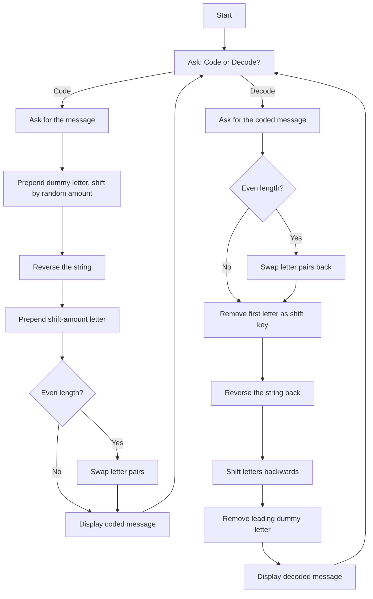
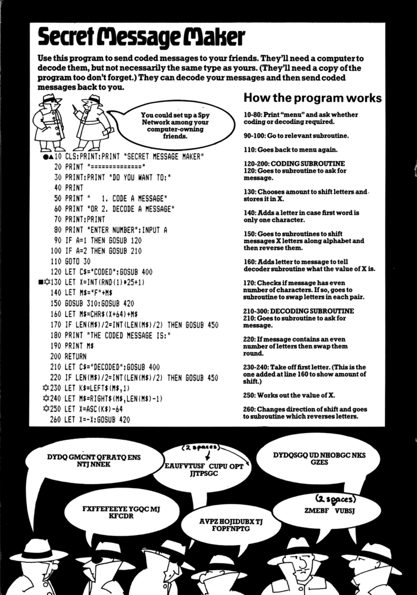
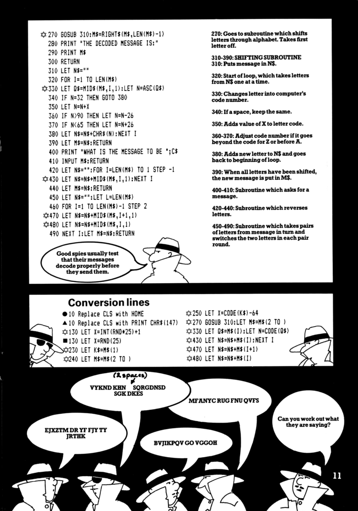

# Secret Message Maker

**Book**: _Computer Spy Games_  

**Author**: [Jenny Tyler and Chris Oxlade](https://github.com/marcusjobb/UsborneBooks)  
**Translator**: [Marcus Medina](http://marcusmedina.pro)  

## Story

Use this program to send coded messages to your friends. They'll need a computer to decode them, but not necessarily the same type as yours. (They'll need a copy of the program too don't forget.) They can decode your messages and then send coded messages back to you.

## Pseudocode

```plaintext
LOOP
    ASK "Code a message (1) or Decode a message (2)?"
    IF coding:
        ASK for the message
        PICK a random shift amount (1-25)
        PREPEND a dummy letter
        SHIFT every letter along the alphabet by the shift amount
        REVERSE the whole string
        PREPEND a letter representing the shift amount
        IF the result has an even length THEN swap each pair of letters
        DISPLAY the coded message
    IF decoding:
        ASK for the coded message
        IF it has an even length THEN swap each pair of letters back
        REMOVE the first letter and read it as the shift amount
        REVERSE the string back
        SHIFT every letter backwards by that amount
        REMOVE the leading dummy letter
        DISPLAY the decoded message
END LOOP
```

## Flowchart



## Code

<details>
<summary>Pages</summary>

  


</details>

<details>
<summary>ZX-81 BASIC</summary>

```basic
10 CLS:PRINT:PRINT "SECRET MESSAGE MAKER"
20 PRINT "==============="
30 PRINT:PRINT "DO YOU WANT TO:"
40 PRINT
50 PRINT "  1. CODE A MESSAGE"
60 PRINT "OR 2. DECODE A MESSAGE"
70 PRINT:PRINT
80 PRINT "ENTER NUMBER":INPUT A
90 IF A=1 THEN GOSUB 120
100 IF A=2 THEN GOSUB 210
110 GOTO 30
120 LET C$="CODED":GOSUB 400
130 LET X=INT(RND(1)*25+1)
140 LET M$="F"+M$
150 GOSUB 310:GOSUB 420
160 LET M$=CHR$(X+64)+M$
170 IF LEN(M$)/2=INT(LEN(M$)/2) THEN GOSUB 450
180 PRINT "THE CODED MESSAGE IS:"
190 PRINT M$
200 RETURN
210 LET C$="DECODED":GOSUB 400
220 IF LEN(M$)/2=INT(LEN(M$)/2) THEN GOSUB 450
230 LET K$=LEFT$(M$,1)
240 LET M$=RIGHT$(M$,LEN(M$)-1)
250 LET X=ASC(K$)-64
260 LET X=-X:GOSUB 420
270 GOSUB 310:M$=RIGHT$(M$,LEN(M$)-1)
280 PRINT "THE DECODED MESSAGE IS:"
290 PRINT M$
300 RETURN
310 LET N$="":FOR I=1 TO LEN(M$)
320 LET Q$=MID$(M$,I,1):LET N=ASC(Q$)
330 IF N=32 THEN GOTO 380
340 LET N=N+X
350 IF N>90 THEN LET N=N-26
360 IF N<65 THEN LET N=N+26
370 LET N$=N$+CHR$(N):GOTO 390
380 LET N$=N$+CHR$(N)
390 NEXT I
395 LET M$=N$:RETURN
400 PRINT "WHAT IS THE MESSAGE TO BE ";C$
410 INPUT M$:RETURN
420 LET N$="":FOR I=LEN(M$) TO 1 STEP -1
430 LET N$=N$+MID$(M$,I,1):NEXT I
440 LET M$=N$:RETURN
450 LET N$="":LET L=LEN(M$)
460 FOR I=1 TO LEN(M$)-1 STEP 2
470 LET N$=N$+MID$(M$,I+1,1)
480 LET N$=N$+MID$(M$,I,1)
490 NEXT I:LET M$=N$:RETURN
```

</details>

<details>
<summary>C#</summary>

```csharp
using System;
using System.Text;

class SecretMessageMaker
{
    static Random rnd = new Random();

    static void Main()
    {
        while (true)
        {
            Console.WriteLine("SECRET MESSAGE MAKER");
            Console.WriteLine("===============");
            Console.WriteLine("\nDO YOU WANT TO:");
            Console.WriteLine("  1. CODE A MESSAGE");
            Console.WriteLine("OR 2. DECODE A MESSAGE");
            Console.Write("\nENTER NUMBER: ");
            string choice = Console.ReadLine()?.Trim();
            if (choice == null) return;

            if (choice == "1") Code();
            else if (choice == "2") Decode();
        }
    }

    static void Code()
    {
        Console.Write("What is the message to be CODED? ");
        string m = Console.ReadLine();
        if (m == null) return;

        int x = rnd.Next(1, 26);
        m = "F" + m;
        m = Shift(m, x);
        m = Reverse(m);
        m = (char)(x + 64) + m;
        if (m.Length % 2 == 0) m = SwapPairs(m);

        Console.WriteLine("THE CODED MESSAGE IS:");
        Console.WriteLine(m);
    }

    static void Decode()
    {
        Console.Write("What is the message to be DECODED? ");
        string m = Console.ReadLine();
        if (m == null) return;

        if (m.Length % 2 == 0) m = SwapPairs(m);
        char k = m[0];
        m = m.Substring(1);
        int x = -(k - 64);
        m = Reverse(m);
        m = Shift(m, x);
        m = m.Substring(1);

        Console.WriteLine("THE DECODED MESSAGE IS:");
        Console.WriteLine(m);
    }

    static string Shift(string m, int x)
    {
        var sb = new StringBuilder();
        foreach (char ch in m)
        {
            if (ch == ' ') { sb.Append(ch); continue; }
            int n = ch + x;
            if (n > 90) n -= 26;
            if (n < 65) n += 26;
            sb.Append((char)n);
        }
        return sb.ToString();
    }

    static string Reverse(string m)
    {
        char[] arr = m.ToCharArray();
        Array.Reverse(arr);
        return new string(arr);
    }

    static string SwapPairs(string m)
    {
        var sb = new StringBuilder();
        for (int i = 0; i < m.Length - 1; i += 2)
        {
            sb.Append(m[i + 1]);
            sb.Append(m[i]);
        }
        return sb.ToString();
    }
}
```

</details>

<details>
<summary>Python</summary>

```python
import random

def shift(m, x):
    result = []
    for ch in m:
        if ch == " ":
            result.append(ch)
            continue
        n = ord(ch) + x
        if n > 90:
            n -= 26
        if n < 65:
            n += 26
        result.append(chr(n))
    return "".join(result)

def reverse(m):
    return m[::-1]

def swap_pairs(m):
    result = []
    for i in range(0, len(m) - 1, 2):
        result.append(m[i + 1])
        result.append(m[i])
    return "".join(result)

def code():
    m = input("What is the message to be CODED? ")
    x = random.randint(1, 25)
    m = "F" + m
    m = shift(m, x)
    m = reverse(m)
    m = chr(x + 64) + m
    if len(m) % 2 == 0:
        m = swap_pairs(m)
    print("THE CODED MESSAGE IS:")
    print(m)

def decode():
    m = input("What is the message to be DECODED? ")
    if len(m) % 2 == 0:
        m = swap_pairs(m)
    k = m[0]
    m = m[1:]
    x = -(ord(k) - 64)
    m = reverse(m)
    m = shift(m, x)
    m = m[1:]
    print("THE DECODED MESSAGE IS:")
    print(m)

def secret_message_maker():
    while True:
        print("SECRET MESSAGE MAKER")
        print("===============")
        print("\nDO YOU WANT TO:")
        print("  1. CODE A MESSAGE")
        print("OR 2. DECODE A MESSAGE")
        choice = input("\nENTER NUMBER: ").strip()

        if choice == "1":
            code()
        elif choice == "2":
            decode()

if __name__ == "__main__":
    secret_message_maker()
```

</details>

<details>
<summary>Java</summary>

```java
import java.util.Random;
import java.util.Scanner;

public class SecretMessageMaker {
    static Random rnd = new Random();
    static Scanner scanner = new Scanner(System.in);

    public static void main(String[] args) {
        while (true) {
            System.out.println("SECRET MESSAGE MAKER");
            System.out.println("===============");
            System.out.println("\nDO YOU WANT TO:");
            System.out.println("  1. CODE A MESSAGE");
            System.out.println("OR 2. DECODE A MESSAGE");
            System.out.print("\nENTER NUMBER: ");
            if (!scanner.hasNextLine()) return;
            String choice = scanner.nextLine().trim();

            if (choice.equals("1")) code();
            else if (choice.equals("2")) decode();
        }
    }

    static void code() {
        System.out.print("What is the message to be CODED? ");
        if (!scanner.hasNextLine()) return;
        String m = scanner.nextLine();

        int x = rnd.nextInt(25) + 1;
        m = "F" + m;
        m = shift(m, x);
        m = reverse(m);
        m = (char) (x + 64) + m;
        if (m.length() % 2 == 0) m = swapPairs(m);

        System.out.println("THE CODED MESSAGE IS:");
        System.out.println(m);
    }

    static void decode() {
        System.out.print("What is the message to be DECODED? ");
        if (!scanner.hasNextLine()) return;
        String m = scanner.nextLine();

        if (m.length() % 2 == 0) m = swapPairs(m);
        char k = m.charAt(0);
        m = m.substring(1);
        int x = -(k - 64);
        m = reverse(m);
        m = shift(m, x);
        m = m.substring(1);

        System.out.println("THE DECODED MESSAGE IS:");
        System.out.println(m);
    }

    static String shift(String m, int x) {
        StringBuilder sb = new StringBuilder();
        for (char ch : m.toCharArray()) {
            if (ch == ' ') { sb.append(ch); continue; }
            int n = ch + x;
            if (n > 90) n -= 26;
            if (n < 65) n += 26;
            sb.append((char) n);
        }
        return sb.toString();
    }

    static String reverse(String m) {
        return new StringBuilder(m).reverse().toString();
    }

    static String swapPairs(String m) {
        StringBuilder sb = new StringBuilder();
        for (int i = 0; i < m.length() - 1; i += 2) {
            sb.append(m.charAt(i + 1));
            sb.append(m.charAt(i));
        }
        return sb.toString();
    }
}
```

</details>

<details>
<summary>Go</summary>

```go
package main

import (
	"bufio"
	"fmt"
	"math/rand"
	"os"
	"strings"
	"time"
)

func shift(m string, x int) string {
	var sb strings.Builder
	for _, ch := range m {
		if ch == ' ' {
			sb.WriteRune(ch)
			continue
		}
		n := int(ch) + x
		if n > 90 {
			n -= 26
		}
		if n < 65 {
			n += 26
		}
		sb.WriteRune(rune(n))
	}
	return sb.String()
}

func reverse(m string) string {
	runes := []rune(m)
	for i, j := 0, len(runes)-1; i < j; i, j = i+1, j-1 {
		runes[i], runes[j] = runes[j], runes[i]
	}
	return string(runes)
}

func swapPairs(m string) string {
	var sb strings.Builder
	runes := []rune(m)
	for i := 0; i < len(runes)-1; i += 2 {
		sb.WriteRune(runes[i+1])
		sb.WriteRune(runes[i])
	}
	return sb.String()
}

func code(reader *bufio.Reader) {
	fmt.Print("What is the message to be CODED? ")
	line, err := reader.ReadString('\n')
	if err != nil {
		return
	}
	m := strings.TrimRight(line, "\r\n")

	x := rand.Intn(25) + 1
	m = "F" + m
	m = shift(m, x)
	m = reverse(m)
	m = string(rune(x+64)) + m
	if len(m)%2 == 0 {
		m = swapPairs(m)
	}

	fmt.Println("THE CODED MESSAGE IS:")
	fmt.Println(m)
}

func decode(reader *bufio.Reader) {
	fmt.Print("What is the message to be DECODED? ")
	line, err := reader.ReadString('\n')
	if err != nil {
		return
	}
	m := strings.TrimRight(line, "\r\n")

	if len(m)%2 == 0 {
		m = swapPairs(m)
	}
	runes := []rune(m)
	k := runes[0]
	m = string(runes[1:])
	x := -(int(k) - 64)
	m = reverse(m)
	m = shift(m, x)
	m = string([]rune(m)[1:])

	fmt.Println("THE DECODED MESSAGE IS:")
	fmt.Println(m)
}

func main() {
	rand.Seed(time.Now().UnixNano())
	reader := bufio.NewReader(os.Stdin)

	for {
		fmt.Println("SECRET MESSAGE MAKER")
		fmt.Println("===============")
		fmt.Println("\nDO YOU WANT TO:")
		fmt.Println("  1. CODE A MESSAGE")
		fmt.Println("OR 2. DECODE A MESSAGE")
		fmt.Print("\nENTER NUMBER: ")
		line, err := reader.ReadString('\n')
		if err != nil {
			return
		}
		choice := strings.TrimSpace(line)

		if choice == "1" {
			code(reader)
		} else if choice == "2" {
			decode(reader)
		}
	}
}
```

</details>

<details>
<summary>C++</summary>

```cpp
#include <iostream>
#include <string>
#include <cstdlib>
#include <ctime>
#include <algorithm>

std::string shiftMsg(const std::string& m, int x) {
    std::string result;
    for (char ch : m) {
        if (ch == ' ') { result += ch; continue; }
        int n = ch + x;
        if (n > 90) n -= 26;
        if (n < 65) n += 26;
        result += (char)n;
    }
    return result;
}

std::string reverseMsg(const std::string& m) {
    std::string r = m;
    std::reverse(r.begin(), r.end());
    return r;
}

std::string swapPairs(const std::string& m) {
    std::string result;
    for (size_t i = 0; i + 1 < m.length(); i += 2) {
        result += m[i + 1];
        result += m[i];
    }
    return result;
}

void codeMessage() {
    std::cout << "What is the message to be CODED? ";
    std::string m;
    if (!std::getline(std::cin, m)) return;

    int x = rand() % 25 + 1;
    m = "F" + m;
    m = shiftMsg(m, x);
    m = reverseMsg(m);
    m = std::string(1, (char)(x + 64)) + m;
    if (m.length() % 2 == 0) m = swapPairs(m);

    std::cout << "THE CODED MESSAGE IS:" << std::endl;
    std::cout << m << std::endl;
}

void decodeMessage() {
    std::cout << "What is the message to be DECODED? ";
    std::string m;
    if (!std::getline(std::cin, m)) return;

    if (m.length() % 2 == 0) m = swapPairs(m);
    char k = m[0];
    m = m.substr(1);
    int x = -((int)k - 64);
    m = reverseMsg(m);
    m = shiftMsg(m, x);
    m = m.substr(1);

    std::cout << "THE DECODED MESSAGE IS:" << std::endl;
    std::cout << m << std::endl;
}

int main() {
    srand(time(0));

    while (true) {
        std::cout << "SECRET MESSAGE MAKER" << std::endl;
        std::cout << "===============" << std::endl;
        std::cout << "\nDO YOU WANT TO:" << std::endl;
        std::cout << "  1. CODE A MESSAGE" << std::endl;
        std::cout << "OR 2. DECODE A MESSAGE" << std::endl;
        std::cout << "\nENTER NUMBER: ";
        std::string choice;
        if (!std::getline(std::cin, choice)) return 0;

        if (choice == "1") codeMessage();
        else if (choice == "2") decodeMessage();
    }
}
```

</details>

## Explanation

Your message gets a dummy letter tacked on the front, every letter is shifted along the alphabet by a random amount, the whole thing is reversed, and a key letter recording the shift is prepended — with one more twist for even-length results: adjacent letter pairs get swapped. Send the coded text to a friend running the same program, and choosing "Decode" walks all of those steps back in reverse to recover your original words.

## Challenges

1. **Verify before sending**: Good spies test that their messages decode properly before they send them, as the book itself suggests.
2. **Spy network**: Set up a code exchange among several friends' computers.
3. **Stronger cipher**: Add a second, independent shift amount for extra security.

## Copyright

These programs are adaptations of the original Usborne Computer Guides published in the 1980s. The books are free to download for personal or educational use from [Usborne's Computer and Coding Books](https://usborne.com/row/books/computer-and-coding-books). Programs and adaptations may not be used for commercial purposes.

Return to [Computer Spy Games](./readme.md).
