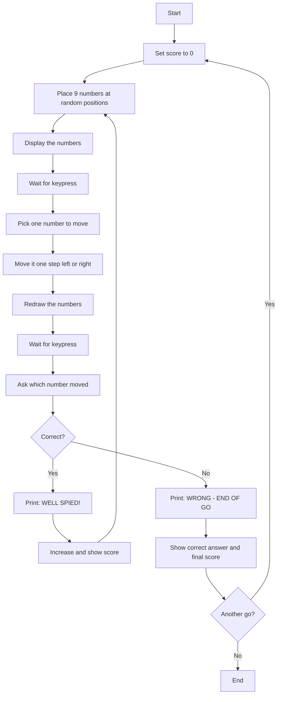
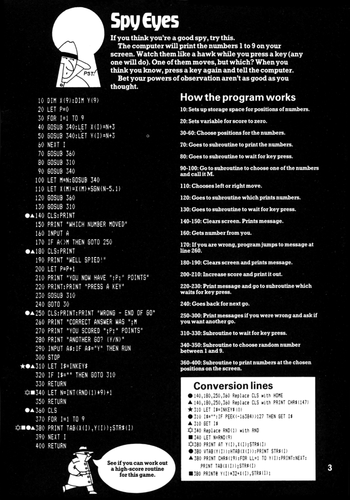

# Spy Eyes

**Book**: _Computer Spy Games_  

**Author**: [Jenny Tyler and Chris Oxlade](https://github.com/marcusjobb/UsborneBooks)  
**Translator**: [Marcus Medina](http://marcusmedina.pro)  

## Story

If you think you're a good spy, try this.

The computer will print the numbers 1 to 9 on your screen. Watch them like a hawk while you press a key (any one will do). One of them moves, but which? When you think you know, press a key again and tell the computer.

Bet your powers of observation aren't as good as you thought.

## Pseudocode

```plaintext
SET score = 0
LOOP forever
    PLACE numbers 1-9 at random positions on screen
    DISPLAY the numbers
    WAIT for keypress
    PICK one number at random to move
    MOVE it one step left or right (random direction)
    REDRAW the numbers
    WAIT for keypress
    ASK "WHICH NUMBER MOVED"
    IF correct THEN
        PRINT "WELL SPIED!", increase score
        PRINT score, wait for keypress, loop again
    ELSE
        PRINT "WRONG - END OF GO", correct answer, final score
        ASK "ANOTHER GO?"
        IF yes THEN restart with score reset ELSE end
    END IF
END LOOP
```

## Flowchart



## Code

<details>
<summary>Pages</summary>



</details>

<details>
<summary>ZX-81 BASIC</summary>

```basic
10 DIM X(9):DIM Y(9)
20 LET P=0
30 FOR I=1 TO 9
40 GOSUB 340:LET X(I)=N+3
50 GOSUB 340:LET Y(I)=N+3
60 NEXT I
70 GOSUB 360
80 GOSUB 310
90 GOSUB 340
100 LET M=N:GOSUB 340
110 LET X(M)=X(M)+SGN(N-5.1)
120 GOSUB 360
130 GOSUB 310
140 CLS:PRINT
150 PRINT "WHICH NUMBER MOVED"
160 INPUT A
170 IF A<>M THEN GOTO 250
180 CLS:PRINT
190 PRINT "WELL SPIED!"
200 LET P=P+1
210 PRINT "YOU NOW HAVE ";P;" POINTS"
220 PRINT:PRINT "PRESS A KEY"
230 GOSUB 310
240 GOTO 30
250 CLS:PRINT:PRINT "WRONG - END OF GO"
260 PRINT "CORRECT ANSWER WAS ";M
270 PRINT "YOU SCORED ";P;" POINTS"
280 PRINT "ANOTHER GO? (Y/N)"
290 INPUT A$:IF A$="Y" THEN RUN
300 STOP
310 LET I$=INKEY$
320 IF I$="" THEN GOTO 310
330 RETURN
340 LET N=INT(RND(1)*9)+1
350 RETURN
360 CLS
370 FOR I=1 TO 9
380 PRINT TAB(X(I),Y(I));STR$(I)
390 NEXT I
400 RETURN
```

</details>

<details>
<summary>C#</summary>

```csharp
using System;

class SpyEyes
{
    const int Size = 16;
    static Random rnd = new Random();
    static int[] x = new int[9];
    static int[] y = new int[9];
    static int score = 0;

    static void Main()
    {
        while (true)
        {
            PlaceNumbers();
            Draw();
            Console.Write("Press Enter...");
            Console.ReadLine();

            int m = rnd.Next(9);
            int dir = rnd.Next(2) == 0 ? -1 : 1;
            x[m] = Math.Clamp(x[m] + dir, 0, Size - 1);

            Draw();
            Console.Write("Press Enter...");
            Console.ReadLine();

            Console.Write("Which number moved (1-9)? ");
            if (!int.TryParse(Console.ReadLine(), out int guess)) guess = -1;

            if (guess == m + 1)
            {
                Console.WriteLine("WELL SPIED!");
                score++;
                Console.WriteLine($"You now have {score} points");
                Console.Write("Press Enter...");
                Console.ReadLine();
            }
            else
            {
                Console.WriteLine("WRONG - END OF GO");
                Console.WriteLine($"Correct answer was {m + 1}");
                Console.WriteLine($"You scored {score} points");
                Console.Write("Another go? (Y/N): ");
                string again = Console.ReadLine()?.Trim().ToUpper();
                if (again == "Y")
                {
                    score = 0;
                    continue;
                }
                return;
            }
        }
    }

    static void PlaceNumbers()
    {
        for (int i = 0; i < 9; i++)
        {
            x[i] = rnd.Next(4, 13);
            y[i] = rnd.Next(4, 13);
        }
    }

    static void Draw()
    {
        char[,] grid = new char[Size, Size];
        for (int r = 0; r < Size; r++)
            for (int c = 0; c < Size; c++)
                grid[r, c] = ' ';

        for (int i = 0; i < 9; i++)
            grid[y[i], x[i]] = (char)('1' + i);

        Console.Clear();
        for (int r = 0; r < Size; r++)
        {
            for (int c = 0; c < Size; c++)
                Console.Write(grid[r, c]);
            Console.WriteLine();
        }
    }
}
```

</details>

<details>
<summary>Python</summary>

```python
import random

SIZE = 16

def place_numbers():
    xs = [random.randint(4, 12) for _ in range(9)]
    ys = [random.randint(4, 12) for _ in range(9)]
    return xs, ys

def draw(xs, ys):
    grid = [[" " for _ in range(SIZE)] for _ in range(SIZE)]
    for i in range(9):
        grid[ys[i]][xs[i]] = str(i + 1)
    print()
    for row in grid:
        print("".join(row))

def spy_eyes():
    score = 0
    while True:
        xs, ys = place_numbers()
        draw(xs, ys)
        input("Press Enter...")

        m = random.randint(0, 8)
        direction = random.choice([-1, 1])
        xs[m] = max(0, min(SIZE - 1, xs[m] + direction))

        draw(xs, ys)
        input("Press Enter...")

        try:
            guess = int(input("Which number moved (1-9)? "))
        except ValueError:
            guess = -1

        if guess == m + 1:
            print("WELL SPIED!")
            score += 1
            print(f"You now have {score} points")
            input("Press Enter...")
        else:
            print("WRONG - END OF GO")
            print(f"Correct answer was {m + 1}")
            print(f"You scored {score} points")
            again = input("Another go? (Y/N): ").strip().upper()
            if again == "Y":
                score = 0
                continue
            return

if __name__ == "__main__":
    spy_eyes()
```

</details>

<details>
<summary>Java</summary>

```java
import java.util.Random;
import java.util.Scanner;

public class SpyEyes {
    static final int SIZE = 16;
    static Random rnd = new Random();
    static int[] x = new int[9];
    static int[] y = new int[9];
    static int score = 0;
    static Scanner scanner = new Scanner(System.in);

    public static void main(String[] args) {
        while (true) {
            placeNumbers();
            draw();
            System.out.print("Press Enter...");
            if (!scanner.hasNextLine()) return;
            scanner.nextLine();

            int m = rnd.nextInt(9);
            int dir = rnd.nextBoolean() ? 1 : -1;
            x[m] = Math.max(0, Math.min(SIZE - 1, x[m] + dir));

            draw();
            System.out.print("Press Enter...");
            if (!scanner.hasNextLine()) return;
            scanner.nextLine();

            System.out.print("Which number moved (1-9)? ");
            if (!scanner.hasNextLine()) return;
            int guess;
            try {
                guess = Integer.parseInt(scanner.nextLine().trim());
            } catch (NumberFormatException e) {
                guess = -1;
            }

            if (guess == m + 1) {
                System.out.println("WELL SPIED!");
                score++;
                System.out.println("You now have " + score + " points");
                System.out.print("Press Enter...");
                if (!scanner.hasNextLine()) return;
                scanner.nextLine();
            } else {
                System.out.println("WRONG - END OF GO");
                System.out.println("Correct answer was " + (m + 1));
                System.out.println("You scored " + score + " points");
                System.out.print("Another go? (Y/N): ");
                if (!scanner.hasNextLine()) return;
                String again = scanner.nextLine().trim().toUpperCase();
                if (again.equals("Y")) {
                    score = 0;
                    continue;
                }
                return;
            }
        }
    }

    static void placeNumbers() {
        for (int i = 0; i < 9; i++) {
            x[i] = 4 + rnd.nextInt(9);
            y[i] = 4 + rnd.nextInt(9);
        }
    }

    static void draw() {
        char[][] grid = new char[SIZE][SIZE];
        for (char[] row : grid) java.util.Arrays.fill(row, ' ');
        for (int i = 0; i < 9; i++) grid[y[i]][x[i]] = (char) ('1' + i);

        System.out.println();
        for (char[] row : grid) {
            System.out.println(new String(row));
        }
    }
}
```

</details>

<details>
<summary>Go</summary>

```go
package main

import (
	"bufio"
	"fmt"
	"math/rand"
	"os"
	"strconv"
	"strings"
	"time"
)

const size = 16

var x, y [9]int
var score int

func placeNumbers() {
	for i := 0; i < 9; i++ {
		x[i] = 4 + rand.Intn(9)
		y[i] = 4 + rand.Intn(9)
	}
}

func draw() {
	grid := make([][]byte, size)
	for r := range grid {
		grid[r] = make([]byte, size)
		for c := range grid[r] {
			grid[r][c] = ' '
		}
	}
	for i := 0; i < 9; i++ {
		grid[y[i]][x[i]] = byte('1' + i)
	}
	fmt.Println()
	for _, row := range grid {
		fmt.Println(string(row))
	}
}

func main() {
	rand.Seed(time.Now().UnixNano())
	reader := bufio.NewReader(os.Stdin)

	for {
		placeNumbers()
		draw()
		fmt.Print("Press Enter...")
		if _, err := reader.ReadString('\n'); err != nil {
			return
		}

		m := rand.Intn(9)
		dir := 1
		if rand.Intn(2) == 0 {
			dir = -1
		}
		x[m] += dir
		if x[m] < 0 {
			x[m] = 0
		}
		if x[m] > size-1 {
			x[m] = size - 1
		}

		draw()
		fmt.Print("Press Enter...")
		if _, err := reader.ReadString('\n'); err != nil {
			return
		}

		fmt.Print("Which number moved (1-9)? ")
		line, err := reader.ReadString('\n')
		if err != nil {
			return
		}
		guess, convErr := strconv.Atoi(strings.TrimSpace(line))
		if convErr != nil {
			guess = -1
		}

		if guess == m+1 {
			fmt.Println("WELL SPIED!")
			score++
			fmt.Printf("You now have %d points\n", score)
			fmt.Print("Press Enter...")
			if _, err := reader.ReadString('\n'); err != nil {
				return
			}
		} else {
			fmt.Println("WRONG - END OF GO")
			fmt.Printf("Correct answer was %d\n", m+1)
			fmt.Printf("You scored %d points\n", score)
			fmt.Print("Another go? (Y/N): ")
			line, err := reader.ReadString('\n')
			if err != nil {
				return
			}
			if strings.ToUpper(strings.TrimSpace(line)) == "Y" {
				score = 0
				continue
			}
			return
		}
	}
}
```

</details>

<details>
<summary>C++</summary>

```cpp
#include <iostream>
#include <string>
#include <cstdlib>
#include <ctime>
#include <algorithm>

const int SIZE = 16;
int x[9], y[9];
int score = 0;

void placeNumbers() {
    for (int i = 0; i < 9; i++) {
        x[i] = 4 + rand() % 9;
        y[i] = 4 + rand() % 9;
    }
}

void draw() {
    char grid[SIZE][SIZE];
    for (int r = 0; r < SIZE; r++)
        for (int c = 0; c < SIZE; c++)
            grid[r][c] = ' ';

    for (int i = 0; i < 9; i++)
        grid[y[i]][x[i]] = '1' + i;

    std::cout << std::endl;
    for (int r = 0; r < SIZE; r++) {
        for (int c = 0; c < SIZE; c++)
            std::cout << grid[r][c];
        std::cout << std::endl;
    }
}

int main() {
    srand(time(0));

    while (true) {
        placeNumbers();
        draw();
        std::cout << "Press Enter...";
        std::string line;
        if (!std::getline(std::cin, line)) return 0;

        int m = rand() % 9;
        int dir = (rand() % 2 == 0) ? -1 : 1;
        x[m] = std::max(0, std::min(SIZE - 1, x[m] + dir));

        draw();
        std::cout << "Press Enter...";
        if (!std::getline(std::cin, line)) return 0;

        std::cout << "Which number moved (1-9)? ";
        if (!std::getline(std::cin, line)) return 0;
        int guess;
        try {
            guess = std::stoi(line);
        } catch (...) {
            guess = -1;
        }

        if (guess == m + 1) {
            std::cout << "WELL SPIED!" << std::endl;
            score++;
            std::cout << "You now have " << score << " points" << std::endl;
            std::cout << "Press Enter...";
            if (!std::getline(std::cin, line)) return 0;
        } else {
            std::cout << "WRONG - END OF GO" << std::endl;
            std::cout << "Correct answer was " << (m + 1) << std::endl;
            std::cout << "You scored " << score << " points" << std::endl;
            std::cout << "Another go? (Y/N): ";
            if (!std::getline(std::cin, line)) return 0;
            std::transform(line.begin(), line.end(), line.begin(), ::toupper);
            if (line == "Y") {
                score = 0;
                continue;
            }
            return 0;
        }
    }
}
```

</details>

## Explanation

Nine numbers are scattered across the screen. After you look them over and press a key, one number silently shifts one step to the left or right. Press a key again, then guess which number moved. Guess right and your score climbs; guess wrong and the round ends with your final score.

## Challenges

1. **High score**: Keep track of the best score across rounds, as the book itself suggests.
2. **Harder mode**: Move two numbers instead of one.
3. **Timer**: Limit how long you have to observe the numbers before they can move.

## Copyright

These programs are adaptations of the original Usborne Computer Guides published in the 1980s. The books are free to download for personal or educational use from [Usborne's Computer and Coding Books](https://usborne.com/row/books/computer-and-coding-books). Programs and adaptations may not be used for commercial purposes.

Return to [Computer Spy Games](./readme.md).
