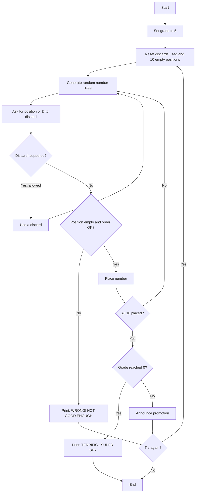
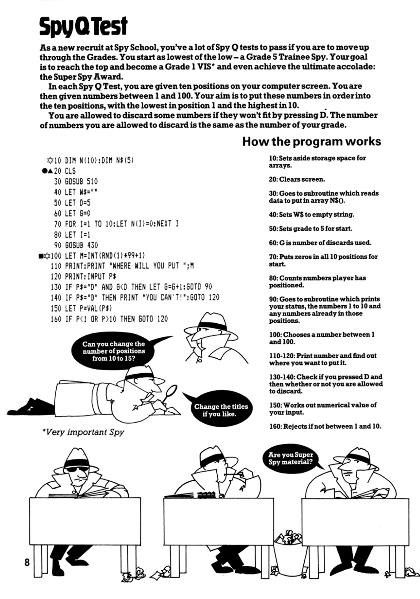
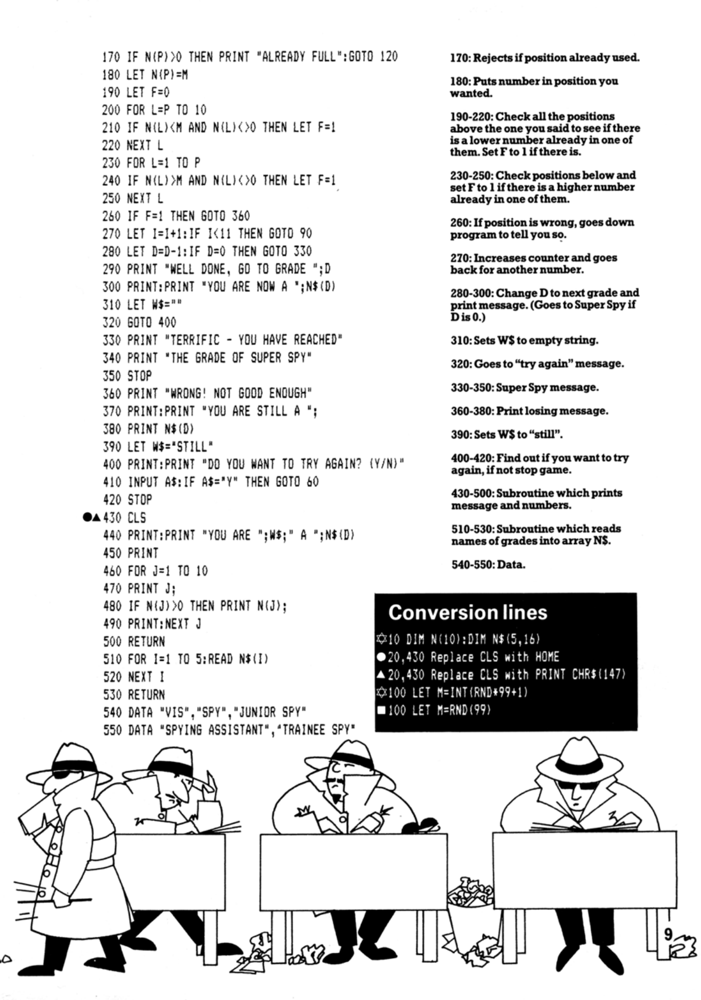

# Spy Q Test

**Book**: _Computer Spy Games_   
**Author**: [Jenny Tyler and Chris Oxlade](https://github.com/marcusjobb/UsborneBooks)  
**Translator**: [Marcus Medina](http://marcusmedina.pro)  

## Story

As a new recruit at Spy School, you've a lot of Spy Q tests to pass if you are to move up through the Grades. You start as lowest of the low — a Grade 5 Trainee Spy. Your goal is to reach the top and become a Grade 1 VIS (Very Important Spy) and even achieve the ultimate accolade: the Super Spy Award.

In each Spy Q Test, you are given ten positions on your computer screen. You are then given numbers between 1 and 100. Your aim is to put these numbers in order into the ten positions, with the lowest in position 1 and the highest in 10.

You are allowed to discard some numbers if they won't fit by pressing D. The number of numbers you are allowed to discard is the same as the number of your grade.

## Pseudocode

```plaintext
SET grade = 5 (Trainee Spy)
LOOP
    SET discards_used = 0, positions = 10 empty slots
    FOR each of 10 numbers to place
        GENERATE random number 1-99
        ASK player for a position (1-10) or D to discard
        IF discard requested AND discards remaining THEN
            use a discard, get a new number
        ELSE
            VALIDATE position is empty and keeps ascending order
            IF invalid THEN end test as failure
            PLACE number in chosen position
    END FOR
    IF all 10 placed correctly THEN
        grade decreases by 1
        IF grade reaches 0 THEN announce Super Spy Award, end
        ELSE announce promotion to new grade
    ELSE
        announce failure, grade stays the same
    ASK "TRY AGAIN?"
END LOOP
```

## Flowchart



## Code

<details>
<summary>Pages</summary>

  


</details>

<details>
<summary>ZX-81 BASIC</summary>

```basic
10 DIM N(10):DIM N$(5)
20 CLS
30 GOSUB 510
40 LET W$=""
50 LET D=5
60 LET G=0
70 FOR I=1 TO 10:LET N(I)=0:NEXT I
80 LET I=1
90 GOSUB 430
100 LET M=INT(RND(1)*99+1)
110 PRINT:PRINT "WHERE WILL YOU PUT ";M
120 PRINT:INPUT P$
130 IF P$="D" AND G<D THEN LET G=G+1:GOTO 90
140 IF P$="D" THEN PRINT "YOU CAN'T!":GOTO 120
150 LET P=VAL(P$)
160 IF P<1 OR P>10 THEN GOTO 120
170 IF N(P)>0 THEN PRINT "ALREADY FULL":GOTO 120
180 LET N(P)=M
190 LET F=0
200 FOR L=P TO 10
210 IF N(L)<M AND N(L)<>0 THEN LET F=1
220 NEXT L
230 FOR L=1 TO P
240 IF N(L)>M AND N(L)<>0 THEN LET F=1
250 NEXT L
260 IF F=1 THEN GOTO 360
270 LET I=I+1:IF I<11 THEN GOTO 90
280 LET D=D-1:IF D=0 THEN GOTO 330
290 PRINT "WELL DONE, GO TO GRADE ";D
300 PRINT:PRINT "YOU ARE NOW A ";N$(D)
310 LET W$=""
320 GOTO 400
330 PRINT "TERRIFIC - YOU HAVE REACHED"
340 PRINT "THE GRADE OF SUPER SPY"
350 STOP
360 PRINT "WRONG! NOT GOOD ENOUGH"
370 PRINT:PRINT "YOU ARE STILL A ";
380 PRINT N$(D)
390 LET W$="STILL"
400 PRINT:PRINT "DO YOU WANT TO TRY AGAIN? (Y/N)"
410 INPUT A$:IF A$="Y" THEN GOTO 60
420 STOP
430 CLS
440 PRINT:PRINT "YOU ARE ";W$;" A ";N$(D)
450 PRINT
460 FOR J=1 TO 10
470 PRINT J;
480 IF N(J)>0 THEN PRINT N(J);
490 PRINT:NEXT J
500 RETURN
510 FOR I=1 TO 5:READ N$(I)
520 NEXT I
530 RETURN
540 DATA "VIS","SPY","JUNIOR SPY"
550 DATA "SPYING ASSISTANT","TRAINEE SPY"
```

</details>

<details>
<summary>C#</summary>

```csharp
using System;

class SpyQTest
{
    static string[] grades = { "", "VIS", "SPY", "JUNIOR SPY", "SPYING ASSISTANT", "TRAINEE SPY" };
    static Random rnd = new Random();

    static void Main()
    {
        int grade = 5;
        string status = "";

        while (true)
        {
            int[] positions = new int[11];
            int discardsUsed = 0;
            int placed = 0;
            bool failed = false;

            while (placed < 10 && !failed)
            {
                ShowBoard(positions, grade, status);
                int m = rnd.Next(1, 100);
                Console.WriteLine($"\nWhere will you put {m}?");

                while (true)
                {
                    Console.Write("Position (1-10) or D to discard: ");
                    string input = Console.ReadLine()?.Trim().ToUpper();
                    if (input == null) return;

                    if (input == "D")
                    {
                        if (discardsUsed < grade)
                        {
                            discardsUsed++;
                            break;
                        }
                        Console.WriteLine("YOU CAN'T!");
                        continue;
                    }

                    if (!int.TryParse(input, out int p) || p < 1 || p > 10)
                        continue;
                    if (positions[p] > 0)
                    {
                        Console.WriteLine("ALREADY FULL");
                        continue;
                    }

                    positions[p] = m;
                    bool bad = false;
                    for (int l = p; l <= 10; l++)
                        if (positions[l] != 0 && positions[l] < m) bad = true;
                    for (int l = 1; l <= p; l++)
                        if (positions[l] != 0 && positions[l] > m) bad = true;

                    if (bad) { failed = true; break; }
                    placed++;
                    break;
                }
            }

            if (!failed)
            {
                grade--;
                if (grade == 0)
                {
                    Console.WriteLine("TERRIFIC - YOU HAVE REACHED");
                    Console.WriteLine("THE GRADE OF SUPER SPY");
                    return;
                }
                Console.WriteLine($"WELL DONE, GO TO GRADE {grade}");
                Console.WriteLine($"YOU ARE NOW A {grades[grade]}");
                status = "";
            }
            else
            {
                Console.WriteLine("WRONG! NOT GOOD ENOUGH");
                Console.WriteLine($"YOU ARE STILL A {grades[grade]}");
                status = "STILL";
            }

            Console.Write("\nDo you want to try again? (Y/N): ");
            string again = Console.ReadLine()?.Trim().ToUpper();
            if (again != "Y") return;
        }
    }

    static void ShowBoard(int[] positions, int grade, string status)
    {
        Console.WriteLine($"\nYOU ARE {status} A {grades[grade]}\n");
        for (int j = 1; j <= 10; j++)
            Console.WriteLine(positions[j] > 0 ? $"{j} {positions[j]}" : $"{j}");
    }
}
```

</details>

<details>
<summary>Python</summary>

```python
import random

GRADES = ["", "VIS", "SPY", "JUNIOR SPY", "SPYING ASSISTANT", "TRAINEE SPY"]

def show_board(positions, grade, status):
    print(f"\nYOU ARE {status} A {GRADES[grade]}\n")
    for j in range(1, 11):
        if positions[j] > 0:
            print(j, positions[j])
        else:
            print(j)

def spy_q_test():
    grade = 5
    status = ""

    while True:
        positions = [0] * 11
        discards_used = 0
        placed = 0
        failed = False

        while placed < 10 and not failed:
            show_board(positions, grade, status)
            m = random.randint(1, 99)
            print(f"\nWhere will you put {m}?")

            while True:
                choice = input("Position (1-10) or D to discard: ").strip().upper()

                if choice == "D":
                    if discards_used < grade:
                        discards_used += 1
                        break
                    print("YOU CAN'T!")
                    continue

                if not choice.isdigit():
                    continue
                p = int(choice)
                if p < 1 or p > 10:
                    continue
                if positions[p] > 0:
                    print("ALREADY FULL")
                    continue

                positions[p] = m
                bad = False
                for l in range(p, 11):
                    if positions[l] != 0 and positions[l] < m:
                        bad = True
                for l in range(1, p + 1):
                    if positions[l] != 0 and positions[l] > m:
                        bad = True

                if bad:
                    failed = True
                    break
                placed += 1
                break

        if not failed:
            grade -= 1
            if grade == 0:
                print("TERRIFIC - YOU HAVE REACHED")
                print("THE GRADE OF SUPER SPY")
                return
            print(f"WELL DONE, GO TO GRADE {grade}")
            print(f"YOU ARE NOW A {GRADES[grade]}")
            status = ""
        else:
            print("WRONG! NOT GOOD ENOUGH")
            print(f"YOU ARE STILL A {GRADES[grade]}")
            status = "STILL"

        again = input("\nDo you want to try again? (Y/N): ").strip().upper()
        if again != "Y":
            return

if __name__ == "__main__":
    spy_q_test()
```

</details>

<details>
<summary>Java</summary>

```java
import java.util.Random;
import java.util.Scanner;

public class SpyQTest {
    static String[] grades = { "", "VIS", "SPY", "JUNIOR SPY", "SPYING ASSISTANT", "TRAINEE SPY" };
    static Random rnd = new Random();
    static Scanner scanner = new Scanner(System.in);

    public static void main(String[] args) {
        int grade = 5;
        String status = "";

        while (true) {
            int[] positions = new int[11];
            int discardsUsed = 0;
            int placed = 0;
            boolean failed = false;

            while (placed < 10 && !failed) {
                showBoard(positions, grade, status);
                int m = rnd.nextInt(99) + 1;
                System.out.println("\nWhere will you put " + m + "?");

                while (true) {
                    System.out.print("Position (1-10) or D to discard: ");
                    if (!scanner.hasNextLine()) return;
                    String input = scanner.nextLine().trim().toUpperCase();

                    if (input.equals("D")) {
                        if (discardsUsed < grade) {
                            discardsUsed++;
                            break;
                        }
                        System.out.println("YOU CAN'T!");
                        continue;
                    }

                    int p;
                    try {
                        p = Integer.parseInt(input);
                    } catch (NumberFormatException e) {
                        continue;
                    }
                    if (p < 1 || p > 10) continue;
                    if (positions[p] > 0) {
                        System.out.println("ALREADY FULL");
                        continue;
                    }

                    positions[p] = m;
                    boolean bad = false;
                    for (int l = p; l <= 10; l++)
                        if (positions[l] != 0 && positions[l] < m) bad = true;
                    for (int l = 1; l <= p; l++)
                        if (positions[l] != 0 && positions[l] > m) bad = true;

                    if (bad) { failed = true; break; }
                    placed++;
                    break;
                }
            }

            if (!failed) {
                grade--;
                if (grade == 0) {
                    System.out.println("TERRIFIC - YOU HAVE REACHED");
                    System.out.println("THE GRADE OF SUPER SPY");
                    return;
                }
                System.out.println("WELL DONE, GO TO GRADE " + grade);
                System.out.println("YOU ARE NOW A " + grades[grade]);
                status = "";
            } else {
                System.out.println("WRONG! NOT GOOD ENOUGH");
                System.out.println("YOU ARE STILL A " + grades[grade]);
                status = "STILL";
            }

            System.out.print("\nDo you want to try again? (Y/N): ");
            if (!scanner.hasNextLine()) return;
            String again = scanner.nextLine().trim().toUpperCase();
            if (!again.equals("Y")) return;
        }
    }

    static void showBoard(int[] positions, int grade, String status) {
        System.out.println("\nYOU ARE " + status + " A " + grades[grade] + "\n");
        for (int j = 1; j <= 10; j++) {
            if (positions[j] > 0) System.out.println(j + " " + positions[j]);
            else System.out.println(j);
        }
    }
}
```

</details>

<details>
<summary>Go</summary>

```go
package main

import (
	"bufio"
	"fmt"
	"math/rand"
	"os"
	"strconv"
	"strings"
	"time"
)

var grades = []string{"", "VIS", "SPY", "JUNIOR SPY", "SPYING ASSISTANT", "TRAINEE SPY"}

func showBoard(positions [11]int, grade int, status string) {
	fmt.Printf("\nYOU ARE %s A %s\n\n", status, grades[grade])
	for j := 1; j <= 10; j++ {
		if positions[j] > 0 {
			fmt.Println(j, positions[j])
		} else {
			fmt.Println(j)
		}
	}
}

func main() {
	rand.Seed(time.Now().UnixNano())
	reader := bufio.NewReader(os.Stdin)
	grade := 5
	status := ""

	for {
		var positions [11]int
		discardsUsed := 0
		placed := 0
		failed := false

		for placed < 10 && !failed {
			showBoard(positions, grade, status)
			m := rand.Intn(99) + 1
			fmt.Printf("\nWhere will you put %d?\n", m)

			for {
				fmt.Print("Position (1-10) or D to discard: ")
				line, err := reader.ReadString('\n')
				if err != nil {
					return
				}
				input := strings.ToUpper(strings.TrimSpace(line))

				if input == "D" {
					if discardsUsed < grade {
						discardsUsed++
						break
					}
					fmt.Println("YOU CAN'T!")
					continue
				}

				p, convErr := strconv.Atoi(input)
				if convErr != nil || p < 1 || p > 10 {
					continue
				}
				if positions[p] > 0 {
					fmt.Println("ALREADY FULL")
					continue
				}

				positions[p] = m
				bad := false
				for l := p; l <= 10; l++ {
					if positions[l] != 0 && positions[l] < m {
						bad = true
					}
				}
				for l := 1; l <= p; l++ {
					if positions[l] != 0 && positions[l] > m {
						bad = true
					}
				}

				if bad {
					failed = true
					break
				}
				placed++
				break
			}
		}

		if !failed {
			grade--
			if grade == 0 {
				fmt.Println("TERRIFIC - YOU HAVE REACHED")
				fmt.Println("THE GRADE OF SUPER SPY")
				return
			}
			fmt.Printf("WELL DONE, GO TO GRADE %d\n", grade)
			fmt.Printf("YOU ARE NOW A %s\n", grades[grade])
			status = ""
		} else {
			fmt.Println("WRONG! NOT GOOD ENOUGH")
			fmt.Printf("YOU ARE STILL A %s\n", grades[grade])
			status = "STILL"
		}

		fmt.Print("\nDo you want to try again? (Y/N): ")
		line, err := reader.ReadString('\n')
		if err != nil {
			return
		}
		if strings.ToUpper(strings.TrimSpace(line)) != "Y" {
			return
		}
	}
}
```

</details>

<details>
<summary>C++</summary>

```cpp
#include <iostream>
#include <string>
#include <cstdlib>
#include <ctime>
#include <algorithm>

std::string grades[6] = { "", "VIS", "SPY", "JUNIOR SPY", "SPYING ASSISTANT", "TRAINEE SPY" };

void showBoard(int positions[11], int grade, const std::string& status) {
    std::cout << "\nYOU ARE " << status << " A " << grades[grade] << "\n" << std::endl;
    for (int j = 1; j <= 10; j++) {
        if (positions[j] > 0) std::cout << j << " " << positions[j] << std::endl;
        else std::cout << j << std::endl;
    }
}

int main() {
    srand(time(0));
    int grade = 5;
    std::string status = "";

    while (true) {
        int positions[11] = {0};
        int discardsUsed = 0;
        int placed = 0;
        bool failed = false;

        while (placed < 10 && !failed) {
            showBoard(positions, grade, status);
            int m = rand() % 99 + 1;
            std::cout << "\nWhere will you put " << m << "?" << std::endl;

            while (true) {
                std::cout << "Position (1-10) or D to discard: ";
                std::string input;
                if (!std::getline(std::cin, input)) return 0;
                std::transform(input.begin(), input.end(), input.begin(), ::toupper);

                if (input == "D") {
                    if (discardsUsed < grade) {
                        discardsUsed++;
                        break;
                    }
                    std::cout << "YOU CAN'T!" << std::endl;
                    continue;
                }

                int p;
                try {
                    p = std::stoi(input);
                } catch (...) {
                    continue;
                }
                if (p < 1 || p > 10) continue;
                if (positions[p] > 0) {
                    std::cout << "ALREADY FULL" << std::endl;
                    continue;
                }

                positions[p] = m;
                bool bad = false;
                for (int l = p; l <= 10; l++)
                    if (positions[l] != 0 && positions[l] < m) bad = true;
                for (int l = 1; l <= p; l++)
                    if (positions[l] != 0 && positions[l] > m) bad = true;

                if (bad) { failed = true; break; }
                placed++;
                break;
            }
        }

        if (!failed) {
            grade--;
            if (grade == 0) {
                std::cout << "TERRIFIC - YOU HAVE REACHED" << std::endl;
                std::cout << "THE GRADE OF SUPER SPY" << std::endl;
                return 0;
            }
            std::cout << "WELL DONE, GO TO GRADE " << grade << std::endl;
            std::cout << "YOU ARE NOW A " << grades[grade] << std::endl;
            status = "";
        } else {
            std::cout << "WRONG! NOT GOOD ENOUGH" << std::endl;
            std::cout << "YOU ARE STILL A " << grades[grade] << std::endl;
            status = "STILL";
        }

        std::cout << "\nDo you want to try again? (Y/N): ";
        std::string again;
        if (!std::getline(std::cin, again)) return 0;
        std::transform(again.begin(), again.end(), again.begin(), ::toupper);
        if (again != "Y") return 0;
    }
}
```

</details>

## Explanation

Numbers between 1 and 99 arrive one at a time, and you must slot each into one of ten positions so the whole row ends up sorted from lowest to highest. Get greedy or careless and a later number won't fit anywhere without breaking the order — you can discard a limited number of bad draws (equal to your current grade) to survive, but run out of options and the test ends. Pass ten in a row and you're promoted; reach grade 0 and you've earned the Super Spy Award.

## Challenges

1. **More positions**: Expand from 10 positions to 15, as the book itself suggests.
2. **Custom titles**: Change the grade names to your own ranks.
3. **Timer**: Add a time limit for each placement decision.

## Copyright

These programs are adaptations of the original Usborne Computer Guides published in the 1980s. The books are free to download for personal or educational use from [Usborne's Computer and Coding Books](https://usborne.com/row/books/computer-and-coding-books). Programs and adaptations may not be used for commercial purposes.

Return to [Computer Spy Games](./readme.md).
