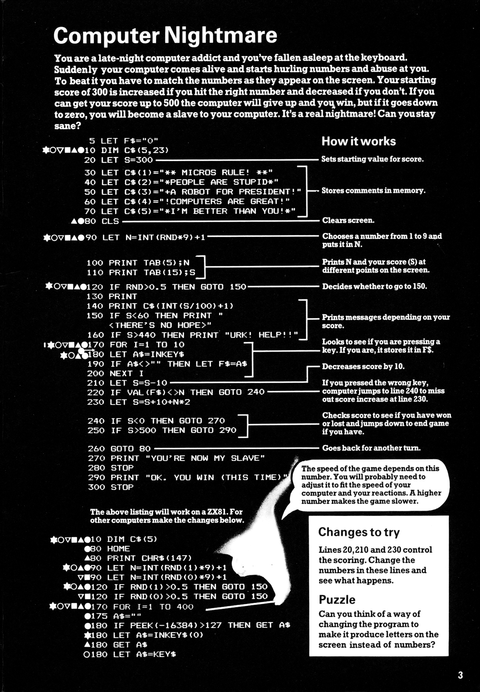

# Computer Nightmare

**Book**: _Creepy Computer Games_
**Author**: [Brendon Kavanagh, Colin Reynolds, Val Robinson, Alan Ramsey, Keith Campbell, Chris Oxlade](https://github.com/marcusjobb/UsborneBooks)
**Translator**: [Marcus Medina](http://marcusmedina.pro)

---

## Story

You are a late-night computer addict who’s fallen asleep at the keyboard.
Suddenly, your computer comes alive and starts **hurling numbers and insults** at you!

To survive, you must match the numbers as they appear on the screen.
You begin with a score of **300** — hitting the right number increases it,
missing decreases it. Reach **500** and you break the curse.
Drop to **0**, and you’ll become a slave to your computer forever.

Can you stay sane?

---

## Pseudocode

```plaintext
SET starting score = 300
STORE a few computer insults in a list
CLEAR the screen

LOOP until score is <= 0 or >= 500
    CHOOSE random number between 1 and 9
    DISPLAY random number and current score
    SOMETIMES print a random insult depending on score
    WAIT for keypress
    DECREASE score slightly each turn
    IF key pressed matches number THEN
        INCREASE score
    ELSE
        DECREASE score more
    END IF
    CHECK win/lose conditions
END LOOP

IF score <= 0 THEN
    PRINT "YOU ARE NOW MY SLAVE"
ELSE
    PRINT "OK. YOU WIN (THIS TIME)"
END IF
```

---

## Flowchart

```mermaid
flowchart TD
    A[Start Game] --> B[Set Score = 300]
    B --> C[Store insult messages]
    C --> D[Loop Start]
    D --> E[Pick random number 1-9]
    E --> F[Display number and score]
    F --> G[Maybe print insult]
    G --> H[Wait for keypress]
    H --> I[Decrease score by 10]
    I --> J[Was key correct?]
    J -->|Yes| K[Increase score by 10 + N*2]
    J -->|No| L[Decrease score again]
    K --> M[Check win (score >= 500)]
    L --> N[Check lose (score <= 0)]
    M -->|Win| O[Show OK. YOU WIN]
    N -->|Lose| P[Show YOU ARE NOW MY SLAVE]
    O --> Q[End]
    P --> Q[End]
```

---

## Code

<details>
<summary>Pages</summary>



</details>

---

<details>
<summary>ZX-81 BASIC</summary>

```basic
5 LET F$="0"
10 DIM C$(5,23)
20 LET S=300
30 LET C$(1)="**MICROS RULE!**"
40 LET C$(2)="**PEOPLE ARE STUPID!**"
50 LET C$(3)="A ROBOT FOR PRESIDENT!"
60 LET C$(4)="COMPUTERS ARE GREAT!"
70 LET C$(5)="I'M BETTER THAN YOU!"
80 CLS
90 LET N=INT(RND*9)+1
100 PRINT TAB(5);N
110 PRINT TAB(15);S
120 IF RND>0.5 THEN GOTO 150
130 PRINT
140 PRINT C$(INT(S/100)+1)
150 IF S<60 THEN PRINT "THERE'S NO HOPE"
160 IF S>440 THEN PRINT "URK! HELP!"
170 FOR I=1 TO 10
180 LET A$=INKEY$
190 IF A$<>"" THEN LET F$=A$
200 NEXT I
210 LET S=S-10
220 IF VAL(F$)<>N THEN GOTO 240
230 LET S=S+10+N*2
240 IF S<=0 THEN GOTO 270
250 IF S>=500 THEN GOTO 290
260 GOTO 80
270 PRINT "YOU'RE NOW MY SLAVE"
280 STOP
290 PRINT "OK. YOU WIN (THIS TIME)"
300 STOP
```

</details>

---

<details>
<summary>C#</summary>

```csharp
using System;

class ComputerNightmare
{
    static void Main()
    {
        string[] insults =
        {
            "**MICROS RULE!**",
            "**PEOPLE ARE STUPID!**",
            "A ROBOT FOR PRESIDENT!",
            "COMPUTERS ARE GREAT!",
            "I'M BETTER THAN YOU!"
        };

        int score = 300;
        Random rnd = new Random();

        while (score > 0 && score < 500)
        {
            int n = rnd.Next(1, 10);
            Console.Clear();
            Console.WriteLine($"Number: {n}   Score: {score}");

            if (rnd.NextDouble() > 0.5)
                Console.WriteLine(insults[Math.Min(score / 100, insults.Length - 1)]);

            Console.Write("Press number: ");
            var key = Console.ReadKey(true).KeyChar;
            if (char.IsDigit(key))
            {
                int guess = key - '0';
                score -= 10;
                if (guess == n)
                    score += 10 + n * 2;
            }

            if (score <= 0)
                Console.WriteLine("\nYOU ARE NOW MY SLAVE!");
            else if (score >= 500)
                Console.WriteLine("\nOK. YOU WIN (THIS TIME)");
        }
    }
}
```

</details>

---

<details>
<summary>Python</summary>

```python
import random

def computer_nightmare():
    insults = [
        "**MICROS RULE!**",
        "**PEOPLE ARE STUPID!**",
        "A ROBOT FOR PRESIDENT!",
        "COMPUTERS ARE GREAT!",
        "I'M BETTER THAN YOU!"
    ]

    score = 300
    while 0 < score < 500:
        n = random.randint(1, 9)
        print(f"\nNumber: {n}   Score: {score}")

        if random.random() > 0.5:
            print(insults[min(score // 100, len(insults) - 1)])

        try:
            guess = int(input("Press number: "))
        except ValueError:
            guess = -1

        score -= 10
        if guess == n:
            score += 10 + n * 2

    if score <= 0:
        print("\nYOU'RE NOW MY SLAVE!")
    else:
        print("\nOK. YOU WIN (THIS TIME)")

if __name__ == "__main__":
    computer_nightmare()
```

</details>

---

<details>
<summary>Java</summary>

```java
import java.util.Random;
import java.util.Scanner;

public class ComputerNightmare {
    public static void main(String[] args) {
        String[] insults = {
            "**MICROS RULE!**",
            "**PEOPLE ARE STUPID!**",
            "A ROBOT FOR PRESIDENT!",
            "COMPUTERS ARE GREAT!",
            "I'M BETTER THAN YOU!"
        };

        int score = 300;
        Random rnd = new Random();
        Scanner scanner = new Scanner(System.in);

        while (score > 0 && score < 500) {
            int n = rnd.nextInt(9) + 1;
            System.out.println("\nNumber: " + n + "   Score: " + score);

            if (rnd.nextDouble() > 0.5) {
                System.out.println(insults[Math.min(score / 100, insults.length - 1)]);
            }

            System.out.print("Press number: ");
            int guess;
            try {
                guess = Integer.parseInt(scanner.nextLine().trim());
            } catch (NumberFormatException e) {
                guess = -1;
            }

            score -= 10;
            if (guess == n) {
                score += 10 + n * 2;
            }
        }

        if (score <= 0) {
            System.out.println("\nYOU'RE NOW MY SLAVE!");
        } else {
            System.out.println("\nOK. YOU WIN (THIS TIME)");
        }
    }
}
```

</details>

---

<details>
<summary>Go</summary>

```go
package main

import (
	"bufio"
	"fmt"
	"math/rand"
	"os"
	"strconv"
	"strings"
	"time"
)

func main() {
	insults := []string{
		"**MICROS RULE!**",
		"**PEOPLE ARE STUPID!**",
		"A ROBOT FOR PRESIDENT!",
		"COMPUTERS ARE GREAT!",
		"I'M BETTER THAN YOU!",
	}

	score := 300
	rand.Seed(time.Now().UnixNano())
	reader := bufio.NewReader(os.Stdin)

	for score > 0 && score < 500 {
		n := rand.Intn(9) + 1
		fmt.Printf("\nNumber: %d   Score: %d\n", n, score)

		if rand.Float64() > 0.5 {
			idx := score / 100
			if idx >= len(insults) {
				idx = len(insults) - 1
			}
			fmt.Println(insults[idx])
		}

		fmt.Print("Press number: ")
		input, _ := reader.ReadString('\n')
		guess, err := strconv.Atoi(strings.TrimSpace(input))
		if err != nil {
			guess = -1
		}

		score -= 10
		if guess == n {
			score += 10 + n*2
		}
	}

	if score <= 0 {
		fmt.Println("\nYOU'RE NOW MY SLAVE!")
	} else {
		fmt.Println("\nOK. YOU WIN (THIS TIME)")
	}
}
```

</details>

---

<details>
<summary>C++</summary>

```cpp
#include <iostream>
#include <cstdlib>
#include <ctime>
#include <string>
#include <algorithm>

int main() {
    std::string insults[] = {
        "**MICROS RULE!**",
        "**PEOPLE ARE STUPID!**",
        "A ROBOT FOR PRESIDENT!",
        "COMPUTERS ARE GREAT!",
        "I'M BETTER THAN YOU!"
    };

    int score = 300;
    srand(time(0));

    while (score > 0 && score < 500) {
        int n = rand() % 9 + 1;
        std::cout << "\nNumber: " << n << "   Score: " << score << std::endl;

        if ((double)rand() / RAND_MAX > 0.5) {
            int idx = std::min(score / 100, 4);
            std::cout << insults[idx] << std::endl;
        }

        std::cout << "Press number: ";
        int guess;
        std::cin >> guess;

        score -= 10;
        if (guess == n) {
            score += 10 + n * 2;
        }
    }

    if (score <= 0) {
        std::cout << "\nYOU'RE NOW MY SLAVE!" << std::endl;
    } else {
        std::cout << "\nOK. YOU WIN (THIS TIME)" << std::endl;
    }

    return 0;
}
```

</details>

---

## Explanation

The game randomly displays a number (1-9).
You must quickly press the same number to increase your score.
Miss or press the wrong key, and the score drops.
As your score changes, the computer throws out random taunts.
If you survive until your score reaches **500**, you escape its control.

If your score drops to **0**, the machine owns you forever.

---

## Challenges

1. **Variable speed** – Adjust how fast the numbers appear depending on score.
2. **Insult bank** – Add more taunts or make them trigger based on your mistakes.
3. **Letter mode** – Modify the code to display letters instead of numbers.
4. **Double trouble** – Occasionally show two numbers and require both to be pressed in order.
5. **Memory overload** – Add a timer penalty if you wait too long before responding.

---

## Copyright

These programs are adaptations of the original Usborne Computer Guides published in the 1980s.
The books are free to download for personal or educational use from
[Usborne’s Computer and Coding Books](https://usborne.com/row/books/computer-and-coding-books).
Programs and adaptations may **not** be used for commercial purposes.

Return to [Creepy Computer Games](./readme.md).
