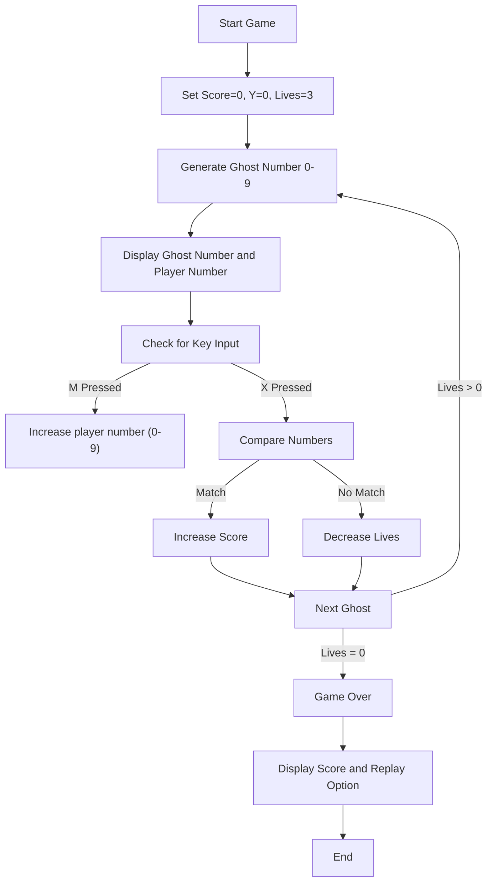
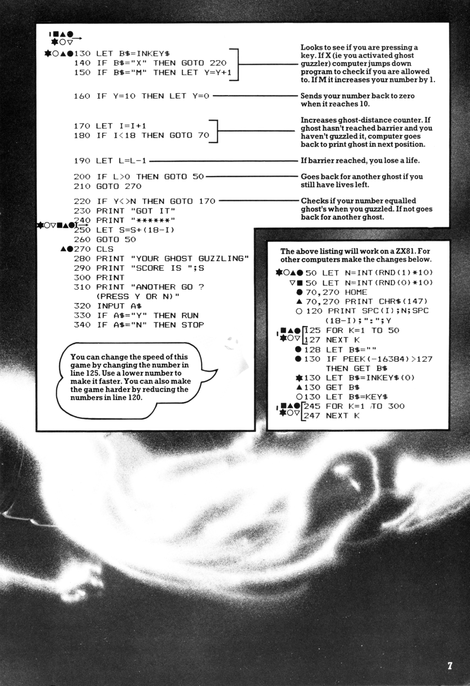

# Ghost Guzzler

**Book**: _Creepy Computer Games_  

**Author**: [Brendon Kavanagh, Colin Reynolds, Val Robinson, Alan Ramsey, Keith Campbell, Chris Oxlade](https://github.com/marcusjobb/UsborneBooks)  
**Translator**: [Marcus Medina](http://marcusmedina.pro)  

---

## Story

The ghosts are loose! 👻
Numbers rush across your screen — each one a **ghostly apparition** trying to invade your computer.
Your only defense is the **Ghost Guzzler**, a strange contraption that devours numbers — but only when you match the right one!

Press **X** to activate your guzzler when the number matches the attacking ghost.
Press **M** to increase your guzzler’s setting (0-9, looping back to 0).
If you fail to catch the ghost, it steals one of your lives.
Lose them all and the ghosts will **haunt your machine forever**...

---

## Pseudocode

```plaintext
PRINT "GHOST GUZZLER"
SET score = 0
SET player_number = 0
SET lives = 3

LOOP while lives > 0
    CHOOSE random ghost_number between 0 and 9
    DISPLAY number of lives, ghost_number, and your_number
    WAIT a short time
    CHECK if a key is pressed:
        - X: try to catch ghost
        - M: increase your number by 1
    IF your_number == ghost_number THEN
        PRINT "GOT IT!"
        INCREASE score
    ELSE IF ghost reaches end THEN
        DECREASE lives
    END IF
END LOOP

PRINT final score
ASK "ANOTHER GO?"
```

---

## Flowchart



---

## Code

<details>
<summary>Pages</summary>

  


</details>

---

<details>
<summary>ZX-81 BASIC</summary>

```basic
10 PRINT "GHOST GUZZLER"
20 LET S=0
30 LET Y=0
40 LET L=3
50 LET N=INT(RND*10)
60 LET I=1
70 CLS
80 FOR J=1 TO L
90 PRINT "/";
100 NEXT J
110 PRINT
120 PRINT TAB(I);N;TAB(18);":";Y
130 LET B$=INKEY$
140 IF B$="X" THEN GOTO 220
150 IF B$="M" THEN LET Y=Y+1
160 IF Y=10 THEN LET Y=0
170 LET I=I+1
180 IF I<18 THEN GOTO 70
190 LET L=L-1
200 IF L>0 THEN GOTO 50
210 GOTO 270
220 IF Y<>N THEN GOTO 170
230 PRINT "GOT IT"
240 PRINT "*******"
250 LET S=S+(18-I)
260 GOTO 50
270 CLS
280 PRINT "YOUR GHOST GUZZLING"
290 PRINT "SCORE IS ";S
300 PRINT
310 PRINT "ANOTHER GO? (PRESS Y OR N)"
320 INPUT A$
330 IF A$="Y" THEN RUN
340 IF A$="N" THEN STOP
```

</details>

---

<details>
<summary>C#</summary>

```csharp
using System;
using System.Threading;

class GhostGuzzler
{
    static void Main()
    {
        int score = 0;
        int player = 0;
        int lives = 3;
        Random rnd = new Random();

        while (lives > 0)
        {
            int ghost = rnd.Next(0, 10);
            for (int pos = 1; pos < 18; pos++)
            {
                Console.Clear();
                Console.WriteLine(new string('/', lives));
                Console.WriteLine($"\nGhost: {ghost}   You: {player}");
                Thread.Sleep(100);

                if (Console.KeyAvailable)
                {
                    var key = Console.ReadKey(true).Key;
                    if (key == ConsoleKey.M)
                    {
                        player = (player + 1) % 10;
                    }
                    else if (key == ConsoleKey.X)
                    {
                        if (player == ghost)
                        {
                            Console.WriteLine("GOT IT!");
                            score += 18 - pos;
                            Thread.Sleep(500);
                            break;
                        }
                    }
                }

                if (pos == 17)
                {
                    lives--;
                    Console.WriteLine("A ghost got you!");
                    Thread.Sleep(800);
                }
            }
        }

        Console.Clear();
        Console.WriteLine($"Your Ghost Guzzling Score: {score}");
        Console.Write("Another go? (Y/N): ");
        if (Console.ReadKey(true).Key == ConsoleKey.Y)
            Main();
    }
}
```

</details>

---

<details>
<summary>Python</summary>

```python
import random
import time
import msvcrt

def ghost_guzzler():
    score = 0
    player = 0
    lives = 3

    while lives > 0:
        ghost = random.randint(0, 9)
        for i in range(1, 18):
            print("\033c", end="")  # clear screen
            print("/" * lives)
            print(f"\nGhost: {ghost}   You: {player}")
            time.sleep(0.1)

            if msvcrt.kbhit():
                key = msvcrt.getwch().upper()
                if key == "M":
                    player = (player + 1) % 10
                elif key == "X":
                    if player == ghost:
                        print("GOT IT!")
                        score += (18 - i)
                        time.sleep(0.5)
                        break
            if i == 17:
                lives -= 1
                print("A ghost got you!")
                time.sleep(0.8)

    print(f"\nYour Ghost Guzzling Score: {score}")
    again = input("Another go? (Y/N): ").upper()
    if again == "Y":
        ghost_guzzler()

if __name__ == "__main__":
    ghost_guzzler()
```

</details>

---

<details>
<summary>Java</summary>

```java
import java.util.Random;
import java.util.Scanner;

public class GhostGuzzler {
    public static void main(String[] args) {
        Scanner scanner = new Scanner(System.in);
        play(scanner);
    }

    static void play(Scanner scanner) {
        Random rnd = new Random();
        int score = 0;
        int player = 0;
        int lives = 3;

        while (lives > 0) {
            int ghost = rnd.nextInt(10);
            boolean caught = false;

            for (int pos = 1; pos < 18 && !caught; pos++) {
                System.out.println("/".repeat(lives));
                System.out.println("\nGhost: " + ghost + "   You: " + player);
                System.out.print("Press M to change your number, X to guzzle, or Enter to wait: ");

                if (!scanner.hasNextLine()) {
                    System.out.println("\nYour Ghost Guzzling Score: " + score);
                    return;
                }
                String key = scanner.nextLine().trim().toUpperCase();

                if (key.equals("M")) {
                    player = (player + 1) % 10;
                } else if (key.equals("X") && player == ghost) {
                    System.out.println("GOT IT!");
                    score += 18 - pos;
                    caught = true;
                }

                if (!caught && pos == 17) {
                    lives--;
                    System.out.println("A ghost got you!");
                }
            }
        }

        System.out.println("\nYour Ghost Guzzling Score: " + score);
        System.out.print("Another go? (Y/N): ");
        if (scanner.hasNextLine()) {
            String again = scanner.nextLine().trim().toUpperCase();
            if (again.equals("Y")) {
                play(scanner);
            }
        }
    }
}
```

</details>

---

<details>
<summary>Go</summary>

```go
package main

import (
	"bufio"
	"fmt"
	"math/rand"
	"os"
	"strings"
	"time"
)

func play(reader *bufio.Reader) {
	score := 0
	player := 0
	lives := 3

	for lives > 0 {
		ghost := rand.Intn(10)
		caught := false

		for pos := 1; pos < 18 && !caught; pos++ {
			fmt.Println(strings.Repeat("/", lives))
			fmt.Printf("\nGhost: %d   You: %d\n", ghost, player)
			fmt.Print("Press M to change your number, X to guzzle, or Enter to wait: ")

			line, err := reader.ReadString('\n')
			if err != nil {
				fmt.Printf("\nYour Ghost Guzzling Score: %d\n", score)
				return
			}
			key := strings.ToUpper(strings.TrimSpace(line))

			if key == "M" {
				player = (player + 1) % 10
			} else if key == "X" && player == ghost {
				fmt.Println("GOT IT!")
				score += 18 - pos
				caught = true
			}

			if !caught && pos == 17 {
				lives--
				fmt.Println("A ghost got you!")
			}
		}
	}

	fmt.Printf("\nYour Ghost Guzzling Score: %d\n", score)
	fmt.Print("Another go? (Y/N): ")
	line, err := reader.ReadString('\n')
	if err == nil && strings.ToUpper(strings.TrimSpace(line)) == "Y" {
		play(reader)
	}
}

func main() {
	rand.Seed(time.Now().UnixNano())
	reader := bufio.NewReader(os.Stdin)
	play(reader)
}
```

</details>

---

<details>
<summary>C++</summary>

```cpp
#include <iostream>
#include <string>
#include <cstdlib>
#include <ctime>
#include <algorithm>

void play() {
    int score = 0;
    int player = 0;
    int lives = 3;

    while (lives > 0) {
        int ghost = rand() % 10;
        bool caught = false;

        for (int pos = 1; pos < 18 && !caught; pos++) {
            std::cout << std::string(lives, '/') << std::endl;
            std::cout << "\nGhost: " << ghost << "   You: " << player << std::endl;
            std::cout << "Press M to change your number, X to guzzle, or Enter to wait: ";

            std::string key;
            if (!std::getline(std::cin, key)) {
                std::cout << "\nYour Ghost Guzzling Score: " << score << std::endl;
                return;
            }
            std::transform(key.begin(), key.end(), key.begin(), ::toupper);

            if (key == "M") {
                player = (player + 1) % 10;
            } else if (key == "X" && player == ghost) {
                std::cout << "GOT IT!" << std::endl;
                score += 18 - pos;
                caught = true;
            }

            if (!caught && pos == 17) {
                lives--;
                std::cout << "A ghost got you!" << std::endl;
            }
        }
    }

    std::cout << "\nYour Ghost Guzzling Score: " << score << std::endl;
    std::cout << "Another go? (Y/N): ";
    std::string again;
    if (std::getline(std::cin, again)) {
        std::transform(again.begin(), again.end(), again.begin(), ::toupper);
        if (again == "Y") {
            play();
        }
    }
}

int main() {
    srand(time(0));
    play();
    return 0;
}
```

</details>

---

## Explanation

Each ghost is represented by a number (0-9) moving across the screen.
You must press **X** when your number matches the ghost’s.
Press **M** to change your guzzler’s number.
If you miss, you lose a life.
Your score increases the sooner you catch the ghost.

---

## Challenges

1. **Sound Effects** – Add spooky sound when you lose a life or catch a ghost.
2. **Speed Control** – Adjust line 125 (or the sleep delay) to make ghosts faster.
3. **Difficulty Curve** – Reduce starting lives or increase ghost speed over time.
4. **Ghost Count** – Track how many ghosts you’ve caught.
5. **Two-Player Mode** – Add alternating turns for two ghost hunters.

---

## Copyright

These programs are adaptations of the original Usborne Computer Guides published in the 1980s.
The books are free to download for personal or educational use from
[Usborne’s Computer and Coding Books](https://usborne.com/row/books/computer-and-coding-books).
Programs and adaptations may **not** be used for commercial purposes.

Return to [Creepy Computer Games](./readme.md).
