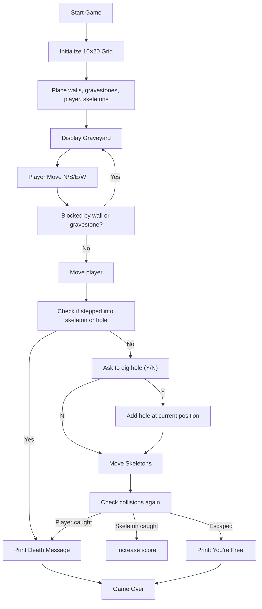
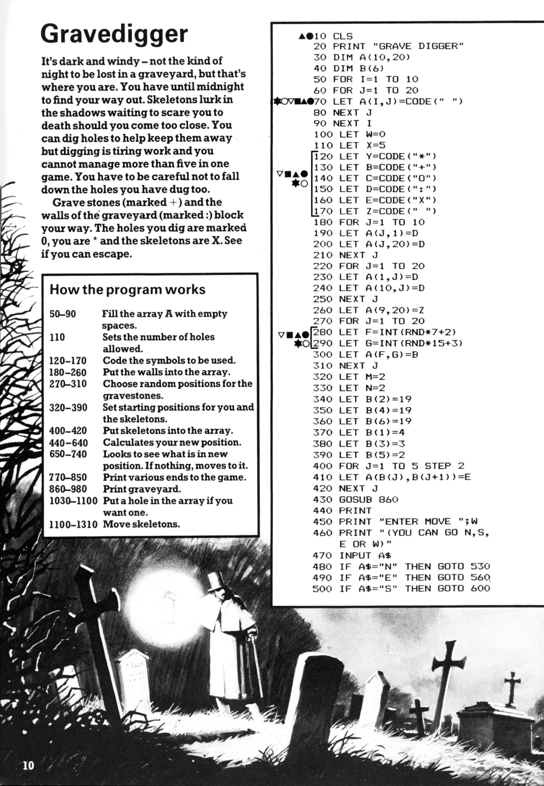
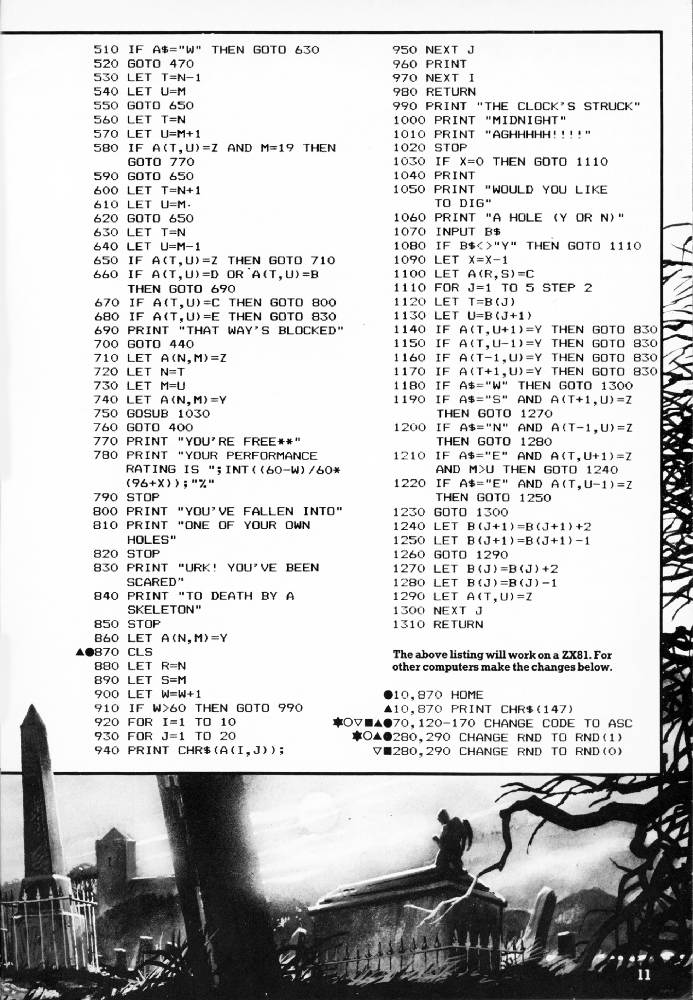

# Gravedigger

**Book**: _Creepy Computer Games_   
**Author**: [Brendon Kavanagh, Colin Reynolds, Val Robinson, Alan Ramsey, Keith Campbell, Chris Oxlade](https://github.com/marcusjobb/UsborneBooks)  
**Translator**: [Marcus Medina](http://marcusmedina.pro)  

---

## Story

It’s dark, cold, and windy — not the kind of night to get lost in a graveyard.
But that’s exactly where you are. Skeletons roam the shadows, rattling their bones and waiting to scare you to death.

You must dig holes to **trap the skeletons** before they reach you.
But be careful — **digging is exhausting**, and you can only dig **five holes** per game.
If you dig too many or fall into your own traps, you’ll never make it to dawn.

Gravestones (marked **+**) and graveyard walls (**:**) block your path.
Your holes are marked **0**, you are **\***, and the skeletons are **X**.
Find your way out before midnight — or join them forever…

---

## Pseudocode

```plaintext
CREATE a 10×20 grid and fill with empty spaces
SET number of holes = 5
DEFINE symbols: + = gravestone, : = wall, 0 = hole, * = player, X = skeleton

PLACE walls and gravestones randomly
PLACE player (*) and skeletons (X) in starting positions

REPEAT until escaped or dead:
    DISPLAY the graveyard
    ASK for movement (N, S, E, W)
    MOVE player if possible
    IF player moves into wall or gravestone → print "That way's blocked"
    IF player steps into skeleton → player dies
    IF player steps into hole → player falls and dies
    CHECK if player escaped → print "You're free!"
    OPTIONALLY dig a hole (Y/N)
    MOVE skeletons toward player
    CHECK collisions again
END LOOP

PRINT outcome and performance rating
```

---

## Flowchart



---

## Code

<details>
<summary>Pages</summary>

  


</details>

---

<details>
<summary>ZX-81 BASIC</summary>

```basic
10 CLS
20 PRINT "GRAVE DIGGER"
30 DIM A(10,20)
40 DIM B(6)
50 FOR I=1 TO 10
60 FOR J=1 TO 20
70 LET A(I,J)=CODE(" ")
80 NEXT J
90 NEXT I
100 LET W=0
110 LET X=5
120 LET Y=CODE("*")
130 LET B=CODE("+")
140 LET C=CODE("0")
150 LET D=CODE(":")
160 LET E=CODE("X")
170 LET Z=CODE(" ")
180 FOR J=1 TO 10
190 LET A(J,1)=D
200 LET A(J,20)=D
210 NEXT J
220 FOR J=1 TO 20
230 LET A(1,J)=D
240 LET A(10,J)=D
250 NEXT J
260 LET A(9,20)=Z
270 FOR J=1 TO 20
280 LET F=INT(RND*7+2)
290 LET G=INT(RND*15+3)
300 LET A(F,G)=B
310 NEXT J
320 LET M=2
330 LET N=2
340 LET B(2)=19
350 LET B(4)=19
360 LET B(6)=19
370 LET B(1)=4
380 LET B(3)=3
390 LET B(5)=2
400 FOR J=1 TO 5 STEP 2
410 LET A(B(J),B(J+1))=E
420 NEXT J
430 GOSUB 860
440 PRINT
450 PRINT "ENTER MOVE: ";
460 PRINT "(YOU CAN GO N,S,E OR W)"
470 INPUT A$
480 IF A$="N" THEN GOTO 530
490 IF A$="E" THEN GOTO 560
500 IF A$="S" THEN GOTO 600
510 IF A$="W" THEN GOTO 630
520 GOTO 470
530 LET N=N-1
540 LET U=M
550 GOTO 650
560 LET T=N
570 LET M=M+1
580 IF A(T,U)=Z AND M=19 THEN GOTO 770
590 GOTO 650
600 LET T=N+1
610 LET U=M
620 GOTO 650
630 LET T=N
640 LET U=M-1
650 IF A(T,U)=Z THEN GOTO 710
660 IF A(T,U)=D OR A(T,U)=B THEN GOTO 690
670 IF A(T,U)=C THEN GOTO 800
680 IF A(T,U)=E THEN GOTO 830
690 PRINT "THAT WAY'S BLOCKED"
700 GOTO 440
710 LET A(N,M)=Z
720 LET N=T
730 LET M=U
740 LET A(N,M)=Y
750 GOSUB 1030
760 GOTO 400
770 PRINT "**YOU'RE FREE**"
780 PRINT "YOUR PERFORMANCE RATING IS ";INT((60-W)/60*(96+X));"%"
790 STOP
800 PRINT "YOU'VE FALLEN INTO"
810 PRINT "ONE OF YOUR OWN HOLES"
820 STOP
830 PRINT "URK! YOU'VE BEEN SCARED"
840 PRINT "TO DEATH BY A SKELETON"
850 STOP
860 LET A(N,M)=Y
870 CLS
880 LET R=N
890 LET S=M
900 LET W=W+1
910 IF W>60 THEN GOTO 990
920 FOR I=1 TO 10
930 FOR J=1 TO 20
940 PRINT CHR$(A(I,J));
950 NEXT J
960 PRINT
970 NEXT I
980 RETURN
990 PRINT "THE CLOCK'S STRUCK"
1000 PRINT "MIDNIGHT!"
1010 PRINT "AGHHHHHH!"
1020 STOP
1030 IF X=0 THEN GOTO 1110
1040 PRINT
1050 PRINT "WOULD YOU LIKE TO DIG?"
1060 PRINT "(Y OR N)"
1070 INPUT B$
1080 IF B$<>"Y" THEN GOTO 1110
1090 LET X=X-1
1100 LET A(N,M)=C
1110 FOR J=1 TO 5 STEP 2
1120 LET T=B(J)
1130 LET U=B(J+1)
1140 IF A(T,U)=Y THEN GOTO 830
1150 IF A(T,U)=Y THEN GOTO 830
1160 IF A(T+1,U)=Y THEN GOTO 830
1170 IF A(T-1,U)=Y THEN GOTO 830
1180 IF A$="W" THEN GOTO 1300
1190 IF A$="S" AND A(T+1,U)=Z THEN GOTO 1270
1200 IF A$="N" AND A(T-1,U)=Z THEN GOTO 1280
1210 IF A$="E" AND A(T,U+1)=Z AND M>U THEN GOTO 1240
1220 IF A$="E" AND A(T,U-1)=Z THEN GOTO 1250
1230 GOTO 1300
1240 LET B(J+1)=B(J+1)+2
1250 LET B(J+1)=B(J+1)-1
1260 GOTO 1290
1270 LET B(J)=B(J)+2
1280 LET B(J)=B(J)-1
1290 LET A(T,U)=Z
1300 NEXT J
1310 RETURN
```

</details>

---

<details>
<summary>C#</summary>

```csharp
using System;

class Gravedigger
{
    const int Rows = 10, Cols = 20;
    static char[,] grid = new char[Rows, Cols];
    static Random rnd = new Random();
    static int playerRow = 2, playerCol = 2;
    static int holesLeft = 5;
    static int turns = 0;
    static (int r, int c)[] skeletons = new (int, int)[3];

    static void Main()
    {
        InitGrid();
        PlaceSkeletons();
        Play();
    }

    static void InitGrid()
    {
        for (int r = 0; r < Rows; r++)
            for (int c = 0; c < Cols; c++)
                grid[r, c] = ' ';

        for (int r = 0; r < Rows; r++)
        {
            grid[r, 0] = ':';
            grid[r, Cols - 1] = ':';
        }
        for (int c = 0; c < Cols; c++)
        {
            grid[0, c] = ':';
            grid[Rows - 1, c] = ':';
        }

        for (int i = 0; i < 25; i++)
            grid[rnd.Next(1, Rows - 1), rnd.Next(1, Cols - 1)] = '+';
        grid[Rows - 2, Cols - 1] = ' ';
    }

    static void PlaceSkeletons()
    {
        for (int i = 0; i < skeletons.Length; i++)
        {
            skeletons[i] = (rnd.Next(1, Rows - 1), rnd.Next(1, Cols - 1));
            grid[skeletons[i].r, skeletons[i].c] = 'X';
        }
        grid[playerRow, playerCol] = '*';
    }

    static void Play()
    {
        while (true)
        {
            Console.Clear();
            Draw();
            Console.WriteLine($"\nHoles left: {holesLeft}");
            Console.Write("Move (N,S,E,W): ");
            char move = char.ToUpper(Console.ReadKey(true).KeyChar);

            int newR = playerRow, newC = playerCol;
            if (move == 'N') newR--;
            if (move == 'S') newR++;
            if (move == 'W') newC--;
            if (move == 'E') newC++;

            if (grid[newR, newC] == ':' || grid[newR, newC] == '+')
            {
                Console.WriteLine("\nThat way’s blocked!");
                Console.ReadKey();
                continue;
            }
            if (grid[newR, newC] == '0')
            {
                Console.WriteLine("\nYou’ve fallen into your own hole!");
                return;
            }
            if (grid[newR, newC] == 'X')
            {
                Console.WriteLine("\nURK! You’ve been scared to death by a skeleton!");
                return;
            }

            grid[playerRow, playerCol] = ' ';
            playerRow = newR; playerCol = newC;
            grid[playerRow, playerCol] = '*';

            if (playerCol == Cols - 1)
            {
                Console.WriteLine("\nYou’re free! Congratulations!");
                return;
            }

            Console.Write("\nDo you want to dig a hole? (Y/N): ");
            if (holesLeft > 0 && Console.ReadKey(true).KeyChar is 'Y' or 'y')
            {
                grid[playerRow, playerCol] = '0';
                holesLeft--;
            }

            MoveSkeletons();
            turns++;

            if (turns > 60)
            {
                Console.WriteLine("\nThe clock’s struck midnight! AGHHHHH!");
                return;
            }
        }
    }

    static void Draw()
    {
        for (int r = 0; r < Rows; r++)
        {
            for (int c = 0; c < Cols; c++)
                Console.Write(grid[r, c]);
            Console.WriteLine();
        }
    }

    static void MoveSkeletons()
    {
        for (int i = 0; i < skeletons.Length; i++)
        {
            var (r, c) = skeletons[i];
            grid[r, c] = ' ';
            int dr = Math.Sign(playerRow - r);
            int dc = Math.Sign(playerCol - c);
            int newR = r + dr;
            int newC = c + dc;

            if (grid[newR, newC] == '*')
            {
                Console.WriteLine("\nA skeleton caught you!");
                Environment.Exit(0);
            }
            if (grid[newR, newC] == '0')
                continue; // Skeleton falls in hole
            grid[newR, newC] = 'X';
            skeletons[i] = (newR, newC);
        }
    }
}
```

</details>

---

<details>
<summary>Python</summary>

```python
import random
import os
import time

ROWS, COLS = 10, 20

def print_grid(grid):
    os.system("cls" if os.name == "nt" else "clear")
    for row in grid:
        print("".join(row))

def gravedigger():
    grid = [[" " for _ in range(COLS)] for _ in range(ROWS)]
    for i in range(ROWS):
        grid[i][0] = grid[i][-1] = ":"
    for j in range(COLS):
        grid[0][j] = grid[-1][j] = ":"
    for _ in range(25):
        grid[random.randint(1, ROWS-2)][random.randint(1, COLS-2)] = "+"
    grid[ROWS-2][COLS-1] = " "

    player = [2, 2]
    skeletons = [[4, 4], [3, 18], [7, 15]]
    for r, c in skeletons: grid[r][c] = "X"
    grid[player[0]][player[1]] = "*"
    holes = 5
    turns = 0

    while True:
        print_grid(grid)
        print(f"Holes left: {holes}")
        move = input("Move (N,S,E,W): ").upper()
        dr, dc = {"N":(-1,0),"S":(1,0),"E":(0,1),"W":(0,-1)}.get(move,(0,0))
        nr, nc = player[0]+dr, player[1]+dc

        if grid[nr][nc] in [":","+"]:
            print("That way’s blocked!"); time.sleep(1); continue
        if grid[nr][nc] == "0":
            print("You fell into your own hole!"); break
        if grid[nr][nc] == "X":
            print("A skeleton got you!"); break

        grid[player[0]][player[1]] = " "
        player = [nr, nc]
        grid[player[0]][player[1]] = "*"

        if player[1] == COLS-1:
            print("You’re free!"); break

        if holes > 0 and input("Dig a hole? (Y/N): ").upper() == "Y":
            grid[player[0]][player[1]] = "0"
            holes -= 1

        # Move skeletons
        for s in skeletons:
            r, c = s
            grid[r][c] = " "
            dr = (player[0] > r) - (player[0] < r)
            dc = (player[1] > c) - (player[1] < c)
            nr, nc = r+dr, c+dc
            if grid[nr][nc] == "*":
                print("A skeleton caught you!"); return
            if grid[nr][nc] == "0":
                continue
            grid[nr][nc] = "X"
            s[:] = [nr, nc]

        turns += 1
        if turns > 60:
            print("The clock’s struck midnight! AGHHHHH!"); break

if __name__ == "__main__":
    gravedigger()
```

</details>

---

<details>
<summary>Java</summary>

```java
import java.util.Random;
import java.util.Scanner;

public class Gravedigger {
    static final int ROWS = 10, COLS = 20;
    static char[][] grid = new char[ROWS][COLS];
    static Random rnd = new Random();
    static int playerRow = 2, playerCol = 2;
    static int holesLeft = 5;
    static int turns = 0;
    static int[][] skeletons = {{4, 4}, {3, 18}, {7, 15}};
    static Scanner scanner = new Scanner(System.in);

    public static void main(String[] args) {
        initGrid();
        placeSkeletons();
        play();
    }

    static void initGrid() {
        for (int r = 0; r < ROWS; r++)
            for (int c = 0; c < COLS; c++)
                grid[r][c] = ' ';

        for (int r = 0; r < ROWS; r++) {
            grid[r][0] = ':';
            grid[r][COLS - 1] = ':';
        }
        for (int c = 0; c < COLS; c++) {
            grid[0][c] = ':';
            grid[ROWS - 1][c] = ':';
        }

        for (int i = 0; i < 25; i++)
            grid[1 + rnd.nextInt(ROWS - 2)][1 + rnd.nextInt(COLS - 2)] = '+';
        grid[ROWS - 2][COLS - 1] = ' ';
    }

    static void placeSkeletons() {
        for (int[] s : skeletons)
            grid[s[0]][s[1]] = 'X';
        grid[playerRow][playerCol] = '*';
    }

    static void play() {
        while (true) {
            draw();
            System.out.println("\nHoles left: " + holesLeft);
            System.out.print("Move (N,S,E,W): ");
            if (!scanner.hasNextLine()) return;
            String moveLine = scanner.nextLine().trim().toUpperCase();
            if (moveLine.isEmpty()) continue;
            char move = moveLine.charAt(0);

            int newR = playerRow, newC = playerCol;
            if (move == 'N') newR--;
            else if (move == 'S') newR++;
            else if (move == 'W') newC--;
            else if (move == 'E') newC++;
            else continue;

            if (grid[newR][newC] == ':' || grid[newR][newC] == '+') {
                System.out.println("\nThat way's blocked!");
                continue;
            }
            if (grid[newR][newC] == '0') {
                System.out.println("\nYou've fallen into your own hole!");
                return;
            }
            if (grid[newR][newC] == 'X') {
                System.out.println("\nURK! You've been scared to death by a skeleton!");
                return;
            }

            grid[playerRow][playerCol] = ' ';
            playerRow = newR;
            playerCol = newC;
            grid[playerRow][playerCol] = '*';

            if (playerCol == COLS - 1) {
                System.out.println("\nYou're free! Congratulations!");
                return;
            }

            if (holesLeft > 0) {
                System.out.print("\nDo you want to dig a hole? (Y/N): ");
                if (!scanner.hasNextLine()) return;
                String dig = scanner.nextLine().trim().toUpperCase();
                if (dig.equals("Y")) {
                    grid[playerRow][playerCol] = '0';
                    holesLeft--;
                }
            }

            if (!moveSkeletons()) return;
            turns++;

            if (turns > 60) {
                System.out.println("\nThe clock's struck midnight! AGHHHHH!");
                return;
            }
        }
    }

    static void draw() {
        for (int r = 0; r < ROWS; r++) {
            StringBuilder sb = new StringBuilder();
            for (int c = 0; c < COLS; c++)
                sb.append(grid[r][c]);
            System.out.println(sb);
        }
    }

    static boolean moveSkeletons() {
        for (int[] s : skeletons) {
            int r = s[0], c = s[1];
            grid[r][c] = ' ';
            int dr = Integer.signum(playerRow - r);
            int dc = Integer.signum(playerCol - c);
            int newR = r + dr, newC = c + dc;

            if (grid[newR][newC] == '*') {
                System.out.println("\nA skeleton caught you!");
                return false;
            }
            if (grid[newR][newC] == '0') {
                continue;
            }
            grid[newR][newC] = 'X';
            s[0] = newR;
            s[1] = newC;
        }
        return true;
    }
}
```

</details>

---

<details>
<summary>Go</summary>

```go
package main

import (
	"bufio"
	"fmt"
	"math/rand"
	"os"
	"strings"
	"time"
)

const rows, cols = 10, 20

var grid [rows][cols]byte
var playerRow, playerCol = 2, 2
var holesLeft = 5
var turns = 0
var skeletons = [3][2]int{{4, 4}, {3, 18}, {7, 15}}

func sign(x int) int {
	if x > 0 {
		return 1
	}
	if x < 0 {
		return -1
	}
	return 0
}

func initGrid() {
	for r := 0; r < rows; r++ {
		for c := 0; c < cols; c++ {
			grid[r][c] = ' '
		}
	}
	for r := 0; r < rows; r++ {
		grid[r][0] = ':'
		grid[r][cols-1] = ':'
	}
	for c := 0; c < cols; c++ {
		grid[0][c] = ':'
		grid[rows-1][c] = ':'
	}
	for i := 0; i < 25; i++ {
		grid[1+rand.Intn(rows-2)][1+rand.Intn(cols-2)] = '+'
	}
	grid[rows-2][cols-1] = ' '
}

func placeSkeletons() {
	for _, s := range skeletons {
		grid[s[0]][s[1]] = 'X'
	}
	grid[playerRow][playerCol] = '*'
}

func draw() {
	for r := 0; r < rows; r++ {
		fmt.Println(string(grid[r][:]))
	}
}

func moveSkeletons() bool {
	for i := range skeletons {
		r, c := skeletons[i][0], skeletons[i][1]
		grid[r][c] = ' '
		dr := sign(playerRow - r)
		dc := sign(playerCol - c)
		newR, newC := r+dr, c+dc

		if grid[newR][newC] == '*' {
			fmt.Println("\nA skeleton caught you!")
			return false
		}
		if grid[newR][newC] == '0' {
			continue
		}
		grid[newR][newC] = 'X'
		skeletons[i][0] = newR
		skeletons[i][1] = newC
	}
	return true
}

func main() {
	rand.Seed(time.Now().UnixNano())
	initGrid()
	placeSkeletons()
	reader := bufio.NewReader(os.Stdin)

	for {
		draw()
		fmt.Printf("\nHoles left: %d\n", holesLeft)
		fmt.Print("Move (N,S,E,W): ")
		line, err := reader.ReadString('\n')
		if err != nil {
			return
		}
		moveLine := strings.ToUpper(strings.TrimSpace(line))
		if moveLine == "" {
			continue
		}
		move := moveLine[0]

		newR, newC := playerRow, playerCol
		switch move {
		case 'N':
			newR--
		case 'S':
			newR++
		case 'W':
			newC--
		case 'E':
			newC++
		default:
			continue
		}

		if grid[newR][newC] == ':' || grid[newR][newC] == '+' {
			fmt.Println("\nThat way's blocked!")
			continue
		}
		if grid[newR][newC] == '0' {
			fmt.Println("\nYou've fallen into your own hole!")
			return
		}
		if grid[newR][newC] == 'X' {
			fmt.Println("\nURK! You've been scared to death by a skeleton!")
			return
		}

		grid[playerRow][playerCol] = ' '
		playerRow, playerCol = newR, newC
		grid[playerRow][playerCol] = '*'

		if playerCol == cols-1 {
			fmt.Println("\nYou're free! Congratulations!")
			return
		}

		if holesLeft > 0 {
			fmt.Print("\nDo you want to dig a hole? (Y/N): ")
			line, err = reader.ReadString('\n')
			if err != nil {
				return
			}
			dig := strings.ToUpper(strings.TrimSpace(line))
			if dig == "Y" {
				grid[playerRow][playerCol] = '0'
				holesLeft--
			}
		}

		if !moveSkeletons() {
			return
		}
		turns++

		if turns > 60 {
			fmt.Println("\nThe clock's struck midnight! AGHHHHH!")
			return
		}
	}
}
```

</details>

---

<details>
<summary>C++</summary>

```cpp
#include <iostream>
#include <string>
#include <cstdlib>
#include <ctime>
#include <algorithm>

const int ROWS = 10, COLS = 20;
char grid[ROWS][COLS];
int playerRow = 2, playerCol = 2;
int holesLeft = 5;
int turns = 0;
int skeletons[3][2] = {{4, 4}, {3, 18}, {7, 15}};

int sign(int x) {
    if (x > 0) return 1;
    if (x < 0) return -1;
    return 0;
}

void initGrid() {
    for (int r = 0; r < ROWS; r++)
        for (int c = 0; c < COLS; c++)
            grid[r][c] = ' ';

    for (int r = 0; r < ROWS; r++) {
        grid[r][0] = ':';
        grid[r][COLS - 1] = ':';
    }
    for (int c = 0; c < COLS; c++) {
        grid[0][c] = ':';
        grid[ROWS - 1][c] = ':';
    }

    for (int i = 0; i < 25; i++)
        grid[1 + rand() % (ROWS - 2)][1 + rand() % (COLS - 2)] = '+';
    grid[ROWS - 2][COLS - 1] = ' ';
}

void placeSkeletons() {
    for (auto &s : skeletons)
        grid[s[0]][s[1]] = 'X';
    grid[playerRow][playerCol] = '*';
}

void draw() {
    for (int r = 0; r < ROWS; r++) {
        for (int c = 0; c < COLS; c++)
            std::cout << grid[r][c];
        std::cout << std::endl;
    }
}

bool moveSkeletons() {
    for (auto &s : skeletons) {
        int r = s[0], c = s[1];
        grid[r][c] = ' ';
        int dr = sign(playerRow - r);
        int dc = sign(playerCol - c);
        int newR = r + dr, newC = c + dc;

        if (grid[newR][newC] == '*') {
            std::cout << "\nA skeleton caught you!" << std::endl;
            return false;
        }
        if (grid[newR][newC] == '0') {
            continue;
        }
        grid[newR][newC] = 'X';
        s[0] = newR;
        s[1] = newC;
    }
    return true;
}

int main() {
    srand(time(0));
    initGrid();
    placeSkeletons();

    while (true) {
        draw();
        std::cout << "\nHoles left: " << holesLeft << std::endl;
        std::cout << "Move (N,S,E,W): ";
        std::string line;
        if (!std::getline(std::cin, line)) return 0;
        std::transform(line.begin(), line.end(), line.begin(), ::toupper);
        if (line.empty()) continue;
        char move = line[0];

        int newR = playerRow, newC = playerCol;
        if (move == 'N') newR--;
        else if (move == 'S') newR++;
        else if (move == 'W') newC--;
        else if (move == 'E') newC++;
        else continue;

        if (grid[newR][newC] == ':' || grid[newR][newC] == '+') {
            std::cout << "\nThat way's blocked!" << std::endl;
            continue;
        }
        if (grid[newR][newC] == '0') {
            std::cout << "\nYou've fallen into your own hole!" << std::endl;
            return 0;
        }
        if (grid[newR][newC] == 'X') {
            std::cout << "\nURK! You've been scared to death by a skeleton!" << std::endl;
            return 0;
        }

        grid[playerRow][playerCol] = ' ';
        playerRow = newR;
        playerCol = newC;
        grid[playerRow][playerCol] = '*';

        if (playerCol == COLS - 1) {
            std::cout << "\nYou're free! Congratulations!" << std::endl;
            return 0;
        }

        if (holesLeft > 0) {
            std::cout << "\nDo you want to dig a hole? (Y/N): ";
            std::string dig;
            if (!std::getline(std::cin, dig)) return 0;
            std::transform(dig.begin(), dig.end(), dig.begin(), ::toupper);
            if (dig == "Y") {
                grid[playerRow][playerCol] = '0';
                holesLeft--;
            }
        }

        if (!moveSkeletons()) return 0;
        turns++;

        if (turns > 60) {
            std::cout << "\nThe clock's struck midnight! AGHHHHH!" << std::endl;
            return 0;
        }
    }

    return 0;
}
```

</details>

---

## Explanation

You navigate a graveyard filled with tombstones, skeletons, and danger.
Each move takes effort, and digging holes can help you trap skeletons — but too many holes can trap **you** instead.
Skeletons move after every turn, slowly closing in.
Survive long enough to reach the graveyard’s edge before midnight.

---

## Challenges

1. **More Skeletons** – Add extra enemies for higher difficulty.
2. **Fatigue System** – Reduce movement speed after digging holes.
3. **Night Mode** – Randomly hide parts of the graveyard each turn.
4. **Treasure Graves** – Occasionally hide rewards under gravestones.
5. **Skeleton Intelligence** – Make skeletons move strategically toward you.

---

## Copyright

These programs are adaptations of the original Usborne Computer Guides published in the 1980s.
The books are free to download for personal or educational use from
[Usborne’s Computer and Coding Books](https://usborne.com/row/books/computer-and-coding-books).
Programs and adaptations may **not** be used for commercial purposes.

Return to [Creepy Computer Games](./readme.md).
