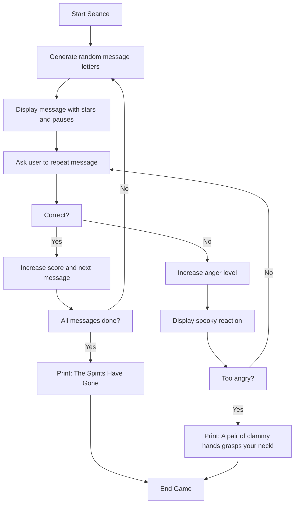

# Seance

**Book**: _Creepy Computer Games_   
**Author**: [Brendon Kavanagh, Colin Reynolds, Val Robinson, Alan Ramsey, Keith Campbell, Chris Oxlade](https://github.com/marcusjobb/UsborneBooks)  
**Translator**: [Marcus Medina](http://marcusmedina.pro)  

---

## Story

You’ve dimmed the lights. The candles flicker.
The computer screen glows softly as you type the first words of the séance program...

Suddenly, letters begin to appear — **messages from the spirits**!
They whisper cryptic phrases through your machine, one letter at a time.
Your task is to remember the letters and type them back in the correct order.

But beware: **mistakes make the spirits angry**.
Too many, and something terrible will happen — the screen will shake, the lights will flicker,
and cold, clammy hands might reach out for you...

Can you keep calm long enough to please the spirits?

---

## Pseudocode

```plaintext
SET score = 0
SET ghost anger = 0
SET base character = 37

LOOP 3 times to create random spirit messages
    PICK random letters
    DISPLAY them one by one
    STORE each sequence
END LOOP

WAIT for user to repeat the message
IF correct → continue to next message
IF wrong → spirits become angry
Display different reactions based on anger level:
    1 = Table shakes
    2 = Light bulb shatters
    3 = Cold hands grasp your neck
END IF

If all letters typed correctly → spirits vanish peacefully
If not → YOU become one of them.
```

---

## Flowchart



---

## Code

<details>
<summary>Pages</summary>


</details>

---

<details>
<summary>ZX-81 BASIC</summary>

```basic
10 LET S=0
20 LET G=0
30 LET CS=37
40 CLS
50 PRINT
60 PRINT TAB(8);"SEANCE"
70 FOR I=1 TO 8
80 LET X=6+I
90 LET Y=5
100 LET A$=CHR$(CS+I)
110 GOSUB 710
120 LET Y=11
130 LET A$=CHR$(CS+22-I)
140 GOSUB 710
150 NEXT I
160 FOR I=1 TO 5
170 LET X=5
180 LET Y=5+I
190 LET A$=CHR$(CS+27-I)
200 GOSUB 710
210 NEXT I
220 FOR I=1 TO 5
230 LET X=8+I
240 LET Y=16
250 LET A$=CHR$(CS+8+I)
260 GOSUB 710
270 NEXT I
280 LET N=INT(RND*4+3)
290 LET L$=""
300 FOR I=1 TO N
310 LET L$=L$+CHR$(CS+INT(RND*26)+1)
320 NEXT I
330 PRINT
340 PRINT "THE MESSAGE IS:"
350 PRINT L$
360 PRINT
370 INPUT R$
380 IF R$=L$ THEN PRINT "THE SPIRITS ARE PLEASED":GOTO 470
390 LET G=G+1
400 IF G=1 THEN PRINT "THE TABLE BEGINS TO SHAKE"
410 IF G=2 THEN PRINT "THE LIGHT BULB SHATTERS"
420 IF G=3 THEN PRINT "A PAIR OF CLAMMY HANDS GRASPS YOUR NECK!":STOP
430 GOTO 330
470 PRINT "THE SPIRITS HAVE GONE"
480 STOP
490 FOR T=1 TO 20
500 NEXT T
510 RETURN
710 PRINT AT Y,X;A$
720 RETURN
```

</details>

---

<details>
<summary>C#</summary>

```csharp
using System;
using System.Threading;

class Seance
{
    static void Main()
    {
        Random rnd = new Random();
        int anger = 0;

        Console.Clear();
        Console.WriteLine("SEANCE\n");
        Thread.Sleep(800);

        while (anger < 3)
        {
            int length = rnd.Next(3, 7);
            string message = "";
            for (int i = 0; i < length; i++)
            {
                char c = (char)('A' + rnd.Next(0, 26));
                message += c;
                Console.Write("*");
                Thread.Sleep(200);
            }

            Console.WriteLine("\n\nType the message:");
            string input = Console.ReadLine()?.ToUpper();

            if (input == message)
            {
                Console.WriteLine("The spirits are pleased...");
                Thread.Sleep(800);
            }
            else
            {
                anger++;
                if (anger == 1) Console.WriteLine("The table begins to shake...");
                else if (anger == 2) Console.WriteLine("The light bulb shatters!");
                else
                {
                    Console.WriteLine("A pair of clammy hands grasps your neck!");
                    Console.WriteLine("You have angered the spirits!");
                    return;
                }
                Thread.Sleep(1500);
            }

            Console.WriteLine("\nThe spirits whisper another...");
            Thread.Sleep(1200);
        }

        Console.WriteLine("\nThe spirits have gone. The room is silent...");
    }
}
```

</details>

---

<details>
<summary>Python</summary>

```python
import random, time, os

def seance():
    anger = 0
    print("SEANCE\n")
    time.sleep(1)

    while anger < 3:
        length = random.randint(3, 7)
        message = "".join(chr(65 + random.randint(0, 25)) for _ in range(length))
        print("Messages from the beyond appear...")
        print("*" * length)
        time.sleep(0.5)

        guess = input("Type the message: ").upper()

        if guess == message:
            print("The spirits are pleased...")
            time.sleep(1)
        else:
            anger += 1
            if anger == 1:
                print("The table begins to shake...")
            elif anger == 2:
                print("The light bulb shatters!")
            elif anger == 3:
                print("A pair of clammy hands grasps your neck!")
                print("You have angered the spirits!")
                return
            time.sleep(1.5)
        print("\nA new message flickers into view...\n")
        time.sleep(1)

    print("The spirits have gone. The air feels heavy...")

if __name__ == "__main__":
    seance()
```

</details>

---

<details>
<summary>Java</summary>

```java
import java.util.Random;
import java.util.Scanner;

public class Seance {
    public static void main(String[] args) {
        Random rnd = new Random();
        Scanner scanner = new Scanner(System.in);
        int anger = 0;

        System.out.println("SEANCE\n");

        while (anger < 3) {
            int length = 3 + rnd.nextInt(4);
            StringBuilder message = new StringBuilder();
            for (int i = 0; i < length; i++) {
                message.append((char) ('A' + rnd.nextInt(26)));
            }
            System.out.println("Messages from the beyond appear...");
            System.out.println("*".repeat(length));

            System.out.print("Type the message: ");
            if (!scanner.hasNextLine()) return;
            String guess = scanner.nextLine().trim().toUpperCase();

            if (guess.equals(message.toString())) {
                System.out.println("The spirits are pleased...");
            } else {
                anger++;
                if (anger == 1) System.out.println("The table begins to shake...");
                else if (anger == 2) System.out.println("The light bulb shatters!");
                else {
                    System.out.println("A pair of clammy hands grasps your neck!");
                    System.out.println("You have angered the spirits!");
                    return;
                }
            }
            System.out.println("\nA new message flickers into view...\n");
        }

        System.out.println("The spirits have gone. The air feels heavy...");
    }
}
```

</details>

---

<details>
<summary>Go</summary>

```go
package main

import (
	"bufio"
	"fmt"
	"math/rand"
	"os"
	"strings"
	"time"
)

func main() {
	rand.Seed(time.Now().UnixNano())
	reader := bufio.NewReader(os.Stdin)
	anger := 0

	fmt.Println("SEANCE\n")

	for anger < 3 {
		length := 3 + rand.Intn(4)
		var sb strings.Builder
		for i := 0; i < length; i++ {
			sb.WriteByte(byte('A' + rand.Intn(26)))
		}
		message := sb.String()

		fmt.Println("Messages from the beyond appear...")
		fmt.Println(strings.Repeat("*", length))

		fmt.Print("Type the message: ")
		line, err := reader.ReadString('\n')
		if err != nil {
			return
		}
		guess := strings.ToUpper(strings.TrimSpace(line))

		if guess == message {
			fmt.Println("The spirits are pleased...")
		} else {
			anger++
			switch anger {
			case 1:
				fmt.Println("The table begins to shake...")
			case 2:
				fmt.Println("The light bulb shatters!")
			default:
				fmt.Println("A pair of clammy hands grasps your neck!")
				fmt.Println("You have angered the spirits!")
				return
			}
		}
		fmt.Println("\nA new message flickers into view...\n")
	}

	fmt.Println("The spirits have gone. The air feels heavy...")
}
```

</details>

---

<details>
<summary>C++</summary>

```cpp
#include <iostream>
#include <string>
#include <cstdlib>
#include <ctime>
#include <algorithm>

int main() {
    srand(time(0));
    int anger = 0;

    std::cout << "SEANCE\n" << std::endl;

    while (anger < 3) {
        int length = 3 + rand() % 4;
        std::string message;
        for (int i = 0; i < length; i++) {
            message += static_cast<char>('A' + rand() % 26);
        }

        std::cout << "Messages from the beyond appear..." << std::endl;
        std::cout << std::string(length, '*') << std::endl;

        std::cout << "Type the message: ";
        std::string guess;
        if (!std::getline(std::cin, guess)) return 0;
        std::transform(guess.begin(), guess.end(), guess.begin(), ::toupper);

        if (guess == message) {
            std::cout << "The spirits are pleased..." << std::endl;
        } else {
            anger++;
            if (anger == 1) std::cout << "The table begins to shake..." << std::endl;
            else if (anger == 2) std::cout << "The light bulb shatters!" << std::endl;
            else {
                std::cout << "A pair of clammy hands grasps your neck!" << std::endl;
                std::cout << "You have angered the spirits!" << std::endl;
                return 0;
            }
        }
        std::cout << "\nA new message flickers into view...\n" << std::endl;
    }

    std::cout << "The spirits have gone. The air feels heavy..." << std::endl;
    return 0;
}
```

</details>

---

## Explanation

You receive ghostly messages — each letter appears as a star on the screen.
Your task is to **remember and retype** the message exactly as it appeared.
Each mistake makes the spirits angrier, and their reactions grow stronger:

1. _The table begins to shake…_
2. _The light bulb shatters…_
3. _A pair of clammy hands grasps your neck!_

If you survive their test, the spirits will vanish peacefully.
If not — you’ll join them in the afterlife.

---

## Challenges

1. **Speed Variation** – Adjust line 490 to control how fast the stars appear.
2. **Random Lengths** – Change the range of letters per message for variety.
3. **Sound Effects** – Add thunder or whispers using your computer’s sound commands.
4. **Memory Mode** – Show the message only once, then clear the screen before typing.
5. **Spirit Names** – Make each spirit introduce itself with a random eerie name.

---

## Copyright

These programs are adaptations of the original Usborne Computer Guides published in the 1980s.
The books are free to download for personal or educational use from
[Usborne’s Computer and Coding Books](https://usborne.com/row/books/computer-and-coding-books).
Programs and adaptations may **not** be used for commercial purposes.

Return to [Creepy Computer Games](./readme.md).
