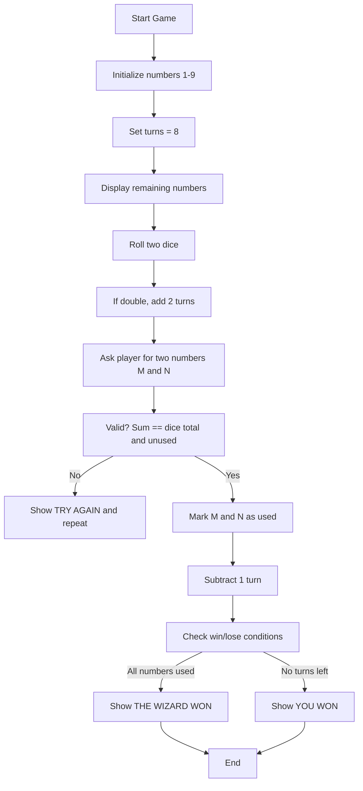
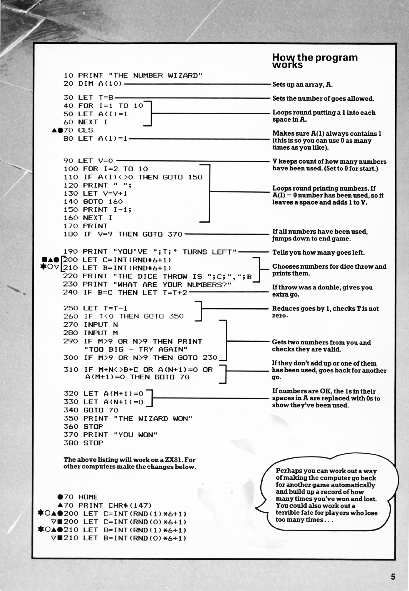

# The Number Wizard

**Book**: _[Creepy Computer Games](https://drive.google.com/file/d/0Bxv0SsvibDMTRUl3SFRONGN0MFk/view?resourcekey=0-kcOvkkPmrMYcDp7xGzxcdg)_   
**Author**: [Brendon Kavanagh, Colin Reynolds, Val Robinson, Alan Ramsey, Keith Campbell, Chris Oxlade](https://github.com/marcusjobb/UsborneBooks)  
**Translator**: [Marcus Medina](http://marcusmedina.pro)  

---

## Story

The mysterious **Number Wizard** challenges you to a magical duel of numbers!
He conjures the digits **1 to 9** into the air, then rolls two enchanted dice.
Your task: pick two numbers that add up to the total of the dice throw.

Once a number is used, it vanishes — gone for the rest of the game.
Use all numbers before your turns run out, and you’ll defeat the Wizard.
Fail, and your mind will be trapped forever in his realm of arithmetic.

Remember:

- Doubles give you **extra turns**.
- You can use **zero** as many times as you like.
- The Wizard _never_ forgives a mistake…

---

## Pseudocode

```plaintext
PRINT "THE NUMBER WIZARD"
SET turns = 8
CREATE array A(1..10) and fill with 1
ENSURE A(1) = 1 (allows zero use)

REPEAT UNTIL all numbers used OR turns = 0
    DISPLAY remaining numbers
    PRINT number of turns left
    ROLL two dice (C and B) between 1 and 6
    IF dice are equal THEN add 2 extra turns
    ASK player for two numbers M and N
    IF M+N != (C+B) OR either number already used THEN
        PRINT "TRY AGAIN"
        CONTINUE loop
    ELSE
        SET A(M+1)=0 and A(N+1)=0 (mark as used)
        SUBTRACT 1 turn
    END IF
END LOOP

IF all numbers used THEN PRINT "THE WIZARD WON"
ELSE PRINT "YOU WON"
```

---

## Flowchart



---

## Code

<details>
<summary>Pages</summary>

  


</details>

---

<details>
<summary>ZX-81 BASIC</summary>

```basic
10 PRINT "THE NUMBER WIZARD"
20 DIM A(10)
30 LET T=8
40 FOR I=1 TO 10
50 LET A(I)=1
60 NEXT I
70 CLS
80 LET A(1)=1
90 LET V=0
100 FOR I=2 TO 10
110 IF A(I)<0 THEN GOTO 150
120 PRINT " ";
130 LET V=V+1
140 GOTO 160
150 PRINT I-1
160 NEXT I
170 PRINT
180 IF V=9 THEN GOTO 370
190 PRINT "YOU'VE ";T;" TURNS LEFT"
200 LET C=INT(RND*6)+1
210 LET B=INT(RND*6)+1
220 PRINT "THE DICE THROW IS ";C;" + ";B
230 PRINT "WHAT ARE YOUR NUMBERS?"
250 LET T=T-1
260 IF T<0 THEN GOTO 350
270 INPUT M
280 INPUT N
290 IF M>9 OR N>9 THEN PRINT "TOO BIG - TRY AGAIN"
300 IF M>9 OR N>9 THEN GOTO 230
310 IF M+N<>B+C OR A(M+1)=0 OR A(N+1)=0 THEN GOTO 70
320 LET A(M+1)=0
330 LET A(N+1)=0
340 GOTO 70
350 PRINT "THE WIZARD WON"
360 STOP
370 PRINT "YOU WON"
380 STOP
```

</details>

---

<details>
<summary>C#</summary>

```csharp
using System;

class NumberWizard
{
    static void Main()
    {
        int[] numbers = new int[10];
        for (int i = 0; i < numbers.Length; i++) numbers[i] = 1;

        int turns = 8;
        Random rnd = new Random();

        while (turns > 0 && !AllUsed(numbers))
        {
            Console.Clear();
            Console.WriteLine("Numbers left:");
            for (int i = 1; i <= 9; i++)
                if (numbers[i] > 0) Console.Write($"{i} ");
            Console.WriteLine($"\nTurns left: {turns}");

            int dice1 = rnd.Next(1, 7);
            int dice2 = rnd.Next(1, 7);
            Console.WriteLine($"Dice throw: {dice1} + {dice2} = {dice1 + dice2}");

            if (dice1 == dice2)
            {
                turns += 2;
                Console.WriteLine("Double! You gain 2 extra turns!");
            }

            Console.Write("Enter two numbers separated by space: ");
            string[] input = Console.ReadLine()?.Split(' ');
            if (input == null || input.Length < 2) continue;

            if (!int.TryParse(input[0], out int m) || !int.TryParse(input[1], out int n))
                continue;

            if (m < 0 || n < 0 || m > 9 || n > 9)
            {
                Console.WriteLine("Invalid numbers! Try again.");
                continue;
            }

            if (numbers[m] == 0 || numbers[n] == 0)
            {
                Console.WriteLine("One of those numbers is already used!");
                continue;
            }

            if (m + n != dice1 + dice2)
            {
                Console.WriteLine("They don't add up! Try again.");
                continue;
            }

            numbers[m] = numbers[n] = 0;
            turns--;
        }

        Console.WriteLine(AllUsed(numbers)
            ? "🎩 The Wizard Won!"
            : "✨ You Won!");
    }

    static bool AllUsed(int[] arr)
    {
        for (int i = 1; i <= 9; i++)
            if (arr[i] != 0) return false;
        return true;
    }
}
```

</details>

---

<details>
<summary>Python</summary>

```python
import random

def number_wizard():
    numbers = [1] * 10
    turns = 8

    while turns > 0 and sum(numbers[1:]) > 0:
        print("\nNumbers left:", [i for i in range(1, 10) if numbers[i] > 0])
        print(f"Turns left: {turns}")

        dice1 = random.randint(1, 6)
        dice2 = random.randint(1, 6)
        print(f"The dice throw is {dice1} + {dice2} = {dice1 + dice2}")

        if dice1 == dice2:
            turns += 2
            print("Double! You get 2 extra turns!")

        try:
            m, n = map(int, input("Enter two numbers: ").split())
        except ValueError:
            print("Invalid input.")
            continue

        if not (0 <= m <= 9 and 0 <= n <= 9):
            print("Numbers must be between 0 and 9.")
            continue
        if numbers[m] == 0 or numbers[n] == 0:
            print("One of those has already been used!")
            continue
        if m + n != dice1 + dice2:
            print("They don't add up! Try again.")
            continue

        numbers[m] = numbers[n] = 0
        turns -= 1

    if sum(numbers[1:]) == 0:
        print("\nTHE WIZARD WON!")
    else:
        print("\nYOU WON!")

if __name__ == "__main__":
    number_wizard()
```

</details>

---

<details>
<summary>Java</summary>

```java
import java.util.Random;
import java.util.Scanner;

public class NumberWizard {
    public static void main(String[] args) {
        int[] numbers = new int[10];
        for (int i = 0; i < numbers.length; i++) numbers[i] = 1;

        int turns = 8;
        Random rnd = new Random();
        Scanner scanner = new Scanner(System.in);

        while (turns > 0 && !allUsed(numbers)) {
            System.out.print("\nNumbers left:");
            for (int i = 1; i <= 9; i++)
                if (numbers[i] > 0) System.out.print(" " + i);
            System.out.println();
            System.out.println("Turns left: " + turns);

            int dice1 = rnd.nextInt(6) + 1;
            int dice2 = rnd.nextInt(6) + 1;
            System.out.println("The dice throw is " + dice1 + " + " + dice2 + " = " + (dice1 + dice2));

            if (dice1 == dice2) {
                turns += 2;
                System.out.println("Double! You get 2 extra turns!");
            }

            System.out.print("Enter two numbers separated by space: ");
            if (!scanner.hasNextLine()) break;
            String line = scanner.nextLine();
            String[] parts = line.trim().split("\\s+");
            if (parts.length < 2) {
                System.out.println("Invalid input.");
                continue;
            }

            int m, n;
            try {
                m = Integer.parseInt(parts[0]);
                n = Integer.parseInt(parts[1]);
            } catch (NumberFormatException e) {
                System.out.println("Invalid input.");
                continue;
            }

            if (m < 0 || n < 0 || m > 9 || n > 9) {
                System.out.println("Numbers must be between 0 and 9.");
                continue;
            }
            if (numbers[m] == 0 || numbers[n] == 0) {
                System.out.println("One of those has already been used!");
                continue;
            }
            if (m + n != dice1 + dice2) {
                System.out.println("They don't add up! Try again.");
                continue;
            }

            numbers[m] = 0;
            numbers[n] = 0;
            turns--;
        }

        if (allUsed(numbers)) {
            System.out.println("\nTHE WIZARD WON!");
        } else {
            System.out.println("\nYOU WON!");
        }
    }

    static boolean allUsed(int[] arr) {
        for (int i = 1; i <= 9; i++)
            if (arr[i] != 0) return false;
        return true;
    }
}
```

</details>

---

<details>
<summary>Go</summary>

```go
package main

import (
	"bufio"
	"fmt"
	"math/rand"
	"os"
	"strconv"
	"strings"
	"time"
)

func allUsed(numbers [10]int) bool {
	for i := 1; i <= 9; i++ {
		if numbers[i] != 0 {
			return false
		}
	}
	return true
}

func main() {
	var numbers [10]int
	for i := range numbers {
		numbers[i] = 1
	}

	turns := 8
	rand.Seed(time.Now().UnixNano())
	reader := bufio.NewReader(os.Stdin)

	for turns > 0 && !allUsed(numbers) {
		fmt.Print("\nNumbers left:")
		for i := 1; i <= 9; i++ {
			if numbers[i] > 0 {
				fmt.Printf(" %d", i)
			}
		}
		fmt.Println()
		fmt.Printf("Turns left: %d\n", turns)

		dice1 := rand.Intn(6) + 1
		dice2 := rand.Intn(6) + 1
		fmt.Printf("The dice throw is %d + %d = %d\n", dice1, dice2, dice1+dice2)

		if dice1 == dice2 {
			turns += 2
			fmt.Println("Double! You get 2 extra turns!")
		}

		fmt.Print("Enter two numbers separated by space: ")
		line, err := reader.ReadString('\n')
		parts := strings.Fields(line)
		if len(parts) < 2 {
			if err != nil {
				break
			}
			fmt.Println("Invalid input.")
			continue
		}

		m, err1 := strconv.Atoi(parts[0])
		n, err2 := strconv.Atoi(parts[1])
		if err1 != nil || err2 != nil {
			fmt.Println("Invalid input.")
			continue
		}

		if m < 0 || n < 0 || m > 9 || n > 9 {
			fmt.Println("Numbers must be between 0 and 9.")
			continue
		}
		if numbers[m] == 0 || numbers[n] == 0 {
			fmt.Println("One of those has already been used!")
			continue
		}
		if m+n != dice1+dice2 {
			fmt.Println("They don't add up! Try again.")
			continue
		}

		numbers[m] = 0
		numbers[n] = 0
		turns--
	}

	if allUsed(numbers) {
		fmt.Println("\nTHE WIZARD WON!")
	} else {
		fmt.Println("\nYOU WON!")
	}
}
```

</details>

---

<details>
<summary>C++</summary>

```cpp
#include <iostream>
#include <cstdlib>
#include <ctime>

bool allUsed(int numbers[10]) {
    for (int i = 1; i <= 9; i++)
        if (numbers[i] != 0) return false;
    return true;
}

int main() {
    int numbers[10];
    for (int i = 0; i < 10; i++) numbers[i] = 1;

    int turns = 8;
    srand(time(0));

    while (turns > 0 && !allUsed(numbers)) {
        std::cout << "\nNumbers left:";
        for (int i = 1; i <= 9; i++)
            if (numbers[i] > 0) std::cout << " " << i;
        std::cout << std::endl;
        std::cout << "Turns left: " << turns << std::endl;

        int dice1 = rand() % 6 + 1;
        int dice2 = rand() % 6 + 1;
        std::cout << "The dice throw is " << dice1 << " + " << dice2 << " = " << (dice1 + dice2) << std::endl;

        if (dice1 == dice2) {
            turns += 2;
            std::cout << "Double! You get 2 extra turns!" << std::endl;
        }

        std::cout << "Enter two numbers separated by space: ";
        int m, n;
        if (!(std::cin >> m >> n)) {
            if (std::cin.eof()) break;
            std::cin.clear();
            std::cin.ignore(10000, '\n');
            std::cout << "Invalid input." << std::endl;
            continue;
        }

        if (m < 0 || n < 0 || m > 9 || n > 9) {
            std::cout << "Numbers must be between 0 and 9." << std::endl;
            continue;
        }
        if (numbers[m] == 0 || numbers[n] == 0) {
            std::cout << "One of those has already been used!" << std::endl;
            continue;
        }
        if (m + n != dice1 + dice2) {
            std::cout << "They don't add up! Try again." << std::endl;
            continue;
        }

        numbers[m] = 0;
        numbers[n] = 0;
        turns--;
    }

    if (allUsed(numbers)) {
        std::cout << "\nTHE WIZARD WON!" << std::endl;
    } else {
        std::cout << "\nYOU WON!" << std::endl;
    }

    return 0;
}
```

</details>

---

## Explanation

The wizard rolls two dice and challenges you to match their sum using two of the remaining numbers (1-9).
When you use numbers, they disappear. Doubles grant bonus turns.
You must clear all numbers before your turns run out.

---

## Challenges

1. **Fate Counter** – Keep a record of how many times you’ve lost or won.
2. **Evil Mode** – Make the wizard “curse” you by taking away a number when you guess wrong.
3. **Automatic Replay** – Add a loop that restarts the game automatically after finishing.
4. **Sound & Graphics** – Use color or sound feedback for dice rolls and wins.
5. **Zero Strategy** – Add the option to use zero as one of the numbers strategically.

---

## Copyright

These programs are adaptations of the original Usborne Computer Guides published in the 1980s.
The books are free to download for personal or educational use from
[Usborne’s Computer and Coding Books](https://usborne.com/row/books/computer-and-coding-books).
Programs and adaptations may **not** be used for commercial purposes.

Return to [Creepy Computer Games](./readme.md).
