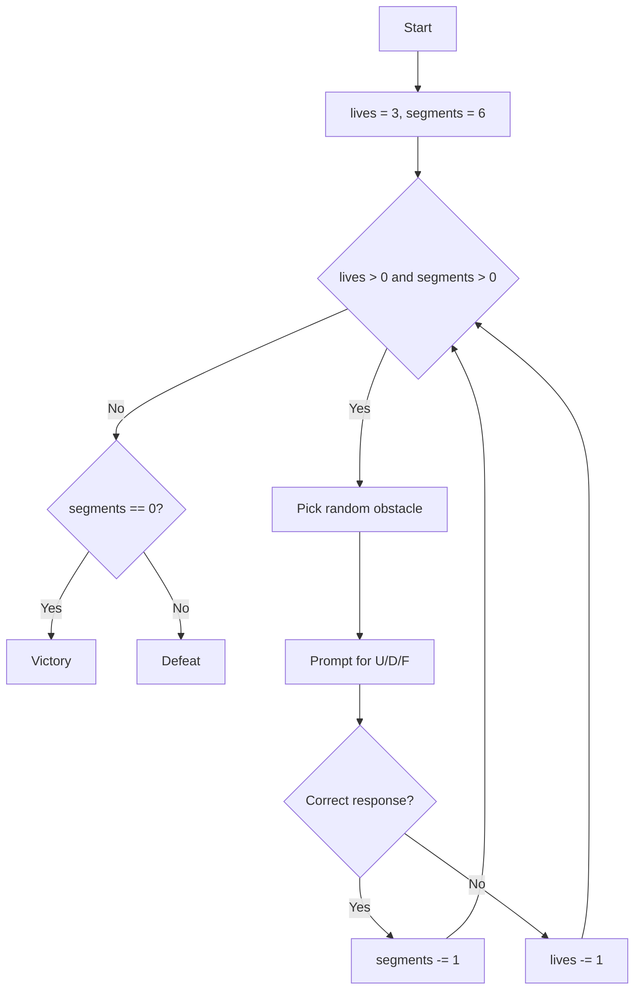

# Flying Witches

**Book**: _Weird Computer Games (Usborne, 1984)_  
**Author**: [Usborne Publishing](https://usborne.com/row/books/computer-and-coding-books)  
**Translator**: [Marcus Medina](http://marcusmedina.pro)

## Story

It is Walpurgis Night and witches from every coven race across the moonlit sky. You and your broomstick partner, Catnip, must reach the summit of Mount Screech before dawn. Each stretch of the journey throws a new obstacle — a low branch, a chimney stack, a roaring gust of wind. React fast: `U` to swoop up, `D` to duck, `F` to race forward — and you might win the midnight dash.

## Pseudocode

```plaintext
lives = 3
segments_remaining = 6
WHILE lives > 0 AND segments_remaining > 0
    random obstacle chosen from list
    display obstacle clue
    GET player move (U, D, F)
    IF move matches safe response THEN
        segments_remaining -= 1
        display success message
    ELSE
        lives -= 1
        display failure message
END WHILE
IF segments_remaining == 0 THEN
    player wins (reaches the summit)
ELSE
    player loses (tumbles from broom)
```

## Flowchart



## Code

<details>
<summary>ZX-81 BASIC</summary>

```basic
10 GOSUB 700:GOSUB 620
20 LET NW=4:LET M=0:LET FM=50
30 GOSUB 530:LET H=NH
40 GOSUB 550
50 LET EF=0:LET FF=0:LET HH=H
60 FOR I=1 TO 4:LET G(I)=0:NEXT I
70 FOR I=1 TO 4:LET A$=PS(I)+" ":LET X=I
80 LET Y=I+1:GOSUB 610:NEXT I
90 GOSUB 490:GOSUB 430
100 IF M=FM THEN GOTO 250
110 IF EF=1 THEN GOTO 230
120 IF INKEY$<>"" THEN GOTO 90
130 LET HH=H-1:GOSUB 510
140 GOSUB 490:GOSUB 430
150 LET H=HH
160 IF H>0 THEN GOTO 130
170 IF P=I THEN GOSUB 320
180 GOSUB 530
190 GOSUB 550
200 LET HH=H+1:GOSUB 510:GOSUB 490
210 LET H=HH:IF H<N THEN GOTO 90
220 GOSUB 430:GOTO 200
230 LET A$="WELL DONE! SUPERWITCH IS PLEASED WITH YOU"
240 LET A$="OUT OF BROOMSTICKS!":GOTO 260
250 LET A$="TOO LATE!"
260 LET X=1:LET Y=15:GOSUB 610
270 STOP
280 LET A$="W":LET X=P:GOSUB 610
290 FOR T=1 TO 1000:NEXT T
300 LET NW=NW-1:IF NW=0 THEN LET FF=1
310 RETURN
320 IF W=1 THEN GOSUB 280:RETURN
330 LET G(R)=G(R)+1
340 LET A$=STR$(G(R)):LET X=1:Y=R:GOSUB 610
350 LET Y=19:GOSUB 430
360 LET F=0
380 FOR I=1 TO 4
390 IF G(I)>=N(I) THEN LET F=F+1
400 NEXT I
410 IF F=4 THEN LET EF=1
420 RETURN
430 LET GD=GD+1:IF GD>6 THEN LET GD=1
440 LET A$=G$(GD):LET X=1:LET Y=15:GOSUB 610
450 LET A$=" ":LET X=P:LET Y=14:GOSUB 610
460 LET P=P+1:IF P>20 THEN GOSUB 550
470 LET P=P:LET A$=CS:GOSUB 610
480 RETURN
490 LET A$=" ":LET X=16:LET Y=14-HH:GOSUB 610:RETURN
510 LET A$="*":LET X=16:LET Y=14-H:GOSUB 610:RETURN
530 LET NH=INT(RND(1)*5)+3:RETURN
550 LET R=INT(RND(1)*4)+1
560 LET W=0:IF RND(1)>0.8 THEN LET W=1
570 LET CS=LEFT$(PS(R),1):LET P=1
580 LET M=M+1
590 IF M=FM THEN LET CS="CAULDRON"
600 RETURN
610 PRINT TAB(X,Y);A$:RETURN
620 CLS:PRINT:PRINT "THE POTION MUST HAVE":PRINT
640 FOR I=1 TO 4
650 LET N=INT(RND(1)*3)+2:LET N(I)=N
660 PRINT:PRINT;N;" ";PS(I)
670 NEXT I:PRINT:PRINT "PRESS RETURN TO PLAY"
690 INPUT X$:CLS:RETURN
700 DIM PS(4):DIM N(4):DIM G(4)
710 DIM G$(5)
720 FOR I=1 TO 4:READ PS(I):NEXT I
730 DATA "TOES OF NEWTS","EYES OF LIZARDS","ROOTS OF IVY","BRAINS OF BATS"
740 LET H$="====================="
750 FOR I=1 TO 5:LET G$(I)=MID$(H$,I,20)
760 NEXT I:LET GD=1
770 RETURN
```

</details>

## Modern Implementations

<details>
<summary>C#</summary>

```csharp
using System;
using System.Collections.Generic;

namespace WeirdComputerGames;

public static class FlyingWitches
{
    private static readonly (string Prompt, char SafeMove)[] Obstacles =
    {
        ("Low branch ahead!", 'U'),
        ("Chimney stack incoming!", 'D'),
        ("Storm gust!", 'F')
    };

    public static void Main()
    {
        var random = new Random();
        int lives = 3;
        int segmentsRemaining = 6;

        while (lives > 0 && segmentsRemaining > 0)
        {
            var obstacle = Obstacles[random.Next(Obstacles.Length)];
            Console.WriteLine($"\nLives: {lives} | Segments left: {segmentsRemaining}");
            Console.WriteLine(obstacle.Prompt);
            Console.Write("React (U=up, D=down, F=forward): ");

            string? input = Console.ReadLine()?.Trim().ToUpperInvariant();
            if (string.IsNullOrEmpty(input))
                continue;

            if (input[0] == obstacle.SafeMove)
            {
                segmentsRemaining--;
                Console.WriteLine("Graceful manoeuvre! You glide onward.");
            }
            else
            {
                lives--;
                Console.WriteLine("Ouch! Catnip yowls as you clip the obstacle.");
            }
        }

        Console.WriteLine(lives > 0
            ? "You swoop onto Mount Screech just before dawn!"
            : "You tumble from your broom and spend the night untangling robes...");
    }
}
```

</details>
<details>
<summary>Python</summary>

```python
import random

OBSTACLES = [
    ("Low branch ahead!", "U"),
    ("Chimney stack incoming!", "D"),
    ("Storm gust!", "F"),
]


def fly() -> None:
    lives = 3
    segments = 6

    while lives > 0 and segments > 0:
        prompt, safe = random.choice(OBSTACLES)
        print(f"\nLives: {lives} | Segments left: {segments}")
        print(prompt)
        move = input("React (U/D/F): ").strip().upper()

        if move == safe:
            segments -= 1
            print("Elegant swoop! You dash forward.")
        else:
            lives -= 1
            print("Catnip screeches as you wobble!")

    if segments == 0:
        print("You touch down on Mount Screech in triumph!")
    else:
        print("You spiral out of control. Maybe next Walpurgis Night...")


if __name__ == "__main__":
    fly()
```

</details>
<details>
<summary>Java</summary>

```java
import java.util.List;
import java.util.Random;
import java.util.Scanner;

public class FlyingWitches {
    private record Obstacle(String prompt, char safeMove) {}

    private static final List<Obstacle> OBSTACLES = List.of(
        new Obstacle("Low branch ahead!", 'U'),
        new Obstacle("Chimney stack incoming!", 'D'),
        new Obstacle("Storm gust!", 'F')
    );

    public static void main(String[] args) {
        Scanner scanner = new Scanner(System.in);
        Random random = new Random();
        int lives = 3;
        int segments = 6;

        while (lives > 0 && segments > 0) {
            Obstacle obstacle = OBSTACLES.get(random.nextInt(OBSTACLES.size()));
            System.out.printf("%nLives: %d | Segments left: %d%n", lives, segments);
            System.out.println(obstacle.prompt());
            System.out.print("React (U/D/F): ");
            String input = scanner.nextLine().trim().toUpperCase();

            if (!input.isEmpty() && input.charAt(0) == obstacle.safeMove()) {
                segments--;
                System.out.println("Graceful flight! You streak ahead.");
            } else {
                lives--;
                System.out.println("You wobble and lose a broomstick!");
            }
        }

        if (segments == 0) {
            System.out.println("You land on Mount Screech amid cheers!");
        } else {
            System.out.println("You tumble from your broom and Catnip is unimpressed...");
        }
    }
}
```

</details>
<details>
<summary>Go</summary>

```go
package main

import (
    "bufio"
    "fmt"
    "math/rand"
    "os"
    "strings"
    "time"
)

type obstacle struct {
    prompt  string
    safe    string
}

var obstacles = []obstacle{
    {"Low branch ahead!", "U"},
    {"Chimney stack incoming!", "D"},
    {"Storm gust!", "F"},
}

func main() {
    rand.Seed(time.Now().UnixNano())
    reader := bufio.NewReader(os.Stdin)
    lives := 3
    segments := 6

    for lives > 0 && segments > 0 {
        ob := obstacles[rand.Intn(len(obstacles))]
        fmt.Printf("\nLives: %d | Segments left: %d\n", lives, segments)
        fmt.Println(ob.prompt)
        fmt.Print("React (U/D/F): ")
        line, _ := reader.ReadString('\n')
        move := strings.ToUpper(strings.TrimSpace(line))

        if move == ob.safe {
            segments--
            fmt.Println("Catnip purrs — perfect manoeuvre!")
        } else {
            lives--
            fmt.Println("You wobble and lose a broomstick!")
        }
    }

    if segments == 0 {
        fmt.Println("You swoop onto Mount Screech victorious!")
    } else {
        fmt.Println("You tumble from the sky. Better luck next Walpurgis Night.")
    }
}
```

</details>
<details>
<summary>C++</summary>

```cpp
#include <iostream>
#include <random>
#include <string>
#include <vector>

struct Obstacle { std::string prompt; char safe; };

int main() {
    std::mt19937 rng(std::random_device{}());
    std::vector<Obstacle> obstacles = {
        {"Low branch ahead!", 'U'},
        {"Chimney stack incoming!", 'D'},
        {"Storm gust!", 'F'}
    };

    int lives = 3;
    int segments = 6;

    while (lives > 0 && segments > 0) {
        const auto& ob = obstacles[rng() % obstacles.size()];
        std::cout << "\nLives: " << lives << " | Segments left: " << segments << '\n'
                  << ob.prompt << '\n'
                  << "React (U/D/F): ";
        std::string input;
        std::getline(std::cin, input);
        if (!input.empty() && std::toupper(input[0]) == ob.safe) {
            --segments;
            std::cout << "Graceful swoop!\n";
        } else {
            --lives;
            std::cout << "Catnip shrieks as you wobble!\n";
        }
    }

    if (segments == 0)
        std::cout << "You reach Mount Screech triumphant!\n";
    else
        std::cout << "You tumble from your broom. Maybe next time...\n";
}
```

</details>
<details>
<summary>Rust</summary>

```rust
use rand::seq::SliceRandom;
use rand::thread_rng;
use std::io::{self, Write};

struct Obstacle {
    prompt: &'static str,
    safe: char,
}

fn main() {
    let obstacles = [
        Obstacle { prompt: "Low branch ahead!", safe: 'U' },
        Obstacle { prompt: "Chimney stack incoming!", safe: 'D' },
        Obstacle { prompt: "Storm gust!", safe: 'F' },
    ];

    let mut rng = thread_rng();
    let mut lives = 3;
    let mut segments = 6;
    let mut input = String::new();

    while lives > 0 && segments > 0 {
        let obstacle = obstacles.choose(&mut rng).unwrap();
        println!("\nLives: {lives} | Segments left: {segments}");
        println!("{}", obstacle.prompt);
        print!("React (U/D/F): ");
        io::stdout().flush().unwrap();
        input.clear();
        io::stdin().read_line(&mut input).unwrap();
        let ch = input.trim().to_uppercase().chars().next();

        if ch == Some(obstacle.safe) {
            segments -= 1;
            println!("Elegant manoeuvre! You glide ahead.");
        } else {
            lives -= 1;
            println!("Catnip screeches as you wobble!");
        }
    }

    if segments == 0 {
        println!("You land on Mount Screech to great acclaim!");
    } else {
        println!("You tumble from the broom. Better luck next Walpurgis Night.");
    }
}
```

</details>
## Explanation

Each modern port keeps the rhythm of the original: a series of random obstacles, three simple responses, and a balance between risk and reaction time. You win by stringing together correct responses before running out of broomsticks.

## Challenges

1. **Night Sky Map** – Track progress across ASCII art stars to show how close you are to Mount Screech.
2. **Wind Meter** – Introduce a stamina bar that dips on mistakes and refills with streaks of success.
3. **Two-Witch Relay** – Alternate turns between two players and combine their segment progress.

## Copyright

These programs are adaptations of the original _Usborne Computer Guides_ published in the 1980s. The books are free to download for personal or educational use from [Usborne’s Computer and Coding Books](https://usborne.com/row/books/computer-and-coding-books). Programs and adaptations may not be used for commercial purposes.

Return to [Weird Computer Games](./readme.md).
