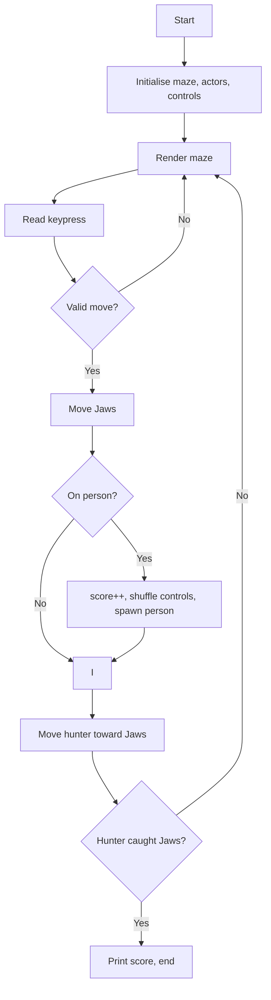

# Jaws

**Book**: _Weird Computer Games (Usborne, 1984)_  
**Author**: [Usborne Publishing](https://usborne.com/row/books/computer-and-coding-books)  
**Translator**: [Marcus Medina](http://marcusmedina.pro)

## Story

Mmmmmm... people do taste yummy! But with **The Hunter** forever on your tail, it’s difficult to get close enough to grab a snack.

You are **J (for Jaws)** and swim around the bay using the keys **A**, **Z**, **N**, and **M**. Try to eat as many **P (people)** as you can before **H** catches you.

There’s a snag (of course): each time you succeed in chomping a victim you get so excited you forget which key does what — the controls shuffle every time you feed!

## Pseudocode

```plaintext
Load maze layout and starting positions for Jaws, hunter, and first person
Set score = 0 and create control mapping (A,Z,N,M)
REPEAT
    Display maze with positions
    Read key press from player
    Translate key using current mapping to a direction
    Attempt to move Jaws; if move hits wall, ignore
    IF Jaws lands on person THEN
        Increment score
        Randomly shuffle control mapping
        Place new person at random empty tile
    Move hunter one step closer to Jaws (priority horizontal then vertical)
    IF hunter reaches Jaws THEN
        Game over (caught)
UNTIL game ends
Show final score and optionally ask to play again
```

## Flowchart



## Code

<details>
<summary>ZX-81 BASIC</summary>

```basic
10 DIM MS(12):DIM KS(4):GOSUB 660
20 LET S=0:LET T=0:LET G=0
30 LET U=1
40 LET KS(1)="A":LET KS(2)="M"
50 LET KS(3)="Z":LET KS(4)="N"
60 LET P1=2:LET P2=2
70 GOSUB 600:GOSUB 440
90 LET Hx=P1:LET Hy=P2
100 LET I$=INKEY$
110 IF I$=KS(1) THEN LET NY=NY-1
120 IF I$=KS(2) THEN LET NX=NX+1
130 IF I$=KS(3) THEN LET NY=NY+1
140 IF I$=KS(4) THEN LET NX=NX-1
150 LET N$=I$:LET YN=Y:GOSUB 530
160 IF F=1 THEN GOTO 230
170 LET PX=NX:LET PY=NY:LET A$=" "
180 GOSUB 640
190 LET NX=PX:LET NY=PY:LET A$="J"
200 GOSUB 640
210 LET PX=NX:LET PY=NY
220 IF PX=GX AND PY=GY THEN GOSUB 340
230 IF PX=HX AND PY=HY THEN GOTO 280
240 IF RND(1) THEN GOSUB 370
250 LET T=T+1:LET Y=12:LET A$=STR$(T)
260 GOSUB 640
270 LET G=G+1:GOTO 90
280 FOR P=1 TO 2000:NEXT P
290 CLS:PRINT "YOU HAVE BEEN CAUGHT"
300 PRINT "SCORE ";T
310 PRINT "ANOTHER GO? (Y/N)"
320 LET A$=INKEY$:IF A$="Y" THEN GOTO 20
330 STOP
340 LET T=T+1:LET U=U+0.03
350 GOSUB 390:GOSUB 490
360 RETURN
370 LET X=GX:LET Y=GY:LET A$=" "
380 GOSUB 640:GOSUB 440:RETURN
390 LET K1=INT(RND(1)*4)+1
400 LET K2=INT(RND(1)*4)+1
410 LET TS=KS(K1)
420 LET KS(K1)=KS(K2):LET KS(K2)=TS
430 RETURN
440 GOSUB 550
450 IF X=PX AND Y=PY THEN GOTO 440
460 LET GX=X:LET GY=Y
470 LET A$="H":GOSUB 640
480 RETURN
490 GOSUB 550
500 LET X=PX:LET Y=PY:LET A$="P"
510 GOSUB 640
520 RETURN
530 FOR F=0:IF MID$(MS(Y),X,1)<>" " THEN LET F=1
540 RETURN
550 LET X=INT(RND(1)*14)+2
560 LET Y=INT(RND(1)*9)+2
570 GOSUB 530
580 IF F=1 THEN GOTO 550
590 RETURN
600 CLS:FOR Y=1 TO 12
610 LET A$=MS(Y)
620 PRINT TAB(1,Y);A$
630 NEXT Y:RETURN
640 PRINT TAB(X,Y);A$
650 RETURN
660 FOR I=1 TO 12:READ MS(I):NEXT I
670 DATA "0000000000000"
680 DATA "0         0"
690 DATA "0 0000000 0"
700 DATA "0 0     0 0"
710 DATA "0 0 0 0 0 0"
720 DATA "0 0 0 0 0 0"
730 DATA "0 0     0 0"
740 DATA "0 0000000 0"
750 DATA "0         0"
760 DATA "0000000000000"
770 DATA "             "
780 DATA "             "
790 DATA "PEOPLE EATEN:"
```

</details>

## Modern Implementations

The modern ports keep the looping structure: a grid-based chase where Jaws moves once per input, the hunter takes a step toward Jaws, and the control bindings shuffle after each meal.

<details>
<summary>C#</summary>

```csharp
using System;
using System.Collections.Generic;

namespace WeirdComputerGames;

public static class Jaws
{
    private const int Width = 13;
    private const int Height = 9;

    private static readonly ConsoleKey[] Keys =
        { ConsoleKey.A, ConsoleKey.M, ConsoleKey.Z, ConsoleKey.N };

    private static readonly (int dx, int dy)[] Directions =
    {
        (0, -1), // up
        (1, 0),  // right
        (0, 1),  // down
        (-1, 0)  // left
    };

    public static void Main()
    {
        var random = new Random();
        var mapping = new Dictionary<ConsoleKey, (int dx, int dy)>();
        ShuffleControls(random, mapping);

        (int x, int y) jaws = (Width / 2, Height / 2);
        (int x, int y) hunter = (1, 1);
        (int x, int y) person = SpawnPerson(random, jaws, hunter);

        int score = 0;

        while (true)
        {
            DrawGrid(jaws, hunter, person, score, mapping);
            ConsoleKey key = Console.ReadKey(true).Key;
            if (!mapping.TryGetValue(key, out var delta))
                continue;

            var target = (x: jaws.x + delta.dx, y: jaws.y + delta.dy);
            if (IsInside(target))
            {
                jaws = target;
            }

            if (jaws == person)
            {
                score++;
                ShuffleControls(random, mapping);
                person = SpawnPerson(random, jaws, hunter);
            }

            hunter = StepToward(hunter, jaws);
            if (hunter == jaws)
            {
                Console.WriteLine("\nYOU HAVE BEEN CAUGHT!");
                Console.WriteLine($"Score: {score}");
                return;
            }
        }
    }

    private static void ShuffleControls(Random random,
        IDictionary<ConsoleKey, (int dx, int dy)> mapping)
    {
        var dirs = new List<(int dx, int dy)>(Directions);
        for (int i = dirs.Count - 1; i > 0; i--)
        {
            int j = random.Next(i + 1);
            (dirs[i], dirs[j]) = (dirs[j], dirs[i]);
        }

        for (int i = 0; i < Keys.Length; i++)
        {
            mapping[Keys[i]] = dirs[i];
        }
    }

    private static (int x, int y) SpawnPerson(Random random,
        (int x, int y) jaws, (int x, int y) hunter)
    {
        while (true)
        {
            var candidate = (x: random.Next(0, Width), y: random.Next(0, Height));
            if (candidate != jaws && candidate != hunter)
                return candidate;
        }
    }

    private static (int x, int y) StepToward((int x, int y) from, (int x, int y) to)
    {
        int dx = Math.Sign(to.x - from.x);
        int dy = Math.Sign(to.y - from.y);
        var candidate = (x: from.x + dx, y: from.y + dy);
        return IsInside(candidate) ? candidate : from;
    }

    private static bool IsInside((int x, int y) pos) =>
        pos.x >= 0 && pos.x < Width && pos.y >= 0 && pos.y < Height;

    private static void DrawGrid((int x, int y) jaws,
        (int x, int y) hunter,
        (int x, int y) person,
        int score,
        IDictionary<ConsoleKey, (int dx, int dy)> mapping)
    {
        Console.Clear();
        Console.WriteLine("Jaws Hunt! Eat people, avoid the hunter.");
        Console.WriteLine($"Score: {score}");
        Console.WriteLine("Controls (after each meal they shuffle):");
        foreach (var pair in mapping)
        {
            string dir = pair.Value switch
            {
                (0, -1) => "up",
                (1, 0) => "right",
                (0, 1) => "down",
                (-1, 0) => "left",
                _ => "?"
            };
            Console.WriteLine($" {pair.Key} -> {dir}");
        }

        for (int y = 0; y < Height; y++)
        {
            for (int x = 0; x < Width; x++)
            {
                char ch = ' ';
                if (jaws.x == x && jaws.y == y) ch = 'J';
                else if (hunter.x == x && hunter.y == y) ch = 'H';
                else if (person.x == x && person.y == y) ch = 'P';

                Console.Write(ch);
            }
            Console.WriteLine();
        }
    }
}
```

</details>
<details>
<summary>Python</summary>

```python
import os
import random
from typing import Dict, Tuple

WIDTH = 13
HEIGHT = 9
KEYS = ["A", "M", "Z", "N"]
DIRECTIONS = [(0, -1), (1, 0), (0, 1), (-1, 0)]

def clear() -> None:
    os.system("cls" if os.name == "nt" else "clear")

def shuffle_controls() -> Dict[str, Tuple[int, int]]:
    dirs = DIRECTIONS[:]
    random.shuffle(dirs)
    return dict(zip(KEYS, dirs))

def inside(x: int, y: int) -> bool:
    return 0 <= x < WIDTH and 0 <= y < HEIGHT

def spawn(exclude: set[Tuple[int, int]]) -> Tuple[int, int]:
    while True:
        pos = (random.randrange(WIDTH), random.randrange(HEIGHT))
        if pos not in exclude:
            return pos

def move_hunter(hx: int, hy: int, jx: int, jy: int) -> Tuple[int, int]:
    dx = (jx > hx) - (jx < hx)
    dy = (jy > hy) - (jy < hy)
    nx, ny = hx + dx, hy + dy
    return (nx, ny) if inside(nx, ny) else (hx, hy)

def draw(jaws: tuple[int, int], hunter: tuple[int, int], person: tuple[int, int],
         score: int, mapping: Dict[str, Tuple[int, int]]) -> None:
    clear()
    print("Jaws Hunt! Eat people, avoid the hunter.")
    print(f"Score: {score}")
    print("Controls (shuffle after every meal):")
    names = { (0, -1): "up", (1, 0): "right", (0, 1): "down", (-1, 0): "left" }
    for key in KEYS:
        dx, dy = mapping[key]
        print(f" {key} -> {names[(dx, dy)]}")
    print()
    for y in range(HEIGHT):
        row = []
        for x in range(WIDTH):
            if (x, y) == jaws:
                row.append("J")
            elif (x, y) == hunter:
                row.append("H")
            elif (x, y) == person:
                row.append("P")
            else:
                row.append(" ")
        print("".join(row))


def main() -> None:
    mapping = shuffle_controls()
    jaws = (WIDTH // 2, HEIGHT // 2)
    hunter = (1, 1)
    person = spawn({jaws, hunter})
    score = 0

    while True:
        draw(jaws, hunter, person, score, mapping)
        key = input("Move (A/Z/N/M): ").strip().upper()
        if key not in mapping:
            continue
        dx, dy = mapping[key]
        nx, ny = jaws[0] + dx, jaws[1] + dy
        if inside(nx, ny):
            jaws = (nx, ny)

        if jaws == person:
            score += 1
            mapping = shuffle_controls()
            person = spawn({jaws, hunter})

        hunter = move_hunter(hunter[0], hunter[1], jaws[0], jaws[1])
        if hunter == jaws:
            print("\nYOU HAVE BEEN CAUGHT!")
            print(f"Score: {score}")
            break

if __name__ == "__main__":
    main()
```

</details>
<details>
<summary>Java</summary>

```java
import java.util.Arrays;
import java.util.Collections;
import java.util.EnumMap;
import java.util.List;
import java.util.Map;
import java.util.Random;
import java.util.Scanner;

public class Jaws {
    private static final int WIDTH = 13;
    private static final int HEIGHT = 9;
    private static final List<String> KEYS = List.of("A", "M", "Z", "N");

    private enum Dir { UP(0, -1), RIGHT(1, 0), DOWN(0, 1), LEFT(-1, 0);
        final int dx, dy; Dir(int dx, int dy) { this.dx = dx; this.dy = dy; }}

    public static void main(String[] args) {
        Scanner scanner = new Scanner(System.in);
        Random random = new Random();
        Map<String, Dir> mapping = shuffle(random);

        Point jaws = new Point(WIDTH / 2, HEIGHT / 2);
        Point hunter = new Point(1, 1);
        Point person = spawn(random, jaws, hunter);
        int score = 0;

        while (true) {
            draw(jaws, hunter, person, score, mapping);
            String key = scanner.nextLine().trim().toUpperCase();
            if (!mapping.containsKey(key)) {
                continue;
            }

            Dir dir = mapping.get(key);
            Point candidate = jaws.offset(dir.dx, dir.dy);
            if (candidate.isInside()) {
                jaws = candidate;
            }

            if (jaws.equals(person)) {
                score++;
                mapping = shuffle(random);
                person = spawn(random, jaws, hunter);
            }

            hunter = hunter.stepToward(jaws);
            if (hunter.equals(jaws)) {
                System.out.printf("%nYOU HAVE BEEN CAUGHT!%nScore: %d%n", score);
                break;
            }
        }
    }

    private static Map<String, Dir> shuffle(Random random) {
        List<Dir> dirs = Arrays.asList(Dir.values());
        Collections.shuffle(dirs, random);
        Map<String, Dir> map = new EnumMap<>(String.class);
        for (int i = 0; i < KEYS.size(); i++) {
            map.put(KEYS.get(i), dirs.get(i));
        }
        return map;
    }

    private static Point spawn(Random random, Point jaws, Point hunter) {
        while (true) {
            Point p = new Point(random.nextInt(WIDTH), random.nextInt(HEIGHT));
            if (!p.equals(jaws) && !p.equals(hunter)) {
                return p;
            }
        }
    }

    private static void draw(Point jaws, Point hunter, Point person,
                             int score, Map<String, Dir> mapping) {
        System.out.print("\033[H\033[2J");
        System.out.flush();
        System.out.println("Jaws Hunt! Eat people, dodge the hunter.");
        System.out.println("Score: " + score);
        System.out.println("Controls (shuffle after every meal):");
        for (String key : KEYS) {
            Dir d = mapping.get(key);
            System.out.printf(" %s -> %s%n", key, nameOf(d));
        }
        System.out.println();
        for (int y = 0; y < HEIGHT; y++) {
            StringBuilder row = new StringBuilder();
            for (int x = 0; x < WIDTH; x++) {
                if (jaws.x == x && jaws.y == y) row.append('J');
                else if (hunter.x == x && hunter.y == y) row.append('H');
                else if (person.x == x && person.y == y) row.append('P');
                else row.append(' ');
            }
            System.out.println(row);
        }
    }

    private static String nameOf(Dir d) {
        return switch (d) {
            case UP -> "up";
            case RIGHT -> "right";
            case DOWN -> "down";
            case LEFT -> "left";
        };
    }

    private record Point(int x, int y) {
        boolean isInside() { return x >= 0 && x < WIDTH && y >= 0 && y < HEIGHT; }
        Point offset(int dx, int dy) { return new Point(x + dx, y + dy); }
        Point stepToward(Point other) {
            int nx = x + Integer.compare(other.x, x);
            int ny = y + Integer.compare(other.y, y);
            Point candidate = new Point(nx, ny);
            return candidate.isInside() ? candidate : this;
        }
    }
}
```

</details>
<details>
<summary>Go</summary>

```go
package main

import (
    "bufio"
    "fmt"
    "math/rand"
    "os"
    "strings"
    "time"
)

const (
    width  = 13
    height = 9
)

type point struct{ x, y int }

type dir struct{ dx, dy int }

var keys = []string{"A", "M", "Z", "N"}
var directions = []dir{{0, -1}, {1, 0}, {0, 1}, {-1, 0}}

func main() {
    rand.Seed(time.Now().UnixNano())
    reader := bufio.NewReader(os.Stdin)

    mapping := shuffle()
    jaws := point{width / 2, height / 2}
    hunter := point{1, 1}
    person := spawn(jaws, hunter)
    score := 0

    for {
        draw(jaws, hunter, person, score, mapping)

        line, _ := reader.ReadString('\n')
        key := strings.ToUpper(strings.TrimSpace(line))
        move, ok := mapping[key]
        if !ok {
            continue
        }

        candidate := point{jaws.x + move.dx, jaws.y + move.dy}
        if inside(candidate) {
            jaws = candidate
        }

        if jaws == person {
            score++
            mapping = shuffle()
            person = spawn(jaws, hunter)
        }

        hunter = stepToward(hunter, jaws)
        if hunter == jaws {
            fmt.Printf("\nYOU HAVE BEEN CAUGHT!\nScore: %d\n", score)
            return
        }
    }
}

func shuffle() map[string]dir {
    dirs := append([]dir(nil), directions...)
    rand.Shuffle(len(dirs), func(i, j int) { dirs[i], dirs[j] = dirs[j], dirs[i] })
    mapping := make(map[string]dir)
    for i, key := range keys {
        mapping[key] = dirs[i]
    }
    return mapping
}

func spawn(exclude ...point) point {
    for {
        p := point{rand.Intn(width), rand.Intn(height)}
        valid := true
        for _, e := range exclude {
            if p == e {
                valid = false
                break
            }
        }
        if valid {
            return p
        }
    }
}

func stepToward(from, to point) point {
    dx := 0
    if to.x > from.x {
        dx = 1
    } else if to.x < from.x {
        dx = -1
    }
    dy := 0
    if to.y > from.y {
        dy = 1
    } else if to.y < from.y {
        dy = -1
    }
    candidate := point{from.x + dx, from.y + dy}
    if inside(candidate) {
        return candidate
    }
    return from
}

func inside(p point) bool {
    return p.x >= 0 && p.x < width && p.y >= 0 && p.y < height
}

func draw(jaws, hunter, person point, score int, mapping map[string]dir) {
    fmt.Print("\033[H\033[2J")
    fmt.Printf("Jaws Hunt! Score: %d\n", score)
    fmt.Println("Controls (shuffle after each meal):")
    names := map[dir]string{{0, -1}: "up", {1, 0}: "right", {0, 1}: "down", {-1, 0}: "left"}
    for _, key := range keys {
        fmt.Printf(" %s -> %s\n", key, names[mapping[key]])
    }
    fmt.Println()
    for y := 0; y < height; y++ {
        for x := 0; x < width; x++ {
            switch {
            case jaws.x == x && jaws.y == y:
                fmt.Print("J")
            case hunter.x == x && hunter.y == y:
                fmt.Print("H")
            case person.x == x && person.y == y:
                fmt.Print("P")
            default:
                fmt.Print(" ")
            }
        }
        fmt.Println()
    }
}
```

</details>
<details>
<summary>C++</summary>

```cpp
#include <algorithm>
#include <iostream>
#include <map>
#include <random>
#include <string>
#include <vector>

struct Point { int x, y; };
struct Dir { int dx, dy; };

constexpr int WIDTH = 13;
constexpr int HEIGHT = 9;

const std::vector<char> KEYS{'A', 'M', 'Z', 'N'};
const std::vector<Dir> DIRECTIONS{{0, -1}, {1, 0}, {0, 1}, {-1, 0}};

bool inside(const Point& p) {
    return p.x >= 0 && p.x < WIDTH && p.y >= 0 && p.y < HEIGHT;
}

Point spawn(std::mt19937& rng, const Point& jaws, const Point& hunter) {
    std::uniform_int_distribution<int> xDist(0, WIDTH - 1);
    std::uniform_int_distribution<int> yDist(0, HEIGHT - 1);
    while (true) {
        Point p{xDist(rng), yDist(rng)};
        if ((p.x != jaws.x || p.y != jaws.y) &&
            (p.x != hunter.x || p.y != hunter.y)) {
            return p;
        }
    }
}

Point stepToward(const Point& from, const Point& to) {
    Point candidate{from.x + (to.x > from.x) - (to.x < from.x),
                    from.y + (to.y > from.y) - (to.y < from.y)};
    return inside(candidate) ? candidate : from;
}

void draw(const Point& jaws, const Point& hunter, const Point& person,
          int score, const std::map<char, Dir>& mapping) {
    std::cout << "\033[H\033[2J";
    std::cout << "Jaws Hunt! Score: " << score << "\n";
    std::cout << "Controls (shuffle after each meal):\n";
    auto nameOf = [](const Dir& d) {
        if (d.dx == 0 && d.dy == -1) return "up";
        if (d.dx == 1 && d.dy == 0) return "right";
        if (d.dx == 0 && d.dy == 1) return "down";
        return "left";
    };
    for (char key : KEYS) {
        std::cout << ' ' << key << " -> " << nameOf(mapping.at(key)) << '\n';
    }
    std::cout << '\n';
    for (int y = 0; y < HEIGHT; ++y) {
        for (int x = 0; x < WIDTH; ++x) {
            if (jaws.x == x && jaws.y == y) std::cout << 'J';
            else if (hunter.x == x && hunter.y == y) std::cout << 'H';
            else if (person.x == x && person.y == y) std::cout << 'P';
            else std::cout << ' ';
        }
        std::cout << '\n';
    }
}

int main() {
    std::mt19937 rng(std::random_device{}());
    std::map<char, Dir> mapping;
    std::vector<Dir> dirs = DIRECTIONS;
    std::shuffle(dirs.begin(), dirs.end(), rng);
    for (size_t i = 0; i < KEYS.size(); ++i) mapping[KEYS[i]] = dirs[i];

    Point jaws{WIDTH / 2, HEIGHT / 2};
    Point hunter{1, 1};
    Point person = spawn(rng, jaws, hunter);
    int score = 0;

    while (true) {
        draw(jaws, hunter, person, score, mapping);
        std::string line;
        std::getline(std::cin, line);
        if (line.empty()) continue;
        char key = static_cast<char>(std::toupper(line[0]));
        if (!mapping.contains(key)) continue;

        Point candidate{jaws.x + mapping[key].dx, jaws.y + mapping[key].dy};
        if (inside(candidate)) jaws = candidate;

        if (jaws.x == person.x && jaws.y == person.y) {
            ++score;
            std::shuffle(dirs.begin(), dirs.end(), rng);
            for (size_t i = 0; i < KEYS.size(); ++i) mapping[KEYS[i]] = dirs[i];
            person = spawn(rng, jaws, hunter);
        }

        hunter = stepToward(hunter, jaws);
        if (hunter.x == jaws.x && hunter.y == jaws.y) {
            std::cout << "\nYOU HAVE BEEN CAUGHT!\nScore: " << score << '\n';
            break;
        }
    }
    return 0;
}
```

</details>
<details>
<summary>Rust</summary>

```rust
use rand::seq::SliceRandom;
use rand::Rng;
use std::collections::HashMap;
use std::io::{self, Write};

const WIDTH: i32 = 13;
const HEIGHT: i32 = 9;
const KEYS: [char; 4] = ['A', 'M', 'Z', 'N'];
const DIRECTIONS: [(i32, i32); 4] = [(0, -1), (1, 0), (0, 1), (-1, 0)];

type Point = (i32, i32);

default fn inside(p: Point) -> bool {
    p.0 >= 0 && p.0 < WIDTH && p.1 >= 0 && p.1 < HEIGHT
}

fn spawn(rng: &mut impl Rng, jaws: Point, hunter: Point) -> Point {
    loop {
        let candidate = (rng.gen_range(0..WIDTH), rng.gen_range(0..HEIGHT));
        if candidate != jaws && candidate != hunter {
            return candidate;
        }
    }
}

fn step_toward(from: Point, to: Point) -> Point {
    let dx = (to.0 > from.0) as i32 - (to.0 < from.0) as i32;
    let dy = (to.1 > from.1) as i32 - (to.1 < from.1) as i32;
    let candidate = (from.0 + dx, from.1 + dy);
    if inside(candidate) { candidate } else { from }
}

fn draw(jaws: Point, hunter: Point, person: Point, score: i32,
        mapping: &HashMap<char, (i32, i32)>) {
    print!("\x1B[H\x1B[2J");
    println!("Jaws Hunt! Score: {score}");
    println!("Controls (shuffle after each meal):");
    for key in KEYS {
        let dir = mapping[&key];
        let name = match dir {
            (0, -1) => "up",
            (1, 0)  => "right",
            (0, 1)  => "down",
            _       => "left",
        };
        println!(" {key} -> {name}");
    }
    println!();
    for y in 0..HEIGHT {
        let mut row = String::with_capacity(WIDTH as usize);
        for x in 0..WIDTH {
            if jaws == (x, y) { row.push('J'); }
            else if hunter == (x, y) { row.push('H'); }
            else if person == (x, y) { row.push('P'); }
            else { row.push(' '); }
        }
        println!("{row}");
    }
}

fn main() {
    let mut rng = rand::thread_rng();
    let mut dirs = DIRECTIONS.to_vec();
    dirs.shuffle(&mut rng);
    let mut mapping: HashMap<char, (i32, i32)> = KEYS
        .iter()
        .zip(dirs.iter())
        .map(|(&k, &d)| (k, d))
        .collect();

    let mut jaws = (WIDTH / 2, HEIGHT / 2);
    let mut hunter = (1, 1);
    let mut person = spawn(&mut rng, jaws, hunter);
    let mut score = 0;

    loop {
        draw(jaws, hunter, person, score, &mapping);
        print!("Move (A/Z/N/M): ");
        io::stdout().flush().unwrap();

        let mut input = String::new();
        io::stdin().read_line(&mut input).unwrap();
        if let Some(ch) = input.chars().next() {
            let key = ch.to_ascii_uppercase();
            if let Some(&(dx, dy)) = mapping.get(&key) {
                let candidate = (jaws.0 + dx, jaws.1 + dy);
                if inside(candidate) {
                    jaws = candidate;
                }
            } else {
                continue;
            }
        }

        if jaws == person {
            score += 1;
            dirs.shuffle(&mut rng);
            mapping = KEYS.iter()
                .zip(dirs.iter())
                .map(|(&k, &d)| (k, d))
                .collect();
            person = spawn(&mut rng, jaws, hunter);
        }

        hunter = step_toward(hunter, jaws);
        if hunter == jaws {
            println!("\nYOU HAVE BEEN CAUGHT!\nScore: {score}");
            break;
        }
    }
}
```

</details>
## Explanation

The modern ports recreate the cat-and-mouse tension: every move you make the hunter inches closer, and every snack you take scrambles the controls. The original maze had fixed walls, but the essential loop is the same — you juggle position, reflexes, and sudden key changes.

## Challenges

1. **Smarter Hunter** – Give the hunter a chance to move diagonally two steps when you hesitate.
2. **Power-Up Divers** – Occasionally spawn a scuba diver who stuns the hunter when eaten.
3. **Maze Builder** – Allow the player to choose from different wall layouts before starting the hunt.

## Copyright

These programs are adaptations of the original _Usborne Computer Guides_ published in the 1980s. The books are free to download for personal or educational use from [Usborne’s Computer and Coding Books](https://usborne.com/row/books/computer-and-coding-books). Programs and adaptations may not be used for commercial purposes.

Return to [Weird Computer Games](./readme.md).
