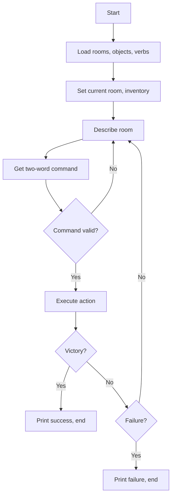

# Micropuzzle

**Book**: _Weird Computer Games (Usborne, 1984)_  
**Author**: [Usborne Publishing](https://usborne.com/row/books/computer-and-coding-books)  
**Translator**: [Marcus Medina](http://marcusmedina.pro)

## Story

What’s happened? Where are you? Everything seems fairly normal — except you feel a bit sick. Better look around and figure out what’s going on. (Hint: talk to your computer in **two-word sentences**.)

This miniature adventure challenges you to experiment with short commands, solve small riddles, and escape before the micropuzzle resets.

## Pseudocode

```plaintext
Load vocabulary (verbs and nouns) and map data
Set starting room and game flags
LOOP
    Display room description and visible objects
    Prompt for two-word command
    Parse verb and noun
    IF verb or noun unknown THEN show error and continue
    Handle verbs:
        GO <direction> -> move between rooms if exit exists
        TAKE <object> -> add to inventory if object present
        DROP <object> -> remove from inventory and place in room
        USE <object> -> perform scripted actions (unlock door, disarm cat, etc.)
        LOOK -> repeat description
    Update flags (cat tamed, door unlocked, countdown)
    Check win/lose conditions
END LOOP when escape achieved or timer expires
```

## Flowchart



## Code

<details>
<summary>ZX-81 BASIC</summary>

```basic
10 GOSUB 1570
20 RESTORE:FOR I=1 TO R:READ D$(I):NEXT I
30 CLS:PRINT "MICRO PUZZLE"
40 PRINT "==============="
50 PRINT "YOU ARE ";D$(R)
60 IF R=20 AND F(9)=0 THEN PRINT "YOU ARE CONFRONTED BY A LARGE CAT"
70 FOR I=1 TO 6
80 IF L(I)=R AND F(I)=0 THEN PRINT "THERE IS A ";O$(I);" HERE."
90 NEXT I
100 PRINT:PRINT "YOU CAN GO ";
110 FOR I=1 TO LEN(R$(R))
120 PRINT MID$(R$(R),I,1);
130 NEXT I
140 PRINT:PRINT "-------------------"
150 PRINT M$:LET M$="WHAT?"
160 IF F(16)=1 THEN PRINT "SELF DESTRUCT COUNTDOWN AT ";L
170 PRINT "WHAT WILL YOU DO NOW";:INPUT Q$
180 LET V$="":LET W$="":LET D8=0:LET L1=LEN(Q$)
190 FOR I=1 TO L1
200 IF MID$(Q$,I,1)=" " AND V$="" THEN LET V$=LEFT$(Q$,I-1)
210 IF MID$(Q$,I+1,1)<>" " AND V$<>"" THEN LET W$=RIGHT$(Q$,L1-I):LET I=L1
220 NEXT I
230 IF W$="" THEN LET W$=Q$
240 FOR I=1 TO V
250 IF V$=H$(I) THEN LET VB=I
260 NEXT I
270 GOSUB 440
280 IF VB=0 THEN LET VB=VB+1
290 IF V$="" AND OB=0 THEN LET M$="THAT IS SILLY"
300 IF W$="" THEN LET M$="I NEED TWO WORDS"
310 IF VB<>0 AND OB<>0 THEN LET M$="YOU CAN'T "+Q$
320 IF VB<>0 AND OB=0 THEN LET M$="YOU DO NOT MAKE SENSE"
330 IF VB<>0 AND OB<>0 AND OB>G THEN LET M$="YOU DO NOT HAVE "+W$
340 LET L=L-1
350 IF L=0 THEN GOTO 600
360 ON VB GOTO 370,410,470,520,550,580
370 GOSUB 650:RETURN
410 GOSUB 710:RETURN
470 GOSUB 870:RETURN
520 GOSUB 1030:RETURN
550 GOSUB 1140:RETURN
580 GOSUB 1280:RETURN
600 PRINT:PRINT "THE PUZZLE RESETS";:STOP
650 IF OB<>0 THEN LET M$="YOU ARE ALREADY CARRYING IT":RETURN
660 IF F(OB)<>0 THEN LET M$="YOU CAN'T TAKE IT":RETURN
670 FOR I=1 TO 6
680 IF L(I)=R AND I=OB THEN LET F(I)=1:LET M$="TAKEN":RETURN
690 NEXT I
700 LET M$="IT ISN'T HERE":RETURN
710 IF F(OB)=0 THEN LET M$="YOU AREN'T CARRYING IT":RETURN
720 FOR I=1 TO 6
730 IF I=OB THEN LET F(I)=0:LET L(I)=R:LET M$="DROPPED":RETURN
740 NEXT I
750 LET M$="YOU CAN'T DROP THAT":RETURN
870 IF OB<>0 THEN LET M$="YOU CAN'T":RETURN
880 LET A=ASC(W$)
890 FOR I=1 TO LEN(R$(R))
900 IF ASC(MID$(R$(R),I,1))=A THEN LET R=V(I):LET M$="OK":RETURN
910 NEXT I
920 LET M$="YOU CAN'T GO THAT WAY":RETURN
1030 IF OB<>4 THEN LET M$="YOU CAN'T":RETURN
1040 IF R<>7 THEN LET M$="NOTHING HAPPENS":RETURN
1050 IF F(9)=1 THEN LET M$="THE CAT PURRS":RETURN
1060 LET M$="THE CAT IS NOW FRIENDLY":LET F(9)=1:RETURN
1140 IF OB<>5 THEN LET M$="YOU CAN'T":RETURN
1150 IF R<>8 THEN LET M$="NOTHING HAPPENS":RETURN
1160 LET M$="THE DOOR UNLOCKS":LET F(10)=1:RETURN
1280 IF OB<>6 THEN LET M$="YOU CAN'T":RETURN
1290 IF F(10)=0 THEN LET M$="THE DOOR IS LOCKED":RETURN
1300 LET M$="THE DOOR OPENS. YOU ESCAPE!":STOP
1570 LET R=20:LET L=200
1580 DIM D$(20):DIM R$(20):DIM L(6):DIM O$(6)
1590 DIM F(20):DIM H$(6)
1600 FOR I=1 TO 6:READ O$(I):NEXT I
1610 DATA "KEY","CATNIP","LASER","MILK","CARD","DOOR"
1620 FOR I=1 TO 6:READ L(I):NEXT I
1630 DATA 17,15,5,17,18,8
1640 FOR I=1 TO 6:READ H$(I):NEXT I
1650 DATA "TAKE","DROP","GO","GIVE","INSERT","OPEN"
1660 FOR I=1 TO 20:READ R$(I):NEXT I
1670 DATA "N","E","S","W","NS","NS","W","E","NS","NS"
1680 DATA "E","W","N","S","N","S","E","W","N",""
1690 FOR I=1 TO 20:READ D$(I):NEXT I
1700 DATA "CELL","CORRIDOR","LAB","SLEEPING QUARTERS","CAT PEN"
1710 DATA "STORES","GUARD ROOM","AIRLOCK","CONTROL ROOM","SHUTTLE"
1720 DATA "OBSERVATORY","DOCK","CRYO CHAMBER","CANTEEN","GALLEY"
1730 DATA "HYDROPONICS","ENGINE ROOM","ARMOURY","CAPTAIN'S CABIN"
1740 DATA "AIR VENT"
1750 RETURN
```

</details>

## Modern Implementations

The rewrites below keep the spirit of the original two-word parser while trimming the content to a handful of rooms and scripted interactions. Commands such as `GO NORTH`, `TAKE KEY`, `USE CARD`, and `LOOK` will lead you through a tiny escape scenario.

<details>
<summary>C#</summary>

```csharp
using System;
using System.Collections.Generic;

namespace WeirdComputerGames;

public static class Micropuzzle
{
    private record Room(string Name, string Description,
        Dictionary<string, string> Exits,
        List<string> Items);

    public static void Main()
    {
        var rooms = new Dictionary<string, Room>
        {
            ["cell"] = new Room(
                "Holding Cell",
                "Bare walls, flickering light, a locked door to the north.",
                new() { ["N"] = "corridor" },
                new List<string>()),
            ["corridor"] = new Room(
                "Guarded Corridor",
                "A nervous robot guard snores beside a locker.",
                new() { ["S"] = "cell", ["E"] = "lab" },
                new List<string> { "card" }),
            ["lab"] = new Room(
                "Research Lab",
                "Smashed glass covers the benches. A door to the east flashes red.",
                new() { ["W"] = "corridor", ["E"] = "airlock" },
                new List<string> { "key" }),
            ["airlock"] = new Room(
                "Airlock",
                "A heavy outer door stands shut. A reader waits for an access card.",
                new() { ["W"] = "lab", ["E"] = "docks" },
                new List<string>()),
            ["docks"] = new Room(
                "Docks",
                "Starlight shines on escape pods. Freedom is a step away.",
                new() { },
                new List<string>())
        };

        var inventory = new HashSet<string>();
        string current = "cell";
        bool airlockUnlocked = false;

        while (true)
        {
            var room = rooms[current];
            Console.WriteLine($"\n{room.Name}\n{room.Description}");
            if (room.Items.Count > 0)
            {
                Console.WriteLine("You see: " + string.Join(", ", room.Items));
            }
            Console.WriteLine("Exits: " + string.Join(", ", room.Exits.Keys));
            Console.Write("Command (two words): ");
            string[] parts = (Console.ReadLine() ?? string.Empty)
                .Trim()
                .ToUpperInvariant()
                .Split(' ', StringSplitOptions.RemoveEmptyEntries);
            if (parts.Length == 0)
                continue;

            string verb = parts[0];
            string noun = parts.Length > 1 ? parts[1] : "";

            switch (verb)
            {
                case "LOOK":
                    continue;
                case "GO":
                    if (room.Exits.TryGetValue(noun, out string next))
                    {
                        if (next == "docks" && !airlockUnlocked)
                        {
                            Console.WriteLine("The door stays locked.");
                        }
                        else
                        {
                            current = next;
                        }
                    }
                    else
                    {
                        Console.WriteLine("You can't go that way.");
                    }
                    break;
                case "TAKE":
                    if (room.Items.Remove(noun.ToLower()))
                    {
                        inventory.Add(noun.ToLower());
                        Console.WriteLine("Taken.");
                    }
                    else
                    {
                        Console.WriteLine("There isn't one here.");
                    }
                    break;
                case "DROP":
                    if (inventory.Remove(noun.ToLower()))
                    {
                        room.Items.Add(noun.ToLower());
                        Console.WriteLine("Dropped.");
                    }
                    else
                    {
                        Console.WriteLine("You're not carrying that.");
                    }
                    break;
                case "USE":
                    HandleUse(noun.ToLower(), room, inventory, ref airlockUnlocked);
                    if (airlockUnlocked && current == "docks")
                    {
                        Console.WriteLine("You launch an escape pod. FREEDOM!\n");
                        return;
                    }
                    break;
                case "INVENTORY":
                    Console.WriteLine("Carrying: " + (inventory.Count == 0 ? "nothing" : string.Join(", ", inventory)));
                    break;
                default:
                    Console.WriteLine("That doesn't work.");
                    break;
            }
        }
    }

    private static void HandleUse(string noun, Room room,
        HashSet<string> inventory, ref bool airlockUnlocked)
    {
        if (noun == "key" && room.Name == "Guarded Corridor" && inventory.Contains("key"))
        {
            Console.WriteLine("You rattle the locker open. A deck card slides out.");
            room.Items.Add("card");
        }
        else if (noun == "card" && room.Name == "Airlock" && inventory.Contains("card"))
        {
            airlockUnlocked = true;
            Console.WriteLine("The reader beeps and the airlock door unlocks.");
        }
        else if (noun == "card" && room.Name == "Docks" && airlockUnlocked)
        {
            Console.WriteLine("The pod accepts the card and powers up.");
        }
        else
        {
            Console.WriteLine("Nothing happens.");
        }
    }
}
```

</details>
<details>
<summary>Python</summary>

```python
from dataclasses import dataclass, field
from typing import Dict, List, Set

@dataclass
class Room:
    name: str
    description: str
    exits: Dict[str, str]
    items: List[str] = field(default_factory=list)

rooms = {
    "cell": Room(
        "Holding Cell",
        "Bare walls, flickering light, a locked door to the north.",
        {"N": "corridor"}
    ),
    "corridor": Room(
        "Guarded Corridor",
        "A nervous robot snores beside a steel locker.",
        {"S": "cell", "E": "lab"},
        ["card"]
    ),
    "lab": Room(
        "Research Lab",
        "Smashed glass and broken jars. A warning light flashes east.",
        {"W": "corridor", "E": "airlock"},
        ["key"]
    ),
    "airlock": Room(
        "Airlock",
        "A heavy door blocks the escape pods. A reader awaits a card.",
        {"W": "lab", "E": "docks"}
    ),
    "docks": Room(
        "Docks",
        "Beyond the transparent hull lies space and freedom.",
        {}
    ),
}

inventory: Set[str] = set()
current = "cell"
airlock_unlocked = False

while True:
    room = rooms[current]
    print(f"\n{room.name}\n{room.description}")
    if room.items:
        print("You see:", ", ".join(room.items))
    if room.exits:
        print("Exits:", ", ".join(room.exits.keys()))

    command = input("Command (two words): ").strip().upper().split()
    if not command:
        continue
    verb = command[0]
    noun = command[1] if len(command) > 1 else ""

    if verb == "LOOK":
        continue
    elif verb == "GO":
        if noun in room.exits:
            target = room.exits[noun]
            if target == "docks" and not airlock_unlocked:
                print("The door refuses to budge.")
            else:
                current = target
        else:
            print("You can't go that way.")
    elif verb == "TAKE":
        noun = noun.lower()
        if noun in room.items:
            room.items.remove(noun)
            inventory.add(noun)
            print("Taken.")
        else:
            print("There isn't one here.")
    elif verb == "DROP":
        noun = noun.lower()
        if noun in inventory:
            inventory.remove(noun)
            room.items.append(noun)
            print("Dropped.")
        else:
            print("You're not carrying that.")
    elif verb == "USE":
        noun = noun.lower()
        if noun == "key" and current == "corridor" and "key" in inventory:
            print("You pop open the locker and a deck card falls out.")
            room.items.append("card")
        elif noun == "card" and current == "airlock" and "card" in inventory:
            airlock_unlocked = True
            print("The reader beeps. The airlock unlocks!")
        elif noun == "card" and current == "docks" and airlock_unlocked:
            print("The pod accepts the card and slides open.")
            print("You escape into space. FREEDOM!")
            break
        else:
            print("Nothing happens.")
    elif verb == "INVENTORY":
        print("Carrying:", ", ".join(sorted(inventory)) or "nothing")
    else:
        print("That doesn't work.")
```

</details>
<details>
<summary>Java</summary>

```java
import java.util.*;

public class Micropuzzle {
    private record Room(String name, String description,
                        Map<String, String> exits,
                        List<String> items) {}

    public static void main(String[] args) {
        Map<String, Room> rooms = buildWorld();
        Set<String> inventory = new HashSet<>();
        String current = "cell";
        boolean airlockUnlocked = false;
        Scanner scanner = new Scanner(System.in);

        while (true) {
            Room room = rooms.get(current);
            System.out.printf("%n%s%n%s%n", room.name(), room.description());
            if (!room.items().isEmpty()) {
                System.out.println("You see: " + String.join(", ", room.items()));
            }
            if (!room.exits().isEmpty()) {
                System.out.println("Exits: " + String.join(", ", room.exits().keySet()));
            }

            System.out.print("Command (two words): ");
            String[] parts = scanner.nextLine().trim().toUpperCase().split("\\s+");
            if (parts.length == 0 || parts[0].isEmpty()) {
                continue;
            }
            String verb = parts[0];
            String noun = parts.length > 1 ? parts[1] : "";

            switch (verb) {
                case "LOOK" -> {}
                case "GO" -> {
                    String exit = room.exits().get(noun);
                    if (exit == null) {
                        System.out.println("You can't go that way.");
                    } else if (exit.equals("docks") && !airlockUnlocked) {
                        System.out.println("The door stays locked.");
                    } else {
                        current = exit;
                    }
                }
                case "TAKE" -> {
                    noun = noun.toLowerCase();
                    if (room.items().remove(noun)) {
                        inventory.add(noun);
                        System.out.println("Taken.");
                    } else {
                        System.out.println("There isn't one here.");
                    }
                }
                case "DROP" -> {
                    noun = noun.toLowerCase();
                    if (inventory.remove(noun)) {
                        room.items().add(noun);
                        System.out.println("Dropped.");
                    } else {
                        System.out.println("You're not carrying that.");
                    }
                }
                case "USE" -> {
                    noun = noun.toLowerCase();
                    if (noun.equals("key") && current.equals("corridor") && inventory.contains("key")) {
                        System.out.println("You unlock the locker and find a deck card.");
                        room.items().add("card");
                    } else if (noun.equals("card") && current.equals("airlock") && inventory.contains("card")) {
                        airlockUnlocked = true;
                        System.out.println("The reader beeps. The airlock opens.");
                    } else if (noun.equals("card") && current.equals("docks") && airlockUnlocked) {
                        System.out.println("The pod accepts the card. You escape!\nFREEDOM!");
                        return;
                    } else {
                        System.out.println("Nothing happens.");
                    }
                }
                case "INVENTORY" -> {
                    if (inventory.isEmpty()) {
                        System.out.println("Carrying nothing.");
                    } else {
                        System.out.println("Carrying: " + String.join(", ", inventory));
                    }
                }
                default -> System.out.println("That doesn't work.");
            }
        }
    }

    private static Map<String, Room> buildWorld() {
        Map<String, Room> rooms = new HashMap<>();
        rooms.put("cell", new Room(
            "Holding Cell",
            "Bare walls, flickering light, a locked door to the north.",
            Map.of("N", "corridor"),
            new ArrayList<>()));
        rooms.put("corridor", new Room(
            "Guarded Corridor",
            "A nervous robot snores beside a steel locker.",
            new HashMap<>(Map.of("S", "cell", "E", "lab")),
            new ArrayList<>(List.of("card"))));
        rooms.put("lab", new Room(
            "Research Lab",
            "Smashed glass and broken jars. A warning light flashes east.",
            new HashMap<>(Map.of("W", "corridor", "E", "airlock")),
            new ArrayList<>(List.of("key"))));
        rooms.put("airlock", new Room(
            "Airlock",
            "A heavy door blocks the escape pods. A reader awaits a card.",
            new HashMap<>(Map.of("W", "lab", "E", "docks")),
            new ArrayList<>()));
        rooms.put("docks", new Room(
            "Docks",
            "Beyond the transparent hull lies space and freedom.",
            new HashMap<>(),
            new ArrayList<>()));
        return rooms;
    }
}
```

</details>
<details>
<summary>Go</summary>

```go
package main

import (
    "bufio"
    "fmt"
    "os"
    "strings"
)

type room struct {
    name        string
    description string
    exits       map[string]string
    items       []string
}

type gameState struct {
    rooms           map[string]*room
    inventory       map[string]bool
    current         string
    airlockUnlocked bool
}

func main() {
    state := newGame()
    reader := bufio.NewReader(os.Stdin)

    for {
        r := state.rooms[state.current]
        fmt.Printf("\n%s\n%s\n", r.name, r.description)
        if len(r.items) > 0 {
            fmt.Printf("You see: %s\n", strings.Join(r.items, ", "))
        }
        if len(r.exits) > 0 {
            exits := make([]string, 0, len(r.exits))
            for dir := range r.exits {
                exits = append(exits, dir)
            }
            fmt.Printf("Exits: %s\n", strings.Join(exits, ", "))
        }

        fmt.Print("Command (two words): ")
        line, _ := reader.ReadString('\n')
        parts := strings.Fields(strings.ToUpper(line))
        if len(parts) == 0 {
            continue
        }
        verb := parts[0]
        noun := ""
        if len(parts) > 1 {
            noun = strings.ToLower(parts[1])
        }

        switch verb {
        case "LOOK":
            continue
        case "GO":
            target, ok := r.exits[noun]
            if !ok {
                fmt.Println("You can't go that way.")
            } else if target == "docks" && !state.airlockUnlocked {
                fmt.Println("The door stays locked.")
            } else {
                state.current = target
            }
        case "TAKE":
            idx := indexOf(r.items, noun)
            if idx == -1 {
                fmt.Println("There isn't one here.")
            } else {
                r.items = append(r.items[:idx], r.items[idx+1:]...)
                state.inventory[noun] = true
                fmt.Println("Taken.")
            }
        case "DROP":
            if !state.inventory[noun] {
                fmt.Println("You're not carrying that.")
            } else {
                r.items = append(r.items, noun)
                delete(state.inventory, noun)
                fmt.Println("Dropped.")
            }
        case "USE":
            handleUse(&state, noun)
            if state.current == "docks" && state.airlockUnlocked && noun == "card" {
                fmt.Println("You power up a pod and blast free. FREEDOM!")
                return
            }
        case "INVENTORY":
            if len(state.inventory) == 0 {
                fmt.Println("Carrying nothing.")
            } else {
                items := make([]string, 0, len(state.inventory))
                for item := range state.inventory {
                    items = append(items, item)
                }
                fmt.Printf("Carrying: %s\n", strings.Join(items, ", "))
            }
        default:
            fmt.Println("That doesn't work.")
        }
    }
}

func newGame() gameState {
    return gameState{
        rooms: map[string]*room{
            "cell": {
                name:        "Holding Cell",
                description: "Bare walls, flickering light, a locked door to the north.",
                exits:       map[string]string{"N": "corridor"},
            },
            "corridor": {
                name:        "Guarded Corridor",
                description: "A nervous robot snores beside a steel locker.",
                exits:       map[string]string{"S": "cell", "E": "lab"},
                items:       []string{"card"},
            },
            "lab": {
                name:        "Research Lab",
                description: "Smashed glass and broken jars. A warning light flashes east.",
                exits:       map[string]string{"W": "corridor", "E": "airlock"},
                items:       []string{"key"},
            },
            "airlock": {
                name:        "Airlock",
                description: "A heavy door blocks the escape pods. A reader awaits a card.",
                exits:       map[string]string{"W": "lab", "E": "docks"},
            },
            "docks": {
                name:        "Docks",
                description: "Beyond the transparent hull lies space and freedom.",
                exits:       map[string]string{},
            },
        },
        inventory: make(map[string]bool),
        current:   "cell",
    }
}

func handleUse(state *gameState, noun string) {
    room := state.rooms[state.current]
    switch noun {
    case "key":
        if state.current == "corridor" && state.inventory["key"] {
            fmt.Println("You unlock the locker and a deck card slides out.")
            room.items = append(room.items, "card")
        } else {
            fmt.Println("Nothing happens.")
        }
    case "card":
        if state.current == "airlock" && state.inventory["card"] {
            state.airlockUnlocked = true
            fmt.Println("The reader beeps. The airlock unlocks.")
        } else if state.current == "docks" && state.airlockUnlocked {
            fmt.Println("The pod powers up.")
        } else {
            fmt.Println("Nothing happens.")
        }
    default:
        fmt.Println("Nothing happens.")
    }
}

func indexOf(slice []string, target string) int {
    for i, v := range slice {
        if v == target {
            return i
        }
    }
    return -1
}
```

</details>
<details>
<summary>C++</summary>

```cpp
#include <algorithm>
#include <iostream>
#include <map>
#include <set>
#include <string>
#include <vector>

struct Room {
    std::string name;
    std::string description;
    std::map<std::string, std::string> exits;
    std::vector<std::string> items;
};

int main() {
    std::map<std::string, Room> rooms {
        {"cell", {
            "Holding Cell",
            "Bare walls, flickering light, a locked door to the north.",
            {{"N", "corridor"}},
            {}
        }},
        {"corridor", {
            "Guarded Corridor",
            "A nervous robot snores beside a steel locker.",
            {{"S", "cell"}, {"E", "lab"}},
            {"card"}
        }},
        {"lab", {
            "Research Lab",
            "Smashed glass and broken jars. A warning light flashes east.",
            {{"W", "corridor"}, {"E", "airlock"}},
            {"key"}
        }},
        {"airlock", {
            "Airlock",
            "A heavy door blocks the escape pods. A reader awaits a card.",
            {{"W", "lab"}, {"E", "docks"}},
            {}
        }},
        {"docks", {
            "Docks",
            "Beyond the transparent hull lies space and freedom.",
            {},
            {}
        }}
    };

    std::set<std::string> inventory;
    std::string current = "cell";
    bool airlockUnlocked = false;

    while (true) {
        Room& room = rooms[current];
        std::cout << "\n" << room.name << "\n" << room.description << "\n";
        if (!room.items.empty()) {
            std::cout << "You see: ";
            for (size_t i = 0; i < room.items.size(); ++i) {
                std::cout << room.items[i] << (i + 1 == room.items.size() ? '\n' : ',');
            }
        }
        if (!room.exits.empty()) {
            std::cout << "Exits: ";
            for (auto it = room.exits.begin(); it != room.exits.end(); ++it) {
                std::cout << it->first;
                if (std::next(it) != room.exits.end()) std::cout << ',';
            }
            std::cout << '\n';
        }

        std::cout << "Command (two words): ";
        std::string verb, noun;
        std::cin >> verb;
        std::getline(std::cin, noun);
        if (!noun.empty() && noun[0] == ' ') noun.erase(noun.begin());
        std::transform(verb.begin(), verb.end(), verb.begin(), ::toupper);
        std::transform(noun.begin(), noun.end(), noun.begin(), ::toupper);

        if (verb == "LOOK") continue;
        else if (verb == "GO") {
            auto exit = room.exits.find(noun);
            if (exit == room.exits.end()) {
                std::cout << "You can't go that way.\n";
            } else if (exit->second == "docks" && !airlockUnlocked) {
                std::cout << "The door stays locked.\n";
            } else {
                current = exit->second;
            }
        }
        else if (verb == "TAKE") {
            std::string item = noun;
            std::transform(item.begin(), item.end(), item.begin(), ::tolower);
            auto it = std::find(room.items.begin(), room.items.end(), item);
            if (it == room.items.end()) {
                std::cout << "There isn't one here.\n";
            } else {
                inventory.insert(item);
                room.items.erase(it);
                std::cout << "Taken.\n";
            }
        }
        else if (verb == "DROP") {
            std::string item = noun;
            std::transform(item.begin(), item.end(), item.begin(), ::tolower);
            if (!inventory.erase(item)) {
                std::cout << "You're not carrying that.\n";
            } else {
                room.items.push_back(item);
                std::cout << "Dropped.\n";
            }
        }
        else if (verb == "USE") {
            std::string item = noun;
            std::transform(item.begin(), item.end(), item.begin(), ::tolower);
            if (item == "key" && current == "corridor" && inventory.contains("key")) {
                std::cout << "You unlock the locker and discover a deck card.\n";
                room.items.push_back("card");
            } else if (item == "card" && current == "airlock" && inventory.contains("card")) {
                airlockUnlocked = true;
                std::cout << "The reader beeps. The airlock opens.\n";
            } else if (item == "card" && current == "docks" && airlockUnlocked) {
                std::cout << "The pod accepts the card. You blast away. FREEDOM!\n";
                break;
            } else {
                std::cout << "Nothing happens.\n";
            }
        }
        else if (verb == "INVENTORY") {
            if (inventory.empty()) std::cout << "Carrying nothing.\n";
            else {
                std::cout << "Carrying: ";
                for (auto it = inventory.begin(); it != inventory.end(); ++it) {
                    std::cout << *it;
                    if (std::next(it) != inventory.end()) std::cout << ',';
                }
                std::cout << '\n';
            }
        }
        else {
            std::cout << "That doesn't work.\n";
        }
    }

    return 0;
}
```

</details>
<details>
<summary>Rust</summary>

```rust
use std::collections::{HashMap, HashSet};
use std::io::{self, Write};

#[derive(Clone)]
struct Room {
    name: &'static str,
    description: &'static str,
    exits: HashMap<String, String>,
    items: Vec<String>,
}

fn main() {
    let mut rooms = build_world();
    let mut inventory: HashSet<String> = HashSet::new();
    let mut current = String::from("cell");
    let mut airlock_unlocked = false;

    loop {
        let room = rooms.get_mut(&current).unwrap();
        println!("\n{}\n{}", room.name, room.description);
        if !room.items.is_empty() {
            println!("You see: {}", room.items.join(", "));
        }
        if !room.exits.is_empty() {
            let exits: Vec<_> = room.exits.keys().cloned().collect();
            println!("Exits: {}", exits.join(", "));
        }

        print!("Command (two words): ");
        io::stdout().flush().unwrap();
        let mut line = String::new();
        io::stdin().read_line(&mut line).unwrap();
        let parts: Vec<_> = line.trim().to_uppercase().split_whitespace().collect();
        if parts.is_empty() {
            continue;
        }
        let verb = parts[0];
        let noun = parts.get(1).map(|s| s.to_lowercase()).unwrap_or_default();

        match verb {
            "LOOK" => continue,
            "GO" => {
                if let Some(target) = room.exits.get(&noun.to_uppercase()) {
                    if target == "docks" && !airlock_unlocked {
                        println!("The door remains locked.");
                    } else {
                        current = target.clone();
                    }
                } else {
                    println!("You can't go that way.");
                }
            }
            "TAKE" => {
                if let Some(pos) = room.items.iter().position(|i| i == &noun) {
                    inventory.insert(noun.clone());
                    room.items.remove(pos);
                    println!("Taken.");
                } else {
                    println!("There isn't one here.");
                }
            }
            "DROP" => {
                if inventory.remove(&noun) {
                    room.items.push(noun.clone());
                    println!("Dropped.");
                } else {
                    println!("You're not carrying that.");
                }
            }
            "USE" => {
                if noun == "key" && current == "corridor" && inventory.contains("key") {
                    println!("You crack the locker. A deck card slides out.");
                    room.items.push("card".into());
                } else if noun == "card" && current == "airlock" && inventory.contains("card") {
                    airlock_unlocked = true;
                    println!("The reader beeps. The airlock unlocks.");
                } else if noun == "card" && current == "docks" && airlock_unlocked {
                    println!("The pod accepts the card. FREEDOM!\n");
                    break;
                } else {
                    println!("Nothing happens.");
                }
            }
            "INVENTORY" => {
                if inventory.is_empty() {
                    println!("Carrying nothing.");
                } else {
                    let mut items: Vec<_> = inventory.iter().cloned().collect();
                    items.sort();
                    println!("Carrying: {}", items.join(", "));
                }
            }
            _ => println!("That doesn't work."),
        }
    }
}

fn build_world() -> HashMap<String, Room> {
    let mut rooms = HashMap::new();
    rooms.insert(
        "cell".into(),
        Room {
            name: "Holding Cell",
            description: "Bare walls, flickering light, a locked door to the north.",
            exits: HashMap::from([(String::from("N"), String::from("corridor"))]),
            items: vec![],
        },
    );
    rooms.insert(
        "corridor".into(),
        Room {
            name: "Guarded Corridor",
            description: "A nervous robot snores beside a steel locker.",
            exits: HashMap::from([
                (String::from("S"), String::from("cell")),
                (String::from("E"), String::from("lab")),
            ]),
            items: vec!["card".into()],
        },
    );
    rooms.insert(
        "lab".into(),
        Room {
            name: "Research Lab",
            description: "Smashed glass and broken jars. A warning light flashes east.",
            exits: HashMap::from([
                (String::from("W"), String::from("corridor")),
                (String::from("E"), String::from("airlock")),
            ]),
            items: vec!["key".into()],
        },
    );
    rooms.insert(
        "airlock".into(),
        Room {
            name: "Airlock",
            description: "A heavy door blocks the escape pods. A reader awaits a card.",
            exits: HashMap::from([
                (String::from("W"), String::from("lab")),
                (String::from("E"), String::from("docks")),
            ]),
            items: vec![],
        },
    );
    rooms.insert(
        "docks".into(),
        Room {
            name: "Docks",
            description: "Beyond the transparent hull lies space and freedom.",
            exits: HashMap::new(),
            items: vec![],
        },
    );
    rooms
}
```

</details>
## Explanation

The ZX-81 original stores vocabulary, room descriptions, and puzzle logic in arrays, making a surprisingly flexible two-word parser for the era. The modern ports mirror that structure with maps and lists plus a small scripted escape sequence. The verbs `GO`, `TAKE`, `DROP`, `USE`, and `LOOK` remain, but the content is trimmed for clarity.

## Challenges

1. **Expanded Map** – Add more rooms and new verbs such as `TALK` or `EXAMINE` to deepen the puzzle.
2. **Countdown Pressure** – Introduce a timer that shortens each loop iteration to recreate the original’s urgency.
3. **Synonym Support** – Accept synonyms (`NORTH`, `UP`, `CARD`, `PASS`) and show how parser tables can scale.

## Copyright

These programs are adaptations of the original _Usborne Computer Guides_ published in the 1980s. The books are free to download for personal or educational use from [Usborne’s Computer and Coding Books](https://usborne.com/row/books/computer-and-coding-books). Programs and adaptations may not be used for commercial purposes.

Return to [Weird Computer Games](./readme.md).
