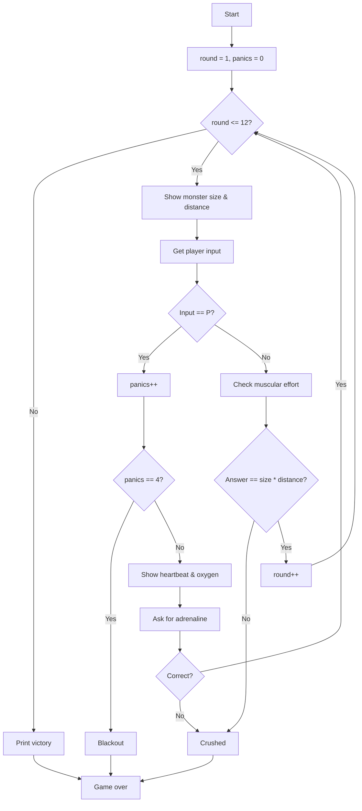

# Monster Wrestling

**Book**: _Weird Computer Games (Usborne, 1984)_  
**Author**: [Usborne Publishing](https://usborne.com/row/books/computer-and-coding-books)  
**Translator**: [Marcus Medina](http://marcusmedina.pro)

## Story

**Monster wrestling** is a sport for lunatics! Which doesn’t say much for you — the brain in charge of this hulk of bone and muscle which is about to take on some of the nastiest monsters in the Universe.

As the **Brain**, you must do a lot of quick and accurate calculations. You must work out the muscular effort required to hold off the monster — multiply the monster’s size by the distance it is from you.

If the numbers look too difficult, you can press the **Panic Button (P)**. Then you have to work out how much **adrenaline** the body needs to get through the crisis by dividing heartbeat increase by oxygen supply. Use the Panic Button sparingly: after three uses you will black out on the fourth.

To live to fight another match you must **survive 12 rounds** against the monster.

## Pseudocode

```plaintext
SET round = 1
SET panics_used = 0
REPEAT UNTIL round > 12
    GENERATE monster_size and monster_distance
    DISPLAY both values
    PROMPT player for muscular effort or panic
    IF player entered panic THEN
        INCREMENT panics_used
        IF panics_used == 4 THEN game over (blackout)
        GENERATE heartbeat_increase and oxygen_supply
        PROMPT for adrenaline = heartbeat / oxygen
        IF answer wrong THEN game over (crushed)
        CONTINUE to next round without incrementing round
    ELSE
        CONVERT answer to integer muscular_effort
        IF muscular_effort != size * distance THEN game over (crushed)
        INCREMENT round
END LOOP
IF loop finished without failure THEN player survives 12 rounds
```

## Flowchart



## Code

<details>
<summary>ZX-81 BASIC</summary>

```basic
20 LET P=0
30 LET K=3
40 CLS
50 LET Y=1
60 LET Y=6
70 LET N=1
80 G=INT(RND(1)*Y)+X
90 LET I=INT(RND(1)*K)+K
100 LET Y=Y+0.5
110 LET K=K+0.5
130 PRINT
140 PRINT "SIZE OF MONSTER: ";G
150 PRINT "DISTANCE AWAY: ";I
160 PRINT "MUSCULAR EFFORT? ";
170 GOSUB 570
180 IF I*G>Z THEN GOTO 320
240 CLS
250 PRINT "MONSTER KEPT AT BAY"
260 IF N<11 THEN GOTO 75
270 PRINT "PHEW! ---- THE MONSTER"
280 PRINT "IS TIRED AND HAS GONE TO"
290 PRINT "LOOK FOR ANOTHER VICTIM."
300 PRINT "YOU SURVIVE TO TELL THE TALE!"
310 STOP
320 CLS
330 PRINT "YOU HAVE BEEN CRUSHED"
340 PRINT "TO A PULP IN THE"
350 PRINT "MONSTER'S HUGE ARMS"
360 PRINT "YOU SURVIVED ";N;" ROUNDS"
370 STOP
390 CLS
400 LET W=INT(RND(1)*9)+1
410 LET WX=INT(RND(1)*9)+1
420 LET P=P+1
430 IF P=4 THEN GOTO 700
440 IF P=3 THEN PRINT "YOU ARE SEEING STARS"
450 PRINT "PANIC ON!!"
470 PRINT "HEARTBEAT INCREASE: ";W
480 PRINT "OXYGEN SUPPLY: ";WX
500 PRINT "AMOUNT OF ADRENALIN? ";
520 LET Q=100
530 GOSUB 580
540 IF Z<>W/WX THEN GOTO 320
550 CLS:IF N<11 THEN GOTO 75
560 GOTO 270
570 LET Z$=""
580 LET A$=INKEY$
590 IF A$=CHR$(13) THEN GOTO 680
600 IF A$="P" THEN GOTO 390
610 IF A$="" THEN GOTO 580
620 PRINT A$;
630 LET Z$=Z$+A$
640 IF LEN Z$>4 THEN GOTO 580
650 GOTO 580
680 LET Z=VAL(Z$)
690 RETURN
700 CLS
710 PRINT "YOU BLACKED OUT"
720 STOP
```

</details>

## Modern Implementations

<details>
<summary>C#</summary>

```csharp
using System;

namespace WeirdComputerGames;

public static class MonsterWrestling
{
    private const int RoundsToWin = 12;
    private const int MaxPanics = 3;

    public static void Main()
    {
        var random = new Random();
        int panics = 0;

        for (int round = 1; round <= RoundsToWin; round++)
        {
            int size = random.Next(8, 16);      // monster size grows gradually
            int distance = random.Next(3, 9);   // distance in arbitrary units
            Console.WriteLine($"\nRound {round}");
            Console.WriteLine($"Size of monster: {size}");
            Console.WriteLine($"Distance away: {distance}");
            Console.Write("Muscular effort? (or P to panic): ");

            string? input = Console.ReadLine()?.Trim().ToUpperInvariant();
            if (input == "P")
            {
                if (++panics > MaxPanics)
                {
                    Console.WriteLine("You blacked out! The monster wins.");
                    return;
                }

                int heartbeat = random.Next(10, 50);
                int oxygen = random.Next(5, 15);
                Console.WriteLine("PANIC ON!!");
                Console.WriteLine($"Heartbeat increase: {heartbeat}");
                Console.WriteLine($"Oxygen supply: {oxygen}");
                Console.Write("Amount of adrenalin? ");

                if (!double.TryParse(Console.ReadLine(), out double answer) ||
                    Math.Abs(answer - (double)heartbeat / oxygen) > 0.01)
                {
                    Console.WriteLine("Wrong dose! You are crushed in a massive hug.");
                    return;
                }

                round--; // panic doesn't advance the round
                continue;
            }

            if (!int.TryParse(input, out int effort) || effort != size * distance)
            {
                Console.WriteLine("Wrong calculation! The monster squeezes you flat.");
                return;
            }

            Console.WriteLine("Muscles straining... the monster is kept at bay!");
        }

        Console.WriteLine("Phew! The monster wearily lumbers off. You survive to tell the tale!");
    }
}
```

</details>
<details>
<summary>Python</summary>

```python
import random

ROUNDS_TO_WIN = 12
MAX_PANICS = 3


def monster_wrestling() -> None:
    panics = 0
    round_no = 1

    while round_no <= ROUNDS_TO_WIN:
        size = random.randint(8, 15)
        distance = random.randint(3, 8)
        print(f"\nRound {round_no}")
        print(f"Size of monster: {size}")
        print(f"Distance away: {distance}")
        choice = input("Muscular effort? (or P to panic): ").strip().upper()

        if choice == "P":
            panics += 1
            if panics > MAX_PANICS:
                print("You black out! The monster crushes you.")
                return

            heartbeat = random.randint(10, 40)
            oxygen = random.randint(5, 12)
            print("PANIC ON!!")
            print(f"Heartbeat increase: {heartbeat}")
            print(f"Oxygen supply: {oxygen}")
            try:
                adrenaline = float(input("Amount of adrenalin? "))
            except ValueError:
                print("That wasn't a number. You are crushed.")
                return

            if abs(adrenaline - heartbeat / oxygen) > 0.01:
                print("Wrong dose! The monster wins.")
                return

            continue  # retry the same round

        try:
            effort = int(choice)
        except ValueError:
            print("You freeze up and the monster flattens you!")
            return

        if effort != size * distance:
            print("Incorrect calculation! The monster crushes you.")
            return

        print("Muscles hold! The monster retreats a step.")
        round_no += 1

    print("Phew! Twelve rounds later the monster slinks away.")


if __name__ == "__main__":
    monster_wrestling()
```

</details>
<details>
<summary>Java</summary>

```java
import java.util.Random;
import java.util.Scanner;

public class MonsterWrestling {
    private static final int ROUNDS_TO_WIN = 12;
    private static final int MAX_PANICS = 3;

    public static void main(String[] args) {
        Scanner scanner = new Scanner(System.in);
        Random random = new Random();
        int panics = 0;

        for (int round = 1; round <= ROUNDS_TO_WIN; round++) {
            int size = random.nextInt(8) + 8;      // 8-15
            int distance = random.nextInt(6) + 3;  // 3-8

            System.out.printf("%nRound %d%n", round);
            System.out.printf("Size of monster: %d%n", size);
            System.out.printf("Distance away: %d%n", distance);
            System.out.print("Muscular effort? (or P to panic): ");
            String input = scanner.nextLine().trim().toUpperCase();

            if ("P".equals(input)) {
                panics++;
                if (panics > MAX_PANICS) {
                    System.out.println("You black out! The monster wins.");
                    return;
                }

                int heartbeat = random.nextInt(31) + 10;
                int oxygen = random.nextInt(8) + 5;
                System.out.println("PANIC ON!!");
                System.out.printf("Heartbeat increase: %d%n", heartbeat);
                System.out.printf("Oxygen supply: %d%n", oxygen);
                System.out.print("Amount of adrenalin? ");

                double answer;
                try {
                    answer = Double.parseDouble(scanner.nextLine());
                } catch (NumberFormatException ex) {
                    System.out.println("That wasn't a number. You are crushed.");
                    return;
                }

                if (Math.abs(answer - (double) heartbeat / oxygen) > 0.01) {
                    System.out.println("Wrong dose! The monster crushes you.");
                    return;
                }

                round--; // redo the round
                continue;
            }

            int effort;
            try {
                effort = Integer.parseInt(input);
            } catch (NumberFormatException ex) {
                System.out.println("Incorrect response! The monster crushes you.");
                return;
            }

            if (effort != size * distance) {
                System.out.println("Wrong calculation! You are crushed.");
                return;
            }

            System.out.println("You hold the monster back!");
        }

        System.out.println("Phew! Twelve rounds later the monster slinks away.");
    }
}
```

</details>
<details>
<summary>Go</summary>

```go
package main

import (
    "bufio"
    "fmt"
    "math"
    "math/rand"
    "os"
    "strconv"
    "strings"
    "time"
)

const (
    roundsToWin = 12
    maxPanics   = 3
)

func main() {
    rand.Seed(time.Now().UnixNano())
    reader := bufio.NewReader(os.Stdin)
    panics := 0

    for round := 1; round <= roundsToWin; round++ {
        size := rand.Intn(8) + 8      // 8-15
        distance := rand.Intn(6) + 3  // 3-8

        fmt.Printf("\nRound %d\n", round)
        fmt.Printf("Size of monster: %d\n", size)
        fmt.Printf("Distance away: %d\n", distance)
        fmt.Print("Muscular effort? (or P to panic): ")
        line, _ := reader.ReadString('\n')
        input := strings.ToUpper(strings.TrimSpace(line))

        if input == "P" {
            panics++
            if panics > maxPanics {
                fmt.Println("You black out! The monster crushes you.")
                return
            }

            heartbeat := rand.Intn(31) + 10
            oxygen := rand.Intn(8) + 5
            fmt.Println("PANIC ON!!")
            fmt.Printf("Heartbeat increase: %d\n", heartbeat)
            fmt.Printf("Oxygen supply: %d\n", oxygen)
            fmt.Print("Amount of adrenalin? ")

            ansLine, _ := reader.ReadString('\n')
            ans, err := strconv.ParseFloat(strings.TrimSpace(ansLine), 64)
            if err != nil || math.Abs(ans-float64(heartbeat)/float64(oxygen)) > 0.01 {
                fmt.Println("Wrong dose! The monster wins.")
                return
            }

            round--
            continue
        }

        effort, err := strconv.Atoi(input)
        if err != nil || effort != size*distance {
            fmt.Println("Wrong calculation! The monster crushes you.")
            return
        }

        fmt.Println("You hold the monster back!")
    }

    fmt.Println("Phew! Twelve rounds later the monster lumbers away.")
}
```

</details>
<details>
<summary>C++</summary>

```cpp
#include <cmath>
#include <iostream>
#include <random>
#include <string>

int main() {
    std::mt19937 rng(std::random_device{}());
    std::uniform_int_distribution<int> sizeDist(8, 15);
    std::uniform_int_distribution<int> distDist(3, 8);
    std::uniform_int_distribution<int> heartbeatDist(10, 40);
    std::uniform_int_distribution<int> oxygenDist(5, 12);

    int panics = 0;

    for (int round = 1; round <= 12; ++round) {
        int size = sizeDist(rng);
        int distance = distDist(rng);

        std::cout << "\nRound " << round << '\n'
                  << "Size of monster: " << size << '\n'
                  << "Distance away: " << distance << '\n'
                  << "Muscular effort? (or P to panic): ";

        std::string input;
        std::getline(std::cin, input);
        for (char& ch : input) ch = static_cast<char>(std::toupper(static_cast<unsigned char>(ch)));

        if (input == "P") {
            if (++panics > 3) {
                std::cout << "You black out! The monster crushes you.\n";
                return 0;
            }

            int heartbeat = heartbeatDist(rng);
            int oxygen = oxygenDist(rng);
            std::cout << "PANIC ON!!\n"
                      << "Heartbeat increase: " << heartbeat << '\n'
                      << "Oxygen supply: " << oxygen << '\n'
                      << "Amount of adrenalin? ";

            std::string ansLine;
            std::getline(std::cin, ansLine);
            double ans = std::stod(ansLine);
            if (std::fabs(ans - static_cast<double>(heartbeat) / oxygen) > 0.01) {
                std::cout << "Wrong dose! The monster wins.\n";
                return 0;
            }

            --round;
            continue;
        }

        int effort = std::stoi(input);
        if (effort != size * distance) {
            std::cout << "Wrong calculation! The monster crushes you.\n";
            return 0;
        }

        std::cout << "You hold the monster back!\n";
    }

    std::cout << "Phew! Twelve rounds later the monster slinks away.\n";
    return 0;
}
```

</details>
<details>
<summary>Rust</summary>

```rust
use rand::Rng;
use std::f64;
use std::io::{self, Write};

const ROUNDS_TO_WIN: i32 = 12;
const MAX_PANICS: i32 = 3;

fn main() {
    let mut rng = rand::thread_rng();
    let mut panics = 0;
    let mut round = 1;

    loop {
        if round > ROUNDS_TO_WIN {
            println!("Phew! The monster finally retreats.");
            break;
        }

        let size = rng.gen_range(8..=15);
        let distance = rng.gen_range(3..=8);
        println!("\nRound {round}");
        println!("Size of monster: {size}");
        println!("Distance away: {distance}");
        print!("Muscular effort? (or P to panic): ");
        io::stdout().flush().unwrap();

        let mut input = String::new();
        io::stdin().read_line(&mut input).unwrap();
        let cmd = input.trim().to_uppercase();

        if cmd == "P" {
            panics += 1;
            if panics > MAX_PANICS {
                println!("You black out! The monster crushes you.");
                break;
            }

            let heartbeat = rng.gen_range(10..=40);
            let oxygen = rng.gen_range(5..=12);
            println!("PANIC ON!!");
            println!("Heartbeat increase: {heartbeat}");
            println!("Oxygen supply: {oxygen}");
            print!("Amount of adrenalin? ");
            io::stdout().flush().unwrap();

            let mut ans_line = String::new();
            io::stdin().read_line(&mut ans_line).unwrap();
            let parsed = ans_line.trim().parse::<f64>();
            match parsed {
                Ok(value) if (value - heartbeat as f64 / oxygen as f64).abs() <= 0.01 => {
                    // round stays the same
                }
                _ => {
                    println!("Wrong dose! The monster crushes you.");
                    break;
                }
            }

            continue;
        }

        let effort = match cmd.parse::<i32>() {
            Ok(val) => val,
            Err(_) => {
                println!("You hesitate and the monster flattens you!");
                break;
            }
        };

        if effort != size * distance {
            println!("Wrong calculation! You are crushed.");
            break;
        }

        println!("You hold the monster back!");
        round += 1;
    }
}
```

</details>
## Explanation

The program is a tense arithmetic drill. Each round generates a **monster size** and **distance**; multiplying them gives the muscular effort needed to keep the monster away. Panicking swaps one calculation for another: a ratio of heartbeat to oxygen. Panics are limited — overusing them leads to a blackout. Survive 12 correct answers and you win.

## Challenges

1. **Endurance Mode** – Remove the 12-round limit and see how long you can last as numbers creep upward.
2. **Combo Bonus** – Track streaks of correct answers and award extra points for consecutive wins without panicking.
3. **Multiplayer Brain** – Alternate rounds between two players and see who keeps their nerves the longest.

## Copyright

These programs are adaptations of the original _Usborne Computer Guides_ published in the 1980s. The books are free to download for personal or educational use from [Usborne’s Computer and Coding Books](https://usborne.com/row/books/computer-and-coding-books). Programs and adaptations may not be used for commercial purposes.

Return to [Weird Computer Games](./readme.md).
