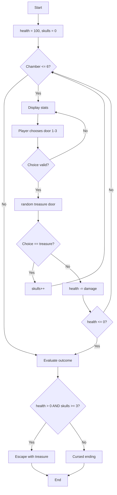

# Skulls of the Pyramid

**Book**: _Weird Computer Games (Usborne, 1984)_  
**Author**: [Usborne Publishing](https://usborne.com/row/books/computer-and-coding-books)  
**Translator**: [Marcus Medina](http://marcusmedina.pro)

## Story

Deep within the desert lies the Pyramid of Akh-Met, where six golden skulls are hidden behind cursed doors. Treasure hunters whisper that only those who can outwit the spirits of the pyramid and keep their courage will escape alive. You must enter each chamber, choose a door, and hope for treasure—not traps. Collect enough skulls before your strength fails, or be sealed inside forever.

## Pseudocode

```plaintext
health = 100
skulls = 0
FOR chamber FROM 1 TO 6
    SHOW chamber, health, skulls
    ASK player to pick door 1-3
    VALIDATE choice
    treasure_door = random door 1-3
    IF choice == treasure_door THEN
        skulls += 1
        SHOW success message
    ELSE
        damage = random between 10 and 30
        health -= damage
        SHOW trap message
        IF health <= 0 THEN EXIT LOOP
END FOR
IF health > 0 AND skulls >= 3 THEN
    Player escapes with treasure
ELSE
    Pyramid curse claims the adventurer
```

## Flowchart



## Code

<details>
<summary>ZX-81 BASIC</summary>

```basic
10 LET TS=0:LET I$="0":LET SP=3
20 LET N=INT(RND(1)*30)+10
30 CLS:PRINT
40 PRINT "SKULLS OF THE PYRAMIDS"
50 PRINT
60 PRINT "YOU ARE REQUIRED"
70 PRINT "TO GET ";N:PRINT
80 LET K=3000:GOSUB 540
90 CLS:LET Y=2
100 FOR I=1 TO 4
110 LET A$=STR$(I):LET X=6+2*I
120 GOSUB 560
130 NEXT I
140 LET A$="^^":FOR I=1 TO 5
150 LET Y=2+2*I
160 FOR J=1 TO I+3
170 LET X=7-I+2*J
180 GOSUB 560
190 NEXT J
200 NEXT I
210 LET Y=14
220 FOR I=1 TO 9:LET A$=STR$(I)
230 LET X=1+2*I:GOSUB 560
240 NEXT I
250 PRINT
260 PRINT "YOU MUST USE 5"
270 PRINT "SKULLS TO SCORE"
280 PRINT "THE NUMBER"
290 LET S=0:GOSUB 430
300 PRINT "TOTAL SO FAR ";TS
310 PRINT
320 LET L=TS:LET I$=" ":LET SP=SP-1
330 IF SP=0 THEN GOTO 370
340 PRINT "SPARES LEFT ";SP
350 PRINT
360 GOTO 410
370 PRINT "NO SPARES LEFT"
380 PRINT:PRINT "YOUR FINAL SCORE IS ";TS
390 STOP
410 PRINT "LEVER? ";
420 INPUT A$
430 LET I=VAL (A$)
440 IF I<1 OR I>4 THEN PRINT "YOU ARE DESTROYED":STOP
450 LET Z=Z+(5-I)
460 IF Z>5 THEN PRINT "TOO MANY SKULLS":STOP
470 LET X=6+2*I:LET Y=3:LET A$=" ":GOSUB 560
480 LET Y=5:LET A$="<>":GOSUB 560
490 LET M=I
500 LET F=F+1
510 IF F<5 THEN RETURN
520 LET Z=0:LET F=0
530 LET Q=INT(RND(1)*4)+1
540 DIM T(4):DIM O(4)
550 FOR I=1 TO 4
560 LET T(I)=INT(RND(1)*9)+1
570 LET O(I)=T(I)
580 NEXT I:RETURN
590 LET TS=TS+Q
600 LET X=1+2*Q:LET A$="**"
610 LET Y=17:GOSUB 560
620 RETURN
```

</details>

## Modern Implementations

<details>
<summary>C#</summary>

```csharp
using System;

namespace WeirdComputerGames;

public static class SkullsOfThePyramid
{
    private const int Chambers = 6;
    private const int MinimumSkulls = 3;

    public static void Main()
    {
        var random = new Random();
        int health = 100;
        int skulls = 0;

        for (int chamber = 1; chamber <= Chambers && health > 0; chamber++)
        {
            Console.WriteLine($"\nChamber {chamber}");
            Console.WriteLine($"Health: {health} | Skulls: {skulls}");
            Console.Write("Choose a door (1-3): ");

            if (!int.TryParse(Console.ReadLine(), out int choice) || choice < 1 || choice > 3)
            {
                Console.WriteLine("Only three doors stand here.");
                chamber--;
                continue;
            }

            int treasureDoor = random.Next(1, 4);
            if (choice == treasureDoor)
            {
                skulls++;
                Console.WriteLine("A golden skull gleams in the torchlight!");
            }
            else
            {
                int damage = random.Next(10, 31);
                health -= damage;
                Console.WriteLine($"A trap snaps! You lose {damage} health.");
            }
        }

        if (health > 0 && skulls >= MinimumSkulls)
            Console.WriteLine($"You stagger into the moonlight clutching {skulls} skulls!");
        else if (health > 0)
            Console.WriteLine("The pyramid seals shut—you needed more skulls.");
        else
            Console.WriteLine("The curse overwhelms you. The tomb keeps its secrets.");
    }
}
```

</details>
<details>
<summary>Python</summary>

```python
import random

CHAMBERS = 6
MINIMUM_SKULLS = 3


def play() -> None:
    health = 100
    skulls = 0

    for chamber in range(1, CHAMBERS + 1):
        if health <= 0:
            break

        print(f"\nChamber {chamber}")
        print(f"Health: {health} | Skulls: {skulls}")

        try:
            choice = int(input("Choose a door (1-3): "))
        except ValueError:
            print("You must enter a number between 1 and 3.")
            continue

        if choice not in (1, 2, 3):
            print("There are only three doors.")
            continue

        treasure_door = random.randint(1, 3)
        if choice == treasure_door:
            skulls += 1
            print("You claim a glittering skull!")
        else:
            damage = random.randint(10, 30)
            health -= damage
            print(f"Blades flash! You lose {damage} health.")

    if health > 0 and skulls >= MINIMUM_SKULLS:
        print(f"You escape with {skulls} skulls and your life!")
    elif health > 0:
        print("The door slams shut—you failed to gather enough skulls.")
    else:
        print("Your spirit joins the guardians of the pyramid.")


if __name__ == "__main__":
    play()
```

</details>
<details>
<summary>Java</summary>

```java
import java.util.Random;
import java.util.Scanner;

public class SkullsOfThePyramid {
    private static final int CHAMBERS = 6;
    private static final int MINIMUM_SKULLS = 3;

    public static void main(String[] args) {
        Scanner scanner = new Scanner(System.in);
        Random random = new Random();

        int health = 100;
        int skulls = 0;

        for (int chamber = 1; chamber <= CHAMBERS && health > 0; chamber++) {
            System.out.printf("%nChamber %d%n", chamber);
            System.out.printf("Health: %d | Skulls: %d%n", health, skulls);
            System.out.print("Choose a door (1-3): ");

            String input = scanner.nextLine();
            int choice;
            try {
                choice = Integer.parseInt(input);
            } catch (NumberFormatException ex) {
                System.out.println("You must enter a number between 1 and 3.");
                chamber--;
                continue;
            }

            if (choice < 1 || choice > 3) {
                System.out.println("Only three doors here.");
                chamber--;
                continue;
            }

            int treasureDoor = random.nextInt(3) + 1;
            if (choice == treasureDoor) {
                skulls++;
                System.out.println("You lift a golden skull from its niche!");
            } else {
                int damage = random.nextInt(21) + 10;
                health -= damage;
                System.out.printf("Spears thrust from the walls! You lose %d health.%n", damage);
            }
        }

        if (health > 0 && skulls >= MINIMUM_SKULLS) {
            System.out.printf("You escape with %d skulls!%n", skulls);
        } else if (health > 0) {
            System.out.println("You limp out empty-handed as the pyramid seals behind you.");
        } else {
            System.out.println("Your adventure ends in the dark halls of the pyramid.");
        }
    }
}
```

</details>
<details>
<summary>Go</summary>

```go
package main

import (
    "bufio"
    "fmt"
    "math/rand"
    "os"
    "strconv"
    "strings"
    "time"
)

const (
    chambers      = 6
    minimumSkulls = 3
)

func main() {
    rand.Seed(time.Now().UnixNano())
    reader := bufio.NewReader(os.Stdin)

    health := 100
    skulls := 0

    for chamber := 1; chamber <= chambers && health > 0; chamber++ {
        fmt.Printf("\nChamber %d\n", chamber)
        fmt.Printf("Health: %d | Skulls: %d\n", health, skulls)
        fmt.Print("Choose a door (1-3): ")

        line, _ := reader.ReadString('\n')
        choice, err := strconv.Atoi(strings.TrimSpace(line))
        if err != nil || choice < 1 || choice > 3 {
            fmt.Println("Only doors 1, 2, or 3 exist.")
            chamber--
            continue
        }

        treasureDoor := rand.Intn(3) + 1
        if choice == treasureDoor {
            skulls++
            fmt.Println("A golden skull drops into your hands!")
        } else {
            damage := rand.Intn(21) + 10
            health -= damage
            fmt.Printf("A trap springs! You lose %d health.\n", damage)
        }
    }

    if health > 0 && skulls >= minimumSkulls {
        fmt.Printf("You escape carrying %d skulls!\n", skulls)
    } else if health > 0 {
        fmt.Println("The pyramid seals behind you—you needed more skulls.")
    } else {
        fmt.Println("You collapse among the dunes—the curse claims another victim.")
    }
}
```

</details>
<details>
<summary>C++</summary>

```cpp
#include <iostream>
#include <random>
#include <string>

int main() {
    std::mt19937 rng(std::random_device{}());
    std::uniform_int_distribution<int> doorDist(1, 3);
    std::uniform_int_distribution<int> damageDist(10, 30);

    int health = 100;
    int skulls = 0;

    for (int chamber = 1; chamber <= 6 && health > 0; ++chamber) {
        std::cout << "\nChamber " << chamber << '\n'
                  << "Health: " << health << " | Skulls: " << skulls << '\n'
                  << "Choose a door (1-3): ";

        std::string line;
        std::getline(std::cin, line);
        int choice = std::stoi(line);
        if (choice < 1 || choice > 3) {
            std::cout << "Only doors 1, 2, or 3 exist.\n";
            --chamber;
            continue;
        }

        int treasureDoor = doorDist(rng);
        if (choice == treasureDoor) {
            ++skulls;
            std::cout << "A priceless skull drops into your arms!\n";
        } else {
            int damage = damageDist(rng);
            health -= damage;
            std::cout << "Hidden darts strike! You lose " << damage << " health.\n";
        }
    }

    if (health > 0 && skulls >= 3) {
        std::cout << "You escape with " << skulls << " skulls!\n";
    } else if (health > 0) {
        std::cout << "You limp away empty-handed as the pyramid seals shut.\n";
    } else {
        std::cout << "Your adventure ends beneath the drifting sands.\n";
    }

    return 0;
}
```

</details>
<details>
<summary>Rust</summary>

```rust
use rand::Rng;
use std::io::{self, Write};

const CHAMBERS: i32 = 6;
const MINIMUM_SKULLS: i32 = 3;

fn main() {
    let mut rng = rand::thread_rng();
    let mut health = 100;
    let mut skulls = 0;

    for chamber in 1..=CHAMBERS {
        if health <= 0 {
            break;
        }

        println!("\nChamber {chamber}");
        println!("Health: {health} | Skulls: {skulls}");
        print!("Choose a door (1-3): ");
        io::stdout().flush().unwrap();

        let mut input = String::new();
        io::stdin().read_line(&mut input).unwrap();
        let choice: i32 = match input.trim().parse() {
            Ok(num) if (1..=3).contains(&num) => num,
            _ => {
                println!("Only three doors exist.");
                continue;
            }
        };

        let treasure_door = rng.gen_range(1..=3);
        if choice == treasure_door {
            skulls += 1;
            println!("You snatch a golden skull from its pedestal!");
        } else {
            let damage = rng.gen_range(10..=30);
            health -= damage;
            println!("A trap springs! You lose {damage} health.");
        }
    }

    if health > 0 && skulls >= MINIMUM_SKULLS {
        println!("You escape with {skulls} skulls and your life.");
    } else if health > 0 {
        println!("The pyramid doors slam shut—you lacked enough skulls.");
    } else {
        println!("The sands cover your fate inside the pyramid.");
    }
}
```

</details>
## Explanation

Each chamber presents a simple gamble: three doors, one treasure, two traps. Success is about risk management — you must gather at least three skulls while your health ticks down from missteps. The modern versions faithfully recreate that loop, keeping health, skulls, and chambers in sync with the original.

## Challenges

1. **Map of Clues** – Add cryptic hints that suggest which door is safest based on previous rounds.
2. **Limited Bandages** – Let the adventurer carry a few restoratives that can be used between rooms.
3. **Two Adventurers** – Allow two players to take turns exploring and compare scores at the end.

## Copyright

These programs are adaptations of the original _Usborne Computer Guides_ published in the 1980s. The books are free to download for personal or educational use from [Usborne’s Computer and Coding Books](https://usborne.com/row/books/computer-and-coding-books). Programs and adaptations may not be used for commercial purposes.

Return to [Weird Computer Games](./readme.md).
