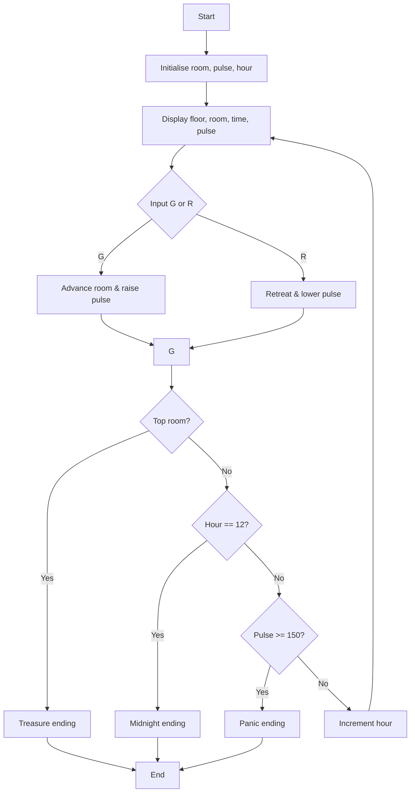

# Tower of Terror

**Book**: _Weird Computer Games (Usborne, 1984)_  
**Author**: [Usborne Publishing](https://usborne.com/row/books/computer-and-coding-books)  
**Translator**: [Marcus Medina](http://marcusmedina.pro)

## Story

Your mouth is dry, your legs are shaking, and your heart is thumping—you’ve entered the **Tower of Terror**. Press `G` to move through the rooms. Each step reveals new horrors: skeletons, ghosts, and a headless axeman. With each shock, your pulse rate rockets. Will you continue (`G`) or retreat (`R`) to recover? Watch the clock—you only have until midnight to reach the top of the tower and claim the treasure. If your pulse hits 150, panic takes over and you’ll hurl yourself out of the window.

## Pseudocode

```plaintext
initialise room = 1, pulse = 50, hour = random between 9 and 18
LOOP
    work out floor and room number
    print floor/room/time/pulse
    ask player to GO (G) or RETREAT (R)
    IF G THEN
        room += 1
        pulse += random 1-40
        randomly trigger “nasties” message
    ELSE IF R THEN
        room -= 1 (min 1)
        pulse -= 5 (min resting level)
    IF room is top room THEN player wins
    IF hour == 12 THEN midnight ending
    IF pulse >= 150 THEN panic ending
    hour += 1
END LOOP
```

## Flowchart



## Code

<details>
<summary>ZX-81 BASIC</summary>

```basic
10 GOSUB 470
20 PRINT "GOOD LUCK"
30 LET RM=0
40 LET H=9+INT (RND (1)*10)
50 LET P=50
60 CLS
70 PRINT "TOWER OF TERROR"
80 PRINT
90 PRINT RS
100 LET FL=INT (RM/5)
110 LET RM=RM-FL*5+1
120 IF FL=0 THEN PRINT "THE GROUND FLOOR":GOTO 160
130 IF FL=5 THEN PRINT "TOP FLOOR":GOTO 160
140 PRINT "FLOOR ";FL
150 PRINT "ROOM ";RM
160 PRINT "THE TIME IS ";H;":00 PM"
170 PRINT "YOUR PULSE RATE IS ";P
180 PRINT "GO OR RETREAT (G/R)?"
190 LET A$=INKEY$
200 IF A$="" THEN GOTO 190
210 IF A$="G" THEN GOSUB 240:GOTO 270
220 IF A$="R" THEN GOSUB 330:GOTO 270
230 GOTO 190
240 LET RM=RM+1
250 LET P=P+INT (RND (1)*5)+1
260 RETURN
270 IF RM=5 THEN GOTO 520
280 IF H=12 THEN GOSUB 360:GOTO 400
290 IF P>=150 THEN GOSUB 440:GOTO 400
300 LET H=H+1
310 GOTO 100
320 STOP
330 PRINT "MONSTER KEPT AT BAY"
340 PRINT "PHEW!!! -- THE MONSTER"
350 PRINT "IS TIRED AND HAS GONE TO"
360 PRINT "LOOK FOR ANOTHER VICTIM"
370 PRINT "YOU SURVIVE TO TELL THE TALE!"
380 RETURN
390 PRINT "WELL DONE"
400 PRINT "IT'S MIDNIGHT"
410 PRINT "TOO LATE"
420 PRINT "THE MONSTER HAS GONE MAD"
430 PRINT "LEAP FROM A WINDOW"
440 PRINT "YOU JUMP OUT OF"
450 PRINT "THE TOWER!"
460 RETURN
470 PRINT "WELCOME TO THE TOWER"
480 RETURN
490 PRINT "SKELETON"
500 PRINT "GHOST"
510 PRINT "HEADLESS AXEMAN"
520 RETURN
```

</details>

## Modern Implementations

<details>
<summary>C#</summary>

```csharp
using System;

namespace WeirdComputerGames;

public static class TowerOfTerror
{
    private const int MaxPulse = 150;
    private const int RoomsPerFloor = 5;

    public static void Main()
    {
        var random = new Random();
        int room = 0;
        int pulse = 50;
        int hour = random.Next(9, 19); // 9–18 inclusive

        while (true)
        {
            int floor = room / RoomsPerFloor;
            int roomNumber = room % RoomsPerFloor + 1;

            Console.WriteLine($"\nFloor {floor}, Room {roomNumber}");
            Console.WriteLine($"Time: {hour}:00 pm");
            Console.WriteLine($"Pulse: {pulse}");
            Console.Write("(G)o or (R)est? ");

            string? input = Console.ReadLine()?.Trim().ToUpperInvariant();
            if (input is "G")
            {
                room++;
                pulse += random.Next(1, 6) + floor; // nasties add extra pulse
            }
            else if (input is "R")
            {
                room = Math.Max(0, room - 1);
                pulse = Math.Max(50, pulse - 10);
                Console.WriteLine("You catch your breath.");
            }
            else
            {
                Console.WriteLine("Choose G or R.");
                continue;
            }

            if (roomNumber >= RoomsPerFloor)
            {
                Console.WriteLine("You reach the top and seize the treasure!");
                break;
            }
            if (hour >= 12)
            {
                Console.WriteLine("Midnight strikes! Panic hurls you from the tower.");
                break;
            }
            if (pulse >= MaxPulse)
            {
                Console.WriteLine("Your heart can’t take it—you leap from the window.");
                break;
            }

            hour++;
        }
    }
}
```

</details>

<details>
<summary>Python</summary>

```python
import random

ROOMS_PER_FLOOR = 5
MAX_PULSE = 150


def tower_of_terror() -> None:
    room = 0
    pulse = 50
    hour = random.randint(9, 18)

    while True:
        floor = room // ROOMS_PER_FLOOR
        room_number = room % ROOMS_PER_FLOOR + 1

        print(f"\nFloor {floor}, Room {room_number}")
        print(f"Time: {hour}:00 pm")
        print(f"Pulse: {pulse}")
        choice = input("(G)o or (R)est? ").strip().upper()

        if choice == "G":
            room += 1
            pulse += random.randint(1, 5) + floor
        elif choice == "R":
            room = max(0, room - 1)
            pulse = max(50, pulse - 10)
            print("You pause to steady your nerves.")
        else:
            print("Only G or R will do.")
            continue

        if room_number >= ROOMS_PER_FLOOR:
            print("You reach the treasure at the top of the tower!")
            break
        if hour >= 12:
            print("Midnight! The tower claims you.")
            break
        if pulse >= MAX_PULSE:
            print("Your pulse explodes—you hurl yourself from the window.")
            break

        hour += 1


if __name__ == "__main__":
    tower_of_terror()
```

</details>

<details>
<summary>Java</summary>

```java
import java.util.Random;
import java.util.Scanner;

public class TowerOfTerror {
    private static final int ROOMS_PER_FLOOR = 5;
    private static final int MAX_PULSE = 150;

    public static void main(String[] args) {
        Scanner scanner = new Scanner(System.in);
        Random random = new Random();

        int room = 0;
        int pulse = 50;
        int hour = random.nextInt(10) + 9; // 9-18

        while (true) {
            int floor = room / ROOMS_PER_FLOOR;
            int roomNumber = room % ROOMS_PER_FLOOR + 1;

            System.out.printf("%nFloor %d, Room %d%n", floor, roomNumber);
            System.out.printf("Time: %d:00 pm%n", hour);
            System.out.printf("Pulse: %d%n", pulse);
            System.out.print("(G)o or (R)est? ");

            String input = scanner.nextLine().trim().toUpperCase();
            if ("G".equals(input)) {
                room++;
                pulse += random.nextInt(5) + 1 + floor;
            } else if ("R".equals(input)) {
                room = Math.max(0, room - 1);
                pulse = Math.max(50, pulse - 10);
                System.out.println("You take a breather.");
            } else {
                System.out.println("Choose G or R.");
                continue;
            }

            if (roomNumber >= ROOMS_PER_FLOOR) {
                System.out.println("You reach the treasure and live to tell the tale!");
                break;
            }
            if (hour >= 12) {
                System.out.println("Midnight! The tower throws you out into the night.");
                break;
            }
            if (pulse >= MAX_PULSE) {
                System.out.println("Your pulse hits the limit—you leap in terror.");
                break;
            }

            hour++;
        }
    }
}
```

</details>

<details>
<summary>Go</summary>

```go
package main

import (
    "bufio"
    "fmt"
    "math/rand"
    "os"
    "strings"
    "time"
)

const (
    roomsPerFloor = 5
    maxPulse      = 150
)

func main() {
    rand.Seed(time.Now().UnixNano())
    reader := bufio.NewReader(os.Stdin)

    room := 0
    pulse := 50
    hour := rand.Intn(10) + 9 // 9-18

    for {
        floor := room / roomsPerFloor
        roomNumber := room%roomsPerFloor + 1

        fmt.Printf("\nFloor %d, Room %d\n", floor, roomNumber)
        fmt.Printf("Time: %d:00 pm\nPulse: %d\n", hour, pulse)
        fmt.Print("(G)o or (R)est? ")

        line, _ := reader.ReadString('\n')
        choice := strings.ToUpper(strings.TrimSpace(line))

        switch choice {
        case "G":
            room++
            pulse += rand.Intn(5) + 1 + floor
        case "R":
            room--
            if room < 0 {
                room = 0
            }
            pulse -= 10
            if pulse < 50 {
                pulse = 50
            }
            fmt.Println("You steady your nerves.")
        default:
            fmt.Println("Choose G or R.")
            continue
        }

        if roomNumber >= roomsPerFloor {
            fmt.Println("You reach the treasure at the top of the tower!")
            break
        }
        if hour >= 12 {
            fmt.Println("Midnight strikes! The tower claims you.")
            break
        }
        if pulse >= maxPulse {
            fmt.Println("Your heart gives out—you leap from the tower!")
            break
        }

        hour++
    }
}
```

</details>

<details>
<summary>C++</summary>

```cpp
#include <iostream>
#include <random>
#include <string>

constexpr int roomsPerFloor = 5;
constexpr int maxPulse = 150;

int main() {
    std::mt19937 rng(std::random_device{}());
    std::uniform_int_distribution<int> hourDist(9, 18);
    std::uniform_int_distribution<int> pulseDist(1, 5);

    int room = 0;
    int pulse = 50;
    int hour = hourDist(rng);

    while (true) {
        int floor = room / roomsPerFloor;
        int roomNumber = room % roomsPerFloor + 1;

        std::cout << "\nFloor " << floor << ", Room " << roomNumber << '\n'
                  << "Time: " << hour << ":00 pm\n"
                  << "Pulse: " << pulse << '\n'
                  << "(G)o or (R)est? ";

        std::string input;
        std::getline(std::cin, input);
        if (!input.empty()) input[0] = std::toupper(static_cast<unsigned char>(input[0]));

        if (input == "G") {
            room++;
            pulse += pulseDist(rng) + floor;
        } else if (input == "R") {
            room = std::max(0, room - 1);
            pulse = std::max(50, pulse - 10);
            std::cout << "You pause to recover.\n";
        } else {
            std::cout << "Choose G or R.\n";
            continue;
        }

        if (roomNumber >= roomsPerFloor) {
            std::cout << "You reach the treasure and survive!\n";
            break;
        }
        if (hour >= 12) {
            std::cout << "Midnight! The tower casts you out.\n";
            break;
        }
        if (pulse >= maxPulse) {
            std::cout << "Your heart can’t cope—you leap from the window!\n";
            break;
        }

        hour++;
    }
}
```

</details>

<details>
<summary>Rust</summary>

```rust
use rand::Rng;
use std::io::{self, Write};

const ROOMS_PER_FLOOR: i32 = 5;
const MAX_PULSE: i32 = 150;

fn main() {
    let mut rng = rand::thread_rng();
    let mut room = 0;
    let mut pulse = 50;
    let mut hour = rng.gen_range(9..=18);

    loop {
        let floor = room / ROOMS_PER_FLOOR;
        let room_number = room % ROOMS_PER_FLOOR + 1;

        println!("\nFloor {floor}, Room {room_number}");
        println!("Time: {hour}:00 pm");
        println!("Pulse: {pulse}");
        print!("(G)o or (R)est? ");
        io::stdout().flush().unwrap();

        let mut line = String::new();
        io::stdin().read_line(&mut line).unwrap();
        let choice = line.trim().to_uppercase();

        if choice == "G" {
            room += 1;
            pulse += rng.gen_range(1..=5) + floor;
        } else if choice == "R" {
            room = (room - 1).max(0);
            pulse = (pulse - 10).max(50);
            println!("You take a deep breath.");
        } else {
            println!("Choose G or R.");
            continue;
        }

        if room_number >= ROOMS_PER_FLOOR {
            println!("You reach the treasure chamber at the top!");
            break;
        }
        if hour >= 12 {
            println!("Midnight strikes! Terror drives you from the tower.");
            break;
        }
        if pulse >= MAX_PULSE {
            println!("Your heart explodes—you leap from the window!");
            break;
        }

        hour += 1;
    }
}
```

</details>

## Explanation

The ZX-81 version relies on `INKEY$` for single-key input, simple arithmetic to raise or lower the pulse, and a loop that tracks both time and room progression. The modern ports mimic that structure with clearer control flow and validation for invalid input, keeping the same trio of endings: treasure, midnight, or panic.

## Challenges

1. **Expanded Tower** – Add more floors and vary the nasties so different floors have different pulse penalties.
2. **Timed Decision** – Introduce a countdown so hesitating raises the pulse automatically.
3. **Item System** – Allow the player to find potions that reset the pulse or shortcuts between floors.

## Copyright

These programs are adaptations of the original _Usborne Computer Guides_ published in the 1980s. The books are free to download for personal or educational use from [Usborne’s Computer and Coding Books](https://usborne.com/row/books/computer-and-coding-books). Programs and adaptations may not be used for commercial purposes.

Return to [Weird Computer Games](./readme.md).
