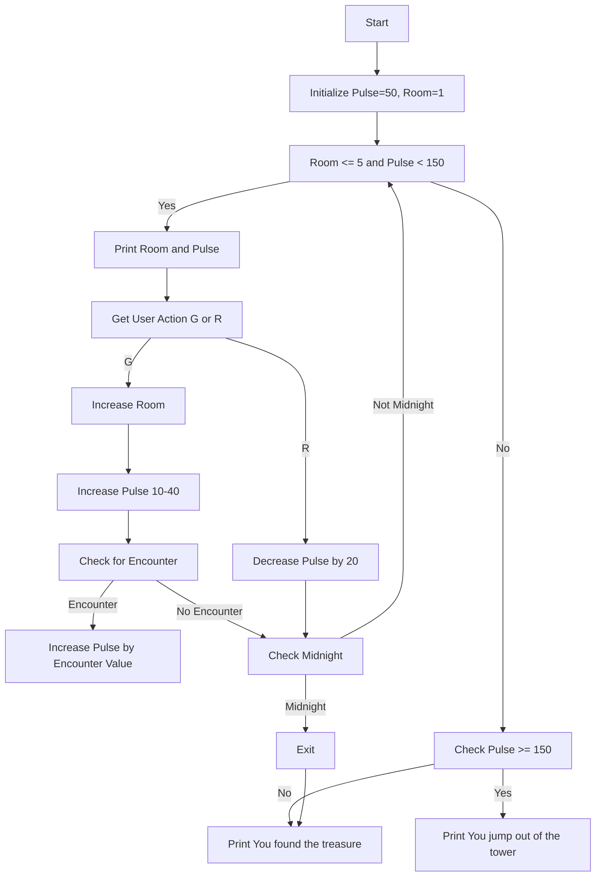

# Tower of Terror

**Book**: _Weird Computer Games_  
**Author**: Jenny Tyler and Chris Oxlade
**Translator**: [Marcus Medina](https://github.com/marcusjobb/UsborneBooks)
## Story

Your mouth is dry, your legs are shaking, and your heart is thumping—you’ve entered the **Tower of Terror**. Press `G` to move through the rooms. Each step reveals new horrors: skeletons, ghosts, and a headless axeman. With each scare, your pulse rate skyrockets. Will you continue (`G`) or retreat (`R`) to recover? You have until midnight to reach the top of the tower and claim the treasure. Watch your pulse rate carefully—if it hits 150, you’ll lose control and leap from the tower to your doom.

## Pseudocode

```plaintext
START
SET Pulse_rate = 50
SET Room_number = 1
WHILE Room_number <= 5 AND Pulse_rate < 150
    PRINT 'You are in room' Room_number
    PRINT 'Pulse rate is' Pulse_rate
    ASK User_action 'G to go, R to recover'
    IF User_action = G
        INCREMENT Room_number
        INCREMENT Pulse_rate RANDOMLY BY 10-40
        CHECK FOR ENCOUNTERS
            IF Encounter THEN INCREMENT Pulse_rate BY Encounter_value
    ELSE IF User_action = R
        DECREMENT Pulse_rate BY 20
    END IF
    CHECK Midnight
        IF Midnight THEN EXIT
END WHILE
IF Pulse_rate >= 150 THEN PRINT 'You jump out of the tower!'
ELSE PRINT 'Congratulations, you found the treasure!'
END
```

## Flowchart



## Code

<details>
<summary>ZX-81</summary>

```basic
10 GOSUB 470
20 PRINT "GOOD LUCK"
30 LET RM=1
40 LET H=1+INT(RND*40)
50 LET P=50
60 CLS:PRINT
70 PRINT "TOWER OF TERROR"
90 PRINT:PRINT RS
100 LET FL=INT(RM/5)
110 LET RM=RM+FL*5-1
120 IF RM=0 THEN PRINT "GROUND FLOOR":GOTO 160
130 IF FL=1 THEN PRINT "TOP FLOOR":GOTO 160
150 PRINT "FLOOR ";FL
160 PRINT "ROOM ";RM
170 PRINT "TIME IS"H":"M" PM"
180 PRINT "PULSE RATE IS";P
190 PRINT "GO OR REST?"
200 INPUT A$
210 IF A$="G" THEN GOTO 250
220 IF A$="R" THEN P=P-20:GOTO 300
230 PRINT "INVALID INPUT":GOTO 190
250 RM=RM+1
260 LET P=P+INT(RND*40)+10
270 PRINT "MOVING TO NEXT ROOM"
280 GOTO 120
300 PRINT "RESTING... PULSE LOWERED"
310 IF P>150 THEN PRINT "YOU JUMP OUT OF THE TOWER!":END
320 IF RM>5 THEN PRINT "CONGRATULATIONS! TREASURE FOUND":END
330 GOTO 120
470 PRINT "GAME INITIALIZED"
480 RETURN
```

</details>

<details>
<summary>C#</summary>

```csharp
using System;

class TowerOfTerror
{
    static void Main()
    {
        int pulse = 50;
        int room = 1;
        Random rand = new Random();

        while (room <= 5 && pulse < 150)
        {
            Console.WriteLine($"You are in room {room}.");
            Console.WriteLine($"Your pulse rate is {pulse}.");
            Console.Write("Press G to go or R to recover: ");

            string action = Console.ReadLine().ToUpper();
            if (action == "G")
            {
                room++;
                pulse += rand.Next(10, 41);
                Console.WriteLine("You encountered a nasty! Pulse increased.");
            }
            else if (action == "R")
            {
                pulse = Math.Max(50, pulse - 20);
                Console.WriteLine("You took a moment to recover.");
            }

            if (pulse >= 150)
            {
                Console.WriteLine("You jumped out of the tower in panic!");
                return;
            }
        }

        Console.WriteLine(room > 5 ? "Congratulations! You found the treasure!" : "Midnight struck. Game over.");
    }
}
```

</details>

<details>
<summary>Python</summary>

```python
import random

def tower_of_terror():
    pulse = 50
    room = 1

    while room <= 5 and pulse < 150:
        print(f"You are in room {room}.")
        print(f"Your pulse rate is {pulse}.")
        action = input("Press G to go or R to recover: ").upper()

        if action == 'G':
            room += 1
            pulse += random.randint(10, 40)
            print("You encountered something scary! Pulse increased.")
        elif action == 'R':
            pulse = max(50, pulse - 20)
            print("You rested and recovered some pulse.")

        if pulse >= 150:
            print("You jumped out of the tower in panic!")
            return

    if room > 5:
        print("Congratulations! You found the treasure!")
    else:
        print("Midnight struck. Game over.")

if __name__ == "__main__":
    tower_of_terror()
```

</details>

## Explanation

This game simulates a spooky adventure through a haunted tower. Players must balance exploration with careful management of their pulse rate. Moving forward increases the pulse randomly, and encounters with "nasties" spike it further. Retreating lowers the pulse, allowing players to recover. If the pulse reaches 150, the player loses. The goal is to reach the top before midnight.

## Challenges

1. **Add More Rooms**: Expand the tower to 10 rooms for a longer challenge.
2. **Introduce More Scares**: Add more types of encounters with varying pulse increases.
3. **Add a Time Mechanic**: Implement a countdown timer to simulate midnight.

## Copyright

These programs are adaptations of the original Usborne Computer Guides published in the 1980s. The books are free to download for personal or educational use from [Usborne's Computer and Coding Books](https://usborne.com/row/books/computer-and-coding-books). Programs and adaptations may not be used for commercial purposes.

Return to [Weird Computer Games](./readme.md).
